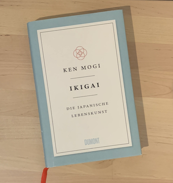

+++
title = "📚Bücher"
draft = false
description = "In meinen Blogbeiträgen erwähne ich immer wieder Bücher. Einige davon regelmässig. "
+++
In meinen Blogbeiträgen erwähne ich immer wieder Bücher und einige davon regelmässig. Es sind oft Bücher, die mich über die Jahre begleiten, andere kenne ich vielleicht erst seit kurzem oder finde die Grundthematik interessant oder inspirierend. Einige davon zeige ich nun hier.



**Der Weg zu echtem Selbstvertrauen, Von der Angst zur Freiheit**

[Russ Harris](https://thehappinesstrap.com/my-story/) zeigt inseinem Buch auf, wie man mit Hilfe der Akzeptanz- und Commitmenttherapie das eigene Leben aktiv gestalten kann. Dabei geht es nicht um selbstoptimierung, sondern darum, u. a. mit Akzeptanz, Offenheit, Werteklarheit sowie aktivem und bewusstem Handeln ein gutes Leben zu führen. Das Buch bietet Anleitungen und Wegweiser, seinen Weg, seine Träume und Ziele zu verfolgen, auch wenn Angst, Schmerz oder andere Einschränkungen (die oft einfach zum Leben gehören), das Leben immer wieder bestimmen. 



Ikigai, die japanische Lebenskunst, Ken Mogi

Wer mich etwas besser kennt weiss, dass ich oft Dinge und Themen hinterfrage. Ikigai ist so ein «Konzept», das (immer noch) als etwas verkauft wird, das es nicht ist. Meistens sieht man die vier Kreise und den Schnittmengen Misson, Passion, Beruf und Berufung. Nun, das hat wenig mit dem Ikigai zu tun, das in Japan einfach irgendwie zur Kultur gehört. Ken Mogi, ein japanischer Autor und Neurowissenschaftler gibt in seinem Buch «Ikigai» einen echten und differenzierten Einblick. Ein Buch, das ich gerne weiterempfehle. 





**Entlehrt euch!, Ausbruch aus dem Vollständigkeitswahn, Rolf Arnold**

Wir könnte oder sollte Lernen und Bildung funktionieren? Was ist Lernen und warum hat Wissensvermittlung wenig oder gar nichts damit zu tun? Dieses Buch eignet sich gut als «Verstörer», als «Augenöffner» oder einfach als Unterstützung und Bestätigung für Bildungsquerulant:innen. Rolf Arnold zeigt, wie wir vom Vollständigkeitswahn wegkommen und warum das Belehren keinen Sinn macht. Eine Inspiration und ein Mutmacher für alle, die sich hin zu selbstgesteuertem Lernen bewegen wollen, bei dem der Mensch und sein Interesse im Zentrum steht. 

