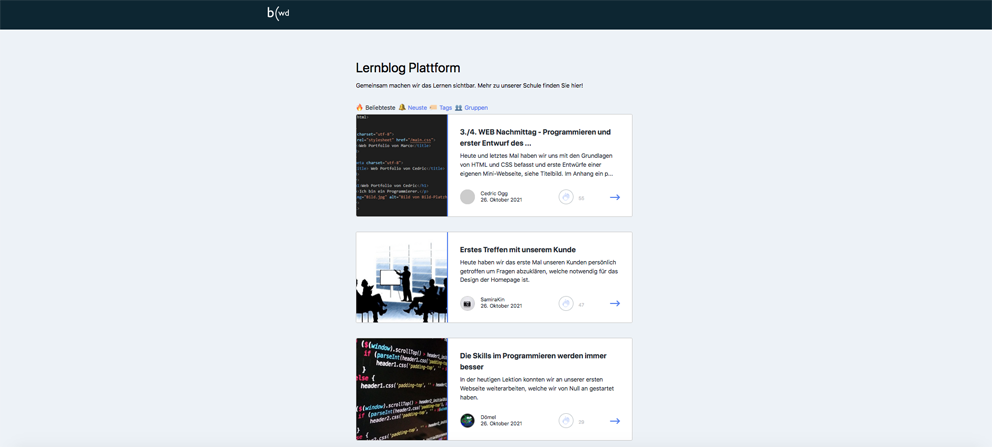
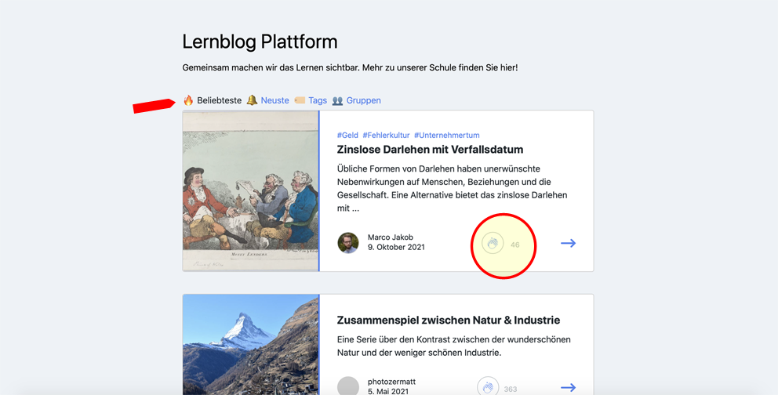
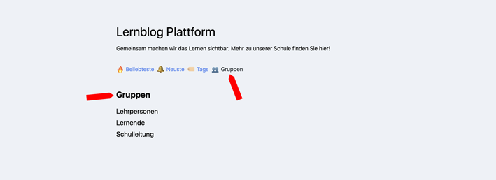

+++
title = "Lernblog im Detail"
draft = false
+++
Zusammen Lernen sichtbar machen. Darum gehts im Lernblog. Hier siehst du anhand eines Beispieles, wie der Lernblog in deinem Unternehmen oder deiner Institution aufgebaut sein könnte.

**Einbettung auf der Webseite**

Hier findest du den Link zu den Lernblogs bereits auf der Startseite oben rechts. 

**Lernblog Ansicht**

So sieht die Übersichtsseite des Lernblogs aus. Hier sind die beliebtesten an erster Stelle. 

**Rubriken** 

Die Kategorien siehst du über den Beiträgen und kannst ganz einfach wählen was dir gerade wichig ist. In diesem Fall kannst du Beliebtheit, Neueste, Tags und Gruppen wählen. 

**Beliebteste**

Die Positionierung aus der Rubrik «Beliebteste» wird aufgrund der Anzahl Likes sowie der Aktuallität der Beiträge berechnet. So ist diese Seite immer aktuell und interessant. 

**Gruppen** 

Vielleicht schreiben in deiner Institution oder deinem Unternehmen ganze Abteilungen, Klassen oder Teams am Lernblog. Diese kannst du einteilen und hier filtern.