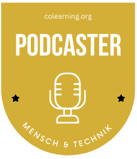
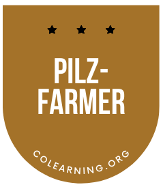

+++
title = "Portfolio"
draft = false
image = "4.png"
description = "Das ist mein Lernportfolio"
+++
#### Lernportfolio Benjamin Zaugg



Seit April 2020 mache ich Podcasts. In dieser Zeit habe ich verschiedene Formate produziert.  \
So habe ich mir im Bereich Podcasting verschiedene Kompetenzen erarbeitet.  

Nutzen von verschiedener Hardware für Podcasting und Optimierung des Equipments für den mobilen Einsatz 

Angefangen habe ich mit einem Shure 58A Beta sowie dem Shure Interface MVI für die Soloaufnahmen. Die Wahl fiel auf dieses Mikrofon, weil es ungenutzt bei mir rumlag und das Shure Interface war für mich die logische Ergänzung.  

Im weiteren Verlauf habe ich folgende Produkte ausprobiert und genutzt:  

**Hardware** 

* Shure 58A Beta sowie Popschutz K&M 23956 
* Shure MV7 (XLR & USB) & Shure MV7X (Nur XLR) Audio Interface Adapter Focusrite Scarlett 2i2 3rd Gen 
* Shure MV88+ (Video-Kit) (genutzt in Übergangsphase zu 2er Gesprächen 
* 2 Tischstative, hier gibt es etliche Möglichkeiten. Am flexibelsten bin ich mit dem Dreibein-Tischstativ: [K&M 23150-3](https://www.bensblog.ch/podcast/*%20**K&M%2023150-3**) 
* Macbook und Garageband 
* [Audio Interface Adapter Focusrite Scarlett 2i2 3rd Gen](https://focusrite.com/de/news/introducing-scarlett-3rd-gen) 
* Kopfhörer [Audio Technica ATH-M30x](https://www.galaxus.ch/en/s1/product/audio-technica-ath-m30x-headphones-3827638?supplier=406802) (zeitweise Audio Technica ATH-M50x, wobei diese Investition nicht unbedingt nötig ist) 
* [Zoom H5 Audiorecorder](https://www.galaxus.ch/en/s1/product/zoom-h5-handheld-audio-recorders-2752880?isSecondHand=true&shid=859802&gclid=CjwKCAjwzY2bBhB6EiwAPpUpZva_CiUtftB2qvH0eGWExtafrxemnRR1wxK7CtvZ_OIL05-MDwEjcxoC9rMQAvD_BwE&gclsrc=aw.ds) (mit 2 XLR-Anschlüssen) 
* 1 Koffer [B+WOutdoor case type 3000 - SI](https://www.galaxus.ch/en/s1/product/bw-outdoor-case-type-3000-si-suitcase-camera-bag-7105761?supplier=406802) (Wasser- und Staubdicht)

**Software**

Podigee für Hosting und Verbreitung auf den Plattformen \
Zencaster und später zoom für Onlineaufnahmen mit Gästen 

**Vor Ort und Remoteaufnahmen**  

Dafür habe ich meine Gesprächsgäste jeweils vorgängig über die Minimalanforderungen (z. B. möglichst ruhiger und nicht zu grosser Raum) informiert. Dann habe ich mich und das Gespräch der Umgebung angepasst, manchmal die Umgebungsgeräusche sogar bewusst genutzt. Diese wurden jedoch sowieso relativ gut durch die hochwertigen Mikrofone gefiltert.  

**Podcast-Aufnahmen an verschiedenen Standorten und in verschiedenen Räumlichkeiten** 

Einige Aufnahmen fanden online statt, die Gesprächspartnerinnen waren also zuhause. Andere Aufnahmeorte waren u. a.: Coworking Space, Architekturbüro, Einzimmerwohnung auf dem Sofa, Schulhaus, Film- und Fotostudio,   

**Formate** 

* Einzelformat entwicklungsfreiraum zu Themen der persönlichen Entwicklung 
* Gespräche mit Personen über ihre Biografie u. a. mit Fokus auf Lernen und Berufsausbildung und Umgang mit schwierigen Situationen 
* Gespräche mit Personen auf helfenden Berufen (z. B. Gesundheitsweisen) mit Fokus auf Einblick in den Alltag sowie die persönlichen Sichtweisen der Personen 
* Podcastreihe zu einem geplanten Neubau einer Schulanlage mit Gesprächen und Sichtweisen mit verschiedenen Beteiligten. Planung und Durchführung in Absprache mit der Auftraggeberin 

**Interviewpartner:innen und Gesprächsführung** 

* Suchen und Anfragen von potenziellen Interviewgästen 
* Termine vereinbaren und Planung der Folge 
* Vorbereiten von individuellen Personen- und Themenbezogenen Fragen 
* Schaffen und Halten einer angenehmen und vertrauensvollen Gesprächsatmosphäre 
* Eingehen auf spontane und allenfalls auch unvorhergesehene Wendungen im Gespräch 
* Erkennen von Grenzen im Gespräch 

**Verarbeitung Podcast** 

* Schneiden der Audiodatei (immer mit dem Ziel möglichst alles so zu lassen wie es war) 
* Upload (Folge betiteln, Beschreibung der Folge, etc.) 
* Teilweise transkribieren der Gespräche von Mundart auf Hochdeutsch 

**Kommunikation Podcast** 

Erstellen von Bildern und Texten für die Kommunikationskanäle (Webseite, Social Media Plattformen) 

**Hier gehts zu Podcast-Lernblogbeiträgen:** 

[Wie startet man einen Podcast vom 21. Oktober 2021](https://www.bensblog.ch/wie-startet-man-einen-podcast/)

[Podcast vom 6. März 2022](https://www.bensblog.ch/podcast/)

[Erfahrungen von zwei Jahren als Podcaster vom 4. November 2022](https://www.bensblog.ch/podcast3/)

Dieser Badge wird bestätigt von: 




Im Herbst 2021 bin ich gemeinsam mit anderen Colearner:innen in das Pilzfarmprojekt gestartet. Gemeinsam haben wir im Coworking Space Effinger eine Pilzzucht aufgebaut, den Vertrieb geregelt und im Herbst 2022 die ersten Pilzboxen für die Pilzzucht zuhause produziert. Bis Weihnachten haben wir fast 200 Stück verkauft. 

**Mein Beitrag**

* Mitaufbau Lernunternehmen nach agilem Vorgehen
* Mithilfe beim Mischen der ersten Pilzsäcke
* Organisation und Koordination Kommunikation (Webseite, Social Media gemeinsam mit jugenlichen Colearnern

**Angeeignete und erweiterte Kompetenzen**

* Einhalten der Hygiene beim Mischen von Pilzsubstrat
* Kennen der Pilzwachstumszyklen
* Unterstützung beim Aufbau von Kommunikationskompetenzen bei jugendlichen Colearnern

Bestätigt von: 

