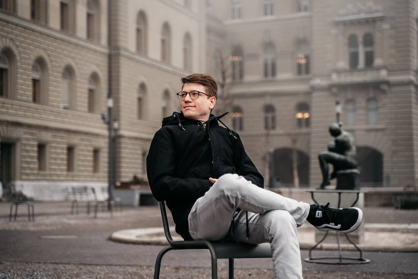

+++
title = "Über mich"
draft = false
image = "_dsc7027-kopie.jpg"
description = "Hallo, ich bin Ben. \n\n"
+++

## Ben Zaugg

👋 Hallo, ich bin Ben.

Mich interessieren Menschen, ihr Lernen, ihre Arbeit und die Frage, wie Entwicklung und Menschsein in einer Welt möglich sind, die sich ständig verändert.

Ich sammle Fragen, beobachte Veränderungen und versuche zu verstehen, wie Menschen, Teams und Organisationen lernen, zusammenarbeiten und sich entwickeln. Dabei interessieren mich besonders die Übergänge zwischen Sicherheit und Unsicherheit, Wissen und Nichtwissen sowie Bewahren und Verändern.

Beruflich bewege ich mich irgendwo zwischen Organisationsentwicklung, Lernen, Führung und Veränderung. Persönlich bewege ich mich oft zwischen Neugier, Zweifel und dem Vertrauen, dass Entwicklung dort möglich wird, wo Menschen einander begegnen.

In diesem Blog denke ich laut. Ich teile Erfahrungen, Beobachtungen, Fragen und Gedanken aus meinem Alltag als Lernender, Organisationsentwickler und Mensch. Manchmal schreibe ich über Arbeit und Lernen, manchmal über andere menschliche Bewegungen. Und manchmal über Themen, bei denen ich selbst noch keine Antworten habe.

Ich glaube, dass Entwicklung selten geradlinig verläuft. Sie entsteht im Unterwegssein – in Gesprächen, im Ausprobieren und im Umgang mit dem, was sich verändert.

🌱 Colearning begleitet mich dabei seit vielen Jahren. Ich engagiere mich für die Colearning-Bewegung und lerne selbst jeden Tag mit und von anderen Menschen.

✍️ Dieser Blog ist mein digitales Notizbuch, Lernjournal, Logbuch und Denkraum – offen für Gedanken, die unterwegs entstehen. Vielleicht findest du hier Perspektiven, die dich inspirieren, irritieren oder zum Weiterdenken anregen.

\
🌐<https://www.benzaugg.ch>

📧kontakt@benzaugg.ch

PS: 🎧 In drei verschiedenen Podcast-Formaten 🎙️ZUKUNFTSHELDEN, 🎙️24Stunden.life und🎙️entwicklungsfreiraum habe ich mit Menschen gesprochen, die ehrliche und tiefe Einblicke in ihre Arbeit, Biografien und Lernerfahrungen gegeben haben. Die Podcastfolgen sind nicht mehr verfügbar, es finden sich jedoch möglicherweise noch Hinweise und Überbleibsel aus dieser Zeit in Blogbeiträgen.

PPS: Das Leben findet oft in Wellenbewegungen statt und meistens passiert gerade dann viel, wenn wir uns aus unserer Komfort- oder Gewohnheitszone bewegen. 2021 habe ich mich weit aus dieser Komfortzone bewegt, weil ich wissen wollte, wie die Welt als Selbstständiger aussieht. Anstatt nur die tollen Momente und das Gute zu zeigen, wollte ich vieles zeitnah niederschreiben und teilen. Hätte ich mir diese Aufgabe nicht gestellt, wäre hier vieles verborgen geblieben oder schön und gefiltert erschienen. Aus meiner ursprünglich geplanten Selbstständigkeit ist auch eine Lern- und Entdeckungsreise durch die Bildungs- und Arbeitswelt entstanden.