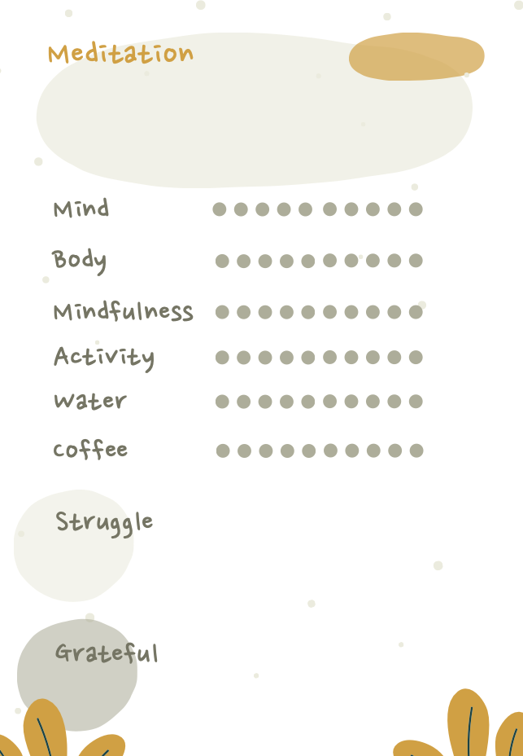

+++
title = "Achtsamkeit als Lernprojekt"
date = "2023-03-25"
draft = false
pinned = false
tags = ["Achtsamkeit", "Lernen", "Persönlichkeitsentwicklung"]
image = "bildschirm-foto-2023-03-25-um-12.34.48.png"
description = "Immer wieder Anfänger sein und den Dingen mit Neugier begegnen. Einblick in meinen Lernprozess und mein Lernprojekt Achtsamkeit. "
footnotes = "📚**Bücher Jon Kabat-Zinn**\n\n📕[Achtsamkeit für alle, Weisheit zur Transformation der Welt](https://www.exlibris.ch/de/buecher-buch/deutschsprachige-buecher/jon-kabat-zinn/achtsamkeit-fuer-alle/id/9783867812535/)\n\n📕[Meditation ist nicht, was Sie denken, Warum Achtsamkeit so wichtig ist](https://www.exlibris.ch/de/buecher-buch/deutschsprachige-buecher/jon-kabat-zinn/meditation-ist-nicht-was-sie-denken/id/9783867812504/)\n\n📕[Wach weden und unser Leben wirklich leben, Wie wir Achtsamkeit im Alltag praktizieren](https://www.exlibris.ch/de/buecher-buch/deutschsprachige-buecher/jon-kabat-zinn/wach-werden-und-unser-leben-wirklich-leben/id/9783867812511/)\n\n📕[Das heilende Potenzial der Achtsamkeit, Eine neue Art zu sein](https://www.exlibris.ch/de/buecher-buch/deutschsprachige-buecher/jon-kabat-zinn/das-heilende-potenzial-der-achtsamkeit/id/9783867812528/)"
+++
> Meditation ist nicht, was Sie denken
>
> *Jon Kabat-Zinn*

Schweigen, Sitzen, Atmen, nicht bewegen. Das wird oft unter Achtsamkeit verstanden. So nehme ich das zumindest wahr. Es gibt viele Missverständnisse über Achtsamkeit, wobei ich nicht vorhabe, diese aufzuklären. Ich bin mir nicht einmal sicher, ob ich diese wirklich identifizieren könnte. Vielleicht gehe ich selbst mit der einen oder anderen Fehlannahme zu Achtsamkeit durchs Leben. Sicher ist, hinter dem Hype ist so viel mehr.

Seit 2013 ist Achtsamkeit ein Teil meines Lebens. Nicht immer gleich intensiv und manchmal fast gar nicht. Auch wenn es diesen Herbst zehn Jahre her ist, seit ich den MBSR-Kurs gemacht habe, fühle ich mich immer noch wie ein Anfänger. Nur heute weiss ich, dass das völlig o.k. ist und irgendwie auch gut. Das Anfängersein stört mich immer weniger. Ende des letzten Jahres habe ich Achtsamkeit zu einem meiner Lernprojekte gemacht. Eigentlich wollte ich ein CAS dazu machen, aber warum nicht ein eigenes Lernprojekt starten?

#### Der Beginn

Irgendwann im letzten Jahr begann ich das Buch «Achtsamkeit für alle, Weisheit zur Transformation der Welt» von Jon Kabat-Zinn zu lesen. Es machte mir wieder bewusst, welche Kraft und Wichtigkeit Achtsamkeit in unserem Leben hat und haben kann. Ich sehe Verbindungen zu den Gebieten, die mich interessieren und zu denen ich sowieso als Selbst- und Colearner unterwegs bin. Es sind Themen wie (echtes) Lernen, menschliche Entwicklung, psychische und physische Gesundheit, Führung, Entwicklung und Transformation von Organisationen und so vielem mehr. Achtsamkeit kann uns helfen, mit den Herausforderungen des 21. Jahrhunderts (besser) umzugehen. Kabat-Zinn schreibt über das Buch von Yuval Harari *21 Lektionen für das 21. Jahrhundert*: «Ich würde die Grundaussage dieses Buches folgendermassen umreissen: Bevor wir angesichts dessen, was sich am Horizont abzeichnet - künstliche Intelligenz, intelligente Roboter und die Aussicht auf digital, wenn nicht sogar biologisch aufgerüstete Menschen und vieles mehr, das Harari detailliert beschreibt - unser Menschsein aufgeben, täten wir vielleicht gut daran, erst einmal gründlich zu erforschen, was es heissen und wie es sich anfühlen könnte, voll und ganz Mensch zu sein, also ganz und gar hellwach und im Körper anwesend zu sein.»

Wie schön und wie passend! Aber auch anstrengend und herausfordernd (da kommen mir schon wieder Verbindungen zu C. R. Rogers in den Sinn, also schon wieder eine Verknüpfung im Gehirn). Es sind viele Herausforderungen, viele Informationen, viele Ablenkungen, viele Impulse, viele Widersprüche, viele negative und beängstigende Nachrichten. Es ist einfach viel. Achtsamkeit ermöglicht uns, den Autopilotenmodus zu verlassen. Wir können lernen, fürsorglich(er), aufmerksam(er) und bewusst(er) mit uns sowie allem um uns (Natur, Menschen, ...) umzugehen. 

#### Lernprojekt

Ich möchte Achtsamkeit nicht nur zum Selbstzweck in mein Leben integrieren, sondern verstehen, was da passiert. Was passiert in mir und um mich, welche Auswirkungen hat Achtsamkeitspraxis auf Menschen (Psyche und Körper), welchen Einfluss hat Achtsamkeit auf Organisationen, auf Führung, und und und. 

#### Das tue ich

Ich habe die formelle Achtsamkeitspraxis zu einem fixen Teil meines Alltags gemacht. Das heisst, jeden Morgen und jeden Abend ab aufs Kissen. Irgendwann möchte ich (vielleicht) überprüfen, ob oder was sich bei mir verändert hat. Deshalb habe ich mir eine Art Achtsamkeitstagebuch gebastelt.

Dort trage ich die Meditationen und die Zeitdauer ein. Ich schaue am Abend, wie es mir gerade geht und notiere einige andere Dinge. So kann ich in ein paar Wochen oder Monaten sehen, ob oder was sich verändert hat. 

Das hilft mir, auch tagsüber immer wieder achtsam zu sein. Denn «die Praxis der Achtsamkeit läuft letztendlich darauf hinaus, wie Sie Moment für Moment für Moment entscheiden, Ihr Leben zu leben, während Sie es noch können. Etwas konkreter: darauf, wie Sie sich entscheiden, Ihr Leben im Verhältnis zu den Dingen zu leben, denen Sie auf dem Gebiet begegnen, das ich manchmal *die totale Katastrophe* der menschlichen Grundsituation nenne, oder etwas persönlicher: die totale Katastrophe, die das Leben jeder und jedes Einzelnen manchmal ist.» Kabat-Zinn (2020) S. 20. Ich kann z. B. wach(er) durch den Tag, durchs Leben gehen und bewusste(re) Entscheidungen treffen.

Dann lese ich Bücher (siehe Beitrag von gestern: [Ich lerne noch](https://www.bensblog.ch/ich-lerne-noch/)) und tauche mit Podcasts, Youtube, in Gesprächen etc. weiter ab. Dabei finde ich Verbindungen zwischen den Themen, sehe Widersprüche und es stellen sich wieder neue Fragen. So komme ich plötzlich von Achtsamkeit zur Theorie U, google etwas dazu, lande (irgendwie) bei Mindful Leadership, besuche eine Abendveranstaltung zu Feedback, bei der dann plötzlich Beyond Leadership auftaucht und in einem Pausengespräch jemand von der Theorie U spricht.

Es ist also ein Lernprojekt, das nicht isoliert ist. Ich folge dem Flow, den Fragen und meinen Interessen. Was ich lerne hat einen direkten Einfluss auf mich, auf meine persönliche Entwicklung und auf meinen Berufsalltag. Vielleicht findet ein Impuls aus der Theorie den Weg in mein tägliches Handeln oder ich gehe einer Frage nach, die gerade bei der Arbeit auftaucht. 

Da bleibt mir nur der Abschluss mit einem Zitat das ich sehr mag. Meinstens wird es Jon Kabat-Zinn zugeschrieben, aber dann auch Joseph Goldstein. Woher auch immer, es gefällt mir. 

> Du kannst die Wellen nicht stoppen, aber du kannst lernen zu surfen.