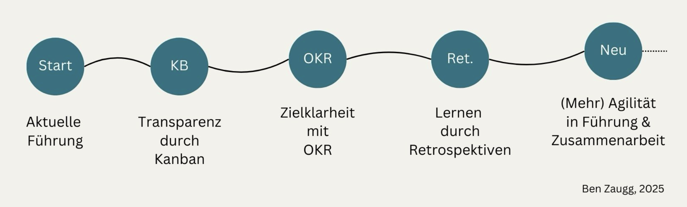
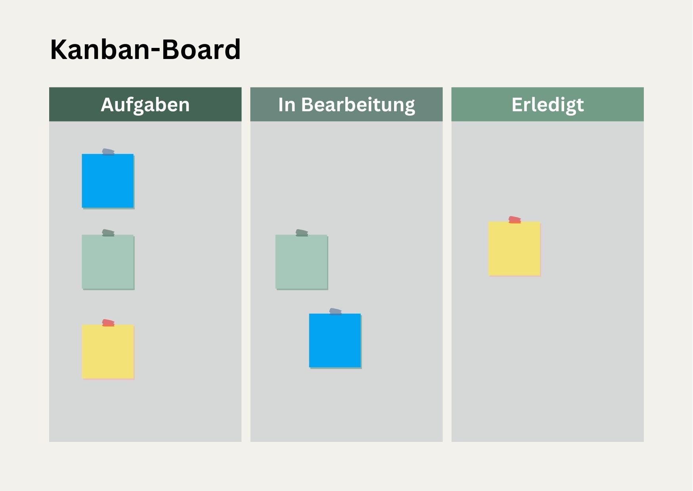
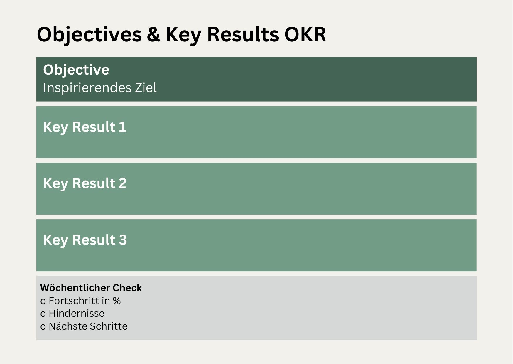
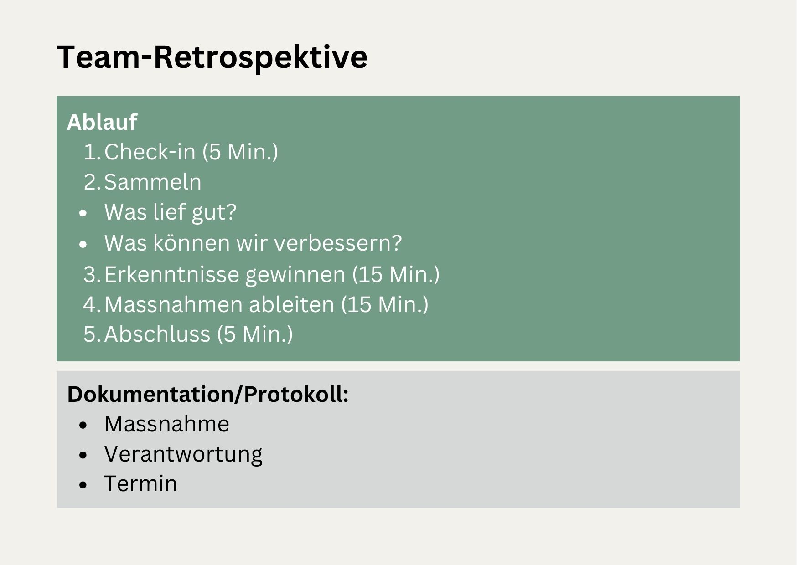

+++
title = "Integration agiler Methoden in klassische Führungskontexte - Teil 2"
date = "2025-01-22"
draft = false
pinned = false
tags = ["CAS-BI", "Agilität", "Leadership", "Personalentwicklung", "Organisationsentwicklung"]
image = "agil-leadership-2.jpg"
description = "Agilität kann Führung und Teamarbeit auch in klassische(re)n Organisationen bereichern – vorausgesetzt, sie wird sinnvoll eingesetzt. Teil 2: Praxisleitfaden für Führungspersonen"
footnotes = "📘 [Das neue Führen, Führen und sich führen lassen in Zeiten der Unvorhersehbarkeit, Bodo Janssen](https://www.exlibris.ch/de/buecher-buch/deutschsprachige-buecher/bodo-janssen/das-neue-fuehren/id/9783424202854/)\n\n💻**[\\--> Einblicke und Gedanken zum Buch in diesem Blogbeitrag](https://www.bensblog.ch/das-neue-fuehren/)**\n\n📕[Future Skills, 30 Zukunftsentscheidende Kompetenzen und wie wir sie lernen können](https://www.exlibris.ch/de/buecher-buch/deutschsprachige-buecher/69-co-creators/future-skills/id/9783800666355/)\n\n📘[Organisationsdesign in einer komplexen und instabilen Welt, Einführung in Modelle und Konzepte sowie deren Anwendung](https://www.exlibris.ch/de/buecher-buch/deutschsprachige-buecher/jens-o-meissner/organisationsdesign-in-einer-komplexen-und-instabilen-welt/id/9783658423384/?userLoggedOut=true)\n\n📕 [Zwischen Alt und Neu liegt gut, Wie wir mit Good Work eine zukunftsfähige Arbeitskultur gestalten können, ohne alles neu machen zu müssen, Jule Jankowski](https://www.exlibris.ch/de/buecher-buch/deutschsprachige-buecher/jule-jankowski/zwischen-alt-und-neu-liegt-gut/id/9783800669332/)\n\n➡️[Hier gehts zu allen Beiträgen des CAS Business Impact und zu einer Bücherliste](https://www.bensblog.ch/cas_businessimpact_verzeichnis/)\n\nTitelbild Hintergrundbild: Erstellt mit Dall-E3"
+++
# Teil 2: Praxisleitfaden für Führungskräfte

## Über diesen Praxisleitfaden

Dieser Leitfaden entstand im Rahmen des [CAS Business Impact](https://www.bensblog.ch/tags/cas-bi/) und bietet Ihnen als Führungskraft konkrete Hilfestellung bei der Integration agiler Methoden in Ihren Führungsalltag. Er basiert auf praktischen Erfahrungen und ist bewusst pragmatisch gestaltet. Nutzen Sie die Vorschläge und Werkzeuge als Inspiration und passen Sie sie an Ihren spezifischen Kontext an.

## Typische Ausgangssituationen

Führungskräfte, die über den Einsatz agiler Methoden nachdenken, stehen oft vor ähnlichen Herausforderungen in ihrem Führungsalltag. Die folgenden Situationen sind übliche Auslöser für den Wunsch nach Veränderung.

Sie erkennen sich in einer oder mehreren dieser Situationen wieder:

**Transparenz und Überblick:**

* «Ich weiss oft nicht genau, wer gerade woran arbeitet»
* «Uns fehlt der Überblick über laufende Arbeiten und Prioritäten»
* «Manche Aufgaben gehen im Tagesgeschäft verloren»
* «Wir haben zu viele Baustellen gleichzeitig offen»

**Zusammenarbeit und Kommunikation:**

* «Die Abstimmung im Team könnte besser sein»
* «Wichtige Informationen kommen nicht bei allen an»
* «Meetings sind oft ineffizient und wenig zielführend»
* «Es gibt immer wieder dieselben Missverständnisse»

**Ziele und Entwicklung:**

* «Die Abstimmung von Zielen und deren Verfolgung müsste besser sein»
* «Wir verlieren manchmal das grosse Ganze aus den Augen»
* «Der Fortschritt bei Projekten ist schwer einzuschätzen und (kleine) Erfolge sind wenig sichtbar»
* «Wir lernen zu wenig aus unseren Erfahrungen und machen immer wieder die gleichen Fehler»

**Change und Verbesserung:**

* «Veränderungen umzusetzen fällt uns schwer»
* «Gute Ideen gehen unter und werden selten in die Tat umgesetzt »
* «Wir reagieren zu langsam auf neue Anforderungen und das führt zu Stress»
* «Die Balance zwischen Stabilität und Veränderung ist schwierig zu halten»

# 2. Praktische Umsetzung der Methoden

Die erfolgreiche Einführung agiler Methoden basiert auf einer schrittweisen, pragmatischen Vorgehensweise. Jede Methode bietet spezifische Einstiegspunkte und Quick Wins, die einen schnellen sicht- und spürbaren Mehrwert für Team und Führungskraft schaffen.

Abbildung 3:Möglicher Entwicklungsweg von klassischer Führung zu mehr Agilität in der Führung und Zusammenarbeit, eigene Darstellung

## 2.1 Einfach starten mit Kanban

Kanban bietet einen einfachen Einstieg in agiles Arbeiten durch die Visualisierung von Arbeitsprozessen. Die Methode lässt sich mit minimalen Vorbereitungen starten und schrittweise ausbauen.

#### **Quick Wins**

**Einfaches Kanban-Board erstellen:**

* Whiteboard oder Wand mit drei Spalten: «Aufgabe», «In Bearbeitung», «Erledigt» (siehe Abbildung 4)
* Haftnotizen für Aufgaben
* Wöchentliches 15-Minuten-Treffen am Board einführen oder täglicher Einstieg 5 – 10 Min. 

**Erste Schritte:**

* Aktuelle Hauptaufgaben auf Haftnotizen schreiben
* Jedes Teammitglied pflegt seine Aufgaben selbst
* Zu Beginn keine Limits für Anzahl Aufgaben setzen, nur beobachten

**Nach 2-3 Wochen:**

* Erste WIP (Work in Progress)-Limits einführen
* Prozess gemeinsam anpassen
* Erfolge sichtbar machen und feiern 

#### **Häufige Bedenken und Lösungen**

Bei der Einführung von Kanban tauchen oft ähnliche Bedenken auf, für die es bewährte Lösungsansätze gibt. Die folgenden Beispiele zeigen, wie man konstruktiv damit umgehen kann.

* «Das ist zu simpel für unsere komplexe Arbeit» **→** Gerade bei Komplexität hilft Visualisierung
* «Wir sitzen nicht alle an einem Ort» **→** Digitale Tools wie Trello, miro-Board oder Microsoft Planner nutzen
* «Dafür haben wir keine Zeit» **→** Mit 15 Minuten pro Woche starten

**Praxistipps**

**Do:**

* Klein anfangen, kontinuierlich verbessern und lernen
* Team von Anfang an einbinden, allenfalls Infos/Schulungen zur Verfügung stellen
* Regelmässige kurze Besprechungen am Board

**Don't:**

* Zu viele Regeln auf einmal
* Perfektionismus bei der Umsetzung
* Nebenbei einführen und einfach laufen lassen 

## 2.2 Zielklarheit durch OKR

Objectives and Key Results (OKR) bieten einen strukturierten Rahmen für die Zielvereinbarung und -verfolgung. Die Methode verbindet inspirierende Ziele mit messbaren Ergebnissen und lässt sich gut in bestehende Führungsprozesse integrieren. Inspirierende Ziele wecken intrinsische Motivation und schaffen eine gemeinsame Ausrichtung im Team. Sie verwandeln Vorgaben in greifbare Aufgaben, die das Team aktiv mitgestalten kann.

#### **Quick Wins**

**Start mit einem Bereichs-Objective:**

* Inspirierendes Team-Ziel formulieren & Zeitraum festlegen
* 2-3 messbare Key Results definieren
* Team in Formulierung einbinden

**Einfaches Tracking:**

* Wöchentlicher Kurz-Check im Team
* Fortschritt in Prozent schätzen
* Hindernisse besprechen

**Nach definiertem Zeitraum:**

* Gemeinsam Erfolge feiern
* Aus Erfahrungen lernen
* Nächstes OKR definieren

#### **Praxistipps**

* Start mit einem OKR
* Fokus auf Verbesserungsziele im Team
* Bestehende Zielvereinbarungen/Stossrichtung/Strategie integrieren

## 2.3 Lernen durch Retrospektiven

Retrospektiven sind regelmässige Team-Meetings zur gezielten Reflexion und Verbesserung der Zusammenarbeit. Sie bieten einen geschützten Rahmen für offenen Austausch und die Entwicklung konkreter Verbesserungsmassnahmen.

#### **Quick Wins**

**Monatliche Retrospektive einführen:**

* 60-90 Minuten einplanen
* Alle Teammitglieder einladen
* Einfaches Format wählen

**Struktur für den Start:**

* Was lief gut?
* Was können wir verbessern?
* Welche konkreten Massnahmen nehmen wir uns vor?

**Folgeprozess:**

* Massnahmen dokumentieren
* Verantwortliche benennen
* Umsetzung verfolgen 

## 3. Erste Schritte als Führungskraft

Der Einstieg in agile Methoden erfordert eine sorgfältige Vorbereitung sowohl der Führungskraft selbst als auch des Teams. Eine strukturierte Herangehensweise erhöht die Erfolgschancen deutlich.

## 3.1 Vorbereitung

**□ Selbstreflexion:**

* Bin ich bereit, mehr Verantwortung ans Team zu geben?
* Kann ich gut mit Unsicherheit umgehen?
* Bin ich offen für Feedback und neue Wege?

**□ Teamanalyse:**

* Wo steht das Team heute?
* Welche Methode bietet den grössten Mehrwert?
* Welche Widerstände könnte es geben?

**□ Rahmenbedingungen:**

* Information an eigenen Vorgesetzten
* Ressourcen klären (Zeit, Raum, Tools)
* Schnittstellen zu anderen Teams beachten
* Allenfalls Unterstützung holen (Personalentwicklung, Coach, Weiterbildung) 

## 3.2 Die ersten 8 Wochen

Die erste Zeit ist entscheidend für den erfolgreichen Start mit agilen Methoden. Ein strukturierter Zeitplan hilft dabei, die richtigen Schritte zum richtigen Zeitpunkt zu gehen und das Team schrittweise an die neue Arbeitsweise heranzuführen.

 Woche 1:

* Teamgespräch zur Einführung
* Methode vorstellen
* Gemeinsame Entscheidung für Start

Woche 2-3:

* Start mit ausgewählter Methode
* Tägliche kurze Checks durch FK
* Unterstützung bei Fragen

Woche 4:

* Erste Mini-Retrospektive
* Anpassungen vornehmen
* Erfolge würdigen

Woche 5-7:

* Routine entwickeln
* Prozess verfeinern
* Team mehr Verantwortung geben

Woche 8:

* Grössere Retrospektive
* Nächste Schritte planen
* Erfolge feiern

## 4. Vorlagen und Hilfsmittel

Für einen erfolgreichen Start mit agilen Methoden sind praktische Vorlagen und Hilfsmittel unverzichtbar. Die folgenden Templates und Checklisten können direkt genutzt und an die eigenen Bedürfnisse angepasst werden.

## 4.1 Gesprächsleitfaden Kick-off Meeting

Einstieg (10 Min)

* Aktuelle Situation beschreiben
* Team-Input zu Verbesserungspotenzialen
* Überblick über geplante Methode

Hauptteil (30 Min)

* Methode im Detail vorstellen
* Konkrete Vorteile aufzeigen
* Bedenken aufnehmen und besprechen
* Offene Fragen klären 

Abschluss (20 Min)

* Nächste Schritte festlegen
* Verantwortlichkeiten klären
* Termin für Start fixieren 

## 4.2 Checkliste Methodenauswahl

**Kanban bietet sich an, wenn:** 

□ Überlastung ein Thema ist 

□ Mehr Transparenz gewünscht ist 

□ Priorisierung verbessert werden soll

**OKR bietet sich an, wenn**: 

□ Zielklarheit fehlt 

□ Mehr Fokus gewünscht ist 

□ Team selbstständiger werden soll

**Retrospektiven bieten sich an, wenn:** 

□Kontinuierliche Verbesserung wichtig ist 

□Team mehr Mitsprache haben soll 

□Aus Erfahrungen gelernt werden soll

## 4.3 Vorlagen für den Start

**Einfaches Kanban-Board**

Abbildung 4:Kanban-Board, diverse Quellen, eigene grafische Umsetzung

**OKR-Vorlage**

Abbildung 5: OKR-Vorlage, diverse Quellen, eigene grafische Umsetzung

**Team-Retrospektive Ablauf**

Abbildung 6: Team-Retrospektive, diverse Quellen, eigene grafische Umsetzung

## 5. Erfolgsfaktoren

Die erfolgreiche Einführung agiler Methoden hängt von verschiedenen Faktoren ab. Die Beachtung bewährter Praktiken und das Vermeiden häufiger Fehler erhöhen die Chancen auf eine nachhaltige Implementierung deutlich.

## 5.1 Dos and Don'ts

**Do:**

* Klein starten und wachsen lassen
* Nutzen wenn sinnvoll (Check z. B. mit Stacey-Matrix)
* Team aktiv einbinden
* Regelmässig reflektieren und anpassen
* Erfolge sichtbar machen
* Geduld haben

**Don't:**

* Zu viel auf einmal verändern
* Perfektionismus anstreben
* Team unter Druck setzen
* Rückschläge persönlich nehmen
* Zu früh aufgeben

## 5.2 Häufige Stolpersteine

Der Weg zu mehr Agilität ist nicht frei von Hindernissen. Das Wissen um häufige Stolperfallen und deren frühzeitige Erkennung hilft dabei, Rückschläge zu vermeiden oder konstruktiv damit umzugehen.

* Zu hohe Erwartungen zu Beginn
* Unklare Kommunikation der Ziele
* Mangelnde Kontinuität
* Fehlende Vorbildfunktion
* Zu wenig Zeit für Etablierung
* Zu wenig Geduld/Durchhaltewillen

## 5.3 Nächste Entwicklungsschritte

Nach der erfolgreichen Einführung erster agiler Methoden stellt sich die Frage nach der weiteren Entwicklung. Eine schrittweise Erweiterung und Vertiefung der agilen Praktiken ermöglicht kontinuierliches Wachstum und nachhaltige Verbesserung. Nach erfolgreicher Einführung einer Methode:

* Weitere Methoden hinzunehmen
* Bestehende Prozesse verfeinern
* Team mehr Verantwortung geben
* Erfolge mit anderen teilen
* Netzwerk zum Austausch aufbauen

## 6. Fazit und Ausblick 

Die Integration agiler Methoden in klassische Führungskontexte ist ein kontinuierlicher Lernprozess. Der vorliegende Leitfaden bietet Ihnen praktische Orientierung für Ihre ersten Schritte und die weitere Entwicklung auf diesem Weg.

## 6.1 Zusammenfassung der Kernpunkte

* Agile Methoden können auch in klassischen Kontexten Mehrwert schaffen
* Der Schlüssel liegt in der schrittweisen, pragmatischen Einführung
* Führungskräfte spielen eine zentrale Rolle als Ermöglicher
* Transparenz und Kommunikation sind entscheidende Erfolgsfaktoren

## 6.2 Ihre nächsten Schritte

* Analysieren Sie Ihre aktuelle Situation anhand der Checklisten
* Wählen Sie eine Methode für den Start
* Nutzen Sie die Vorlagen für die ersten Wochen
* Bleiben Sie im Dialog mit Ihrem Team
* Reflektieren Sie regelmässig die Fortschritte 

## 6.3 Weiterführende Ressourcen

* Austausch mit anderen Führungskräften suchen
* Fachliteratur zu spezifischen Methoden
* Erfahrungsberichte aus der eigenen Organisation nutzen
* Bei Bedarf externe Unterstützung hinzuziehen

[\--> zu Teil 1: Definition und Einstieg ](https://www.bensblog.ch/agile-methoden-in-klassischer-fuehrung_teil1/)