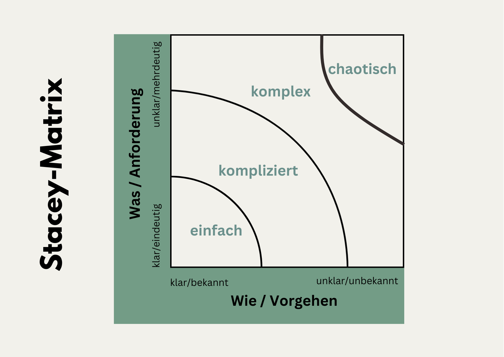
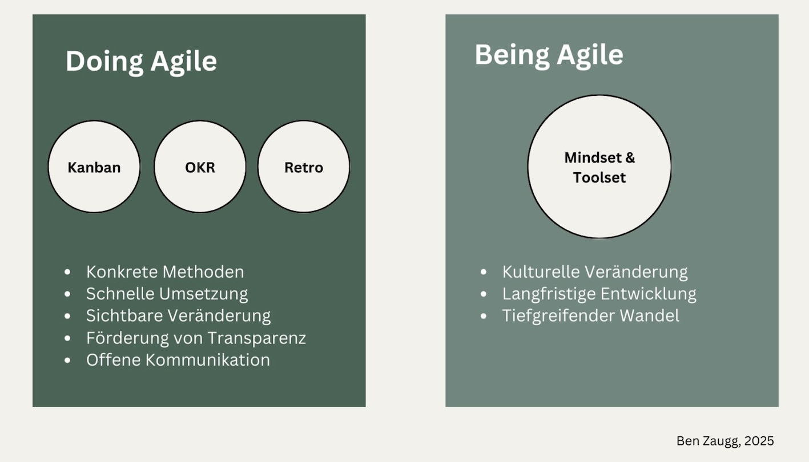

+++
title = "Integration agiler Methoden in klassische Führungskontexte - Teil 1"
date = "2025-01-22"
draft = false
pinned = false
tags = ["CAS-BI", "Agilität", "Leadership", "Personalentwicklung", "Organisationsentwicklung"]
image = "agil-leadership.jpg"
description = "Agilität kann Führung und Teamarbeit auch in klassische(re)n Organisationen bereichern – vorausgesetzt, sie wird sinnvoll eingesetzt. Teil 1: Grundlagen & Einstieg"
+++
## Über diesen Text

Dieser zweiteilige Leitfaden entstand innerhalb des [CAS Business Impact](https://www.bensblog.ch/tags/cas-bi/). Der Text richtet sich an Führungskräfte in (klassische(re)n Organisationsstrukturen, die ihre Führungsarbeit sowie die Teamarbeit durch agile Methoden bereichern möchten. Teil 1 bietet die theoretischen Grundlagen und Hintergründe, während Teil 2 als praktischer Leitfaden für die konkrete Umsetzung dient. Die Teile können sowohl gemeinsam als auch unabhängig voneinander genutzt werden.

# Teil 1: Theoretische Grundlagen

## 1. Theoretische Grundlagen

## 1.0 Agilität - Ursprung und Definition

Agilität hat seinen Ursprung in der Softwareentwicklung und basiert auf dem agilen Manifest von 2001. Die dort formulierten Werte und Prinzipien bilden bis heute die Grundlagen des agilen Arbeitens.

* Priorisierung von Menschen 
* Interaktionen über Prozesse
* funktionierende Ergebnisse über umfassende Dokumentation 
* Reaktion auf Veränderung über das Befolgen eines Plans 

Diese Prinzipien haben sich über die Jahre als wertvoll für viele Bereiche auch ausserhalb der Softwareentwicklung erwiesen. Trotzdem sollte Agilität oder agiles Arbeiten sinnvoll und überlegt eingesetzt werden. 

## 1.1 Sinnvoller Einsatz von Agilität

Agile Methoden sind kein Allheilmittel und sollten gezielt dort eingesetzt werden, wo sie einen echten Mehrwert bieten. Die Stacey-Matrix bietet hier eine hilfreiche Orientierung: Während in einfachen und komplizierten Kontexten klassische Methoden oft besser geeignet sind, entfalten agile Ansätze ihre Stärken besonders in komplexen Umgebungen. Der Einsatz agiler Methoden sollte daher stets vom spezifischen Kontext, der Unternehmenskultur und den vorhandenen Kompetenzen abhängig gemacht werden. 

Abbildung 1: Stacey-Matrix, diverse Quellen

## 1.2 Doing Agile vs. Being Agile

Die Integration agiler Methoden in Organisationen erfolgt auf zwei Ebenen: Dem "Doing Agile" - der konkreten Anwendung agiler Werkzeuge und Methoden - und dem "Being Agile" - der Entwicklung einer agilen Denkweise und Kultur. Während die vollständige kulturelle Transformation zu «Being Agile» einen längeren Zeitraum benötigt, können agile Methoden schnell einen Mehrwert bieten. Der vorliegende Ansatz fokussiert sich bewusst auf das "Doing Agile" als ersten, pragmatischen Schritt zur Erhöhung der Agilität in der Führung und Zusammenarbeit im Team.

Abbildung 2: Unterschied Doing Agile & Being Agile, eigene Darstellung 

## 2. Neue Führungsrolle im agilen Kontext

## 2.1 Vom klassischen zum agilen Führungsverständnis

Die Integration agiler Methoden erfordert je nach bisheriger Art der Führung und dem aktuellen Menschenbild eine Anpassung des Führungsverständnisses. Führungskräfte werden zu Ermöglichern, die Rahmenbedingungen schaffen und Hindernisse beseitigen. Dies bedeutet nicht den Verzicht auf klassische Führungsinstrumente, sondern eine bewusste Erweiterung des Führungsrepertoires mit agilen Elementen. Wichtig ist dabei die Balance zwischen notwendiger Führung und schrittweise wachsender Selbstorganisation der Teams.

## 2.2 Entwicklungspfad der Führungskraft

Der Weg zur Integration agiler Methoden ist selbst ein agiler Prozess. Es ist Anwenden und «Learning by Doing» zugleich. Er findet auch immer im Wechselspiel zwischen der neuen Art der Führung und den Reaktionen und Entwicklungsschritten des Teams statt. Führungskräfte entwickeln ihre neue Rolle schrittweise durch:

* Experimentieren mit einzelnen Methoden
* Reflektieren der Erfahrungen
* Adaptieren der Vorgehensweise
* Schaffen von psychologischer Sicherheit für das Team
* Vorleben einer experimentierfreudigen Kultur

## 3. Ausgewählte Methoden für den Führungsalltag

 Diese drei Methoden eigen sich, um die Führung und Teamarbeit mit agilen Arbeitsformen zu erweitern. Sie sind einfach einführbar, schaffen schnell sichtbare Mehrwerte und können flexibel an verschiedene Arbeits- und Führungskontexte angepasst werden.

## 3.1 Kanban

Kanban ist eine Methode zur Visualisierung und Optimierung von Arbeitsprozessen, die sich besonders gut für den Einstieg in agiles Arbeiten eignet.

#### **Kernelemente**

* Visualisierung der Arbeit (Aufgaben) auf Kanban-Board
* Limitierung der parallelen Arbeit (=Work in Progress Limits)
* Pull-Prinzip statt Push-Prinzip = Mitarbeitende werden aktiv(er)

#### **Mehrwert**

* Erhöhte Transparenz über Arbeitsauslastung
* Reduzierung von Multitasking
* Identifikation von Engpässen und Kapazitäten
* Basis für kontinuierliche Optimierung der Arbeit
* Mitarbeitende übernehmen mehr Verantwortung und können durch die transparenteren Prozesse mehr Verantwortung übernehmen

## 3.2 Objectives and Key Results (OKR)

OKR ist eine Methode zur agilen Zielvereinbarung und -verfolgung, das sowohl für strategische als auch für alltägliche Verbesserungsziele geeignet ist. Durch die inspirierenden Ziele und Meilensteine wird eine Stossrichtung vorgegeben. Kleine(re) Erfolge auf dem Weg werden sichtbar. 

#### **Kernelemente**

* Objectives: Qualitative, inspirierende Ziele
* Key Results: Messbare Erfolgskriterien
* Transparente Kommunikation

#### **Mehrwert**

* Fokussierung auf wichtigste Ziele
* Verbindung von strategischer und operativer Ebene
* Integration von Verbesserungen in den Alltag
* Erhöhte Eigenverantwortung der Teams

## 3.3 Retrospektiven

Retrospektiven sind strukturierte Team-Meetings zur Reflexion und kontinuierlichen Verbesserung der Zusammenarbeit.

#### **Kernelemente**

* Regelmässige Durchführung
* Strukturierter Ablauf
* Fokus auf Verbesserungsmassnahmen
* Offene Diskussionskultur

#### **Mehrwert**

* Kontinuierliche Verbesserung der Zusammenarbeit
* Frühzeitige Problemerkennung
* Stärkung der Teamkultur
* Förderung von Eigenverantwortung
* Durch klare Struktur mehr Fokus = Effizienz

## 4. Kontextabhängige Implementierung

## 4.1 Geeignete Kontexte

Basierend auf der Stacey-Matrix sind agile Methoden besonders in komplexen Situationen sinnvoll. Dies sind Kontexte, in denen der Zusammenhang zwischen Ursache und Wirkung erst im Nachhinein erkennbar ist und viele unbekannte Elemente eine Rolle spielen.

* Die vorgestellten Methoden eignen sich besonders für:
* Projektbasierte Arbeit mit hoher Komplexität
* Wissensarbeiter-Teams
* Bereiche mit häufigen Änderungsanforderungen
* Teams mit Bedarf an besserer Selbstorganisation
* In Change Prozessen

In einfachen oder nur komplizierten Situationen, wo Zusammenhänge klar sind und bisheriges Wissen zur Verfügung steht, können klassische Führungs- und Zusammenarbeitsmethoden oft zielführender sein. 

## 4.2 Erfolgsfaktoren

Die Einführung agiler Methoden ist ein Veränderungsprozess, dessen Erfolg von verschiedenen Faktoren abhängt. Durch die bewusste Berücksichtigung dieser Faktoren kann die Wahrscheinlichkeit einer erfolgreichen Implementation deutlich erhöht werden.

Für eine erfolgreiche Implementation sind folgende Faktoren entscheidend:

* Klärung des gemeinsamen Verständnisses von «Agilität»
* Klare Kommunikation von Zielen und Erwartungen
* Schrittweise Einführung und Anpassung
* Balance zwischen Stabilität und Agilität

## 4.3 Einsatz in Change Prozessen

Veränderungsprozesse sind komplex und erfordern einen strukturierten, aber gleichzeitig flexiblen Ansatz. Agile Methoden bieten hier Vorteile, da sie Transparenz schaffen, schnelle Anpassungen ermöglichen und die Mitarbeitenden aktiv einbinden. Durch iterative Prozesse helfen sie dabei, grosse Veränderungen in überschaubare Schritte zu unterteilen. 

Agile Methoden können Change-Prozesse effektiv unterstützen durch:

* Iteratives Vorgehen zur Komplexitätsreduktion
* Frühe Erfolgserlebnisse durch kleine Verbesserungen
* Kontinuierliches Feedback zur Prozessoptimierung
* Aktive Einbindung der Mitarbeitenden
* Transparente Kommunikation von Fortschritten
* Aufbau von Veränderungskompetenz für eine Arbeitswelt die zunehmend im Wandel ist

## 4.4 Potenzielle Herausforderungen

Die Einführung agiler Methoden bringt verschiedene Herausforderungen mit sich, auf die ein Augenmerk gelegt werden muss. Ein bewusster Umgang mit diesen Herausforderungen ist wichtig für eine erfolgreiche Umsetzung.

Typische Herausforderungen:

* Widerstände erkennen und angehen
* Hybride Strukturen durch flexible Anpassung gestalten
* erschiedene Geschwindigkeiten (Adaptierung, Mindshift etc.) und Arbeitsweisen berücksichtigen sowie Widersprüche zwischen Agile und Klassisch erkennen

[\--> zu Teil 2](https://www.bensblog.ch/agile-methoden-in-klassicher-fuehrung-teil2/)