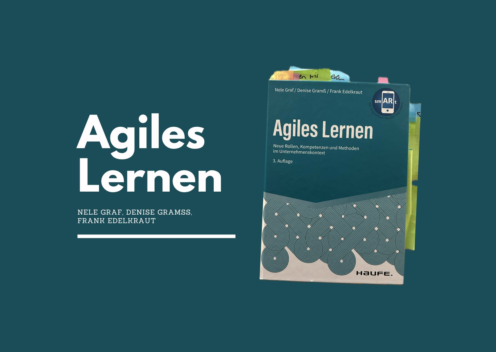
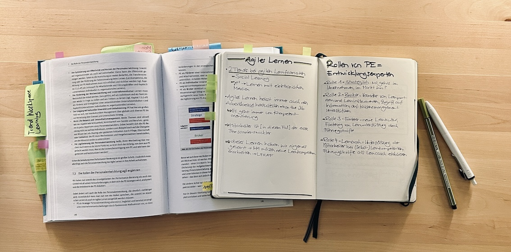

+++
title = "Buch: Agiles Lernen – Neue Rollen, Kompetenzen und Methoden im Unternehmenskontext"
date = "2024-09-02"
draft = false
pinned = false
tags = ["Buch", "Agilität", "Lernen", "Bildung", "Leadership", "Personalentwicklung", "Organisationsentwicklung"]
image = "agiles-lernen.jpg"
description = "Einblicke in das Buch «Agiles Lernen» und Gedanken dazu. "
footnotes = "🛒[Zum Buch «Agiles Lernen» bei exlibris](https://www.exlibris.ch/de/buecher-buch/deutschsprachige-buecher/nele-graf/agiles-lernen/id/9783648158548/?srsltid=AfmBOop9JV1Yq0PsvcHP4APLxIEl8rE6s1cuSRj9oJRv0O0d-LepJPKO)\n\nPS: Das ist meine fünfte [«Buchrezension»](https://www.bensblog.ch/tags/buch/) und ein weiterer Versuch (wobei langsam nicht mehr von einem Versuch gesprochen werden kann 😉). Nachdem ich in meinem ersten Podcastformat vor ein paar Jahren über Bücher erzählt habe und ich etliche positive Rückmeldungen erhielt, dachte ich mir schon lange, ich könnte doch auch einmal etwas schreiben. Wie gefällts dir?\n\nPPS: Keine bezahlte Werbung, nur persönliche Einschätzung & Empfehlung."
+++
## Einleitung: Die Notwendigkeit agilen Lernens in einer sich wandelnden Arbeitswelt

Das Buch beginnt mit der Beobachtung, dass sich nicht nur die Arbeitswelt, sondern auch die Lernwelt grundlegend wandelt. Während sich Unternehmen früher langsamer entwickelten, beschleunigen heute technologische Innovationen, etwa durch künstliche Intelligenz und digitale Transformation, diesen Wandel. Die Autoren argumentieren, dass die Diskrepanz zwischen den Anforderungen der industriellen und der digitalen Revolution eine neue Herangehensweise an das Lernen erfordert. In diesem Zusammenhang wird agiles Lernen als ein Schlüsselkonzept hervorgehoben, das sich an die dynamischen Bedingungen der modernen Arbeitswelt anpassen kann.

> «Wir haben hierin unsere Erfahrungen in agilem Arbeiten, moderner Personalentwicklung und der Lernforschung zusammengeführt, weil wir überzeugt sind, dass Lernen zu dem Erfolgsfaktor für Unternehmen und Mitarbeiter in der VUCA-Welt wird.»
>
> *aus dem Buch S. 13*

## Lernen als Schlüsselkompetenz in der agilen Arbeitswelt

Zentrales Thema des Buches ist das kontinuierliche Lernen. Die Autoren sehen Lernen als zentrale Aufgabe moderner Personalentwicklung und als wesentliche Kompetenz, um in der agilen Arbeitswelt zu bestehen. In einer Zeit des Fachkräftemangels und ständiger Veränderungen der Berufsbilder – verstärkt durch Technologien wie KI – ist das Lernen für Mitarbeitende und Führungskräfte essenziell. Graf, Gramss und Edelkraut betonen die Rolle der Personalentwicklungsabteilungen, Führungskräfte sowie die Verantwortung der Lernenden selbst.

> «Egal wie wir Veränderungen wahrnehmen, jede ist ein Lernprozess.»
>
> *aus dem Buch S. 21*

## Begriffsklärung und Abgrenzung: Agiles Lernen, Lernen 4.0 und New Learning

Im Buch gibt es auch eine differenzierte Abgrenzung der Begriffe „agiles Lernen“, „Lernen 4.0“ und „New Learning“. Diese Trennung ist nicht nur für das Verständnis hilfreich, sondern schafft auch Klarheit in der Zusammenarbeit. Die Autoren erläutern, was jedes dieser Konzepte beinhaltet und wie sie sich voneinander unterscheiden. 

## Praktische Ansätze und agile Lernformate

Es werden agile Lernformate vorgestellt, die in Unternehmen implementiert werden können, sowie Strategien, wie solche Formate erfolgreich umgesetzt werden. Die Autoren beschreiben dabei nicht nur die formalen Aspekte dieser Lernformate, sondern auch, wie man sie in der Praxis einführt. Das Buch wird durch Illustrationen, Links und ergänzende Inhalte – abrufbar über die Haufe App – bereichert, die zusätzlichen Einblicke und Vertiefungen bieten, darunter auch YouTube-Videos und Artikel.

## Neue Rollen und Kompetenzen für Führungskräfte und Personalentwicklung

Ein weiterer Aspekt des Buches sind die neuen Rollen von Führungskräften und Personalentwicklern im Kontext des agilen Lernens. Die Autoren beschreiben, wie Führungskräfte und Personalentwickler zu Lernbegleitern werden, die Mitarbeitende dabei unterstützen, zu kompetenten und selbstständigen Lernenden zu werden. Sie beschreiben, wie sich das Verständnis der Personalentwicklung und die Organisationsstrukturen verändern müssen, um agiles Lernen zu fördern und eine menschenzentrierte Lernkultur zu ermöglichen.

## Fazit: Ein wertvoller Leitfaden für zukunftsorientierte Lernkulturen

„Agiles Lernen“ bietet einen fundierten und praxisnahen Einblick in die Lernkultur von morgen. Es stellt wertvolle Impulse für Personalentwickler:innen und Führungskräfte bereit, die an der Schnittstelle von Lernen und Arbeiten stehen. Das Buch zeigt, wie agiles (lebenslanges) Lernen in den Arbeitsalltag integriert und wie es dazu beiträgt, dass Mitarbeitende auch in einem dynamischen Umfeld erfolgreich sein können. Es ist ein wertvoller Leitfaden für alle, die sich mit modernen und menschenzentrierten Lernformen auseinandersetzen und die Entwicklung ihrer Organisationen aktiv mitgestalten möchten.

> «In der Konsequenz gehört das kontinuierliche Lernen von Mitarbeitenden, Führungskräften und der Organisation zu den zentralen Aufgaben moderner Personalentwicklung.»
>
> *aus dem Buch S. 35*

**👍Von mir gibt es dafür eine Lese-Empfehlung!**

Buch: Agiles Lernen – Neue Rollen, Kompetenzen und Methoden im Unternehmenskontext

Autor:innen: Nele Graf, Denise Gramss und Frank Edelkraut