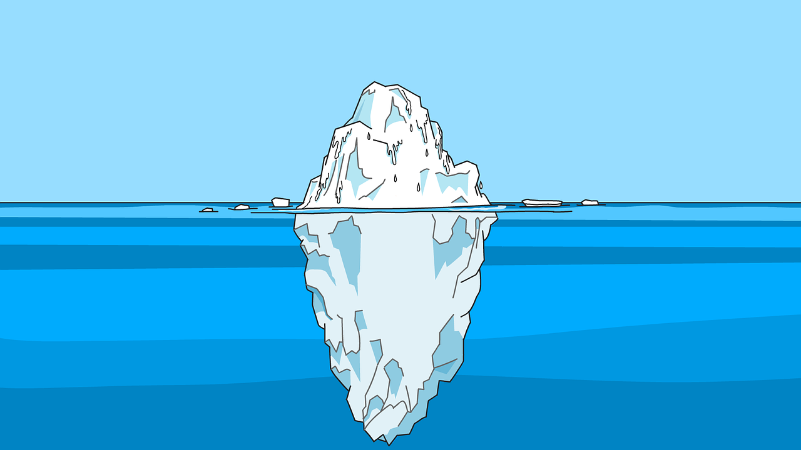

+++
title = "Bewerbungsprozess - andere Zeiten brechen an"
date = "2022-11-06"
draft = false
pinned = false
tags = ["Arbeit", "Gedanken"]
image = "career-3449422_640.png"
description = "Der Arbeitsmarkt verändert sich und auch die Bewerbungsprozesse sind nicht mehr so einheitlich wie noch vor ein paar Jahren. Wie bewirbt man sich aber richtig? "
footnotes = "Titelbild by [Coffee Bean](https://pixabay.com/users/coffeebeanworks-558718/?utm_source=link-attribution&utm_medium=referral&utm_campaign=image&utm_content=3449422) from [Pixabay](https://pixabay.com//?utm_source=link-attribution&utm_medium=referral&utm_campaign=image&utm_content=3449422)"
+++
### Bewerbungsprozess - andere Zeiten brechen an

Wer sich einen neuen Job sucht, kennt es. Jobportale durchsuchen, Stellenausschreibungen lesen und sich dort bewerben, wo man den Anforderungen entspricht. Dann darauf hoffen, dass jemand die Bewerbungsunterlagen liest. Was lesen die HR-Menschen aber genau? Was interessiert sie? Warum kommt es zu einer Absage? Wir die Bewerbung überhaupt noch gelesen?

#### Wie läuft ein Bewerbungsprozess ab? 

Vor ein paar Jahren wäre es noch recht einfach gewesen, den Prozess zu beschreiben. Die Prozesse werden immer unterschiedlicher. Leider beahutpen viele, die Warheit zu kennen. Nur wer genau hinsieht, wer mit HR-Fachpersonen spricht oder selbst im Bewerbungsprozess drin ist merkt, wie unterschiedlicht die Abläufe sind. Hier schildere ich meine Erfahrungen als Bewerber und kombiniere sie mit Wissen und ebenfalls Erfahrungen aus Gesprächen mit HR-Fachleuten, Büchern und meiner Arbeit als Job-Coach. 

#### Stellenausschreibung 

Bei den Stellenausschreibungen ist noch vieles wie früher. Wobei hier auffällt, wie sehr sich Inserate ähneln. Sie werden oft kopiert und leicht angepasst. Es gibt viele Unternehmen, die gar nicht so genau wissen, welche Qualifikationen sie wirklich brauchen. In einer Welt, die sich so schnell verändert, irgendwie auch kein Wunder.  


**Ein sehr häufiger Ablauf ist:** 

* Stellenausschreibung
* Bewerbung per Mail oder über eine Onlineplattform 
* Gespräch 1 oder Kurzinterview per Telefon
* Allenfalls Gespräch 2 
* Referenzen einholen 
* Anstellung/Absage 
  

Mittlerweile gibt es aber beispielsweise «Job-Tinder». Jobeagle ermöglicht ansprechende Stellenbeschreibungen und einfaches Bewerben. Alles sehr ähnlich wie bei Tinder. Andere Firmen möchten ein kurzes Bewerbungsvideo oder den Lebenslauf per PDF und ein paar Worte zur Motivation per Whats-App.  

#### Unterschiedliche Ansprüche 

«Job-Tinder»: Den Bewerber:innen wird ein einfachen und schnelles Bewerben angepriesen. Ist einmal gewischt, werden aber einige Daten (wie beim Lebenslauf) verlangt. Viele Firmen wünschen sich hier (verständlicherweise) trotz der Einfachheit möglichst viele ausgefüllte Felder, um ein gutes Bild zu erhalten. Bewerber:innen füllen aber relativ wenig bis nichts aus, da es ja einfach und schnell sein soll(te) und auch so angepriesen wird. 

Das scheint bei vielen neueren Bewerbungsformen und Tools der Fall zu sein. Es sind unterschiedliche Ansprüche und die sind nicht geklärt oder nicht kommuniziert.  

#### Die Marktverschiebung  

Bisher hatten wir einen Arbeitgebermarkt. Unternehmen die Jobs im Angebot hatten, konnten oft zwischen vielen Bewerbenden auswählen. Das hat sich in den letzten Jahren in verschiedenen Branchen bereits (z. T. drastisch) verschoben und es wird sich weiterhin verschieben. Es werden mehr Menschen pensioniert, als auf den Arbeitsmarkt kommen und die Macht wechselt zunehmend hin zu den Bewerber:innen. Wir haben also zunehmend einen Arbeitnehmendenmarkt.  

#### Verdeckter Arbeitsmarkt 

Kennst du den verdeckten Arbeitsmarkt? Man beschreibt ihn auch gerne mit dem Eisbergmodell. Das heisst, der grösste Teil der offenen Stellen ist unsichtbar. Diese Stellen werden nicht ausgeschrieben. Du findest sie über Kontakte, über Spontanbewerbungen usw.  Je nach Branche spricht man von rund 75 % aller Stellen. 

#### Was ist bei einer Bewerbung wichtig?  

Das würde einen eigenen Beitrag füllen. Saubere, vollständige Bewerbungsunterlagen sind auch in Zeiten des Fachkräftemangels noch wichtig. Dazu gehören alle Arbeitszeugnisse, ein individuelles sowie aussagekräftiges Bewerbungsschreiben und natürlich ein vollständiger Lebenslauf.  \
 \
Die Ansprüche an Bewerbungsunterlagen sind heute vielleicht so unterschiedlich wie noch nie. Mit dem sauberen und vollständigen Dossier bist du aber immer auf der sicheren Seite.    

#### Vorgegebene Raster 

Absagen können schmerzen, sie können demotivieren und einem zum Verzweifeln bringen. Ganz oft ist es aber so, dass bereits ganz klare Vorstellungen vorhanden sind, wer denn gesucht wird. Das kann und wird kaum in Stellenausschreibungen kommuniziert. Zu beachten ist auch, dass einige Unternehmen viele Teile des Bewerbungsprozesses automatisiert haben oder zunehmend automatisieren. 


\
[SRF- Beitrag vom 16.08.2018 Wenn der Job-Roboter Menschen rekrutiert](https://www.srf.ch/news/wirtschaft/kuenstliche-intelligenz-wenn-der-job-roboter-menschen-rekrutiert)\
\
[SRF-Beitrag vom 27.02.2020 Wenn Computer über Menschen urteilen](https://www.srf.ch/news/wirtschaft/online-rekrutierung-wenn-computer-ueber-menschen-urteilen)

[SRF-Beitrag vom 15.03.2021 Computer says no: Wenn der Roboter über die Karriere entscheidet](https://www.srf.ch/radio-srf-3/input/maschinen-auf-personalsuche-computer-says-no-wenn-der-roboter-ueber-die-karriere-entscheidet)


#### Vom Arbeitgebermarkt zum Arbeitnehmermarkt 

Durch den Fachkräftemangel wandelt sich der Arbeitsmarkt. Es sind nicht mehr immer die Arbeitgeber, die aus den Bewerber:innen auswählen können, sondern immer mehr auch die Arbeitnehmer:innen, die sich das Unternehmen aussuchen dürfen. Das ist und bleibt aber von Branche zu Branche und von Unternehmen zu Unternehmen unterschiedlich.  \
 \
Ein aktuelles Beispiel hier im Bericht von watson

[«Migros-Personalchef: Es fehlt überall an Leuten»](https://www.watson.ch/wirtschaft/migros/661863158-migros-personalchef-es-fehlt-ueberall-an-leuten)

#### Es gibt viele Wahrheiten 

In den letzten Monaten war ich nach meiner Selbstständigkeit wider auf Stellensuche. In dieser Zeit habe ich aktiv mit meinem bestehenden und immer grösser werdenden Netzwerk gearbeitet. Ich habe mich auf Stellen beworben und Spontanbewerbungen geschrieben. Ich erhielt manchmal keine Antwort, sammelte Absagen, ging zu ersten Vorstellungsgesprächen, wurde zu zweiten Vorstellungsgesprächen eingeladen und hatte kurze Kennenlerninterviews. Es waren Treffen über Microsoft Teams, am Telefon, über zoom und natürlich physische.  

Manchmal erhielt ich Rückmeldungen, wie ich wahrgenommen wurde oder gab selbst ein Feedback. Die Erkenntnis ist wieder: Es gibt viele Wahrheiten. Die Rekrutierungsprozesse, die Gespräche, die Antworten, die Rückmeldungen, die Absagen, die Einhaltung von Terminen waren oft sehr unterschiedlich.  

#### Lohntransparenz 

Der Lohn ist und bleibt ein schwieriges Thema. Während Bewerbende bereits im Bewerbungsprozess oder spätestens im Gespräch ihre Vorstellungen bekanntgeben sollten, halten sich Firmen bis am Schluss zurück. Bei der Lohntransparenz ist also nach gaaanz viel Luft nach oben. \
\
Zum Thema Lohn empfehle ich gerne eine SRF-Input Sendung\

(https://www.srf.ch/audio/input/und-was-verdienst-du-so-wir-brechen-das-tabuthema-lohn?id=11181600) aus dem Jahr 2017.

#### Da passiert noch viel 

Der Arbeitsmarkt bewegt sich. (Komplett) neue Anforderungen verlangen nach neuen Berufen und vorhandene Berufsbilder verändern sich unterschiedlich schnell. Es verändert sich aber alles. Es braucht auf allen Seiten Flexibilität und Anpassungsfähigkeit.  \
 \
Wie es mit deinem Job im Bezug auf Automatisierbarkeit aussehen könnte, kannst du auf einer Webseite checken.\

[https://job-futuromat.iab.de/  ](https://job-futuromat.iab.de/) 

Das hier ist wie immer nicht das Ende. Es ist nicht abschliessend und nicht vollständig. Es ist (m)eine Momentaufnahme. Es ist ein Zwischenfazit und es ist die Zeit, in der wir die Zukunft gestalten können. Das sich die Lage «zuspitzt» und sich auch dadurch noch einiges verändern wird, zeigt der oben erwähnte watson-Beitrag, der genau in dem Moment online geht, in dem ich diesen Beitrag fertig schreibe.