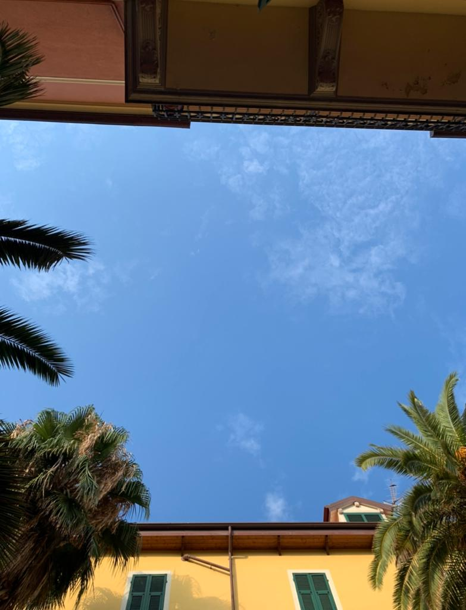
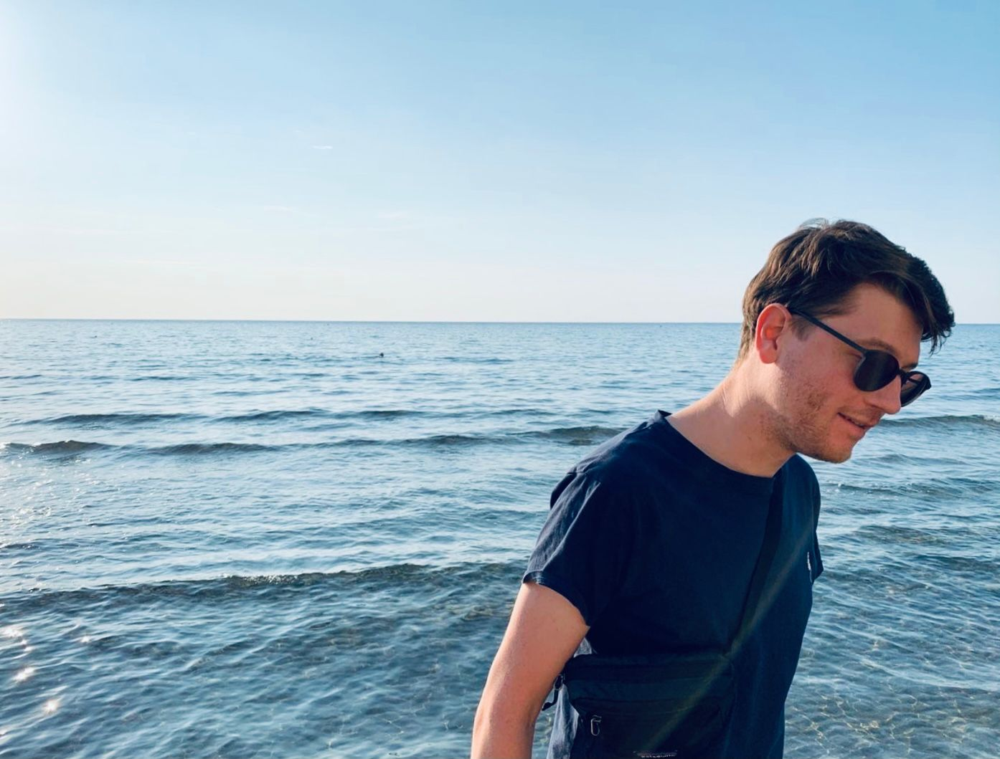
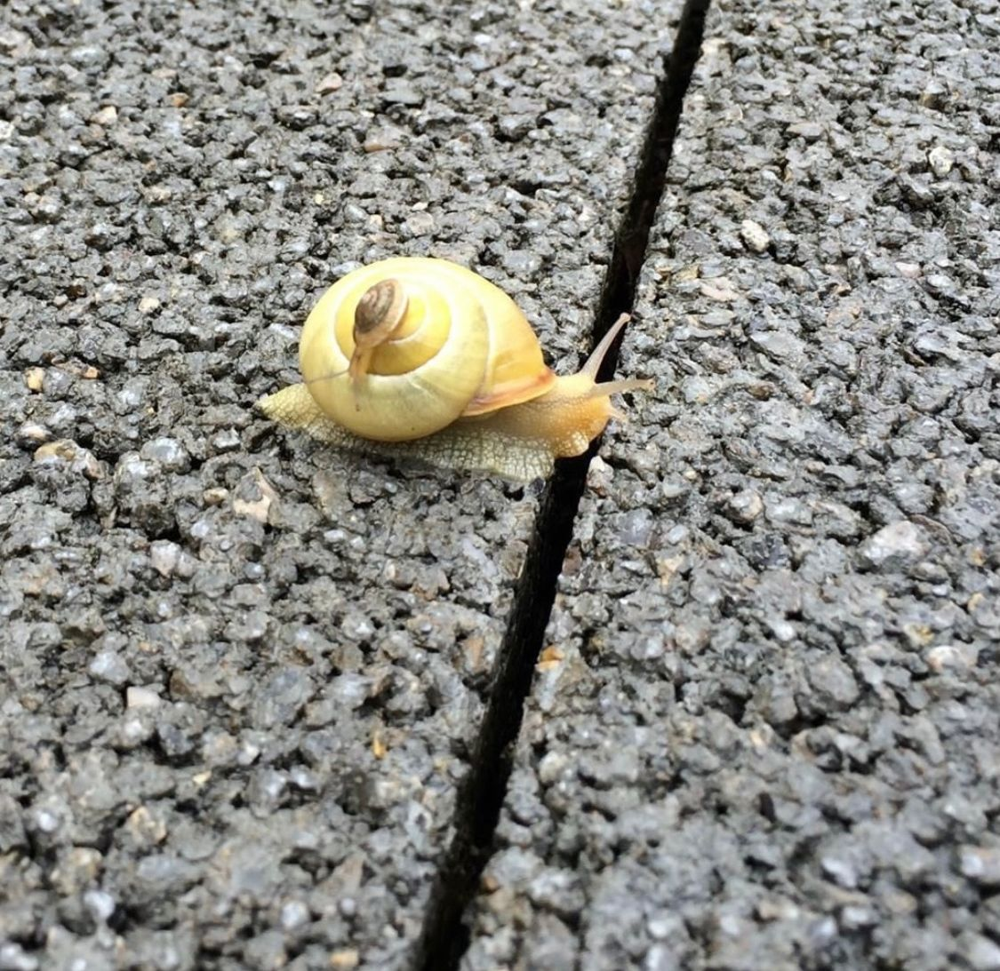

+++
title = ".. und es kommt anders als man denkt"
date = "2021-11-14"
draft = true
pinned = false
image = "whatsapp-image-2021-11-13-at-20.10.53.jpeg"
description = "Manchmal kommt es anders als man denkt. Hier kannst du mich wieder auf meiner Reise begleiten. V"
+++
Manchmal ärgere ich mich ein bisschen, dass ich online (in meinen Podcasts, in Blogs und den (a)sozialen Medien transparent unterwegs bin und manche Dinge nicht zurückhalte. Der Weg fühlt sich für mich zwar richtig an, man sieht aber wo ich eine andere Abzweigung nehme oder den Fokus ändere. Mich persönlich störts nicht, es könnte aber einen negativen Einfluss auf meine Glaubwürdigkeit haben oder die Klarheit meiner Angebote verwässern. Nun, aber genau das sollen meine Kund\*innen, Wegbegleiter\*innen etc. sehen und sich davon vielleicht auch inspirieren lassen. Denn zu oft wird man bei der Änderung der eigenen Meinung als Sprunghaft dargestellt oder als unentschlossen betitelt. Viel zu oft folgen wir einem Weg und verpassen Abzweigungen oder vergessen andere Blickwinkel einzunehmen. 

..und so kam es bei mir wieder einmal anders als gedacht. In den letzten Monaten habe ich voll auf die Arbeit rund um ZUKUNFTSHELDEN gesetzt, es war und ist mein definitiver Start in die Selbstständigkeit. In diesem Zusammenhang habe ich in vielen verschiedenen Varianten kommuniziert. In den sozialen Medien v. a. Linkedin aber auch Instagram, auf Papier und per Post habe ich Bildungsinstitutionen, Schulen und potenzielle Vermittler sowie Zuweiser angeschrieben. Diesen Herbst habe ich dann noch ein Schaufenster gestaltet (auf das ich etwas stolz bin). Dabei habe ich klar kommuniziert, Geschichten erzählt und habe mich mit Menschen verbunden. Die Kommunikation war eigentlich das, was noch nebenbei lief. Klar, Kommunikation ist für mich nichts Neues, da ich die längste Zeit meines beruflichen Weges im Marketing und Verkauf gearbeitet habe. 

Im Tun hat sich nun, so kann ich das nach Rückmeldungen und Gesprächen sagen, eines meiner (vielleicht Kern-) Talente gezeigt. Für mich wäre es zu schade, dass nicht zu nutzen. Kurz gesagt: mit [Hallo Ben.](https://www.halloben.ch) ist vor kurzem ein neues altes Baby zur Welt gekommen. Ich bringe Kommunikation auf den Punkt. Für Menschen von Menschen. 

Für mich war immer klar, dass es viele verschiedene Wege gibt, denen ich folgen könnte und kann. Jetzt bin ich auf diesen zwei Wegen unterwegs. Mit «Zukunftshelden« und mit «Hallo Ben.» Lustigerweise habe ich mich mit der Beratung und Umsetzung rund um Kommunikation seit Jahren immer wieder beschäftigt und das meistens nebenbei in der Freizeit getan. Da waren Google-Optimierungen, Webseiten-Anpassungen, neue Webseiten, Flyer, ... und so weiter. Dabei ging es immer darum die Individualität der Menschen hervorzuheben ohne Marketing-Schnickschnack. Eine meiner wichtigsten Stärken habe ich dabei anscheinend nicht gesehen. Dafür braucht es manchmal die Begegnung mit anderen, die einem dabei helfen. 

Ein Zitat welches mir gut gefällt und in diesem Zusammenhang irgendwie passt ist dieses:

> «Ich bin fähig gewesen, mich für neue Ideen, neue Gefühle, neue Erfahrungen und neue Risiken zu öffnen. Ich entdeckte immer mehr, dass lebendig sein bedeutet, Wagnisse einzugehen, trotz fehlender Gewissheit zu handeln und sich auf das Leben einzulassen. All dies bringt Veränderungen mit sich, und für mich ist der Prozess der Veränderung mit dem Leben identisch. Mir ist klar, dass ich, wenn ich stabil und starr und statisch wäre, eine lebende Leiche wäre. Deshalb akzeptiere ich Verwirrung und Ungewissheit und Furcht und emotionale Höhen und Tiefen, weil sie der Preis sind, den ich für ein strömendes, rätselhaftes, erregendes Leben gern bezahle.» Carl R. Rogers