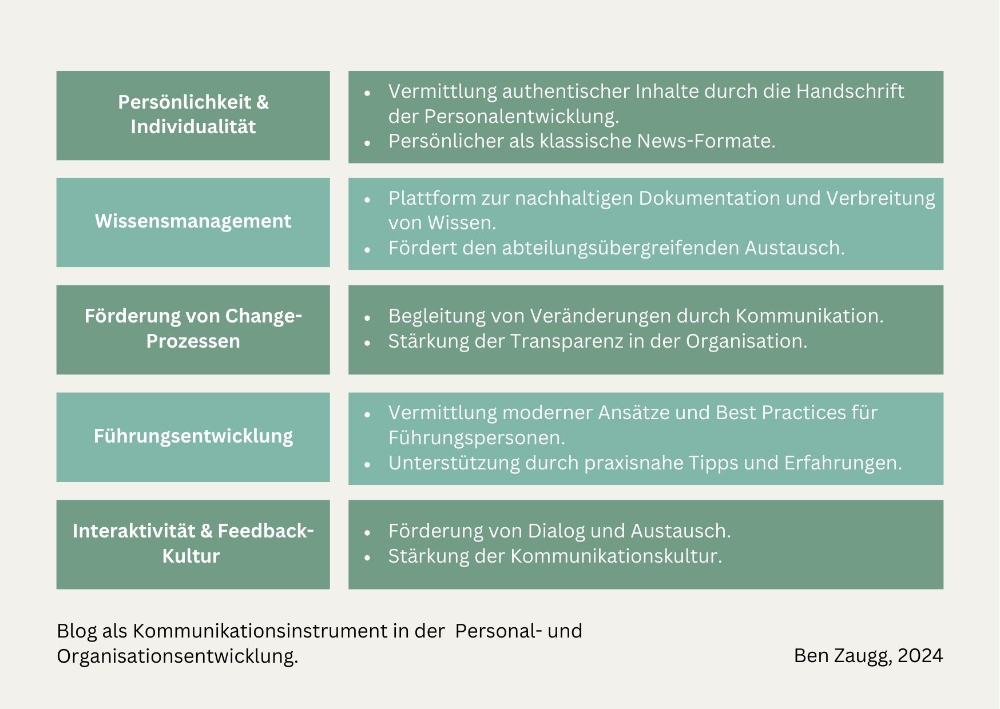
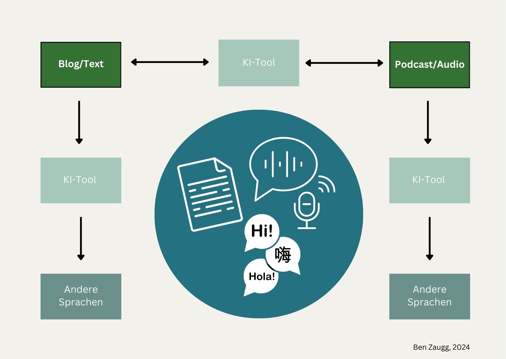

+++
title = "Blogs als wertvolle Ressource in der Personal- und Organisationsentwicklung"
date = "2024-11-21"
draft = false
pinned = false
tags = ["Blog", "Personalentwicklung", "Organisationsentwicklung", "Leadership"]
image = "blog_100-2.jpg"
description = "Blog - eine versteckte Superkraft der Personal- und Organisationsentwicklung?\nIn einer Zeit, in der Wissen, Vertrauen und Dialog entscheidend sind, können Blogs mehr als nur informieren: Sie schaffen Persönlichkeit, stärken den internen Austausch und fördern strategische Entwicklungen. "
footnotes = "Titelbild: Erstellt mit Dall-E 3\n\nBlog: Erstellt mit [Lilo.Blog](https://www.lilo.blog)"
+++
## Einleitung: Warum Blogs?

Blogs sind ein bekanntes Medium und werden häufig genutzt, um Expertenwissen zu teilen oder Einblicke in Fachthemen zu geben. In der Personal- und Organisationsentwicklung entfalten sie jedoch einen einzigartigen Mehrwert: Sie dienen als strategisches Kommunikationsinstrument, um Wissen zu teilen, Vertrauen aufzubauen und Einblicke in Entwicklungsansätze zu geben. Aber was macht Blogs in diesem Kontext besonders?

## Ein Kommunikationskanal der Personal- und Organisationsentwicklung

Ein Blog aus der Feder der [Personal- und Organisationsentwicklung](https://www.bensblog.ch/tags/organisationsentwicklung/) spiegelt die Expertise und Perspektiven dieses Bereichs wider. Er bietet die Möglichkeit, fachliche und aktuelle Inhalte zu teilen, die die strategische Ausrichtung der Organisation unterstützen.

**Fachthemen mit Mehrwert:** Themen wie [Leadership](https://www.bensblog.ch/tags/leadership/), [Change-Management](https://www.bensblog.ch/tags/change/) oder aktuelle Herausforderungen in der Organisation können praxisnah und verständlich aufbereitet werden.

**Einblicke in Entwicklungsarbeit:** Artikel können Ansätze und Methoden beleuchten, die von der Personal- und Organisationsentwicklung entwickelt wurden.

**Erweiterungsoption:** Mitarbeitende oder Führungskräfte können punktuell als Gastautor:innen auftreten, um persönliche Erfahrungsberichte oder Best Practices beizusteuern. Dies ergänzt die fachliche Expertise um eine authentische Perspektive aus der Praxis.

Durch diese gezielte Mischung aus Fachwissen und optionaler Beteiligung wird der Blog zu einem wertvollen Werkzeug für die interne Kommunikation und das Wissensmanagement.

## Praxisorientierte Einsatzmöglichkeiten

### Change-Prozesse begleiten

Der Blog kann als Kommunikationsmittel im Change-Management eingesetzt werden. Artikel könnten die Vision des Wandels erläutern, Widerstände thematisieren oder erste Erfolge präsentieren.

**Mögliche Themen:**

* Wie unsere Organisation Veränderung gestaltet
* Erfolge und Herausforderungen im Change-Prozess
* Tools und Methoden die den Change-Prozess unterstützen

### Führungsentwicklung unterstützen

Inhalte, die von der Personal- und Organisationsentwicklung aufbereitet werden, können Führungspersonen praxisnahe Tipps geben. Auch Empfehlungen für Fachliteratur oder innovative Ansätze der Führungskompetenzentwicklung finden hier Platz.

**Mögliche Themen**

* Leadership: Moderne Ansätze im Führungsalltag
* Remote-Leadership: Erfolgsfaktoren und Stolpersteine
* Führung im Wandel

### Wissensmanagement vorantreiben

Der Blog kann dazu beitragen, Wissen nachhaltig zu dokumentieren und abteilungsübergreifend verfügbar zu machen. Regelmässige Fachbeiträge stellen sicher, dass wichtige Entwicklungen und Methoden lebendig bleiben.

Neben der inhaltlichen Vielfalt können Blogs auch durch (neue) technologische Erweiterungen überzeugen, die ihre Reichweite und Wirkung verstärken.

## Erweiterungsmöglichkeiten: Von [KI](https://www.bensblog.ch/tags/ki/) bis Mehrsprachigkeit

**Durch KI in andere Formate umwandeln:** Blogs können mit Hilfe von KI in [Podcasts](https://www.bensblog.ch/podcasts-personalentwicklung-organisationsentwicklung/) umgewandelt werden. Das ermöglicht die Teilhabe z. B. von Menschen mit Schwierigkeiten beim Lesen und Schreiben. 

**Integration anderer Formate in den Blogartikel:** Die Ergänzung von Podcasts oder Videos kann helfen, Inhalte interaktiv und barrierefrei zugänglich zu machen. 

**Mehrsprachigkeit fördern:** Übersetzungen ermöglichen einen einfachen Zugang für alle Mitarbeitenden, unabhängig von ihrer Muttersprache.

## Interaktivität und Feedback-Kultur: Dialog fördern

Ein Blog ist nicht nur ein Informationskanal, sondern auch eine Plattform für den Austausch. Durch eine Kommentarfunktion können Mitarbeitende aktiv am Dialog teilnehmen, Feedback geben oder Fragen stellen. Dies stärkt die Feedback-Kultur und fördert den Austausch. Das heisst aber auch, dass die Diskussionen moderiert werden sollten. 

## Gedanken zum Schluss: Ein Blog als strategisches Instrument

Ein Blog aus der Feder (oder den Tasten) der Personal- und Organisationsentwicklung ist mehr als ein Medium um Inhalte zu teilen. Er verbindet Fachthemen mit strategischer Kommunikation und Perspektiven aus dem Arbeitsalltag. Mit einer klaren Ausrichtung und einer interaktiven Gestaltung kann er nicht nur Wissen teilen, sondern auch Vertrauen und Vernetzung innerhalb der Organisation fördern. Ein schrittweises Herantasten in iterativen Prozessen hilft dabei, die idealen Inhalte und Formate zu entwickeln.

PS: Das ist mein hundertster (100!)🎉 Blogbeitrag!

