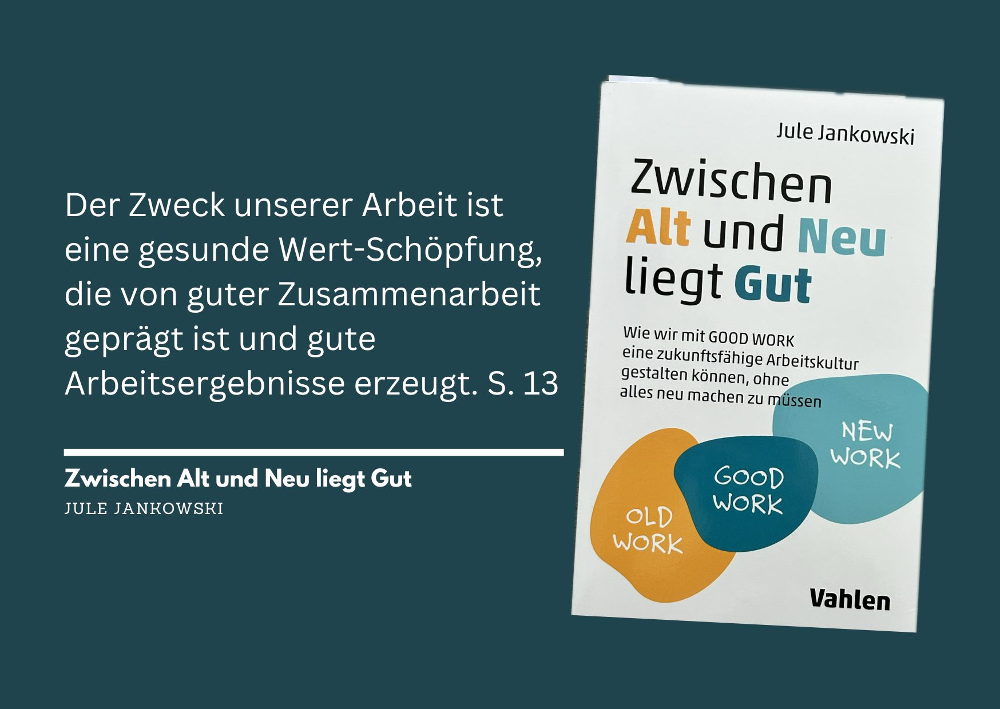

+++
title = "Zwischen Alt und Neu liegt Gut - Das Buch von Jule Jankowski"
date = "2024-12-02"
draft = true
pinned = false
tags = ["NewWork", "Buch", "Personalentwicklung", "Organisationsentwicklung"]
image = "good-work.jpg"
description = "Wie lässt sich die Arbeitswelt zukunftsfähig gestalten, ohne alles Alte über Bord zu werfen? In ihrem Buch „Zwischen Alt und Neu liegt Gut“ verbindet Jule Jankowski Praxis und Theorie, um Prinzipien für eine menschliche, anpassungsfähige und dennoch stabile Arbeitskultur zu entwickeln."
footnotes = "🛒[Zum Buch »Zwischen Alt und Neu liegt Gut» bei exlibris ](https://www.exlibris.ch/de/buecher-buch/deutschsprachige-buecher/jule-jankowski/zwischen-alt-und-neu-liegt-gut/id/9783800669332/?srsltid=AfmBOoobUhuWOk1ZasCoMk_Leh47MYWgNRIHVdXmEAtWkDm_clgtxtMu)\n\n🎧[Good Work Podcast](https://humiq.de/podcast/)\n\nPS: Keine bezahlte Werbung, nur persönliche Einschätzung & Empfehlung."
+++
## Einleitende Gedanken

Ich mag Menschen und Bücher, die Themen und das Leben differenziert betrachten. Dabei spielt für mich die Verbindung von Theorie und Praxis eine wichtige Rolle. Es gibt meistens nicht die eine Lösung, die für alle passt, auch wenn wir das (insbesondere in der Arbeitswelt) gerne so hätten. Ich mag den vereinfachten Hype zu New Work genauso wenig wie das Abwerten von allem «Alten» in unseren Arbeitssystemen. Deshalb schreibe ich hier über das Buch «Good Work». 

## Über das Buch «Zwischen Alt und Neu liegt Gut» von Jule Jankowski

Im Buch «Zwischen Alt und Neu liegt Gut» schreibt Jule Jankowski darüber, wie wir die Arbeitswelt sinnvoll und zukunftsfähig gestalten können, ohne alles Bisherige zu verwerfen. Das Buch ist eigentlich aus einem Podcast heraus entstanden, den sie während der Corona-Pandemie gestartet hat. Darin spricht sie mit verschiedenen Menschen aus der Arbeitswelt darüber, was «GoodWork» bedeutet – also eine Art von Arbeit, die menschlich, anpassungsfähig und doch irgendwie stabil ist.

### **Zwischen «alter» und «neuer» Arbeit liegt die «gute» Arbeit** 

Im Zentrum des Buchs steht die Idee, dass nicht alles Neue automatisch gut und nicht alles Alte automatisch schlecht ist. Sie beschreibt, wie man das Beste aus beiden Welten vereinen kann, um eine Arbeitskultur zu schaffen, die zu den heutigen Herausforderungen passt. Die Essenz daraus beschreibt sie in den «GoodWork-Pinzipien». 

### **GoodWork-Prinzipien für die Praxis**

Ich finde das Buch praktisch und übersichtlich geschrieben. Es gibt konkrete Ansätze, wie Organisationen sich in der Arbeitswelt im Wandel entwickeln können. Themen sind u. a. die Zusammenarbeit, wie flexible Strukturen aussehen könn(t)en und welche Bedeutung Agilität hat oder haben kann. Es geht zum Beispiel darum, wie wichtig zwischenmenschliche Beziehungen am Arbeitsplatz sind und welche Rolle flexible Arbeitszeiten oder räumliche Flexibilität spielen. Die Autorin zeigt nicht nur die Vorteile dieser Ansätze, sondern spricht auch über die Herausforderungen.

> «Denn absichtsfreie Begegnung ist kein Synonym für Small Talk. Es kann die Ouvertüre sein für grosse Gedanken und für tieferes, inhaltliches und persönliches Vernetzen jenseits der häufig intensiv gepflehten Verbindungen.»
>
> *aus dem Buch, S. 91*

### **Ein kritischer Blick auf Agilität**

Mir gefällt auch gut, dass sie im Buch kritisch auf Agilität schaut – ein Thema, das oft als Allheilmittel für moderne Unternehmen angesehen wird. Sie hinterfragt, wann Agilität wirklich sinnvoll ist und wann eher nicht. Dabei spricht sie immer aus der Praxis und bringt viele Stimmen von Fachleuten ein, die sie im Rahmen ihrer Podcasts interviewt hat. Mit QR-Codes im Buch kann man direkt auf diese Podcast-Folgen zugreifen und tiefer in die Themen einsteigen.

> «Ein echter GOOD WORK Ansatz im Sinne der gelebten Agilität besteht in der professionellen Rosinenpickerei.»
>
> *aus dem Buch, S. 199*

### **Einfach und ansprechend gestaltet**

Das Buch ist gut zu lesen und enthält viele kleine Visualisierungen, die die Inhalte auflockern. Die bereits erwähnten QR-Codes zu den Podcast-Folgen und Auszüge aus den Gesprächen ergänzen das Buch perfekt und bieten noch mehr Einblicke und Anregungen aus der Praxis.

**Fazit:** Ein Buch für alle, die die Arbeitswelt von morgen (mit-)gestalten wollen.