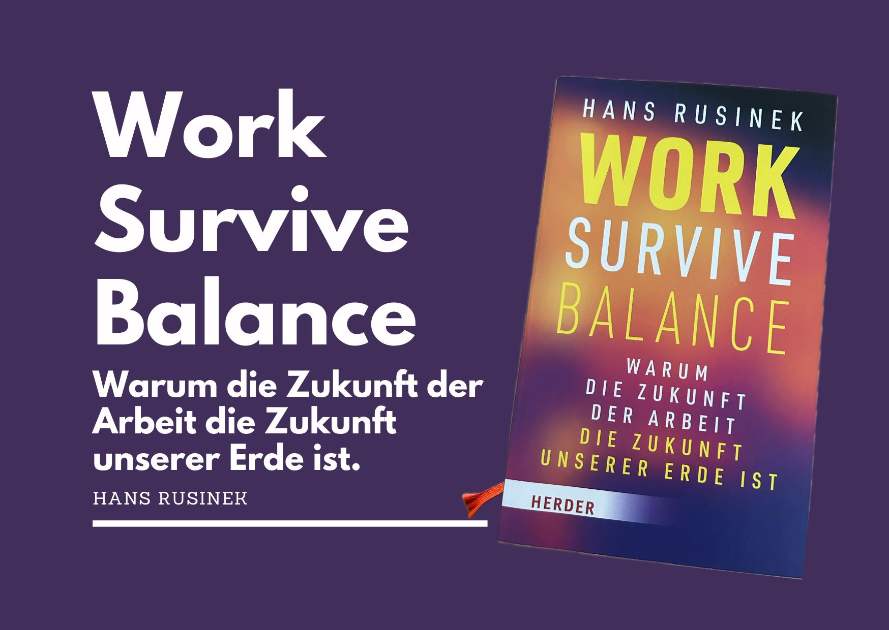
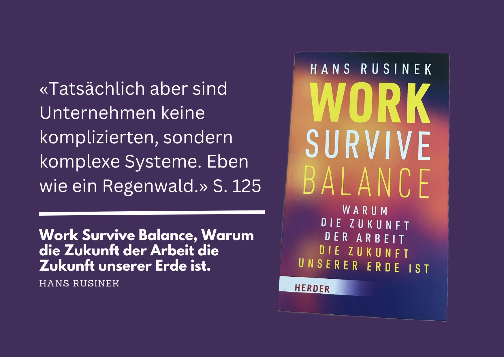

+++
title = "Work Survive Balance - Buch von Hans Rusinek "
date = "2024-10-05"
draft = false
pinned = false
tags = ["Buch", "Organisationsentwicklung", "Gedanken", "NewWork"]
image = "work-survive-balance-2.jpg"
description = "Einblick und Gedanken zum Buch von Hans Rusinek. "
footnotes = "🛒[Zum Buch Work Survive Balance bei exlibris ](https://www.exlibris.ch/de/buecher-buch/deutschsprachige-buecher/hans-rusinek/work-survive-balance/id/9783451399657/?srsltid=AfmBOoqw0gxN4wZL26mlgpG2HbqYUkywW9BB8k67O46oq9dxgQBoqoHN)\n\n🌐[Webseite des Autors](https://www.hans-rusinek.de)\n\nPS: Das ist meine dritte [«Buchrezension»](https://www.bensblog.ch/tags/buch/) und ein weiterer Versuch. Nachdem ich in meinem ersten Podcastformat vor ein paar Jahren über Bücher erzählt habe und ich etliche positive Rückmeldungen erhielt, dachte ich mir schon lange, ich könnte doch auch einmal etwas schreiben. Wie gefällts dir?\n\nPPS: Keine bezahlte Werbung, nur persönliche Einschätzung & Empfehlung."
+++
> «Der Anlass dieses Buches ist damit die Idiotie der [New-Work](https://www.bensblog.ch/tags/newwork/)-Debatten. Die Haltung, die diese Debatten bräuchten, ist die des Zoon politikon, des gesellschaftlichen Wesens. Ein Handeln in dieser Haltung geschieht gemeinsam mit anderen und geschieht aus Sorge um die gemeinsame Welt.»
>
> *Hans Rusinek, Seite 95*

**Titel:** Work Survive Balance – Warum die Zukunft der Arbeit die Zukunft unserer Erde ist

**Autor:** Hans Rusinek

**Erscheinungsjahr:** 2023

**Verlag:** Verlag Herder GmbH, Freiburg im Breisgau

## Einführung

> «Irgendwie sind wir in der einzigen möglichen Welt gelandet, in der es eine Apokalypse gibt, wir aber trotzdem zur Arbeit gehen müssen.»
>
> *Zitat von Tom Cashman im Buch auf Seite 9*

Das Buch „Work Survive Balance“ von Hans Rusinek ist mehr als ein Werk über Nachhaltigkeit, wie es der Untertitel vermuten lassen könnte. Es ist ein tiefgründiger und zugleich praktischer Blick auf die Vergangenheit, Gegenwart und Zukunft der Arbeit und uns Menschen im Kontext von Arbeit. Rusinek zeigt auf, wie eng die Zukunft unseres Planeten mit der Zukunft der Arbeit verwoben ist. Er betrachtet die Entwicklungen und Veränderungen, die unsere Arbeitswelt durchlaufen hat, und beleuchtet, wie heutige Herausforderungen mit der Vergangenheit verbunden sind und wie sie unsere Zukunft beeinflussen.

## Inhaltliche Schwerpunkte

### Vergangenheit und Wandel der Arbeitswelt

Rusinek nimmt uns Lesende mit auf eine Zeitreise durch die Arbeitsgeschichte. Er zeigt, wie frühere Berufszweige, wie etwa Kunstmaler, die vor der Fotografie Angst hatten, ihren Platz in der Arbeitswelt neu definieren mussten. Diese Beispiele verbindet er mit der heutigen Situation und vergleicht sie mit der Einführung von Technologien wie der [künstlichen Intelligenz](https://www.bensblog.ch/tags/ki/), die erneut Ängste und Unsicherheiten schürt. Der Autor verdeutlicht, dass technologischer Fortschritt nicht nur Arbeitsplätze verändert, sondern auch unser Verständnis von Arbeit selbst.

> «Die Gefahr, dass der Computer so wird wie der Mensch, ist nicht so gross wie die Gefahr, dass der Mensch so wird wie der Computer.» 
>
> *Zitat von Conrad Zuse im Buch auf S. 141*

### Die Zukunft des Planeten und der Arbeitswelt

Rusinek schildert, wie die Arbeitswelt und Wirtschaft erheblich zur ökologischen Krise beitragen und welchen Einfluss ein nachhaltigeres Wirtschaften haben könnte. Dabei geht er nicht nur theoretisch vor, sondern schildert eigene Erfahrungen und Beispiele, wie z. B. seinen „Knoppers-Konsum“, um praktische Ansätze zu zeigen. Er verbindet hier Wissenschaft und Praxis und fordert eine zukunftsfähige Gestaltung unserer Arbeit im Einklang mit den ökologischen Herausforderungen.

### Dimensionen des Wandels

Er betrachtet verschiedene Dimensionen des Wandels, um die Arbeitswelt grundlegend zu verändern:

**Haltung und Organisationsverständnis:** Der Text fordert eine Abkehr von kurzfristigem Profitdenken zugunsten eines ganzheitlicheren Ansatzes, der auch künftigen Generationen (Stichwort Enkeltauglichkeit) zugutekommt.

**Anerkennung von Arbeit**: Gerechte Wertschätzung wird für alle Arbeitsformen gefordert, nicht nur für Wissensarbeit. Die Spaltung der Arbeitsgesellschaft wird kritisch beleuchtet.

**Intelligenz und Sinn**: Arbeit wird hier nicht nur als Selbstverwirklichung, sondern als sinnstiftende, oft anstrengende Tätigkeit beschrieben. Anstrengung wird als natürlicher und positiver Bestandteil der Arbeit hervorgehoben.

> «Es ist nur ein Job. Gras wächst. Vögel fliegen. Wellen spülen den Sand weg. Und ich verprügle Leute.» 
>
> *Zitat von Muhammad Ali im Buch auf S. 161*

\
**Zeit und körperliche Arbeit**: Ein bewusster Umgang mit der erlebten Zeit und dem Körper in der Arbeitswelt wird als wesentlich für eine erfüllte Arbeitsweise hervorgehoben.

> «Die Praxistheorie liefert die Einsicht, dass besseres Arbeiten deshalb auch einen besseren Umgang mit dem Körper bedeuten muss.» 
>
> *Hans Rusinek, Seite 71*

### Der Generationenkonflikt - Alterseffekte sind keien Generationeneffekte

Rusinek räumt mit der Idee der Generationenteilung auf. Statt Menschen in stereotype Generationen wie „Babyboomer“ oder „Generation Z“ einzuordnen, schlägt er eine übergreifende Zusammenarbeit vor, bei der unterschiedliche Perspektiven geschätzt und genutzt werden. 

Mehr Aufklärung gibt es übrigens auch hier: [«Warum es keine Generationen gibt»](https://www.martin-schroeder.de/2023/07/17/warum-es-keine-generationen-gibt/)

### Anthropozän und die Vision einer neuen Arbeitswelt

Der Autor bringt den Begriff des Anthropozäns, also des Zeitalters, in dem der Mensch die Erde massgeblich prägt, in den Diskurs über die Arbeitswelt ein. Er lädt in den „Anti-Anti-Arbeits-Club“ ein, der ein neues Arbeitsverständnis propagiert, das die Herausforderungen der heutigen Zeit aufgreift und die Notwendigkeit eines nachhaltigen Wirtschaftens und Handelns betont.

## Stil und Sprache

Rusineks Stil ist zugänglich und klar, zugleich reflektiert und humorvoll. Er versteht es, komplexe Themen verständlich zu machen und dabei auch zum Nachdenken, Schmunzeln und zur Selbstreflexion anzuregen. Die Sprache bleibt durchweg prägnant und lebendig, sodass das Buch trotz der tiefen Themen ein fliessendes Leseerlebnis bietet.

## Fazit

„Work-Survive-Balance“ ist ein inspirierendes und wichtiges Buch, das zentrale Fragen der heutigen Arbeitswelt aufgreift und gleichzeitig einen konkreten Ausblick auf eine nachhaltigere Zukunft gibt. Rusinek schlägt Brücken zwischen Theorie und Praxis. Dabei spricht er Leser (fast) jeden Alters und jeder Berufssparte an. Das Buch bietet zahlreiche Denkanstösse, wie wir gemeinsam die Zukunft der Arbeit und des Planeten positiv gestalten können. Es ist ein Werk, das Mut macht und gleichzeitig Wege aufzeigt, wie wir zu einem bewussteren Umgang mit Arbeit und Umwelt finden können.

\
\
**Empfehlung:** Für alle, die sich für die Themen Arbeit, Nachhaltigkeit und Zukunftsperspektiven interessieren und bereit sind, ihr eigenes Arbeitsverständnis zu hinterfragen.