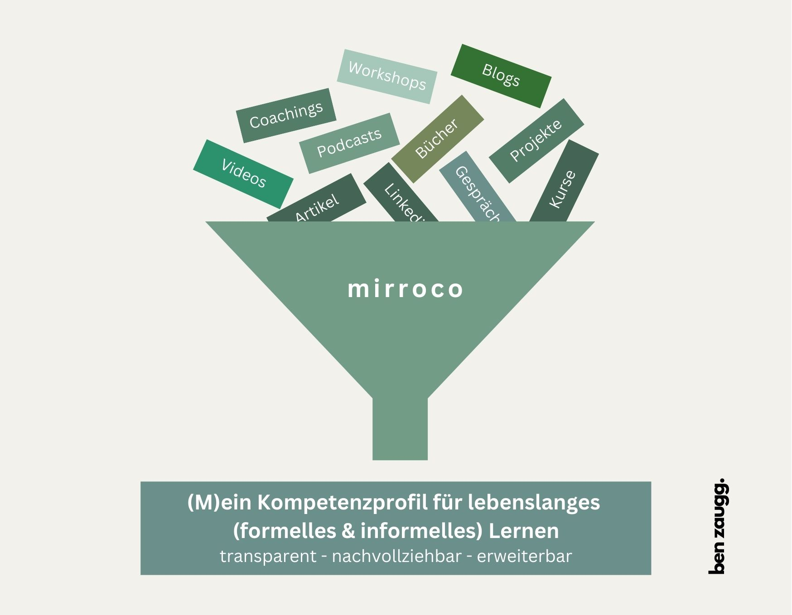

+++
title = "Kompetenzentwicklung sichtbar machen: Das KI-Modul als Beispiel"
date = "2024-11-01"
draft = false
pinned = false
tags = ["CAS", "CAS-BI", "Kompetenzentwicklung", "Lernen", "Bildung", "KI"]
image = "ich-und-die-ki.jpg"
description = "Im vierten Modul des CAS Business Impact werde ich mich mit KI beschäftigen. Neben der bewussten Auseinandersetzung mit Grundlagen geht es dabei auch um die Anwendung im Kontext von Bildungs-, Personal- und Organisationsentwicklung."
+++
## Einleitende Gedanken

Im vierten Modul des CAS Business Impact werde ich mich mit KI beschäftigen. Neben der bewussten Auseinandersetzung mit Grundlagen geht es dabei auch um die Anwendung im Kontext von Bildungs-, Personal- und Organisationsentwicklung. Dies auch immer um Zusammenhang mit anderen (zukunftsorientierten) Technologien sowie Digitalisierungsthemen. 

Innerhalb dieses Prozesses habe ich als Praxisbeispiel ein zusätzliches Projekt zur Abbildung der zu entwickelnden und erworbenen Kompetenzen gestartet. Mit der Software von mirroco kann ich so mein Kompetenzportfolio abbilden. Auch wenn der Plan ist, dieses nach diesem CAS weiterzuführen, ist es im Moment ein Experiment. Insbesondere die definierten Kompetenzen sind nicht abschliessend. 

## So entstand mein Kompetenzprofil

* Auf Basis der Module resp. der Themenbereiche, die ich für mich gewählt habe, lieferte ich Modulbeschreibungen sowie Lerninhalte an mirroco.
*  [mirroco](https://www.mirroco.ch) erstellte auf dieser Basis mit Hilfe von KI ein erstes Kompetenzraster. Dieses war, auch aufgrund der Themenvielfalt, sehr umfassend.
*  In Zusammenarbeit mit mirroco haben ich zwischen 50 und 60 Kompetenzen für dieses CAS definiert. Unten siehst du die Kompetenzen zu den Themen KI / digitale Technologien. Diese sind unterteilt in den Kompetenzbereich, die Hauptkompetenzen sowie deren Unterkompetenzen. 

## Kompetenzen zum Thema KI (und Digitalisierung)

### **KI-Tools und zukunftsorientierte Technologieanwendung**        

##### ChatGPT und textbasierte KI-Tools nutzen  

* Kann effektive Prompts für ChatGPT und textbasierte KI-Tools formulieren.
* Kann KI-basierte Tools zur Unterstützung von Arbeitsprozessen nutzen.

##### KI-Technologien nutzen         

* Kann grundlegende KI-Konzepte und -Technologien erklären und effektive Use Cases identifizieren.
* Kann ChatGPT und andere KI-Tools für Aufgaben im Unternehmenskontext nutzen.
* Kann Strategien zur Integration von KI-Tools in Geschäftsprozesse entwickeln.          

##### Grundkenntnisse zu KI und maschinellem Lernen anwenden        

* Kann die Unterschiede zwischen maschinellem Lernen und Deep Learning erklären.
* Kann Schulungskonzepte zur Förderung der KI-Kompetenz im Unternehmen entwickeln.

##### Kontinuierliches Lernen und Anpassung an digitale Entwicklungen           

* Kann Hands-on-Projekte zur praktischen Anwendung von digitalen Tools durchführen.
* Kann Lücken zwischen aktuellen und zukünftig benötigten digitalen Kompetenzen identifizieren.
* Kann Programme zur Förderung digitaler Kompetenzen der Mitarbeiter entwickeln.

## Lernen gestalten & Lernprozesse abbilden

Auf Basis dieser zu erwerbenden Kompetenzen kann ich konkrete Lernziele setzen oder mir Lernpläne machen. Ich kann aber auch passende Lernmaterialien (Podcasts, Artikel, Bücher, Videos, Blogs etc.) oder Expertinnen und Experten suchen und diese Lernmomente abbilden. So entsteht nach und nach ein Kompetenzportfolio. 

