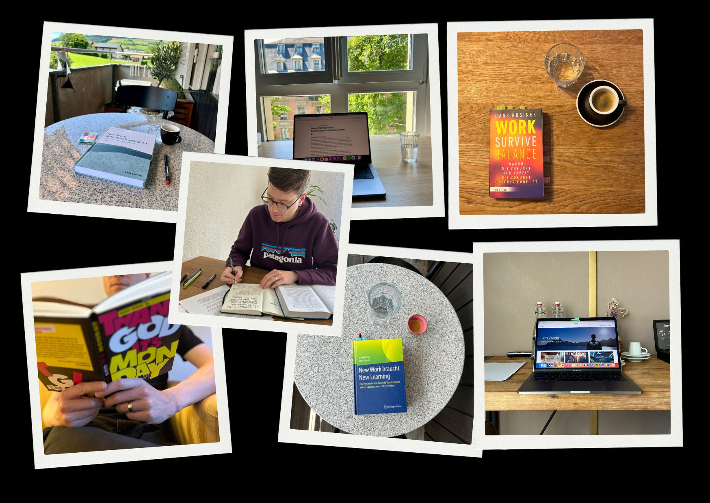
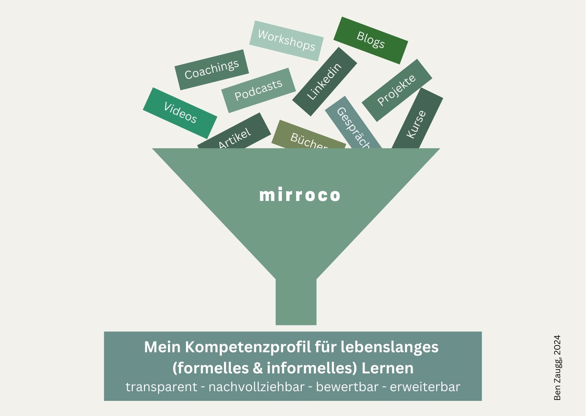
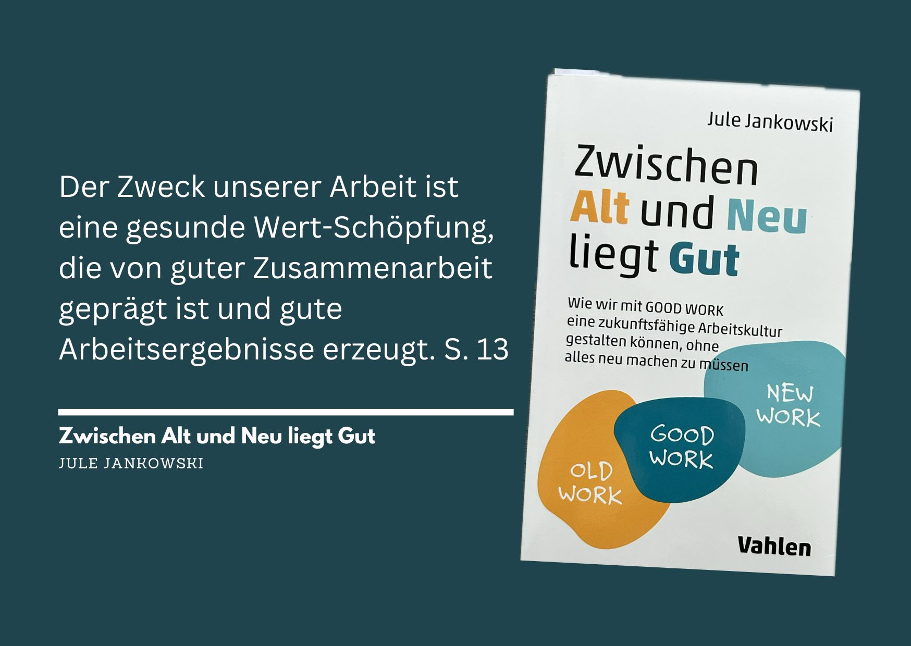

+++
title = "CAS Business Impact: Rückblick"
date = "2025-01-28"
draft = false
pinned = false
tags = ["CAS-BI", "CAS", "Lernen"]
image = "abschluss.jpg"
description = "In meinem letzten Beitrag zum CAS Business Impact blicke ich zurück auf die letzten Monate."
footnotes = "[Zur allen Beiträgen CAS Business Impact](https://www.bensblog.ch/cas_businessimpact_verzeichnis/)\n\n[Zu allem Beiträgen CAS Organisationsentwicklung und Change Leadership](https://www.bensblog.ch/cas-organisationsentwicklung-change-leadership-buecher-und-blogposts/)\n\n[Zum ersten Beitrag CAS Business Impact und der Differenzierung beider CAS-Konzepte](https://www.bensblog.ch/cas_business_impact/)\n\n[Interview zu meinem ersten CAS (Organisationsentwicklung & Change Leadership: Lernen, wie ich es will](https://ikf.ch/de/kontakt-und-beratung/studierendeninterviews/benjamin-zaugg)"
+++
Das wird der letzte Beitrag zum [CAS Business Impact am ikf](https://www.ikf.ch/de/kurse/cas-business-impact). Während rund sieben Monaten habe ich mich intensiv mit den einzelnen Modulen beschäftigt. Diese habe ich frei ausgewählt und immer in den Kontext zu zukunftsorientierter Personal- und Organisationsentwicklung gestellt. Hier blicke ich zurück und fasse zusammen. [Mehr über meinen Einstieg und die damaligen Pläne liest du hier](https://www.bensblog.ch/cas_business_impact/). 

Am Ende sind folgende Module zusammengekommen:

1. New Work
2. Lernende Organisation
3. Training für digitale & agile Zeiten
4. Künstliche Intelligenz (mit Fokus Einführung KI und Kompetenzentwicklung)
5. New Leadership
6. Change Leadership
7. Agile Methoden & Frameworks (mit Fokus Leadership & Teamarbeit)

**Lernprozesse abbilden, Kompetenzen sichtbar machen, Wissen teilen**

Natürlich hätte ich diese Module «nur» mit den zur Verfügung gestellten Lerninhalten absolvieren und still lernen können, da es am Ende bei Bestehen so oder so ein Zertifikat gibt. Nun ja, ich konnte es nicht 😉. Es reizte mich, mein in vielerlei Hinsicht [selbstbestimmtes und selbstorganisiertes Lernen](https://www.bensblog.ch/selbstorganisiertes-lernen-gestalten/) abzubilden, um ein paar Möglichkeiten aufzuzeigen, wie man das eigene Lernen, die eigene [Kompetenzentwicklung](https://www.bensblog.ch/tags/kompetenzentwicklung/) gestalten und präsentieren kann.  So habe ich ganz nebenbei auch meine Kompetenzen im Schreiben, im Zusammenfassen, Bereitstellen, Verknüpfen etc. entwickelt und verbessert. 

> «Ziel muss es sein, dass jeder Einzelne selbst zum Gestalter seiner bzw. ihrer Weiterentwicklung wird.»
>
> *aus [Lernhacks](https://www.lernhacks.de)*

Während der beiden Weiterbildungen [CAS Organisationsentwicklung & Change Leadership](https://www.bensblog.ch/cas-organisationsentwicklung-change-leadership-buecher-und-blogposts/) sowie [Business Impact](https://www.bensblog.ch/tags/cas-bi/) habe ichfolgende Methoden zur Abbildung meines Lernens genutzt:

* Blog
* Podcast
* Miro Board
* mirroco Software
* padlet

**Blog**

Der [Blog](https://www.bensblog.ch/tags/blog/) ist für mich bis heute wohl das erfüllendste und wirkungsvollste aller Tools. Im Text (mit Video, Audio, Links, Grafiken etc.) lassen sich die Themen gut abbilden. Dafür ist (m)ein Blog zuweilen sehr aufwändig. Mittlerweile kann das Erstellen eines Beitrags einen halben Tag (oder länger) dauern. Die Konstanz im Blog (ich schreibe seit rund drei Jahren) und die zunehmenden Fachthemen scheinen ihre Wirkung langsam zu entfalten. Der Blog wird immer beliebter. Mittlerweile durfte ich zudem als Gastautor in zwei weiteren Blogs veröffentlichen. 

**Podcast**

Den [Podcast](https://www.bensblog.ch/tags/podcast/) zu diesen Lernprozessen habe ich bewusst kurz und einfach gestaltet, da dieser «nur» als Umsetzungs-Beispiel dienen sollte. Auch Podcasts sind ein tolles Medium, das ich jedoch lieber für Gespräche/Interviews nutze. 

**Miro-Board**

Ich habe Freude an meinem [Miro-Board](https://www.bensblog.ch/cas_businessimpact_verzeichnis/) und finde, es ist mir gelungen, Inhalte sowohl für mich selbst abzubilden als auch allen Interessierten zugänglich zu machen. Hier sind viele Inhalte unstrukturierter als im Blog und natürlich sind es vor allem Inhalte, die zu mir und meinen Bedürfnissen passen. Das würde ich auf jeden Fall wieder so machen.

**[mirroco Software](https://www.mirroco.ch)**

Wie cool wäre es, wenn ich meine Kompetenzen, die ich bisher formell und informell erworben habe, irgendwo sinnvoll und übersichtlich abgebildet hätte? Diese und noch einige andere Gedanken in die Richtung gingen mir durch den Kopf. In der Vergangenheit kann ich das nicht mehr tun, aber hier und heute dachte ich. Mit der mirroco Software habe ich das ideale Tool für mich gefunden, um meine «Lernmomente» abzubilden. Wie? Das liest du [hier](https://www.bensblog.ch/cas-business-impact-ki/).

Ich werde die Software auch in Zukunft nutzen und weitere berufsbezogene Kompetenzen ergänzen, auf diese hinarbeiten und mein Lernen dazu abbilden. 

**Padlet**

Ein Padlet habe ich nur während des ersten CAS genutzt. Das Miro-Board hat mich da deutlich mehr überzeugt. Dort kann ich Themen, Stichworte etc. verknüpfen  und gleichzeitig Links, Bilder etc. abbilden. 

**Modul-Coaches und andere «Coaches»**

In jedem Modul konnte ich (m)einen Modulcoach auswählen und wurde bei der Wahl vom Lehrgangsleiter unterstützt, wobei ich mich immer frei entscheiden konnte. Da ich Lernender in Vollzeit war 😉, haben mich die Termine resp. das Warten auf die Termine zuweilen etwas gebremst. Aber auch dafür habe ich einen Weg gefunden. Ich startete selbst in die Module und nutze das erste Coching um bereits bearbeitete Themen und Fragen zu besprechen. Je nach Thema machte ich mich danach gleich an die Entwicklung des Wirkungskonzepts. 

Da ich mich für einen Coach zwei Mal entschieden hatte, wurde ich gesamthaft von sechs ganz unterschiedlichen Fachexpertinnen und -experten begleitet. Dazu kam die Begleitung durch den Lehrgangsleiter während der gesamten Zeit. 

Zusätzlich habe ich mich, vor allem über Linkedin, mit anderen für mich relevanten Expertinnen und Experten aus dem DACH-Raum in Verbindung gesetzt und so noch mehr Menschen aus der Praxis zu Lernbegleiter:innen gemacht. 

**[So habe ich mein Lernen gestaltet](https://www.bensblog.ch/cas-lernen-organisieren/)**

Die Module strukturierten den Lernprozess. Daneben liess ich mich manchmal auch vom «Chaos» leiten. Ich wühlte mich durch Bücher, Videos, Artikel und wusste nicht immer ganz genau, wo ich im Detail hinwill, bis sich die Themen dann (fast von selbst) verdichteten, verknüpften und ein klares Bild entstand. Manchmal war auch alles klar und der Prozess fühlte sich linear und geschmeidig an. 

**Materialien**

Ich habe mit dem gearbeitet, was mir in die Finger kam. Klar, da waren Lerninhalte, welche durch das ikf kuratiert wurden. Aber da gab es auch viele und interessante Bücher (ich habe für über 300.- Bücher gekauft), Videos, Blogs, Artikel, Gespräche, Linkedin-Posts, Podcasts, KI-Tools und Hörbücher. 

**Spagat zwischen «Alter» und «Neuer» Arbeitswelt**

Ich habe diese Weiterbildung mit dem Fokus «zukunftsorientierte Personal- und Organisationsentwicklung» gestaltet. Da gibt es natürlich ganz viel «New» und dieses «New» ist, wie sich in vielen Gesprächen (und meinen eigenen Erfahrungen) gezeigt hat, oft nicht oder nur in kleinen Teilen Realität. Auch wenn sich eine Organisation auf den ernsthaften Weg zum Neuem macht, braucht das viel Zeit. Also habe ich immer wieder versucht (und es ist mir hoffentlich gelungen), vor allem praxisorientierte und praxistaugliche Perspektiven einzunehmen. Ein Spagat der wohl immer ein Spagat bleibt. Vielleicht würde es mehr Sinn machen zu balancieren, da wäre ich wohl beweglicher als im Spagat 😉 aber huch, ich schweife ab. 

**Geprägt durch Colearning**

Natürlich bin ich als Colearner und Mitgründer von [Colearning.org](https://www.colearning.org) ein erfahrener (und vermutlich kompetenter) selbstorganisierter Lerner. Mein Lernweg und vieles, was ich tue, ist dadurch geprägt. So wusste ich immer, dass ich, auch wenn ich oft allein unterwegs bin, doch immer Menschen um mich habe, die mit mir Lernen. So soll dieser Beitrag und alle, die mein Lernen aus der Metaperspektivle betrachten auch als Inspiration und «Mutmacher» dienen, sich selbst (auch ausserhalb formeller Bildungsgänge) auf den Weg zu machen.