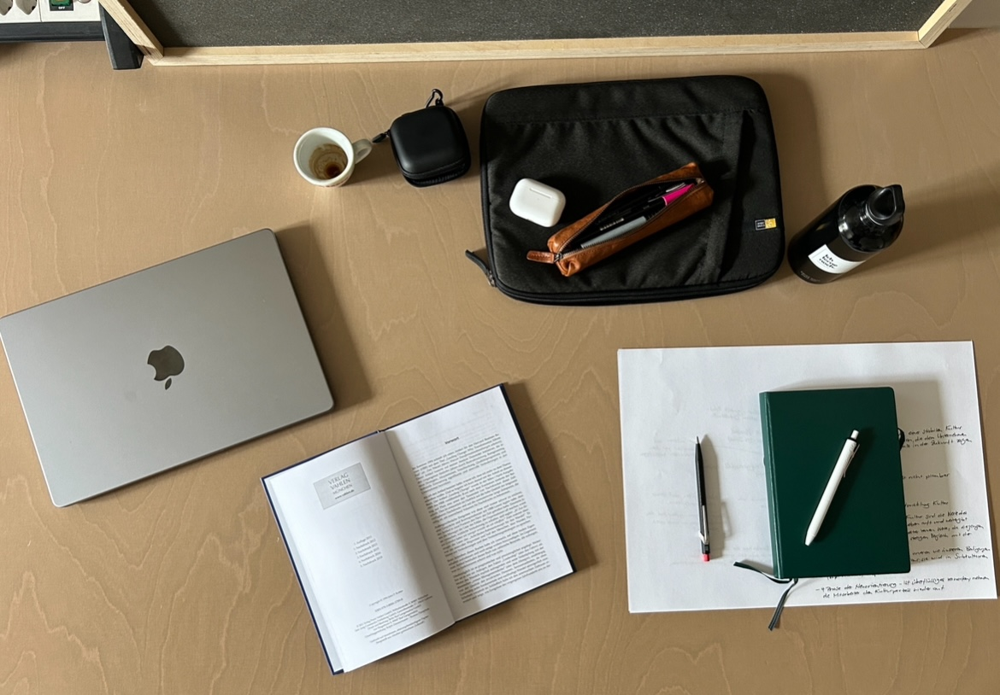

+++
title = "So gestalte ich mein Lernen "
date = "2024-05-03"
draft = false
pinned = false
tags = ["CAS", "Lernen", "Colearning", "Bildung"]
image = "_0a417939-61c2-4e7b-824e-fa95266706ef.jpg"
description = "Wie lernt man selbstorganisiert? Hier gebe ich einen Einblick in meinen (aktuellen) Lernprozess."
footnotes = "**Bücher über (selbstorganisiertes und selbstbestimmtes) Lernen**\n\n📕[Team Toppings, 21 Lernhacks für agiles Arbeiten](https://www.exlibris.ch/de/buecher-buch/deutschsprachige-buecher/franziska-schleuter/team-toppings/id/9783800671939/)\n\n📕[Lernhacks, Mit einfachen Routinen Schritt für Schritt zur agilen Lernkultur](https://www.exlibris.ch/de/buecher-buch/deutschsprachige-buecher/thomas-tillmann/lernhacks/id/9783800664986/)\n\n📕[Berufen statt zertifiziert, Neues Lernen, neue Chancen](https://www.exlibris.ch/de/buecher-buch/deutschsprachige-buecher/anja-c-wagner/berufen-statt-zertifiziert/id/9783035518689/)\n\n📕[Entlehrt euch!](https://www.exlibris.ch/de/buecher-buch/deutschsprachige-buecher/rolf-arnold/entlehrt-euch/id/9783035504590/)"
+++
## **Einleitende Gedanken**

In einem Blogbeitrag habe ich darüber geschrieben, dass das Teilen des Lernens etwas Persönliches ist oder sein kann. Ich meine das Teilen des Lernprozesses, der auch von (vielen) Fragen, Unsicherheiten, Blockaden und Schwierigkeiten begleitet werden kann. Danach hatte ich mehrere Gespräche darüber. Auch darüber, dass Selbstlernen, selbstbestimmtes oder selbstorganisiertes Lernen oft auch zuerst gelernt werden «muss». Deshalb gebe ich hier einen Einblick in meinen (aktuellen) Prozess. 

## **So gestalte ich mein Lernen (im CAS)**

Wie lerne ich als Colearner eigentlich? Wie geht dieses (oder mein) lebenslange Lernen? Anlässlich meines CAS dachte ich mir, ich gebe hier einen Einblick. Es ist mein Weg, der sich immer wieder wandelt und doch darf er für dich auch als Inspiration dienen, dein Lernen aktiv und selbstbestimmt zu gestalten.

## **So ist dieses CAS organisiert**

In meinem aktuellen CAS Organisationsentwicklung und Change Leadership bin ich mehrheitlich selbstständig unterwegs. In diesem Online-CAS finde ich auf der Lernplattform die 5 Module Einführung, Organisationen verstehen, Change planen, Change Leadership und das Abschluss-Modul. In meinem Lernprozess werde ich von meinem Lerncoach begleitet. Das heisst, ich habe vor und nach den Modulen Termine (die wir flexibel vereinbaren) und zwischendurch kann ich allfällige Fragen klären. Soweit der vorgesehene CAS-Ablauf. 

## **Selbstlernen in Gemeinschaft**

Im Sinne von [Colearning](https://www.colearning.org) «Selbstlernen in Gemeinschaft» bin ich aber nicht allein. Innerhalb der Colearning-Community sind wir im [Coworking Space Effinger](https://www.effinger.ch) oder über Discord vernetzt. So landen alle meine Blogbeiträge im «Digitalen Garten». Dort werden sie gelesen, kommentiert und es entstehen online oder in der Begegnung (vielleicht) Diskussionen. Das gibt Einblicke in die Erfahrung anderer, Fragen regen zum Nachdenken oder Hinterfragen an oder ich erhalte Hinweise auf Blogbeiträge, Podcasts oder Personen, mit denen ich mich vernetzen könnte. 

## **Die Lernumgebungen**

Oben habe ich mit der Online-Lernplattform vom ikf, den Coachings sowie der Colearning-Community on- und offline bereits einige Umgebungen genannt. Da das Internet voll mit «Stoff» ist, finde ich in Linkedin-Beiträgen, Youtube-Videos und Podcasts weitere Lerngelegenheiten. So lerne ich gerade dort, wo ich bin und mich wohlfühle. Auch das echte Leben bietet viele Lerngelegenheiten. Organisationen sind überall und vieles ist im «Change». Leadership-Themen finden sich, wenn mir Menschen von ihren Vorgesetzten erzählen, von ihren eigenen Herausforderungen im Führungsalltag, wenn ich Zeitung lese und, und, und… Die Möglichkeiten scheinen unendlich.  

## **Meine Lernmittel**

Viele meiner Lernmittel habe ich bereits genannt. Hier noch einmal eine Auflistung und ein paar Infos dazu. 

### **Linkedin**

Bei Linkedin gibts zwar Lernangebote, von denen schreibe ich hier jedoch nicht (auch wenn ich in der Vergangenheit einige ausprobierte). Oft speichere ich mir Beiträge, die mich interessieren ab und scrolle die später durch. Es gibt immer wieder Inhalte, die gerade relevant und interessant für mich sind. Manchmal sind es Ansichten von Schreibenden, ein anderes Mal eine Visualisierung oder Verlinkungen zu Fachartikeln. Hier teile ich auch einige meiner Blogbeiträge und erhalte Reaktionen oder komme mit neuen Menschen in Kontakt, die sich für Inhalte oder Gedanken interessieren. Da wären wir wieder beim Selbstlernen in Gemeinschaft. 

### **Bücher** 

Während ich diese Zeilen schreibe, sitze ich vor (m)einem Bücherregal. Ein paar Bücher stehen bereit, bearbeitet zu werden. Manchmal suche ich nach konkreten Themen und Verbindungen in den verschiedenen Büchern und ein anderes Mal vertiefe ich mich in ein Thema. Dann bestelle ich auch das eine oder andere Mal (eigentlich oft, zu oft?) neue Bücher, wenn ich z. B. in Artikeln oder im Literaturverzeichnis auf neue interessante Themen stosse. 

### **Youtube**

Hier finde ich viele Inhalte und leider auch viele langweilige oder schlecht verarbeitete Fachinputs. Da macht ein Video aus meiner Sicht wenig Sinn und zum Glück kann ich einfach wegklicken. Bei Youtube-Inhalten gilt es, die Perlen zu entdecken. Davon gibt’s einige. Ich mag mitreissende Referate oder gut gemachte und kurzweilige Inputs, die auf den Punkt gebracht sind. Diese dienen mir zum Beispiel als Einstige in ein Thema. Es kann sein, dass ich ein Video einfach kurz durchspiele und mich erst dann entscheide, mich zu vertiefen. Dann schaue ich mir einzelne Abschnitte 1..2..3..x an und halte das für mich (in dem Moment) wichtige in meinem schönen Notizbuch fest. Ein anderes Mal konsumiere ich einfach nur. 

### **Menschen und Begegnungen**

Hmm.., eigentlich keine richtigen «Lernmittel» und doch wunderbare und wertvolle Lerngelegenheiten. Gespräche und Begegnungen mit Menschen in und ausserhalb der Colearning-Community. Hier tauchen (neue) Fragen auf, Gedanken werden weitergedacht oder in Zusammenhang mit Erfahrungen und der Praxis gebracht. So erlebe ich gerade beim Teilen des Lernens im (Lern-)Blog immer wieder, dass Menschen mich aufgrund bestimmter Themen kontaktieren und ich so wieder Einblicke in ihr (Arbeits- und Lern-) Leben erhalte. 

### **Mentoring**

Seit ich Teil von Colearning bin, mache ich Mentorings. Seit über einem Jahr bin ich mit [Samuel Niklaus](https://projectlead.ch) im gegenseitigen Mentoring unterwegs, mit dem ich mich oft über Leadership, Digitalisierungsthemen, Transformation und so vieles mehr unterhalte. Wir kommen aus unterschiedlichen Welten und haben doch so vieles gemeinsam, auch wenn dies für ein Mentoring nicht zwingend nötig ist. Diese Termine sind manchmal kurz und ein anderes Mal dauern sie zwei bis drei Stunden.