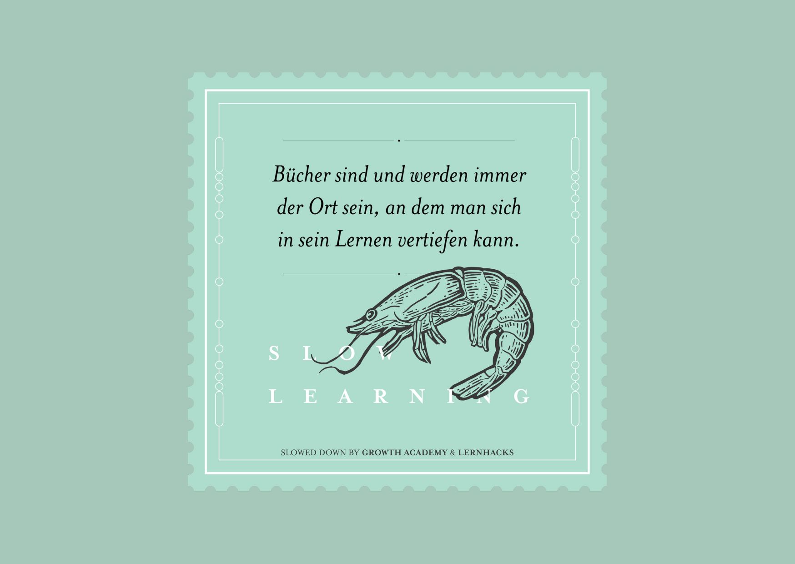

+++
title = "CAS Organisationsentwicklung & Change Leadership – Einblick"
date = "2024-07-12"
draft = false
pinned = false
tags = ["CAS", "Lernen", "Bildung"]
image = "blogbilder-14.png"
description = "Ein Ein- und Rückblick in meinen bisherigen Lernweg im CAS Organisationsentwicklung & Change Leadership."
footnotes = "[Zur Übersicht aller Beiträge zum CAS gehts hier](https://www.bensblog.ch/cas-organisationsentwicklung-change-leadership-buecher-und-blogposts/)\n\n[Inspiration und Infos für den Start eines eigenen (Lern-) Podcasts hier entlang](https://www.bensblog.ch/tags/podcast/)\n\nTitelbild: Bing Image Creator\n\nBild Slow Learning: https://www.slow-learning.com\n\nBilder Lernorte: Ben Zaugg\n\nBild «Ich lerne noch.»: [Colearning.org](https://www.colearning.org)"
+++
Mein Lerncoach hat mich auf den ersten Blogbeitrag zu dieser Weiterbildung angesprochen. Wo befinde ich mich? Bin ich den Weg gegangen, den ich im Kopf hatte? Sind es dieselben Themen geblieben? Es sind nicht mehr viele Module, die im CAS übrigbleiben. Zeit für einen Ein- und vorläufigen Rückblick.

 Zum Schluss dieses ersten Beitrags habe ich geschrieben: 

> «Gerade weil viele Unternehmen noch in für die Zukunft wohl hindernden Strukturen feststecken, werde ich mich vermutlich im weiteren Verlauf dieser Weiterbildung mit den Übergängen zu lebendigen und lernenden Organisationen beschäftigen.»

## Inhalt und Fokusthemen 

Die Themenfelder Organisationsentwicklung, Change und Leadership sind bereit und tief. Man könnte (und das passiert mir auch) tief abtauchen. Für ein CAS wäre oder ist das jedoch zu viel. Mein grober Zeitplan sowie die Module geben mir den Rahmen. 

> «Ich gehe davon aus, dass ich mich vertieft mit der Entwicklung von Organisationen beschäftigen werde, die in einer komplexen Welt nicht nur überleben, sondern leben.»
>
> *aus [CAS Organisationsentwicklung & Change Leadership - Der Einstieg](https://www.bensblog.ch/cas_organisationsentwicklung_change_leadership_dereinstieg/)*

### Welchen Inhalten und Themen habe ich mich nun gewidmet?

### [Organisationsentwicklung](https://www.bensblog.ch/tags/organisationsentwicklung/)

Hier habe ich mich vor allem mit [Kultur-, Kulturwandel und Kulturentwicklung](https://www.bensblog.ch/organisationskultur/) beschäftigt. Das wird mich auch kaum mehr loslassen. Kultur(veränderung) betrachte ich als etwas Hochkomplexes und doch auch Einfaches. [Dietmar](https://ikf.ch/de/institut/prof-dr-dietmar-treichel) sagte in einem Gespräch zur Schwierigkeit oder Einfachheit von Kulturveränderung etwas in dem Stil: «Und es ist auch ganz einfach. Man muss kleine Erfolge erzielen und sichtbar machen». Ja, Kultur ist nicht so einfach zu greifen und doch überall. Irgendwie kam mir da ein Vergleich mit den [Faszien](<https://de.wikipedia.org/wiki/Faszie>) in den Sinn. Sie sind fein, überall im Körper und doch kennt man sich (soweit ich das verstanden habe) damit noch nicht wirklich gut aus. Sie scheinen einen grossen Einfluss auf den Körper zu haben. Solange «alles gut ist», kümmert man sich wenig darum. Sicht- resp. spürbar werden sie erst, wenn «etwas» nicht mehr funktioniert. Diese Gedanken sind ganz frisch und vielleicht erhalten sie in Zukunft noch einen eigenen Text. 

### [Change](https://www.bensblog.ch/tags/change/)

Mit Change habe ich mich vertieft auseinandergesetzt, tue es noch und das Thema wird mich begleiten. Klar, man spricht oft von Change-Management, aber geht es in einer unsichereren und komplexeren (Arbeits-) Welt nicht darum, den Wandel (der übrigens schon immer da war) als natürlichen Prozess anzuerkennen? Dann wären wir schnell bei Leadership und vielleicht weniger bei Management. Dann ist da noch die Transformation, die eben nicht gleich Change ist und einen tiefgreifenderen Wandel bedeutet. 

### [Leadership](https://www.bensblog.ch/tags/leadership/)

Eines meiner Lieblingsthemen. Leadership ist so viel mehr als «Führung». Ein ganz wichtiges Element sehe ich hier bei der Selbstführung und Selbst(er)kenntnis. Aber eben, es geht nicht nur um «Führung», sondern auch um Orientierung, Vision, Sinn, Begleitung, Coaching und so vieles mehr. Ein Thema, das man von so vielen Seiten beleuchten kann und auch hier ist oft wieder der Kontext entscheidend. 

## Mein Blog

> «Das Ziel (und ich lasse es mir offen) ist, dass ich hier regelmässige über den Verlauf des CAS schreibe. Vielleicht werden es aber auch «nur» Themen, die ich beleuchte, ohne den Bezug zum Verlauf des CAS oder des gemachten Lernprozesses zu nehmen.»
>
> *aus [CAS Organisationsentwicklung & Change Leadership - Der Einstieg](https://www.bensblog.ch/cas_organisationsentwicklung_change_leadership_dereinstieg/)*

Ich habe den Eindruck, dass ich die erwähnten Formen alle umgesetzt habe. [Die Sammlung der Artikel findest du hier. ](https://www.bensblog.ch/cas-organisationsentwicklung-change-leadership-buecher-und-blogposts/)

### Einblicke in Themen

Ich habe über konkrete Lernthemen geschrieben und damit einen oft kurzen und einfachen Überblick gegeben. Kurz und einfach u. a. aus folgenden Gründen:

* Es gibt bereits etliche gute Bücher und Blogbeiträge, die umfassend sind.
* Weil es mir hier in dem Fall eher darum geht, ein grosses Bild zu zeichnen. Also der Blog als Gesamtbild.
* Der zeitliche Aufwand. Ein Blogbeitrag braucht oft viel Zeit.

### Lernprozesse und Verlauf

Die Lernprozesse oder den Lernverlauf habe ich tatsächlich nur im ersten, zweiten und diesem Beitrag genauer beleuchtet. In den thematischen Beiträgen habe ich ab und zu lediglich einen kurzen Einblick gegeben. 

### Über das Lernen schreiben

Ob bei der Organisationsentwicklung, in Change-Prozessen oder Leadership. Lernen scheint mir bei allen Bereichen ein wesentlicher Bestandteil zu ein. Es ist mir deshalb ein Anliegen, immer wieder auf Möglichkeiten von [individuellem Lernen und Lernen in Organisationen](https://www.bensblog.ch/tags/lernen/) hinzuweisen. Auch deshalb gebe ich hier einen etwas intimeren Einblick in mein Lernen und meine Lernprozesse. 

### Dann kam noch ein Podcast dazu

Vor allem zur Inspiration, wie Menschen lernen oder Wissen (in Unternehmen) teilen können, habe ich die Beiträge zum Teil mit Podcastfolgen ergänzt. Diese sind absichtlich einfach gehalten, um zu zeigen, dass dies auch so ohne grossen Zeitaufwand möglich ist.

## Ordnung und Struktur

Als Grund für die Wahl zu diesem CAS habe ich auch die Strukturierung genannt. Tatsächlich folge ich einer Struktur und verfolge die Themen so geordnet(er). Weil es halt eben doch viele Verknüpfungen gibt, switche ich immer wieder zwischen den Themen/Modulen. Einige streife ich für mein Verständnis eher oberflächlich und bei anderen trifft es der Begriff [«Slow Learning»](https://www.slow-learning.com) eher. Das heisst, ich habe mich bereits vorher damit beschäftigt und/oder werde mich auch in Zukunft damit auseinandersetzen. 

## Tools

> «Nach einigem Ausprobieren habe ich mich entschieden, für den Start und den Überblick eine Zusammenstellung der Themen auf Padlet zu machen. Diese ergänze ich (für den Moment) mit einem miro Mindmap.»
>
> *aus [CAS Organisationsentwicklung & Change Leadership - Der Einstieg](https://www.bensblog.ch/cas_organisationsentwicklung_change_leadership_dereinstieg/)*

Hier habe ich für mich noch nicht die ideale Lösung gefunden. Mittlerweile arbeite ich kaum noch mit dem Mindmap, dafür ist das Padlet zum CAS sehr lebendig. Dort verlinke ich Videos, fasse sie zusammen, schreibe Links, Autor:innen, Bücher etc. rein, die mir in Gesprächen, bei Linkedin oder irgendwo in der Welt begegnen. Mache werden relevant, andere hängen rum und einige entpuppen sich als (für den Moment) nicht relevant. 

## Lernorte 

Dann kommen wir noch zu meinen Lernorten. Sie sind tatsächlich überall, daran hatte ich jedoch auch keine Zweifel. Nur ans Meer habe ich es noch nicht geschafft. Ich lese, schaue Videos oder höre Podcasts im Zug, in Kaffees, im Coworking-Space oder beim Spazieren. Am meisten sitze ich jedoch an meinem Schreibtisch, am Esstisch oder auf unserem Balkon. 

## Gedanken zum Schluss

In den letzten Monaten bin ich in viele Themen abgetaucht. Einerseits wollte ich mir einen Überblick verschaffen und andererseits habe ich bereits zu Beginn gemerkt, dass ich mich fokussieren «muss». Ich hatte Ideen und Pläne, in welche Richtung es gehen könnte. In dem Prozess liess ich mich einerseits treiben und andererseits von der CAS-Struktur leiten. Bei jedem übergeordneten Thema fand ich in meinem Bücherregal hinter mir oder in einem Webshop die passenden Bücher, mit denen ich CAS-Inhalte vertiefen konnte und immer noch kann. Einige davon drehen sich um neue Arbeit und neues Lernen, oft als New Work und New Learning bezeichnet. Bei anderen geht es um menschen- oder gehirngerechtes Lernen und Arbeiten oder es sind «alte» Praktiken wie z. B. «die lernende Organisation». 

Und es ist wie immer. Die Reise geht weiter und «ich lerne noch».

