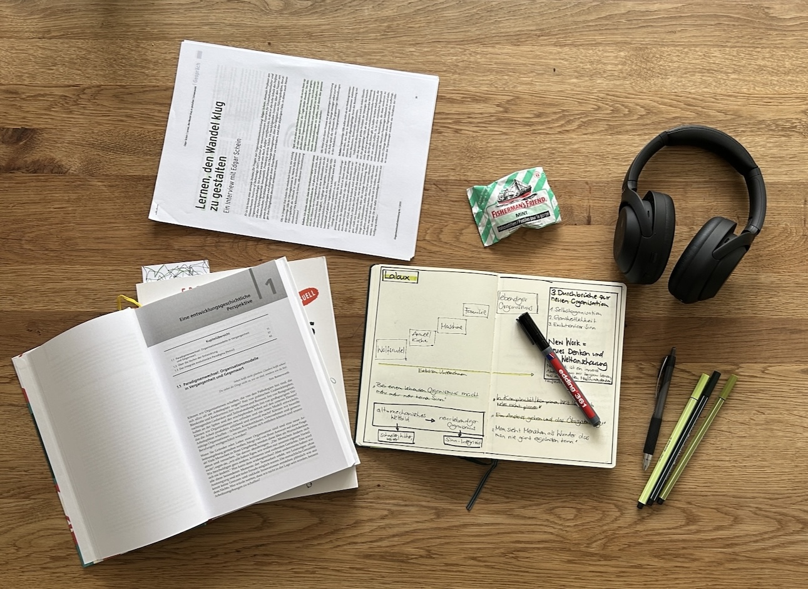

+++
title = "CAS Organisationsentwicklung & Change Leadership - Der Einstieg"
date = "2024-04-23"
draft = false
pinned = false
tags = ["CAS-OECL", "Organisationsentwicklung", "Change", "Leadership"]
image = "blue-gradient-christian-church-schedule-he-is-risen-easter-postcard-2.png"
description = "Ich habe ein CAS in Organisationsentwicklung und Change Leadership begonnen. In diesem Beitrag schreibe ich über den Einstieg, Pläne und erste Gedanken. "
footnotes = "📺[Interview Prof. Peter Kruse über Change Management](https://www.youtube.com/watch?v=FLFyoT7SJFs)\n\n📕[Laloux Frederic (2015), Reinventing Organizations, Ein Leitfaden zur Gestlatung sinnstiftender Formen der Zusammenarbeit, Vahlen Verlag](https://www.exlibris.ch/de/buecher-buch/deutschsprachige-buecher/frederic-laloux/reinventing-organizations/id/9783800649136/)\n\n📕[Minnaar Jost, de Morree Pim (2020), Corporate Rebels, Wie Pioniere die Arbeitswelt revolutionieren](https://www.exlibris.ch/de/buecher-buch/e-books-deutsch/joost-minnaar/corporate-rebels/id/9789083004860/)\n\n 🔗 <https://reinventingorganizationswiki.com/de/>\n\nTitelbild: Erstellt mit KI, Bing Image Creator\n\nBild 1, Café am Meer, erstellt mit KI, Bing Image Creator\n\nFoto: Ben Zaugg\n\nBild 2, Mann am Meer, erstellt mit KI, Bing Image Creator"
+++
## CAS Organisationsentwicklung & Change Leadership 

### Eine kurze Einleitung 

Früher lernte ich nicht gerne. Wobei dieses Lernen damit zu tun hatte, Dinge in meinen Kopf zu stopfen. Was ich «lernte», interessierte mich selten oder hatte keine Relevanz für mein Leben. Natürlich gab es etliche Themen, die mich interessierten, die waren jedoch für mein Leben anscheinend nicht relevant. Das war früher. Insbesondere in den letzten Jahren habe ich mich intensiv mit Lernen auseinandergesetzt, bin im Alltag bewusst lernend unterwegs und zeige seit 2021 auch immer wieder Themen aus meinen Lernprozessen und/oder Gedanken, die mich bewegen. Macht eine organisierte Weiterbildung da überhaupt noch Sinn? Jein. 

### Warum Organisationsentwicklung & Change Leadership?

Seit mehr als zehn Jahren beschäftige ich mich intensiv mit der Begleitung von Menschen. Dabei interessierten mich vor allem die Möglichkeiten der Stärkung von Individuen. Wie können Menschen mehr sich selbst sein und werden? Wie können Menschen ihren eigenen und ganz individuellen (beruflichen) Weg verfolgen? Wie können Menschen ihre Stärken (an-)erkennen, stärken und gezielt einsetzen. Solche Fragen haben mich von Anfang an beschäftigt und sie waren wohl der Anstoss für meinen Weg, der natürlich auch durch meine Biografie geprägt war. Auch durch meine berufliche Tätigkeit bewegte ich mich immer mehr im Bereich der Bildung. So machte ich (teilweise parallel) Aus- und Weiterbildungen in Coaching und der Erwachsenenbildung. Mit Lernen oder Bildung wollte ich allerdings nie etwas am Hut haben, es war mehr so eine strategische Sache, mich dort weiterzubilden. Das war früher. Bildung bewegt mich und irgendwie bewege ich wohl auch Bildung (z. B. mit Colearning). Wie auch immer. Durch diese beiden Themenbereiche und meine Praxistätigkeiten kam ich immer wieder und immer mehr in Kontakt mit anderen Themengebieten, die mich auch interessieren. Leadership, Sinn in der und der Arbeit, die Gestaltung von gesunden, menschenzentrierten und zukunftsfähigen Organisationen und einiges mehr. Es hat mich mehr oder weniger auf natürliche Weise hierhin getrieben. Als Praktiker war und bin ich sehr oft operativ tätig. Das Übergeordnete, das Strategische mit dem Blick fürs grosse Ganze rückte und rückt jedoch immer mehr in den Vordergrund oder in eine gleichberechtigte Position. 

### Warum ich mich für genau dieses CAS entschieden habe

Der erste Grund ist ganz einfach. Die Kosten bewegen sich in einem Rahmen, den ich im Moment gut selbst finanzieren kann. Am [ikf](https://ikf.ch/de) kann ich die (Lern-) Zeiten, den Fokus und die Tiefe der Inhalte und die Verweildauer bei einzelnen Themen selbst bestimmen. Hier lerne ich für mich und die Richtung, in die ich gehen will. Am Ende gibt’s ein Zertifikat, was ja bekanntlich auf dem Arbeitsmarkt gewünscht wird und hilft. Ich beschäftige mich bereits seit längerer Zeit mit den Themen, die in diesem CAS behandelt werden. Ich werde es auch danach tun. Nun jedoch für einen Moment geordnet(er) als (vielleicht) sonst, mit Begleitung und mit konkretem Abschluss. Zudem kann ich meine Lernorte selbst bestimmen, was für mich wichtig ist. 

### Der Plan

Das Ziel (und ich lasse es mir offen) ist, dass ich hier regelmässige über den Verlauf des CAS schreibe. Vielleicht werden es aber auch «nur» Themen, die ich beleuchte, ohne den Bezug zum Verlauf des CAS oder des gemachten Lernprozesses zu nehmen. 

Denn: Lernprozesse öffentlich sichtbar zu machen braucht auch Mut. Das mag bei mir und im Kontext dieses Blogs widersprüchlich klingen. Es sind jedoch zwei ganz unterschiedliche Dinge, den Lernprozess als Lernen zu teilen oder über die erlangte «Expertise» oder bearbeitetes Thema öffentlich zu schreiben. Ich kenne wenige Menschen, die ihre Lernprozesse wirklich bewusst teilen und diese (während des laufenden Prozesses) als solche benennen.

Lernen teilen, gehört jedoch zu [Colearning](https://www.colearning.org) und die geteilten Inhalte können andere inspirieren. Sie öffnen die Möglichkeiten für einen Austausch unter Gleichgesinnten oder Menschen, die per Zufall auf diesen Blog stossen. Ich werde auch das bereits laufende Mentoring mit [Samuel Niklaus](https://www.linkedin.com/in/samuel-niklaus/) weiterführen. Zu seinem (Lern-) Blog [gehts hier](https://projectlead.ch/teilnahmebericht-erster-teil-fachkurs-facilitator-psychologische-sicherheit/). 

## Der Einstieg – Überblick verschaffen

Organisationsentwicklung und Change Leadership sind weite Felder. Ja, eigentlich sind Change und Leadership je ein separater Bereich. Der Einstieg des CAS sieht vor, sich zuerst einen Überblick zu verschaffen. Gerade weil ich mich bereits länger mit diesen Themenfeldern beschäftige, fällt es mir gar nicht so leicht, den Themenfokus zu behalten. Zuerst wollte ich mir jegliche Themengebiete offenlassen. Allfällige «Lücken» füllen und mich später auf ein Gebiet fokussieren. Das schafft jedoch (zu viel) Verwirrung und dient auch meinem Lernprozess kaum. Bereits meine Interessengebiete sind vielfältig und tief. Nach dem ersten Gespräch mit meinen Lerncoach [Prof. Dr. Dietmar Treichel](https://ikf.ch/de/institut/prof-dr-dietmar-treichel) wurde mir (wieder) klar, dass ich mich auf meine Stärken und Interessen fokussieren darf. Das hat diese kleine Blockade gelöst und der Flow ist wieder da. Ich gehe davon aus, dass ich mich vertieft mit der Entwicklung von Organisationen beschäftigen werde, die in einer komplexen Welt nicht nur überleben, sondern leben. 

### Überblick und Zusammenhänge

Nach einigem Pröbeln habe ich mich entschieden, für den Start und den Überblick eine Zusammenstellung der Themen auf Padlet zu machen. Diese ergänze ich (für den Moment) mit einem miro Mindmap. Beide Tools bieten mir zwar (in der kostenlosen Version) nicht alle gewünschten Möglichkeiten zur Strukturierung und Verknüpfung, reichen jedoch aus. Ich vertiefe mich also in die auf der Lernplattform zur Verfügung gestellten Texte und Videos. Viele dieser Themen und einige Autor:innen sind mir bereits begegnet. Nun tauche ich jedoch in einer anderen Tiefe ab. Ich markiere Textelemente, halte Videos an und spiele Abschnitte ein zweites, drittes, viertes Mal ab. Ich notiere Zitate und mir wichtige Inhalte. Vieles bringt mein Hirn oft automatisch in Zusammenhänge und manchmal in Widersprüche. Während ich das hier schreibe, bin ich mir nicht sicher, ob ich den Link zum Paldet hier teilen soll oder ob das doch irgendwie zu persönlich ist. Und so lasse ich es einfach für den Moment. Zudem führe ich ein Notizbuch, weil das Denken mit der Hand immer noch eine der schönsten Formen für mich ist. 

### Erster Themenüberblick

\
Bei Change spricht man häufiger von Management als von Leadership. Vielleicht ist dies der Grund, warum viele Change-Prozesse scheitern. Für mich irgendwie klar, dass man Change kaum managen, also konkret planen, steuern und kontrollieren kann. Man wird dabei der Natur der Menschen nicht gerecht, wobei das halt ein altes (und teilweise immer noch aktuelles) Bild der Arbeitswelt widerspiegelt. Zudem wandelt sich die (Arbeits-) Welt so schnell, dass Pläne oft hinüber sind, sobald man in die Umsetzung kommt. Ich habe Change-Prozesse erlebt, in sehr klassischen (Hierarchie-) Strukturen gearbeitet und das Umfeld einer soziokratischen Organisation hautnah und über längere Zeit erlebt. Teilhabe, Mut, gemeinsame Verantwortung, gute und aktive Kommunikation sind nur einige Elemente, die ich bei Change Leadership und einer zukunftsfähigen Organisation sehe. 

> «Menschen wehren sich nicht gegen Veränderungen, sondern dagegen, verändert zu werden.»
>
> *Peter Senge*

Frederic Laloux beschreibt in seinem Buch Reinventing Organizations die unterschiedlichen Entwicklungsstufen von Unternehmen und wo wir heute stehen. Er konnte anhand einiger Beispiele aufzeigen, dass (grosse und erfolgreiche) Unternehmen den Wandel zu lebendigen Organisationen (oder Ökosystemen) geschafft haben. Nicht nur er, auch die [Corporate Rebels](https://www.corporate-rebels.com) haben viele Unternehmen besucht und beschreiben, wie Menschen zukunftsfähige Organisationen entweder aufgebaut oder transformiert haben. Dabei geht es um Agilität, um lernende Organisationen, Mut, Vertrauen, Transparenz und noch so vieles mehr. Gerade weil viele Unternehmen noch in für die Zukunft wohl hindernden Strukturen feststecken, werde ich mich vermutlich im weiteren Verlauf dieser Weiterbildung mit den Übergängen zu lebendigen und lernenden Organisationen beschäftigen. 

## Die Reise geht weiter.

