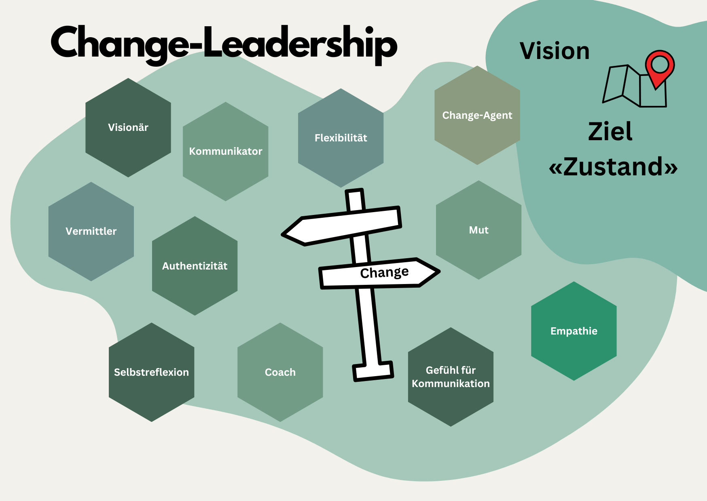

+++
title = "Change-Leadership"
date = "2024-07-20"
draft = true
pinned = false
tags = ["CAS", "Change", "Leadership"]
image = "pilot-3708000_640.jpg"
description = "Was ist Change-Leadership und wo ist der Unterschied zu Change-Management? "
footnotes = "Rogers Carl R. (1973), Entwicklung der Persönlichkeit: Psychotherapie aus der Sicht eines Therapeuten"
+++
## Einleitende Gedanken

Obwohl meine aktuelle Weiterbildung Organisationsentwicklung und Change Leadership beinhaltet, habe ich bisher meistens von Change-Management geschrieben. Dies vor allem zum besseren Verständnis und weil ich mich dabei auf die übliche Definition/Sprache bezogen habe. Auch wenn es vermutlich in den bisherigen Inhalten bereits klare Anhaltspunkte zu Change Leadership gab, widmet sich dieser Beitrag diesem Thema. 

## Abgrenzung von Change-Management zu Change-Leadership

#### Change-Management

**Change-Management wird durch folgende Elemente charakterisiert:** 

* Strukturierter und methodischer Prozess, der den Wandel in der Organisation steuert.
* Planung, Überwachung und Evaluation der Prozesse und Ergebnisse. 
* Fokus auf den Strukturen und den Systemen in der Organisation

#### **Change-Leadership**

**Beim Change-Leadership rücken die Menschen in den Fokus. Es geht nicht mehr lediglich um Prozesse und Ergebnisse. Folgende Elemente stehen für Change-Leadership.**  

* Mitarbeitende stehen neben der Strategie im Fokus.
* Visionen und Orientierung spielen eine wichtige Rolle
* Die Rolle von Führungspersonen ist zentral
* Es wird ein besonderes Augenmerk auf Kommunikation/Information gelegt.

## (Mögliche) Rollen von Change-Leadern

Auch wenn für Change-Leader gerne konkrete Rollen oder ein konkretes Rollen-Set definiert werden, ist es für mich hier wichtig zu erwähnen, dass es sich dabei m. E. eher um eine Auswahl handelt, die zur Person und zur jeweiligen Organisation passen muss. Zudem scheint es mir eine (sehr) grosse Herausforderung für einen Menschen zu sein, alle Rollen auszufüllen. Insbesondere wenn man bedenkt, dass die Führung oft eine Rolle neben der Fachfunktion ist. Zudem können Change-Leader auch Mitarbeitende ohne Führungsrolle sein, sondern Menschen, welche die Veränderung mittragen und mitbegleiten. 

### Visionär

Die (Führungs-) Personen haben eine klare Vision der Veränderung, des Zielbildes oder der Richtung (oder entwickeln diese). Im Idealfall teilen Sie die Vision des Unternehmens und sind in der Lage, diese vorzuleben und/oder in die Sprache der Mitarbeitenden zu übersetzen. 

### Kommunikator

Hier müssten wir noch eine Unterscheidung zwischen Kommunizieren und Informieren machen. Gute Change-Leader machen m. E. beides. Sie stellen einen zielführenden Informationsfluss sicher und informieren klar und verständlich. Gute Kommunikation ist ein zwei- oder gegenseitiger Prozess. Es geht also um den Dialog, darum zuzuhören, abzugleichen und zu verstehen. 

### Coach

In dieser Rolle sind sie begleitend und unterstützend unterwegs. Es geht darum, die Mitarbeitenden im Veränderungsprozess, in ihren Rollen und Herausforderungen zu unterstützen. Ergänzend könnte auch Mentoring oder eine Beratung eingesetzt werden. 

### Veränderungsagent (Change-Agent)

Die Veränderung wird aktiv vorangetrieben und Lösungen in den Vordergrund gestellt. Change-Agents räumen Hindernisse aus dem Weg und helfen dabei, den Wandel in der Organisation zu verankern. 

### Vermittler

Sie sind Vermittler, Übersetzer und pendeln dabei zwischen dem «Alten» und «Neuen». Das heisst, dass sie Anliegen und Widerstände (an-) erkennen und den nötigen Raum oder passende Interventionen finden.

*Diese Aufzählung ist nicht abschliessend.*

## (Mögliche) Eigenschaften von Change-Leadern

Unsere (Arbeits-) Welt ist komplex. Wer in dieser führen will, sollte sich selbst gut kennen oder kennenlernen, um andere Menschen zu leiten und begleiten. Deshalb erachte ich die (tiefe) Auseinandersetzung mit sich selbst als wichtig.

> «Je mehr ich einfach gewillt bin, inmitten dieser ganzen Komplexität des Lebens ich selbst zu sein, und je mehr ich gewillt bin, die Realitäten in mir selbst und im anderen zu verstehen und zu akzeptieren, desto mehr Veränderung scheint in Gang zu kommen.» 
>
> *Rogers Carl (1973), S. 37*

### Flexibilität und Anpassungsfähigkeit

Hindernisse, Unvorhergesehenes und Schwierigkeiten tauchen auch bei noch so gut geplanten Veränderungsvorhaben auf. Das können strukturelle Themen sein, Markt- und Umweltveränderungen oder Widerstände. Change-Leader haben die Fähigkeit flexibel zu (re)agieren und sind anpassungsfähig. 

### Empathie / Verständnis

Change-Leader haben die Fähigkeit, sich in die Lage der anderen zu versetzen oder eine andere Perspektive einzunehmen. Sie können Einfühlungsvermögen (z. B. bei Widerständen oder Unsicherheiten) zeigen und den «Störungen» Platz geben. Wenn wir noch einen Schritt weiter gehen wollen, können und sollen sie auch mit sich empathisch sein. 

### Entscheidungsfreude / Mut

Die Situation kann es erfordern, (schnelle) Entscheidungen zu treffen. Hier ist eine Kombination aus Mut und einem Gefühl für Risiken gefragt. 

### Ein Gefühl für Kommunikation

Ich habe oben bereits erwähnt, dass hier zwischen Kommunikation und Information unterschieden werden sollte. Dies erfordert m. E. ein gutes Gefühl für das, was Mitarbeitende (oder auch aussenstehende Betroffene) benötigen (könnten). Das können Informationen sein oder ein Dialog. 

> «Takt und Timing gehören zur guten Kommunikation in zwischenmenschlichen Beziehungen. Echtheit und Vorsichtigkeit widersprechen sich nicht. Das bedeutet: selektiv authentisch zu sein.» 
>
> *Ruth C. Cohn aus TZI, Die Kunst, sich selbst und eine Gruppe zu leiten*

### Integrität und Authentizität

Weil Systeme und Menschen in Veränderungsprozessen fragil sein können, hilft es, wenn Change-Leader ein klares und stimmiges Bild vermitteln. Wenn sie tun, was sie sagen und sich echt zeigen. Hier sehe ich, wie bei anderen Eigenschaften auch, (grosse) Herausforderungen. 

### Geduld

Veränderungen und Menschen brauchen auch Zeit. Menschen, die für den Wandel verantwortlich sind oder verantwortlich gemacht werden, möchten vielleicht möglichst schnell vorangehen. Sie sind bereit für die Veränderung. Es hilft, wenn sie als Change-Leader geduldig sein können. 

> «Die schwierigste Aufgabe einer Führungskraft besteht darin, Dinge auszuhalten.» 
>
> *Janssen Bodo (2023), Das neue Führen, S. 156*

 *Diese Aufzählung ist nicht abschliessend.*

## Gedanken zum Schluss

Nicht nur weil es heiss ist, bin ich bei den Rollen und Eigenschaften fast ins Schwitzen gekommen. Hast du schon einmal eine Person erlebt, die das alles vereint? Oder versuchst du diesen Rollen und Eigenschaften allen gerecht zu werden? Im Internet und in der Literatur gibt es etliche Definitionen von Führung und Zuschreibungen, so auch zu Change-Leadership. Je komplexer die Welt ist oder wahrgenommen wird, umso mehr Anforderungen sollte eine Führungsperson erfüllen. Es ist grundsätzlich nichts falsch daran, einen hohen Anspruch zu haben und es gibt Menschen, die die ganze Palette spielen können. Man sollte aber auch realistisch bleiben. Es kann eine grosse Herausforderung für einen Menschen sein, dem allem gerecht zu werden. Deshalb sehe ich diese Rolle in Change-Prozessen eher auf (viele) verschiedene Personen verteilt, die sich ergänzen und den Wandel zusammen begleiten oder anführen. Sie gestalten und begleiten gemeinsam den Wandel. Das am besten geleitet von einer starken Vision des Unternehmens. 

## Doch noch ein Gedanke

Die Frage stellt sich mir immer wieder, ob wir denn nun wirklich noch von geplanten Veränderungen sprechen können, oder ob der Wandel nicht so stark und schnell ist, dass Change immer da ist. Wäre es nicht vielleicht sinnvoller, Teams und ganze Organisationen so zu gestalten, dass sie nicht nur durch geplante Veränderungen, sondern auch durch die vielen unvorhergesehenen Dinge navigieren und erfolgreich rauskommen?

> «Wer sich seine Zukunftsfähigkeit bewahren will, wird um starke und sich tief verbunden fühlende Teams nicht herumkommen.» 
>
> *Janssen Bodo (2023), Das neue Führen, S. 171*