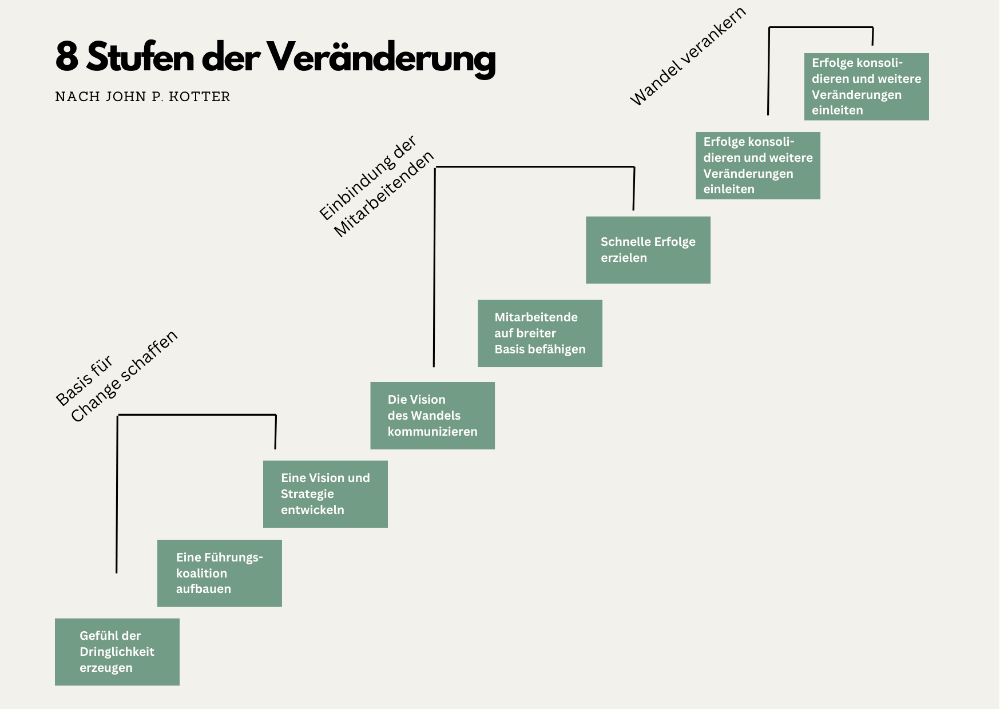
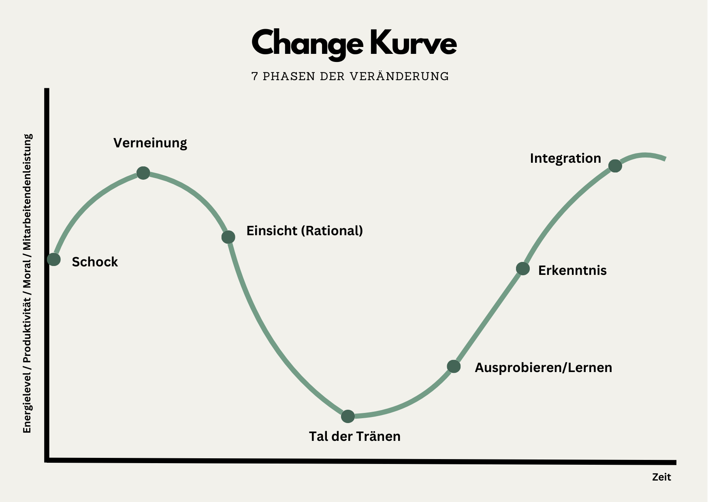
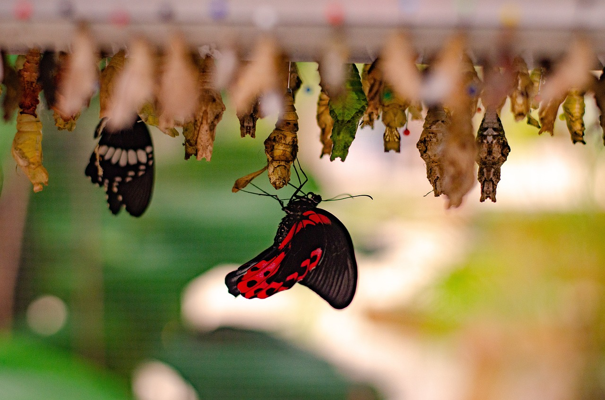

+++
title = "Change Management"
date = "2024-05-17"
draft = false
pinned = false
tags = ["CAS", "Organisationsentwicklung", "Change", "Transformation"]
image = "sea-8581529_1280.jpg"
description = "Change Management und Transformation werden oft synonym verwendet. Es gibt jedoch Unterschiede, die nicht unwesentlich sind. In diesem Beitrag schauen wir auf die Unterschiede und schauen uns Change Management genauer an. "
footnotes = "📚**Erwähnte Bücher**\n\n📕[Jankowski Jule (2022), Zwischen Alt und Neu liegt Gut, Wie wir mit GOOD WORK eine zukunftsfähige Arbeitskultur gestalten können, ohne alles neu machen zu müssen. ](https://www.exlibris.ch/de/buecher-buch/deutschsprachige-buecher/jule-jankowski/zwischen-alt-und-neu-liegt-gut/id/9783800669332/)\n\n📕[Arnold Rolf (2017), Entlehrt euch! Ausbruch aus dem Vollständigkeitswahn.](https://www.exlibris.ch/de/buecher-buch/deutschsprachige-buecher/rolf-arnold/entlehrt-euch/id/9783035504590/)\n\n📕[Kotter John P. (2011), Leading Change, Wie Sie Ihr Unternehmen in acht Schritten erfolgreich verändern](https://www.exlibris.ch/de/buecher-buch/deutschsprachige-buecher/john-p-kotter/leading-change/id/9783800637898/)\n\n📺**Video**\n\n[Prof. Peter Kruse über Change Management ](https://www.youtube.com/watch?v=FLFyoT7SJFs)\n\n[Navigate and Embrace Change, Simon Sinek](https://www.youtube.com/watch?v=pUmTQ-86-YI)\n\n📚**Inspirierende Bücher zum Thema**\n\n📘[Dark Horse Innovation (2014), Thank God it's Monday! Wir wir die Arbeitswelt revolutionieren](https://www.exlibris.ch/de/buecher-buch/deutschsprachige-buecher/dark-horse-innovation/thank-god-its-monday/id/9783430201711/)\n\n📘[Laloux Frederic (2014) Reinventing Organizations, Ein Leitfaden zur Gestaltung sinnstiftender Formen der Zusammenarbeit](https://www.exlibris.ch/de/buecher-buch/deutschsprachige-buecher/frederic-laloux/reinventing-organizations/id/9783800649136/)\n\n📘[Dark Horse Innovation (2023), Future Organization Playbook, Die unverzichtbare Anleitung für innovative Unternehmen in der Transformation](https://www.exlibris.ch/de/buecher-buch/deutschsprachige-buecher/dark-horse-innovation/future-organization-playbook/id/9783867747554/)\n\n📘[Corporate Rebels (2020), Wie Pioniere die Arbeitswelt revolutionieren](https://www.exlibris.ch/de/buecher-buch/e-books-deutsch/joost-minnaar/corporate-rebels/id/9789083004860/)\n\n**Bildnachweise**\n\nBild 8 Stufen des Change: Eigene Visualisierung nach dem 8 Stufen Modell von John P. Kotter\n\nBild Change Management: Eigene Visualisierung nach Kübler-Ross\n\nTitelbild: [Thomas G.](https://pixabay.com/de/users/tho-ge-113537/?utm_source=link-attribution&utm_medium=referral&utm_campaign=image&utm_content=8581529) auf [Pixabay](https://pixabay.com/de//?utm_source=link-attribution&utm_medium=referral&utm_campaign=image&utm_content=8581529)\n\nSchmetterling der sich entpuppt hat: Bild von [Sanne Baan, van de](https://pixabay.com/de/users/sannebaan-4643692/?utm_source=link-attribution&utm_medium=referral&utm_campaign=image&utm_content=6610590) auf [Pixabay](https://pixabay.com/de//?utm_source=link-attribution&utm_medium=referral&utm_campaign=image&utm_content=6610590)"
+++
# Change Management oder Transformation?

Change Management und Transformation werden oft synonym verwendet. Es gibt jedoch Unterschiede, die nicht unwesentlich sind. 

In Change-Prozessen wird etwas verändert. Es kann die Umstrukturierung von Abteilungen oder Teams sein, Veränderungen von Organisationsstrukturen, die Einführung neuer Systeme oder eine neue Strategie. Das Ziel ist, die Organisation besser zu machen und sich an die (neuen) Bedingungen (Markt, Umwelt, …) anzupassen. 

Eine Transformation ist mehr als eine Veränderung. Es ist ein tiefgreifender Wandel, den eine Organisation durchläuft. Was einmal war, wird es so nicht mehr geben. Die Transformation kann zum Beispiel die Unternehmenskultur betreffen, die Art, wie ganz grundsätzlich gearbeitet wird (Bsp. Digitale Transformation) oder den (radikalen) Weg in die Nachhaltigkeit.

> «Der Transformationsprozess ist ein komplexer, multidimensionaler Change-Prozess, der seinerseits wieder aus einer Vielzahl von Changeprojekten besteht, die sich wechselseitig beeinflussen.» 
>
> *Dr. Georg Kraus, [Nicht jeder Change ist eine Transformation](https://www.haufe.de/personal/neues-lernen/unterschied-von-transformationsprozess-und-changeprozess_589614_585022.html)*

### **Beispiele von Transformationen**

##### **Digitale Transformation**

Manuelle Prozesse werden durch digitale ersetzt resp. auch grundlegend verändert (schneller, einfacher, …). Es wird so ganz grundsätzlich anders gearbeitet. Ein aktuelles Beispiel könnten grundlegende Veränderungen durch die KI sein. Denn «nur» ein Wechsel von einem System zu einem anderen ist i. d. R. keine Transformation (auch wenn es sich für manche so anfühlt).

##### **Kulturelle Transformation**

Es geht dabei um die Veränderung der Unternehmenskultur. Das kann z. B. ein Wandel zu Agilität und Flexibilität sein (Arbeitsweise, Arbeitsorte, Zusammenarbeit, …). Es wäre auch die Einführung einer Lern- und Entwicklungskultur denkbar oder die Schaffung eines Arbeitsumfeldes, in dem Inklusion und Diversität aktiv gelebt werden. 

##### **Transformation zu Nachhaltigkeit**

Unternehmen bekennen sich aktiv und umfassend zu Nachhaltigkeit und passen ihre Geschäftstätigkeiten (radikal) an. 

Je nachdem, wo ein Unternehmen steht, werden diese Veränderungen eher Change (Anpassungen, Optimierungen, …) oder eben Transformation (Wandel, grundsätzliche Veränderung) sein. 

**Dazu finde ich eine Geschichte spannend.**

Leider kann ich sie nicht mehr finden, deshalb nur eine kurze Zusammenfassung:

Es geht darum, dass die Raupe, bevor sie zum Schmetterling wird, sich in einen Kokon einspinnt und sich vollständig auflöst. Während dieser Phase scheint es, als würde die Raupe sterben, aber in Wirklichkeit transformiert sie sich in eine ganz neue Form. Sie ist auf dem Weg zum Schmetterling. Diese Metamorphose zeigt auch, dass Veränderung oft mit dem Verlust oder der Auflösung von etwas Altem einhergeht, um Raum für etwas Neues und Schöneres zu schaffen. Es «muss» also «etwas» sterben. Dazwischen ist (viel) Unsicherheit. Raupe und Schmetterling gleichzeitig geht nicht. 

> Die grösste Gefahr in Zeiten des Wandels ist nicht der Wandel selbst, sondern das Handeln mit der Logik von gestern.
>
> *Peter Drucker*

## Change Management

Im Bereich Change Management gibt es verschiedene Modelle, die helfen sollen, Change zu verstehen und zu gestalten. Zwei davon schauen wir uns an.

## **Die 8 Stufen des Change nach Kotter**

John P. Kotter ist ein Experte für Change Management. Er hat acht Stufen definiert, die Organisationen durchlaufen sollen, damit Change gelingt. 

##### **1. Gefühl der Dringlichkeit erzeugen**

Es soll ein Bewusstsein für die Notwendigkeit des Wandels geschaffen werden. So wird eine positive Energie und Motivation für Veränderungen zu erzeugt. Hier ist eine klare Kommunikation wichtig. Wie sieht die aktuelle Realität aus und weshalb ist die Anpassung für eine erfolgreiche Zukunft entscheidend.   

##### **2. Eine Führungskoalition aufbauen**

Die Zusammenstellung einer starken Gruppe, die den Veränderungsprozess lenken und unterstützen kann. Dafür braucht es die nötigen Kompetenzen. Diese Gruppe sollte auch als Vorbild im Changeprozess agieren und diesen aktiv vorleben. Es sollte sich dabei um Menschen aus verschiedenen Bereichen und Hierarchieebenen handeln.

##### **3. Eine Vision und Strategie entwickeln**

Der Wandel braucht eine richtungsweisende Vision und eine Strategie, wie diese umgesetzt werden kann.

##### **4. Die Vision des Wandels kommunizieren**

Die neue Vision und Strategie soll auf allen verfügbaren Kommunikationskanälen kommuniziert werden. Kommuniziert wird auch dadurch, dass die Mitarbeitenden der Führungskoalition die Veränderung vorleben. 

##### **5. Mitarbeitende auf breiter Basis befähigen**

Mitarbeitende sollen zu Risikobereitschaft, Ideen und zum Handeln ermutigt werden. Hindernisse auf dem Weg zur Vision sollen beseitigt werden (z. B. Ändern von Systemen und Strukturen, die nicht zur Vision passen).

##### **6. Schnelle Erfolge erzielen**

Erfolge (sichtbare Verbesserungen) planen und sichtbar machen. Den Menschen, die daran beteiligt sind, Anerkennung zeigen.

##### **7. Erfolge konsolidieren und weitere Veränderungen einleiten**

Durch die gewonnene Glaubwürdigkeit (durch erste Erfolge) weitere Veränderungen initiieren, die in Richtung der Vision gehen. Es sollen Menschen eingestellt, befördert und entwickelt werden, die die Veränderung vorantreiben können. 

##### **8. Neue Ansätze in der Kultur verankern**

Die Veränderung und das Neue werden gefestigt, wenn neue Systeme, Prozesse und Verhaltensweisen bewusst und aktiv in die Kultur integriert werden. 

## **Die Change-Kurve**

Die Change-Kurve beschreibt die emotionalen Phasen, die Menschen durchlaufen, wenn sie mit Veränderungen konfrontiert werden. Den Ursprung habe diese Kurve bei [Elisabeth Kübler-Ross](https://de.wikipedia.org/wiki/Elisabeth_Kübler-Ross). Sie beschrieb, welche Phasen Menschen durchlaufen, wenn sie mit dem Tod konfrontiert werden. Sie wird auch überall etwas anders dargestellt. Deshalb finden sich hier bei den Phasen auch verschiedene Begriffe. 

##### **Schock, Überraschung und Verleugnung**

Ungeplante und überraschende Veränderungen können einen Schock auslösen. Wie dieser Schock wahrgenommen wird, ist individuell. «Er beschreibt das initiale Verharren und Innehalten und damit die Vermeidung von Aktionen, die in Anbetracht des Ereignisses vermutlich angebracht wären.» Jankowski (2022), S. 25. Eine Folge des Schocks in der Arbeitswelt könnte sein, dass die Produktivität abnimmt.

##### **Ärger, Widerstand, Verneinung**

Wut, Frustration und innerer Widerstand tauchen in dieser Phase auf. Menschen behalten bestehende Verhaltensweisen bei und versuchen weiterzumachen wie bisher. Dabei versuchen sie im Tun, die Situation wieder in den Griff zu bekommen.  

##### **Einsicht, Akzeptanz (Rational)**

In dieser Phase erkennen Menschen, dass sie die Situation nicht ändern können. Es bleibt ihnen nichts anderes übrig, als die Situation zu akzeptieren. Das heisst aber nicht, dass sie mit der Situation einverstanden wären. 

##### **Emotionale Akzeptanz, Tal der Tränen**

In der Phase der Veränderung gelangen die Menschen hier an den Tiefpunkt. Es ist eine wichtige und auch schwierige Phase. Denn hier wird der Schmerz spürbar(er). Die Produktivität ist hier nach diesem Kurvenmodell auf dem Tiefpunkt.

##### **Testphase, Ausprobierphase, Lernen** 

Wenn der tiefste Punkt erreicht ist, kann es bergauf gehen. In dieser Phase probieren Menschen Neues aus und wollen die veränderte Situation aktiv mitgestalten. Sie erleben sich wieder als Gestalter:innen. 

##### **Erkenntnisphase**

Die Chancen und Möglichkeiten, die sich aus der Veränderung ergeben, werden sicht- und spürbarer. Menschen fühlen die Gewissheit, dass sie mit der neuen Situation umgehen können.

##### **Integrations- und Konsolidierungsphase**

«Wir haben es geschafft» oder «Ich habe es geschafft». Die Veränderung wird oder ist das neue «Normal» geworden. Es stellt sich ein Zufriedenheitsgefühl ein. 

Veränderungen haben einen Einfluss auf die Menschen und ihre Emotionen. Wenn wir uns (insbesondere) in Change Prozessen dessen bewusst sind, dann können wir den Wandel besser gestalten und begleiten. 

## **Abschliessende Gedanken (für diesen Beitrag und den Moment)**

Zu Beginn dieses Beitrags habe ich eine Begriffsabgrenzung zu Transformation gemacht. Ich bin mir nicht sicher, wie wichtig diese Abgrenzung grundsätzlich ist. Aus meiner Sicht spielt die Abgrenzung eine wesentliche Rolle. Es ist für alle Beteiligten und insbesondere für die Gestalter- und Begleiter:innen wichtig zu wissen, wo sie hinwollen. Soll es (etwas) anders oder neu sein? 

> «Management bedeutet oftmals, dass wir den Menschen die Arbeit erschweren.»
>
> *Peter Drucker*

Modelle sind Modelle. Sie können uns helfen zu verstehen, zu planen und uns unterstützen. Ich bin jedoch der Überzeugung, dass wir uns nie nur an diesen orientieren oder festhalten sollten. Die Menschen, Organisationen und das Leben überhaupt sind zu komplex und bewegen sich in einer immer komplexeren Umgebung. Modelle sind eine Komplexitätsreduktion und vielleicht müssen wir die Komplexität manchmal auch einfach aushalten, abtauchen, ergründen und erleben. Wer weiss, was sich dann für Möglichkeiten auftun können. Wenn du in diese Richtung Inspiration möchtest, dann schau in den Fussnoten *«Inspirierende Bücher»* an.

Auch dieser Beitrag gibt nur einen kurzen und einfachen Ein- und Überblick in eines von vielen Themen, mit denen ich mich im Moment beschäftige.

Veränderungen brauchen Mut und sie sind anstrengend. Das ist gut so. Zum Abschluss noch eine andere Geschichte mit einem Schmetterling. 

*«Eines Tages erschien eine kleine Öffnung in einem Kokon; ein Mann beobachtete den zukünftigen Schmetterling für mehrere Stunden, wie dieser kämpfte, um seinen Körper durch jenes winzige Loch zu zwängen. Dann plötzlich schien er nicht mehr weiterzukommen. Es schien, als ob er so weit gekommen war, wie es ging, aber jetzt aus eigener Kraft nicht mehr weitermachen konnte. So beschloss der Mann, ihm zu helfen: Er nahm eine Schere und machte den Kokon auf. Der Schmetterling kam dadurch sehr leicht heraus.*

*Aber er hatte einen verkrüppelten Körper, er war winzig und hatte verschrumpelte Flügel. Der Mann beobachtete das Geschehen weiter, weil er erwartete, dass die Flügel sich jeden Moment öffnen und sich ausdehnen würden, um den Körper des Schmetterlings zu stützen und ihm Spannkraft zu verleihen. Aber nichts davon geschah. Stattdessen verbrachte der Schmetterling den Rest seines Lebens krabbelnd mit einem verkrüppelten Körper und verschrumpelten Flügeln. Niemals war er fähig zu fliegen.*

*Was der Mann in seiner Güte und seinem Wohlwollen nicht verstand, war, dass der begrenzende Kokon und das Ringen, das erforderlich ist, damit der Schmetterling durch die kleine Öffnung kam, der Weg der Natur ist, um Flüssigkeit vom Körper des Schmetterlings in seine Flügel zu fördern. Dadurch wird er auf den Flug vorbereitet sobald er seine Freiheit aus dem Kokon erreicht. Manchmal ist das Ringen genau das, was wir in unserem Leben benötigen. Wenn wir durch unser Leben ohne Hindernisse gehen dürften, würde es uns lahmlegen. Wir wären nicht so stark, wie wir sein könnten, und niemals fähig zu fliegen.» (Steinbach 2016, S. 68)* Aus Entlehrt euch! Ausbruch aus dem Vollständigkeitswahn, Rolf Arnold, S. 66

PS: Change und Management passen eh nicht so gut zusammen. Deshalb auch ein CAS in Organisationsentwicklung & Change Leadership. Dazu aber sicher in Zukunft mehr.

Nachträgliche Ergänzung: 

> «Deswegen reden wir von Change Management, kurzen Programmen, damit danach das Gerät wieder so läuft wie gehabt - dabei bildet der Doppelbegriff Change Management eigentlich einen Widerspruch in sich.»
>
> *Rusinek Hans (2023), Work Survice Balance, S. 107*

