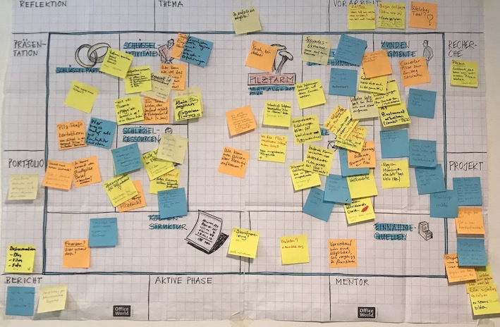
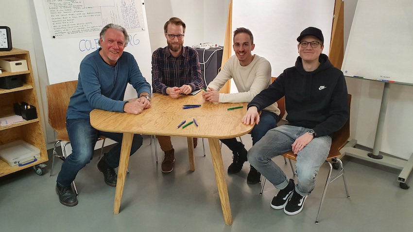
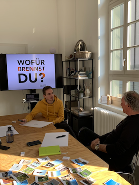

+++
title = "Colearning.org - Rückblick "
date = "2023-01-11"
draft = false
pinned = false
tags = ["Colearning", "Lernen", "Bildung", "colearning.org", "NewLearning"]
image = "bildschirm-foto-2023-01-11-um-09.14.42.png"
description = "Im Februar 2021 war der Start mit Colearning.org. Es ist Zeit für einen Rückblick.  "
footnotes = "**Passende Blogbeiträge von anderen Colearner:innen**\n\n* [Colearning.org](https://www.fredizumbrunn.ch/colearning-org/)\n* [GedankenGänge](https://www.fredizumbrunn.ch/gedankengange/)\n* [Wir geben uns das Lernen zurück](https://www.fredizumbrunn.ch/wir-geben-uns-das-lernen-zuruck/)\n* [Learning by doing](https://www.fredizumbrunn.ch/learnings-by-doing/)\n* [Das Neue kann man nur sehen, wenn man des Neue macht](https://www.fredizumbrunn.ch/das-neue-kann-man-nur-sehen-wenn-man-das-neue-macht/)\n* [Lernunternehmen](https://www.fredizumbrunn.ch/das-neue-kann-man-nur-sehen-wenn-man-das-neue-macht/)\n* [Irgendetwas läuft hier richtig](https://blog.jorisschwarzenbach.ch/irgendetwas-lauft-hier-richtig/)\n* [Die YOLU-Reise startet](https://blog.jorisschwarzenbach.ch/die-yolu-reise-startet/)\n* [Auf den Pilz gekommen](https://hermann.netlify.app/auf-den-pilz-gekommen/)"
+++
### Mein Weg ins Colearning

Irgendwann im Jahr 2021, ich war noch recht frisch im [Effinger](https://www.effinger.ch), sass ich mit [Hermann Flükiger](https://hermann.netlify.app) und [Fredi Zumbrunn](https://www.fredizumbrunn.ch) am grossen Tisch im Erdgeschoss. Zwei Herren im Pensionsalter, beide mit beruflicher Vergangenheit in der Bildung. Ich erinnere mich noch, wie ich zu ihnen sagte, dass ich früher nie mit ihnen an einem Tisch gesessen hätte (also mit zwei Lehrern). Am Tisch mit diesen zwei Herren bin ich gelandet, weil ich mich ein paar Wochen oder Monate vorher (ich weiss es nicht mehr) mit [Marco Jakob](https://www.marcojakob.blog) verabredet hatte. Für das Kennenlernen hatte ich ca. eine Stunde eingeplant und es wurden zweieinhalb. Das weiss ich noch so genau, weil ich einen Folgetermin völlig vergass (das passiert mir sonst nie). Wir sassen im Kocherpark an der Sonne und unterhielten uns über [ZUKUNFTSHELDEN](https://www.zukunftshelden.ch), über Bildung, über Lernen und über Berufsbildung. Wir verstanden uns, wir hatten ähnliche und gleiche Ansichten, Visionen und Träume, wenn wir von Lernen und Bildung sprachen. Was dann kam, weiss ich nicht mehr so genau. Nach der Aufnahme einer [ZUKUNFTSHELDEN-Podcastfolge](https://www.zukunftshelden.ch/hallo) meinte Marco zu mir: «Ich glaube, wir müssen etwas zusammen machen», wobei diese Aussage einfach einmal so im Raum hängen blieb. Wieder ein paar Tage oder Wochen später finden wir uns erneut im Kocherpark und ich starte kurze Zeit später die Zusammenarbeit mit Marco (das verdient wohl einen eigenen Blogbeitrag). So kam ich immer tiefer ins [Colearning Bern](https://www.colearningbern.ch).

Am 6. November 2021 schrieb ich meinen ersten Blogbeitrag *[Meine ersten Erfahrungen mit Colearning](https://www.bensblog.ch/meine-ersten-erfahrungen-mit-colearning/)*, am 13. November 2021 folgte der Eintrag *[Meine ersten Erfahrungen mit Coworking](https://www.bensblog.ch/coworking/)*. 

### Vieles ist unsichtbar

Leider erinnere ich mich an vieles in dieser Zeit nicht mehr oder es war einfach noch viel unklarer, als es heute ist. Vielleicht ist es auch einfach so, dass wie bei den Pilzen zuerst vieles unter der Oberfläche im Stillen passiert. So, dass wir es kaum oder gar nicht wahrnehmen können. Im Oktober 2021 sassen ein paar Colearner:innen nämlich das erste Mal zusammen, um über nichts anderes als eine Idee zu sprechen. Es ging um ein [Lernunternehmen](https://www.marcojakob.blog/lernunternehmen/), also etwas, das Lernen und die unternehmerische Tätigkeit direkt verbindet. Nichts theoretisches, kein isoliertes und sicheres Übungsprojekt. Etwas Echtes. Pilze züchten und verkaufen. 

### Eine [Pilzfarm](https://www.pilzfarm.be) entsteht

Und plötzlich wurde es ernst. Den Interessen entsprechend wurden Aufgaben übernommen, es fanden Abklärungen statt, wir trafen und zu weiteren Sitzungen und irgendwann wurde Pilzsubstrat gemischt. 

### Colearning-Bewegung

[Colearning](https://www.colearning.org) sollte nichts Isoliertes sein, nichts, was nur im Effinger stattfindet, nichts, das uns gehört. Am liebsten hätten wir Colearning überall. Die natürliche Verbindung von Lernen und Arbeit. Das Lernen mitten im Leben. Die Liebe zum Lernen. Wie bringen wir das raus zu den Menschen? Wie kann Colearning zu einer Bewegung werden?

### Colearning.org - Der Anfang

Am 2. Februar 2022 sassen Fredi Zumbrunn, [Joris Schwarzenbach](https://blog.jorisschwarzenbach.ch), Marco Jakob und ich zusammen im Effinger und gründeten [Colearning.org](https://www.colearning.org). Wir schrieben Ideen und Gedanken auf, dachten gemeinsam darüber nach, was wir uns unter Colearning vorstellen, was wir uns wünschen, welche Visionen und Träume wir haben. 

**Auf dem Papier stand zum Beispiel:** 

🖊️ Lehrstellen, Lernstellen

🖊️ Mutausbruch und Mutanfall

🖊️ Love of Learning

🖊️ Colearning, miteinander Lernen teilen, Lernblog

🖊️ Renaturierung des Lernens

🖊️ Open Content, Open Learning 

🖊️ Kinder und Erwachsene, Arbeit und Lernen verbinden

Wo die Reise hinführt, wussten wir nicht (vieles wissen wir auch heute noch nicht 😉). Wir legten los, machten einen Monat später einen Gedankengang (Denken im Gehen), setzten uns zusammen, um unser [Why](https://www.bensblog.ch/start-with-why-i/) zu definieren und weiterzudenken. Obwohl wir klare Vorstellungen hatten, war es gar nicht so einfach, dieses [Why](https://www.zukunftshelden.ch/post/deinwarum) zu definieren. Vielleicht brauchten wir das auch (noch) gar nicht. Vielleicht sollten wir nicht zu viel Zeit damit verbringen und weiter ausprobieren und umsetzen.

#### Colearning.org - Die ersten Schritte

Colearning.org war da, wir waren unterwegs, aber welchen Ideen sollten wir nachgehen? Was ist wichtig? Was kann oder soll warten? Wo ist unsere Energie? Wer hat wie viel Kapazität? Da waren wieder (immer noch) viele Fragen und Ideen. Wir überarbeiteten das [Konzept](https://docs.google.com/document/d/1qcq7b3huOSms2ut1s4PFpCIMD7X9kRLhat7KwjSghwM/edit) und brachten das, was bereits vorhanden war, auf die neue Webseite. Wir wollten das Angebot von Colearning Bern ausbauen und Angebote [für Erwachsene](https://www.colearningbern.ch/erwachsene/) und [Jugendliche](https://www.colearningbern.ch/jugendliche/) machen. Das haben wir auch gemacht. Hier tauch(t)en aber immer wieder Kapazitätsfragen auf und auch das, was Colearning ist, können sich viele vielleicht (noch) zu wenig vorstellen. Es braucht also jedes Mal einen grösseren Initialaufwand. 

#### Vernebelte Sicht

Colearning und das befreite natürliche Lernen ist etwas, was uns am Herzen liegt. Es ist etwas, woran wir glauben, etwas, was wir jeden Tag selbst erleben. Freies und selbstbestimmtes Lernen mitten im Leben. Da sind aber auch die Hindernisse, die sichtbaren und unsichtbaren Hürden, Stolpersteine und Strassengraben. Wir machen das nebenbei und müssen uns auch um unseren Lebensunterhalt kümmern. Viele finden die Idee und das, was wir tun, gut. Es geht aber manchmal nur harzig weiter oder scheint stecken zu bleiben. Das schlägt manchmal auf die Motivation, vernebelt die Sicht und die Perspektive. Das gehört aber einfach dazu. 

#### Wo stehen wir mit Colearning heute?

* Seit der Gründung haben wir auf der Webseite [colearning.org](https://www.colearning.org) zusammengefasst, was Colearning ist. Wir zeigen die einzelnen Elemente, wie auch das [Gesamtkonzept](https://docs.google.com/document/d/1qcq7b3huOSms2ut1s4PFpCIMD7X9kRLhat7KwjSghwM/edit#heading=h.rq2axbnvwgdm). Es kann übernommen und ausprobiert werden.
* Fredi hat Colearning-Meetups organisiert und erste interessierte Menschen zusammengebracht. Wer weiss, was daraus entsteht.. 
* Das erste Lernunternehmen, die [Pilzfarm Bern](https://www.pilzfarm.be) gibt es immer noch. Es sind Pilze im Keller des Effingers gewachsen und vor Weihnachten wurden die ersten rund 200 Pilzboxen verkauft. Ich hörte, es wird bereits an neuen Ideen getüftelt.
* Wir haben zwei [Podcast-Gespräche](https://colearning.podigee.io) über Colearning aufgezeichnet und diese auch [gefilmt](https://www.youtube.com/channel/UC06qEJZv4sB5LkAYUhkyJww). Es war wieder Umsetzung und Lernen in einem. 
* Wir haben bei einem [Netzwerktreffen der German Coworking Federation e. V.](https://coworkland.de/de/veranstaltungen/colearning-bildung-coworking), bei einem Unternehmen für Organisationsenticklung sowie für ein kantonales Amt für Berufsbildung über Colearning und das Lernunternehmen erzählt (und natürlich tun wir das bei allen möglichen Gelegenheiten). Wer weiss, wozu wir inspirieren konnten.
* Marco und Joris haben [Yolu](https://www.yolu.ch) gegründet und im Sommer 2023 werden die ersten zwei Mediamatiker-Lernenden im Effinger ihre Ausbildung starten. 
* Der Lernblog, heute [Lilo.Blog](https://www.lilo.blog) entwickelt sich auch weiter und wir machen uns z. B. Gedanken darüber, wie eine Art Zertifizierung (z. B. Mikro Learning Badges o. Ä.) möglich sein könnten. 
* Ich selbst beginne das erste gegenseitige Mentoring mit jemandem, der noch keine Colearning-Erfahrung hat und bin gespannt wie es wird. 
* Im Moment arbeiten [Joscha](https://www.joschatschanz.ch) und [Levyn](https://levynblog.netlify.app) an einem Video über Colearning. Da gibt es sicher bald mehr.

Was habe ich wohl noch vergessen?