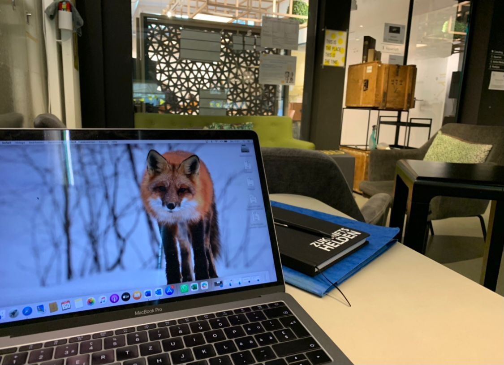

+++
title = "Meine ersten Erfahrungen mit Coworking"
date = "2021-11-13"
draft = false
pinned = false
tags = ["Coworking", "Colearning"]
image = "whatsapp-image-2021-11-13-at-19.29.43.jpeg"
description = "Coworking, Colearning, Lernblog in letzter Zeit nenne ich in Gesprächen mit Freunden und Bekannten diese Begriffe immer wieder und ja, viele (die meisten) verstehen sie kaum. Hier gebe ich einen ersten Einblick in meine Erfahrungen. "
+++
Coworking, Colearning, Lernblog in letzter Zeit nenne ich in Gesprächen mit Freunden und Bekannten diese Begriffe immer wieder und ja, viele (die meisten) verstehen sie kaum. Irgendwie klar und irgendwie schade. Natürlich haben einige eine Idee oder schon einmal davon gehört, einige haben mich im Effinger besucht und einen kleinen Einblick erhalten. Es ist aber, so ist zumindest meine Wahrnehmung für viele immer noch etwas Unbekanntes. Vielleicht verstehen sie es am ehesten als ein Ort, an dem Menschen ihren Arbeitsplatz teilen. Das wars aber auch schon. Da ich immer noch Effinger-Neuling bin, wage ich den Versuch, einen Einblick in meine bisherigen Coworking-Erfahrungen zu geben und natürlich auch einen aktuellen Blick ins Colearning und meine Projekte. Vieles davon scheint immer wieder zu verfliessen aber nun der Reihe nach: 

Ich glaube, irgendwann im Sommer hatte ich meinen ersten richtigen Effinger-Tag und seither bin ich mehr oder weniger regelmässig dort. Am Anfang habe ich mich doch noch irgendwie verloren gefühlt. Ich ging ja weniger wegen des Arbeitsplatzes dorthin (den habe ich zu Hause auch), sondern wegen der Menschen, um Kontakte zu knüpfen, mich auszutauchen und mich im Umfeld von Unternehmer*innen zu bewegen. Irgendwie war immer noch Corona, Ferien, und was weiss ich, es hatte oft nicht so viele Leute. Ab wann ich wirklich öfter dort war, kann ich gar nicht mehr so genau sagen, aber auf jeden Fall bin ich seit ca. 2 - 3 Monaten an ein bis zwei Tagen pro Woche dort am Arbeiten und mich am austauschen und vernetzen. Mittlerweile sitze ich meistens auch im Bereich nahe der Kaffeebar, weil ich mich dort am wohlsten fühle. Wer mich etwas kennt, weiss, dass ich es liebe, in Kaffees und Bars zu sitzen.

Ein paar Dinge, die ich besonders schätze: Immer wieder kommen Menschen zu mir und beginnen mit mir zu sprechen. Es waren bereits einige Gespräche, die irgendwann in der Kaffeerunde begonnen haben und sich eine Stunde hinzogen. Bei diesen Begegnungen geht es nicht einfach um die Arbeit, es geht immer auch um die Person, die dort mit dir spricht und um micht selbst. 

Ich habe es bereits weiter oben geschrieben, ich bin gerne in Kaffees und Bars. Natürlich ist das auch immer abhängig von den Menschen, die dort arbeiten. Für mich sind die Atmosphäre und der Kaffe so, wie ich es mir wünsche. 

Mir scheint, als wäre die Hilfsbereitschaft in der DNA dieses Ortes. Es wird aufeinander Rücksicht genommen und geholfen. Etwas das, so glaube ich, an vielen Orten vermisst wird. 

Und vielleicht ist nicht alles nur Gold, was glänzt. Ich wollte aber meinen immer noch frischen und frohen Blick an diesem Ort mit euch teilen. 

Auch heute wieder ein Zitat zum Abschluss..

> «Ich kümmere mich um meine Angelegenheit, ich bin ich; Du kümmerst Dich um Deine, Du bist Du. Die Welt ist unsere Aufgabe; sie entspricht nicht unseren Erwartungen. Doch wenn wir uns um sie kümmern, wird sie sehr schön sein, wenn nicht, wird sie nicht sein.» 
>
> *Ruth C. Cohn*