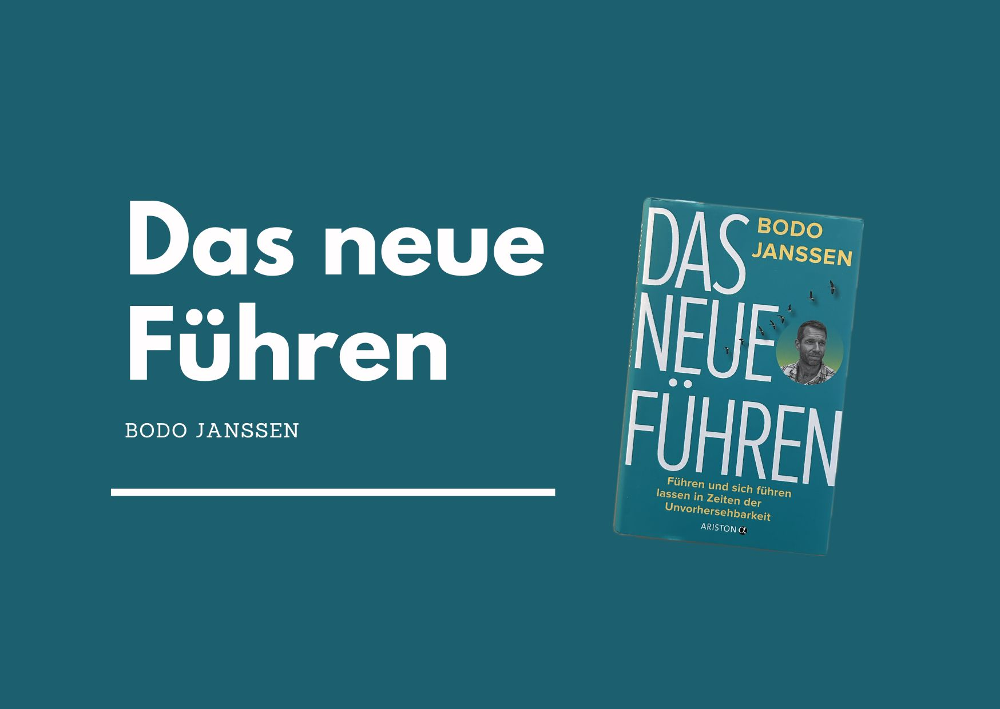

+++
title = "Das neue Führen – Buch von Bodo Janssen"
date = "2023-11-17"
draft = false
pinned = false
tags = ["Buch", "Leadership", "Personalentwicklung", "Organisationsentwicklung", "Gedanken"]
image = "das-neue-fu-hren_2024.jpg"
description = "Einblick und Gedanken zum Buch «Das neue Führen» von Bodo Janssen. "
footnotes = "Passend dazu auch der 📺 [Film «Die stille Revolution»](https://www.die-stille-revolution.de). Ein Film über den Kulturwandel in der Arbeitswelt.\n\nMehr dazu auch hier: [https://www.der-upstalsboom-weg.de](https://www.der-upstalsboom-weg.de/)\n\nPS: Das ist meine erste Buchrezension und ein Versuch. Nachdem ich in meinem ersten Podcastformat vor ein paar Jahren über Bücher erzählt habe und ich etliche positive Rückmeldungen erhielt, dachte ich mir schon lange, ich könnte doch auch einmal etwas schreiben. \n\nÜbrigens, ich werde für erwähnte Bücher und Verlinkungen nicht bezahlt."
+++
# Das neue Führen - Führen und sich führen lassen in Zeiten der Unvorhersehbarkeit

### Worum gehts?

[Bodo Janssen](https://www.ndr.de/geschichte/koepfe/14-Juni-1998-Entfuehrungsopfer-Bodo-Janssen-wird-befreit,bodojanssen102.html)  übernahm nach dem Tod seines Vaters die Führung der [Hotelkette](https://www.upstalsboom.de/). Von einem Tag auf den anderen «musste» er ein Unternehmen leiten. Kontrolle und Kennzahlen gaben ihm dabei in dieser Zeit Sicherheit. Das wiederum führte zu Frust und Unsicherheit bei den Mitarbeitenden. Nach einer Mitarbeitendenbefragung erhielt er katastrophale Ergebnisse, was ihn (nicht ganz direkt) zu einem Umdenken veranlasste. In seinem Buch «Das neue Führen» geht es nicht nur um Führung von anderen, sondern auch darum, sich führen zu lassen und sich selbst zu führen. 

### Inhalt

Was bedeutet Führung in einer Zeit, in der vieles unsicher und unvorhersehbar ist? In diesem Buch schreibt Bodo Janssen über seinen eigenen Weg vom klassischen Manager über einen ersten Klosterbesuch und den grundlegenden Wandel (s)eines Unternehmens. Er beschreibt, wie er klassische Managementstrukturen von Kontrolle und Kennzahlen aufbaute und welche (negativen) Konsequenzen das für ihn, die Mitarbeitenden und für das Unternehmen hatte. 

In diesem Buch beschreibt der Autor nicht den einen neuen Führungsstil. Er beleuchtet die verschiedenen Perspektiven von Führung, Selbstführung und geführt werden. Ein wichtiger Teil dabei ist die Selbst(er)kenntnis. 

> «So brauchte es für mich diese eine Krise, die das Fass zu überlaufen brachte, aber auch die Ermutigung meines benediktinischen Mentors Anselm Grün, mich der gefühlten Katastrophe zu stellen, sie zu nutzen und an ihr zu wachsen, anstatt zu zerbrechen.» 
>
> *Aus dem Buch, S. 75*

Bodo Janssen schreibt aus seiner eigenen Erfahrung und aus den Erkenntnissen der  Unternehmenstransformation. Dabei beleuchtet er einzelne Beispiele, welche seine Ansätze und Argumente verdeutlichen. So ist zum Beispiel zu lesen, wie fehlende Kaffeelöffel in der Gastronomie der Grund sein können, warum Mitarbeitende kündigen. 

In diesem Buch mit vielen Beispielen aus der Praxis verschmelzen alte Weisheiten (z. B. der Benediktinermönche) mit neuer, innovativer und menschlicher Unternehmensführung. Es geht dabei um eine Transformation des Denkens, des Handelns und des Miteinanders bei der Arbeit. Echte Reflexion, Selbst(er)kenntnis, Vertrauen und wirkliches Zuhören sind nur ein paar der m. E. wesentlichen Elemente, die in diesem Buch vorkommen.

Dieses Buch bietet einen Einstieg oder auch konkrete Ideen, wie du als Führungskraft in dieser [VUCA-](https://de.wikipedia.org/wiki/VUCA) oder [BANI-](https://fh-hwz.ch/news/was-bedeutet-bani)Welt in der wir leben, (wieder) zu mehr Klarheit finden kannst. Die Herausforderungen unserer Zeit und der Zukunft können Menschen wohl nur gemeinsam lösen.  

### Meine Gedanken zum Buch

\
Mir gefällt das Buch. Im ersten Teil geht es darum, ein Bewusstsein für das, was war und ist zu schaffen. Der zweite Teil handelt davon, Entschlüsse zu fassen und ins Handeln zu kommen. Durch die persönliche Sicht des Autors, die vielen Erfahrungen und Beispiele aus der Praxis werden die Gedanken greifbar. Viele Elemente in diesem Buch finden sich in ähnlicher Form in anderen Ansätzen (z. B. Sinntheorie Frankl, Mindful Leadership, Psychologische Sicherheit, …) wieder. Bodo Janssen und die Upstalsboom-Gruppe sind aus meiner Sicht absolute Vorreiter und Vorbilder für gesunde und zukunftsfähige Unternehmen.

➡️[Hier gehts zum ](https://www.exlibris.ch/de/buecher-buch/deutschsprachige-buecher/bodo-janssen/das-neue-fuehren/id/9783424202854/)[Buch bei exlibris.ch](https://www.exlibris.ch/de/buecher-buch/deutschsprachige-buecher/bodo-janssen/das-neue-fuehren/id/9783424202854/)