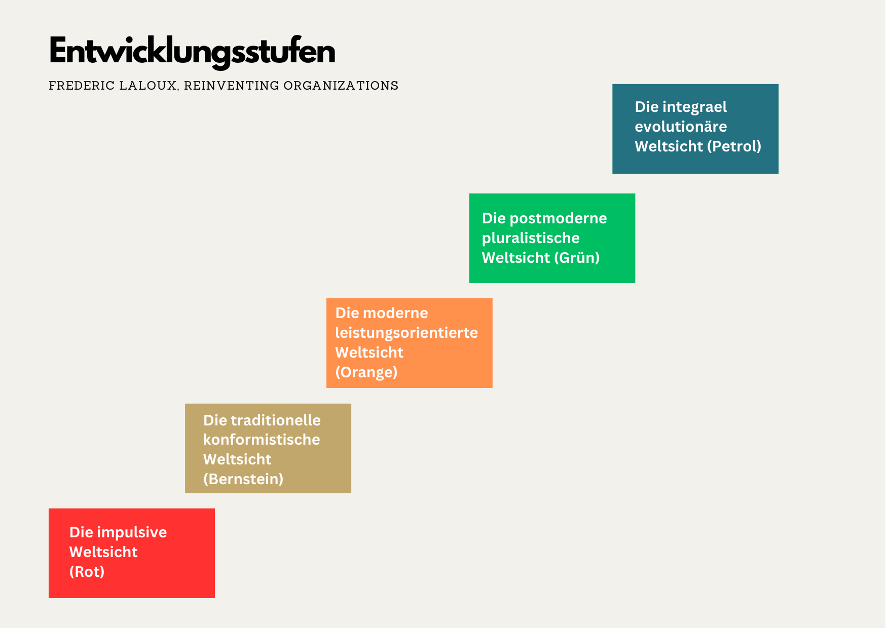

+++
title = "Organisationsentwicklung und Organisationskultur"
date = "2024-07-17"
draft = false
pinned = false
tags = ["CAS", "Organisationsentwicklung", "Organisationskultur"]
image = "wood-3095720_640.jpg"
description = "Ein Versuch, die Begriffe Organisationsentwicklung und Organisationskultur zu definieren. "
footnotes = "📚Bücher\n\n[📘New Work - Gute Arbeit gestalten, Psychologisches Empowerment von Mitarbeitern, Carsten Schermuly](https://www.exlibris.ch/de/buecher-buch/deutschsprachige-buecher/carsten-c-schermuly/new-work-gute-arbeit-gestalten/id/9783648176290/)\n\n[📘](https://www.exlibris.ch/de/buecher-buch/deutschsprachige-buecher/carsten-c-schermuly/new-work-gute-arbeit-gestalten/id/9783648150023/)[Work Survive Balance, Warum die Zukunft der Arbeit die Zukunft unserer Erde ist, Hans Rusinek](https://www.exlibris.ch/de/buecher-buch/deutschsprachige-buecher/hans-rusinek/work-survive-balance/id/9783451399657/)\n\n📘[New Work braucht New Learning, Eine Perspektivreise durch die Transformation unserer Organisations- und Lernwelten](https://www.exlibris.ch/de/buecher-buch/deutschsprachige-buecher/jan-foelsing/new-work-braucht-new-learning/id/9783658327576/)\n\n📘[Schein Edgar H. (2018), Organisationskultur und Leadership](https://www.exlibris.ch/de/buecher-buch/deutschsprachige-buecher/edgar-h-schein/organisationskultur-und-leadership/id/9783800656592/)\n\n📘[Laloux Frederic (2015), Reinventing Organizations, Ein Leitfaden zur Gestlatung sinnstiftender Formen der Zusammenarbeit, Vahlen Verlag](https://www.exlibris.ch/de/buecher-buch/deutschsprachige-buecher/frederic-laloux/reinventing-organizations/id/9783800649136/)\n\n🔗**Links zu Reinventing Organizations**\n\n[Webseite Reinventing Organizations](https://www.reinventingorganizations.com)\n\n[Reinventing Organizations Wiki](https://reinventingorganizationswiki.com/en/)\n\nPS: Die Wahl der Titelbilder für die Blogbeiträge ist oft eine kleine Herausforderung. Insbesondere, weil ich nicht auf klassische Business- und Managementbilder zurückgreifen will. Deshalb wäre vielleicht manchmal eine Erklärung zum Bild sinnvoll. In diesem Fall habe ich mich für den Wald entschieden. Für mich passt er gut zur Entwicklung und vieles passiert auch im Wald unter der Oberfläche oder für uns nicht sichtbar. Und nicht zuletzt steht er in Beziehung zu uns. Zudem mag ich die Beschreibung von Organisationen als lebendige Systeme (wie bei Laloux). Falls du dich für die Natur und das, was unter dem Waldboden passiert interessierst, findest du hier Stoff: \n\n📺[Das geheime Leben der Bäume ](<https://www.youtube.com/watch?v=JMxMjRKlZj8>)\n\n📺[über Pilzmyzel](<https://www.youtube.com/watch?v=nhRv-oL9_iU>)\n\n📺[Ökosysteme, vieles bleibt unsichtbar](<https://www.youtube.com/watch?v=geEzoakhpqQ>)\n\n📸 Bild von [Joe](https://pixabay.com/de/users/jplenio-7645255/?utm_source=link-attribution&utm_medium=referral&utm_campaign=image&utm_content=3095720) auf [Pixabay](https://pixabay.com/de/?utm_source=link-attribution&utm_medium=referral&utm_campaign=image&utm_content=3095720)"
+++
In meinen Blogbeiträgen (insbesondere zum [CAS](https://www.bensblog.ch/cas-organisationsentwicklung-change-leadership-buecher-und-blogposts/)) schreibe ich immer wieder über [Organisationsentwicklung ](https://www.bensblog.ch/tags/organisationsentwicklung/)oder [Organisationskultur](https://www.bensblog.ch/tags/organisationskultur/). Was aber bedeuten diese Begriffe? Hier werde ich versuchen, einen Überblick zu schaffen. Ganz bewusst versuchen, da die Begrifflichkeiten nicht eindeutig und einheitlich sind. Beide betrachte ich im Kontext von neuer Arbeit (New Work), neuem Lernen (New Learning) und Change-~~Management~~ Leadership. 

> Wir verändern die Dinge nicht, indem wir gegen die bestehende Wirklichkeit kämpfen. Um etwas zu verändern, müssen wir ein neues Modell entwickeln, das das alte Modell überflüssig macht.
>
>  *Richard Buckminster Fuller, Laloux, S. 1*

## **Organisationsentwicklung**

Für Organisationsentwicklung gibt es keine einheitliche Definition. Eine Beschreibung könnte lauten: Es geht um die (systematische, strategische, langfristige) Planung und Umsetzung von Veränderungen in einer Organisation. Diese verfolgt Ziele wie die Steigerung der Leistungsfähigkeit des Unternehmens oder die Verbesserung der Arbeit der Menschen im Unternehmen. Es ist also ein breites Feld. 

## **Organisationskultur**

Bei Organisationskultur scheint es etwas einfacher. Da finde ich mehrere Definitionen. Wobei Edgar Schein in seinem Buch Organisationskultur und Leadership gleich zu Beginn vom Problem einer klaren Kulturdefinition schreibt. So würden Kulturen auf vielen Ebenen der «Beobachtbarkeit» beschrieben. Im Buch nennt und beschreibt er mehrere kulturelle Elemente: Beobachtbare Verhaltensweisen im Rahmen menschlicher Interaktionen, Klima, formelle Rituale und Feierlichkeiten, gewählte Werte, Gruppennormen und einige mehr. (Schein 2018)

Es ist also gar nicht so einfach Organisationskultur zu definieren. Schein schreibt: 

*«Zusammenfassend ist der brauchbarste Weg, um zu einer Definition von etwas so Abstraktem wie Kultur zu gelangen, bei Kultur an eine Gruppe zu denken, die gelernt hat, zu überleben, zu wachsen, die mit der äußeren Umgebung umgehen und sich organisieren kann. Wenn wir verstehen, wo Kultur herkommt und wie sie sich entwickelt, können wir etwas Abstraktes begreifen, das zwar nur im Unterbewussten der Gruppe ist, aber das Verhalten der Gruppe massiv beeinflusst. Jede soziale Einheit, die irgendeine Art von gemeinsamer Geschichte erlebt hat, geht durch einen entsprechenden Lernprozess und entwickelt eine Kultur. Die Stärke dieser Kultur ist abhängig von der Dauer, der Stabilität der Mitglieder der Gruppe und der emotionalen Intensität der Lernerfahrung. Wie wir in Fallbeispielen sehen werden, ist die Führung an der Schaffung einer Kultur und auf jeder Stufe des Wachstums und des Reifens beteiligt.»* Schein 2018, S. 13

Bei Schermuly (2021) S. 223 sowie bei Foelsing/Schmitz (2021) S. 188 finde ich zudem Definitionen anderer Autor:innen. Also, es zeigt, es ist auch 2024 (oder ein paar Jahre vorher 😉) keine klare Sache. 

Bei der Organisationskultur geht es um bewusste und unbewusste Elemente. Diese beschreibt Schein anhand von Kulturebenen, wobei Edward T. Hall von einem Eisberg spricht. Auch wenn sich diese sehr ähneln, gibt es auch hier wieder keine Klarheit. Eine Beschreibung und Visualisierung findest du [hier](https://www.bensblog.ch/organisationskultur/). 

> «Je komplexer unsere Umwelt, umso grösser die Bedeutung der Organisationskultur.» 
>
> *Foeling (2021) S. 188*

## **Die (Arbeits-) Welt im Wandel**

Dass sich alles immer verändert hat, ist uns wohl allen klar. Organisationen und Organisationskultur bewegen und entwickeln sich mit den Veränderungen in unserer Welt. Um das noch etwas zu konkretisieren, werfen wir einen Blick zu Frederic Laloux. Er hat über sinnstiftende Formen der Zusammenarbeit ein tolles Buch (es gibt auch ein [illustriertes](https://www.exlibris.ch/de/buecher-buch/deutschsprachige-buecher/frederic-laloux/reinventing-organizations-visuell/id/9783800652853/)!) geschrieben. Dort beschreibt er verschiedene Entwicklungs- resp. Bewusstseinsstufen der Menschheit und die dazugehörenden Organisations-/Arbeitsmodelle, beginnend bei der impulsiven Weltsicht (etwa zehntausend Jahre zurück, unten in Rot). Hier gebe ich nur einen kurzen (aber hoffentlich genügenden) Überblick. 

**Die impulsive Weltsicht:** Es sei etwa zehntausend Jahre her, dass diese Stufe entstand. Durchbrüche bei dieser Form der Arbeit waren die Top-down-Autorität sowie die Arbeitsteilung. Als Archetyp nennt er die Mafia oder Strassengangs. 

Später kam die **traditionelle konformistische Weltsicht**. Archetypen dieser Art der Organisation seien die Armee oder die katholische Kirche. Das stabile Organigramm sowie wiederholbare Prozesse gelten als Durchbrüche dieser Stufe. 

Auf der Stufe der **modernen und leistungsorientierten Weltsicht** ist die bestimmende Metapher die Organisation als Maschine. Innovation, Verlässlichkeit und das Leistungsprinzip nennt Laloux als die drei Durchbrüche dieser Zeit. 

 In der **postmodernen pluralistischen Weltsicht** spricht man von Organisationen als Familie. Die drei Durchbrüche dieser Zeit sind Empowerment, wertorientierte Kultur und die Integration verschiedener Interessengruppen.

 Und was kommt danach? Die **integrale evolutionäre Weltsicht**. Diese ist erst am Entstehen und es sei noch schwer zu sagen, wie diese Stufe die Welt verändern wird. Laloux schreibt von der Welt als ein Ort der individuellen und kollektiven Entfaltung, in der Menschen auf ihre innere Stimme hören (können) und sie als Kompass nutzen und der Suche nach Ganzheit. Es gibt bereits Organisationen, die entsprechend diesen Elementen arbeiten. Als Metapher dafür nennt er lebendige Systeme. Selbstführung, Ganzheit und evolutionärer Sinn seien die Durchbrüche, welche das Management, wie wir es bisher kannten, verändern. 

## **Gedanken zum Schluss**

Organisationen und deren Kultur haben sich schon immer entwickelt und sie werden es weiterhin tun. Auch wenn die Begriffe einfach scheinen, so sehen wir in den (möglichen) Definitionen, dass beides komplex und vielschichtig ist. Ich frage mich gerade, ob Change- und Entwicklungsvorhaben nicht manchmal bereits am unterschiedlichen Verständnis davon scheitern.