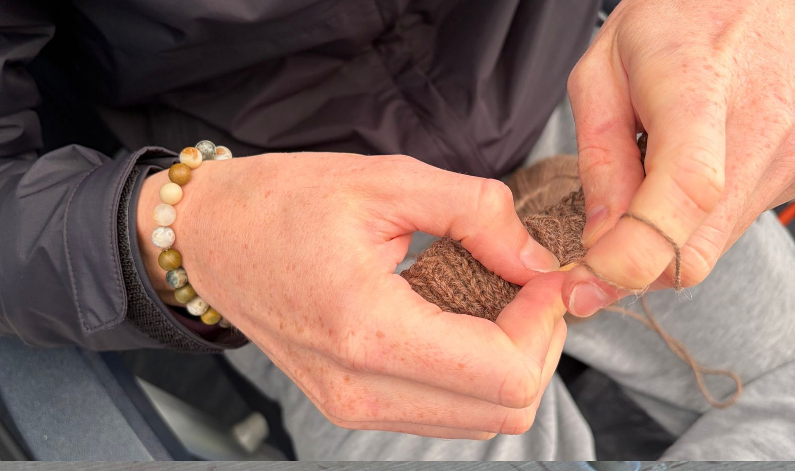
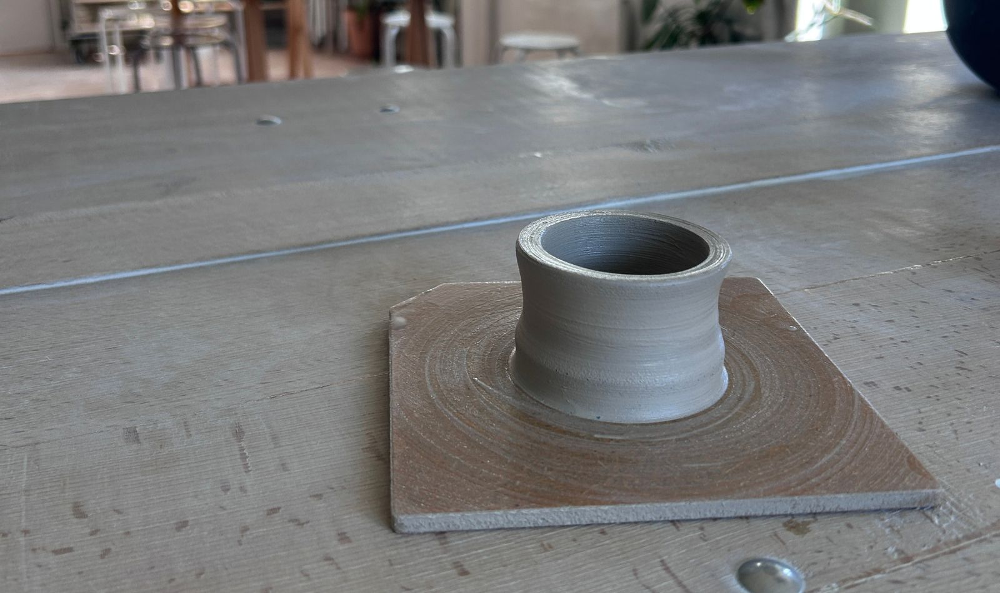

+++
title = "Dem inneren Impuls folgen"
date = "2026-09-25"
draft = false
pinned = false
tags = ["Lernen", "Sinn"]
image = "aussicht.jpg"
description = "Manchmal muss man nicht wissen, wohin etwas führt. Ein paar kleine Experimente mit Stricknadeln, Ton und Stimme haben mir gezeigt, wie gut es tun kann, einem inneren Impuls zu folgen."
footnotes = "Zitat Gunther Schmidt: Aus der Erinnerung aus Gesagtem, während einer Weiterbildung.\n\nFotos: Persönliches Bildarchiv"
+++
# Dem inneren Impuls folgen

In den letzten Blogtexten ging es um Veränderungen und Übergänge. So ist auch dieser Blog vielleicht in einem Übergang – wobei dieser sich sowieso mit mir bewegt und somit immer wieder wandelt.

In diesem Text erzähle ich davon, wie aus einem inneren Impuls drei kleine Experimente entstanden sind – und was ich dabei über mich und das Lernen entdeckt habe.



Auch wenn es in diesem Blog oft um Lernen, um Organisationen und deren Entwicklung ging oder geht, dreht sich im Kern doch immer vieles um Menschen, ums Menschsein und um ein Zusammenleben und Zusammenarbeiten, das uns als Menschen gerecht wird. Meine Neugier leitet mich und ich habe oft den Drang (oder die Lust), zu verstehen, weshalb Dinge sind wie sie sind und wie sie zusammenhängen. Ich selbst bezeichne mich als Lernender und mache da keine Ausnahme mehr, ob ich in einer Weiterbildung sitze, etwas Neues entdecke oder einfach durchs Leben gehe. Tatsächlich bin ich zurzeit auch in einer Weiterbildung und beschäftige mich nebenbei mit Trauma und Körper. Vieles davon würde sich hier ergänzen, denken und schreiben lassen – das würde den Rahmen dieses Textes leider sprengen. So könnte sich dieser Blog tendenziell weg von der Arbeit und hin zum restlichen Teil des Lebens bewegen. Wer weiss.



In einem Text habe ich darüber geschrieben, wie ich selbst einen grösseren Übergang und (Neu-)Anfang erlebe. Nicht nur, aber auch Teil dieser Veränderung(en) sind Alltagsgewohnheiten und damit verbundene Freizeitbeschäftigungen. Im Wissen, dass einiges wegfallen wird, widerstand ich dem Impuls, die folgende Zeit bereits zu verplanen. Ich hatte zwar Ideen im Kopf, was ich machen könnte und möchte, liess aber zuerst den Raum frei werden, bevor ich Entscheidungen (wenn auch keine weltverändernden) traf. In diesem freien (und auch unsicheren) Raum beobachtete ich meine Umgebung, ging Inspirationen nach, sprach mit Menschen, versuchte zu spüren, wo Resonanz da ist und wo auch Ängste und Unsicherheiten mitspielten. Denn diese Verunsicherungen geben mir ebenfalls wichtige Hinweise darauf, was mir wichtig sein könnte.

In den letzten Monaten wurde für mich immer klarer, dass die «Arbeit» mit den Händen (oder mit dem Körper) für mich etwas Wichtiges und Schönes ist (oder sein könnte). Denn gerade aus meiner Schulbiografie hatte (oder habe ich eben bis jetzt) kein sehr gutes (Selbst-)Bild, was kreative und händische Arbeiten anbelangt. Eigentlich verrückt, wie einem so etwas bis ins Erwachsenenalter prägt und begleitet. Aber wie Gunther Schmidt sagen würde, «die Vergangenheit bestimmt nie die Gegenwart oder Zukunft». Ich spürte also, dass es Zeit war, mehr mit den Händen zu tun. Auch wenn immer wieder (vermeintlich konkrete) Ideen auftauchten, was ich tun könnte, so liess ich den Raum bewusst offen, behielt die Ideen im Kopf, sprach mit Menschen darüber, recherchierte und beobachtete, wo ich immer wieder Resonanz spürte. Ich verliess mich dabei vor allem auf mein Bauchgefühl oder meine Intuition.

## Der Beginn – kleine Experimente

Seit ein paar Jahren beginne ich Dinge (nach Möglichkeit) mit kleinen und überschaubaren Experimenten. Sie sollten gross genug sein, damit ich einen konkreten Eindruck erhalte, und nicht zu gross (zeitlich und finanziell), falls etwas doch nicht zu mir passt.

Es haben sich mittlerweile drei konkrete Tätigkeiten herauskristallisiert.

### Töpfern, Stricken und Singen (in der Gruppe)

#### Stricken

Mit (m)einem Strickprojekt bin ich bereits seit ein paar Wochen unterwegs. Es wird eine Wintermütze. Stricken scheint sich als passend zu erweisen. Es hilft mir abzuschalten und ist nahezu überall möglich. Manchmal sind es «nur» ein paar Maschen und manchmal eine längere Zeit. Bisher habe ich beim Campen, als Beifahrer, im Zug, in der Mittagspause oder auf dem Sofa gestrickt. Hier habe ich Unterstützung aus meinem Umfeld, was vieles einfacher macht (Wolle kaufen, Fehler beheben etc.).

#### Töpfern

Das könnte auch zu einer Sinnkrise eines Millennials passen und scheint in Mode zu sein. Das wäre bereits ein Grund gewesen, es nicht zu versuchen. Aber die innere Stimmigkeit war gross und so habe ich mich für einen Drehscheibenkurs angemeldet. Im Gegensatz zum Stricken ist Töpfern auf der Drehscheibe nicht überall möglich. Töpfern braucht Zeit und ich schätze, man muss sich diesem Prozess etwas mehr widmen als dem Stricken. Aus meiner ersten Erfahrung mit Töpfern würde ich sagen, dass es um ein Fühlen und Im-Moment-Sein – ganz bei dem, was ist – geht. Und gerade beim Töpfern brauche ich mehr als nur die Hände (damit meine ich nicht unbedingt den Kopf, sondern den ganzen Körper).

#### Singen

Beim Ausprobieren wurde mir irgendwann bewusst, dass es vielleicht gar nicht nur um die Hände geht. Eher darum, etwas unmittelbar zu tun, zu spüren und mit dem Körper zu erleben. Und damit kam auch das Singen wieder stärker in den Blick.

Mit Gesangsunterricht habe ich vor längerer Zeit und in unregelmässigen Abständen begonnen. Mit dem Singen zu beginnen war wirklich ein zutiefst innerer Impuls, der gedanklich einige innere Widerstände zur Folge hatte. Dem inneren Impuls folgend konnte ich über die Zeit einige Hürden und Hindernisse ablegen (oder integrieren) und entdecken, wie gut mir Singen tut. Nachdem meine Gesangslehrerin in Bern aufhörte, habe ich mich ebenfalls für eine Pause entschieden, um zu sehen, wie oder wo es für mich weitergehen könnte. Ich vermute, dass das Singen in der Gruppe etwas sehr Schönes sein kann und hatte oder habe gleichzeitig einige Unsicherheiten. Anstatt in einen Chor (was nie grundsätzlich das Ziel war), versuche ich es jetzt mit einer Singgruppe (einer Art Gruppenunterricht).

Vielleicht ist es am Ende gar nicht so wichtig, ob aus dem Stricken eine lebenslange Leidenschaft, aus dem Töpfern ein neues Hobby oder aus dem Singen etwas ganz anderes wird. Spannender finde ich gerade, was mir diese kleinen Experimente zeigen: Es tut mir gut, Dinge nicht nur zu verstehen, sondern sie zu tun. Zu spüren, auszuprobieren, Fehler zu machen und mich überraschen zu lassen.

Vielleicht ist «dem inneren Impuls folgen» deshalb auch mehr als das Ausprobieren neuer Freizeitbeschäftigungen (wobei jede der Tätigkeiten auch Beruf ist oder sein kann). Vielleicht geht es darum, dem, was sich stimmig anfühlt, Raum zu geben – ohne schon wissen zu müssen, wohin es führt.

Und es ist Lernen. Mitten im Leben.