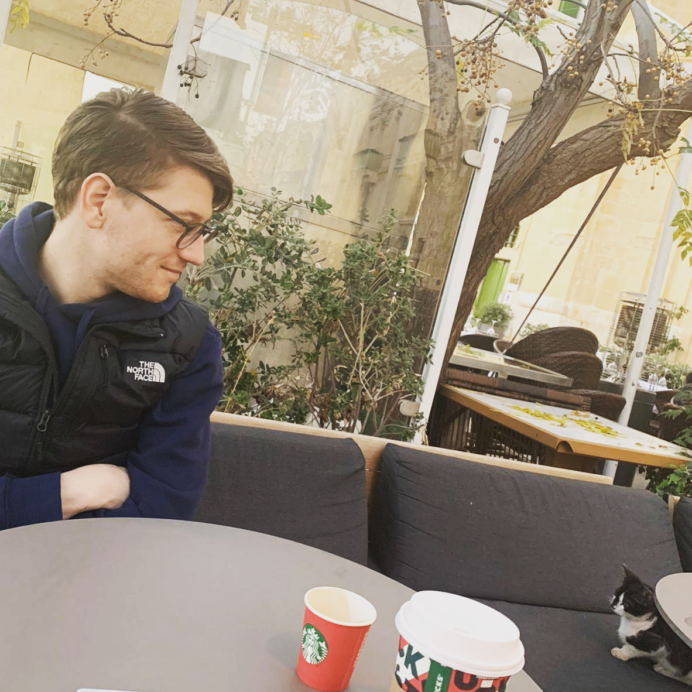

+++
title = "Der Kopf ist leer"
date = "2021-12-05"
draft = false
pinned = false
image = "d739f42e-ecec-4e71-9281-143e1cc1e983.jpg"
+++
Der Titel stimmt natürlich nicht ganz, sonst wäre es kaum möglich etwas zu schreiben.. 😉. Aber es ist so, dass ich in den letzten Tagen ein paar Anläufe genommen habe, um hier etwas zu schreiben. Mein Kopf ist aber einfach leer. Pendenzen die lange offen waren, sind nun definitiv abgeschlossen und andere Dinge scheinen klar(er) zu werden. Da war ganz viel Anspannung (andere ist immer noch da), die mich viel Energie gekostet hat. Das nicht erst seit gestern oder vorgestern, sondern bereits seit fast zwei Jahren. 

Nun scheint wirklich vieles langsam Früchte zu tragen. Viel habe ich aber dazu im Moment nicht zu schreiben und teile nun einfach Zitate, Worte und Zeilen, die mir in dieser Zeit begegnet sind und vielleicht jemanden inspirieren. 

«Wenn Sie durch die Hölle gehen, gehen sie einfach weiter.» Winston Churchill

«Wenn nichts sicher ist, ist alles möglich.» 

«Das Leben ist schön, von einfach war nie die Rede.»

«Viele der Misserfolge des Lebens werden von Menschen erlebt, die nicht wussten, wie nah sie dem Erfolg waren, als sie aufgaben.» Thomas Edison

«Die letzte der menschlichen Freiheiten besteht in der Wahl der Einstellung zu den Dingen.» Viktor E. Frankl

«Das Schicksal gehört zum Menschen wie der Boden, an den ihn die Schwerkraft fesselt, ohne die aber das Gehen unmöglich wäre. Zu unserem Schicksal haben wir zu stehen wie zu dem Boden, auf dem wir stehen – ein Boden, der das Sprungbrett für unsere Freiheit ist.» Viktor E. Frankl

«Es kommt nie und nimmer darauf an, was wir vom Leben zu erwarten haben, viel mehr lediglich darauf: was das Leben von uns erwartet.“„Wenn Leben überhaupt einen Sinn hat, muss auch Leiden einen Sinn haben. Es kommt nicht darauf an, was man leidet, sondern wie man es auf sich nimmt.» Viktor E. Frankl