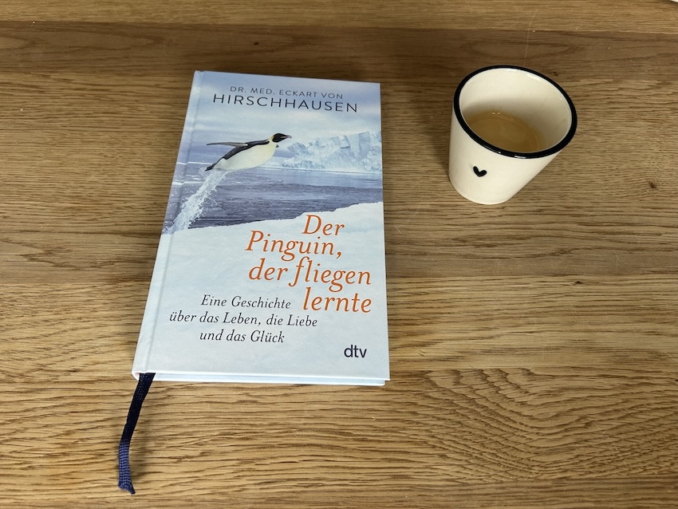
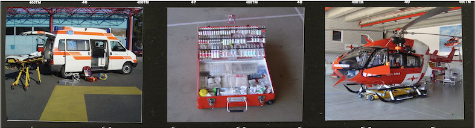
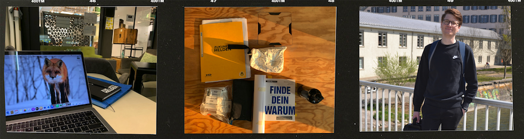
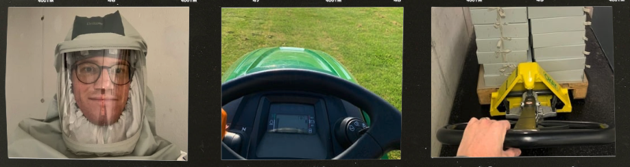
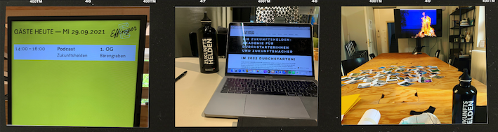

+++
title = "Meine Pinguin-Geschichte"
date = "2025-04-19"
draft = false
pinned = false
tags = ["Biografie"]
image = "leer-2.jpg"
description = "Dieser Text ist ein Rückblick auf meinen beruflichen Weg – erzählt aus der Perspektive der Pinguin-Geschichte von Eckhart von Hirschhausen."
footnotes = "📚**Passende Bücher**\n\n📘[Das Glück kommt selten allein, Eckhart von Hirschhausen](https://www.exlibris.ch/de/buecher-buch/deutschsprachige-buecher/eckart-von-hirschhausen/glueck-kommt-selten-allein-/id/9783499624841/)\n\n📘[Der Pinguin, der fliegen lernte, Eckhart von Hirschhausen](https://www.exlibris.ch/de/buecher-buch/deutschsprachige-buecher/eckart-von-hirschhausen/der-pinguin-der-fliegen-lernte/id/9783423284523/)\n\n📘[Life Design](https://www.exlibris.ch/de/buecher-buch/deutschsprachige-buecher/sebastian-kernbach/life-design/id/9783791049229/?srsltid=AfmBOoprt4y94S7htsQItRUjCSskt0FNYRNw_-dvmwhouBBdKT4qUDR4)\n\n📘[Das Leiden am sinnlosen Leben, Viktor E. Frankl](https://www.exlibris.ch/de/buecher-buch/deutschsprachige-buecher/viktor-e-frankl/das-leiden-am-sinnlosen-leben/id/9783451033506/)\n\n📘[Wer ein Warum zum Leben hat, Viktor E. Frankl](https://www.exlibris.ch/de/buecher-buch/deutschsprachige-buecher/viktor-e-frankl/wer-ein-warum-zu-leben-hat/id/9783407864925/)\n\n📘[...trotzdem Ja zum Leben sagen, Viktor E. Frankl](https://www.exlibris.ch/de/buecher-buch/deutschsprachige-buecher/viktor-e-frankl/-trotzdem-ja-zum-leben-sagen/id/9783466373253/)\n\n📘[Der Mensch vor der Frage nach dem Sinn, Viktor E. Frankl](https://www.exlibris.ch/de/buecher-buch/deutschsprachige-buecher/viktor-e-frankl/der-mensch-vor-der-frage-nach-dem-sinn/id/9783492202893/)\n\n📘[Arbeit, Sinn & Motivation, Harald Pichler](https://www.exlibris.ch/de/buecher-buch/deutschsprachige-buecher/harald-pichler/arbeit-sinn-und-motivation/id/9783991002437/?utm_source=google&utm_medium=cpc&utm_campaign=Shopping+Catch+All+inkl.+LIA+(sh-CH-de)&utm_content=Catch+All+DE&utm_term=&gad_source=1&gbraid=0AAAAAD5hN-XCdNRiABapkg5-KWboSRHdT&gclid=CjwKCAjwk43ABhBIEiwAvvMEBx2ub8IUwsvWt-EeEOv7Aazksc7wLaCzSl-y7OheASgj-vuN_WJVcxoCh8oQAvD_BwE)\n\n📘[Wer dem Glück hinterherrennt, läuft daran vorbei, Russ Harris](https://www.exlibris.ch/de/buecher-buch/deutschsprachige-buecher/russ-harris/wer-dem-glueck-hinterherrennt-laeuft-daran-vorbei/id/9783442179855/)\n\n📘[Der Weg zu echtem Selbstvertrauen - von der Angst zur Freiheit, Russ Harris](https://www.exlibris.ch/de/buecher-buch/deutschsprachige-buecher/russ-harris/der-weg-zu-echtem-selbstvertrauen/id/9783867810951/)\n\n📘[Ikigai, Ken Mogi](https://www.exlibris.ch/de/buecher-buch/deutschsprachige-buecher/ken-mogi/ikigai/id/9783832198992/?utm_source=google&utm_medium=cpc&utm_campaign=Performance+Max+CSS+B_2+hm_30+(pm-CH-de)&utm_content=&utm_term=&gad_source=1&gbraid=0AAAAAD5hN-XkbOf3eSThFLuGlSxOciyid&gclid=CjwKCAjwk43ABhBIEiwAvvMEB_Yti-URMI8UaZv-VhsP6SCNMRRPRn-WXtGrs_lnaw5dl3pqJg3pFRoCmw8QAvD_BwE)\n\n📘[Wabi Sabi, Beth Kempton](https://www.exlibris.ch/de/buecher-buch/deutschsprachige-buecher/beth-kempton/wabi-sabi/id/9783431041194/)\n\n📘[Theorie U, C. Otto Scharmer](https://www.exlibris.ch/de/buecher-buch/deutschsprachige-buecher/c-otto-scharmer/theorie-u-von-der-zukunft-her-fuehren/id/9783849703479/)\n\n**Bilder**\n\nPinguinfoto Titelbild: [Leo Furiolo](https://pixabay.com/users/leo_furiolo-4965736/?utm_source=link-attribution&utm_medium=referral&utm_campaign=image&utm_content=4285650) from [Pixabay](https://pixabay.com/?utm_source=link-attribution&utm_medium=referral&utm_campaign=image&utm_content=4285650)\n\nEisbär in der Wüste: Erstellt mit Dalle-3\n\nBilder «Filmrollen» Archiv Ben Zaugg\n\nSchwimmender Pinguin: [Tazz Anderson Photography](https://pixabay.com/users/tazzanderson-4651246/?utm_source=link-attribution&utm_medium=referral&utm_campaign=image&utm_content=7542194) from [Pixabay](https://pixabay.com/?utm_source=link-attribution&utm_medium=referral&utm_campaign=image&utm_content=7542194)"
+++


Vor ein paar Jahren hatte ich ein Gespräch mit jemandem, der meine Geschichte in einem Buch teilen wollte. Da ich nach dem Treffen und ersten Interviewfragen den Eindruck hatte, die Biografie würde vor allem für Verurteilungen gegenüber Institutionen und Menschen sowie negative Sichtweisen genutzt, habe ich später abgesagt. Die Idee, Einblicke in meine Biografie zu geben, kommt jedoch immer wieder auf. Nicht weil ich den Eindruck habe, ich sei so wichtig, sondern weil ich Menschen Mut machen möchte. Ich selbst konnte viel aus biografischen Einblicken lernen. Nun experimentiere ich selbst mit dem Schreiben an (m)einer Biografie oder zumindest an Einblicken aus verschiedenen Perspektiven. Das neue Buch «Der Pinguin, der fliegen lernte» von Eckhart von Hirschhausen hat mich inspiriert, mich an einem konkreten Text aus der «Pinguin-Perspektive» im Bezug auf meinen bisherigen beruflichen Weg zu versuchen. 



Im Buch «Glück kommt selten allein» bin ich der [Pinguin-Geschichte](https://www.youtube.com/watch?v=sY539oAsTb0) von Eckhart von Hirschhausen begegnet. Ich hatte mir zuvor nie viele Gedanken über die Tollpatschigkeit der Pinguine gemacht, sondern fand sie spannend und lustig. Die Geschichte vom Pinguin ist mir bis heute in Erinnerung geblieben. Dieser tollpatschige Vogel an Land, der erst im Wasser seine volle Eleganz entfaltet - toll. Vielleicht, weil ich mich selbst oft so fühlte: bemüht, fehl am Platz, zu viel oder zu wenig für das, was gerade gefragt war. Ich beschreibe dieses Gefühl oft als «Eisbär in der Wüste» und konnte es mit dem Aufkommen der KI-Bildgenerierung treffend visualisieren. 

Aber im richtigen Element? Da kommt plötzlich Leichtigkeit ins Spiel.\
Nicht, weil alles einfacher wird – sondern weil es sich plötzlich passend anfühlt. (Was einfach klingt, ist viel schwieriger, als man denken könnte und viele Life-, Sinn, Potenzial-Coaches einem weismachen wollen). 

Dieses Bild des Pinguins begleitet mich seit Jahren. Einmal leise im Hintergrund, ein anderes mal ganz präsent. Es erinnert mich an etwas, das ich erst später in Worte fassen konnte: Stärke deine Stärken und fokussiere dich nicht auf das Eliminieren von (vermeintlichen) Schwächen. Und vielleicht noch wichtiger: Finde dein eigenes Element. Das heisst, die eigenen Stärken überhaupt zu erkennen, anerkennen und darauf zu achten. Dann die Umgebungen finden, die passen. Auf die Arbeit bezogen könnte das heissen: 

* Arbeitsinhalt/Arbeitstätigkeiten (was kann und tue ich wirklich wirklich gerne und gut?)
* Arbeitsort (Distanz zur Arbeit, Unternehmensgrösse, Branche, …)
* Arbeitsumgebung (Einrichtung, Arbeitsthemen, die Menschen mit denen man arbeitet, …)
* Klima (Kultur, …)

Genau das habe ich im Laufe der Zeit immer wieder versucht. Nicht geradlinig, nicht geplant – aber mit Neugier, mit Mut (auch wenn es sich oft nicht mutig, sondern absolut nötig anfühlt) zum Ausprobieren und einer gewissen Hartnäckigkeit. 

Erleben statt nur überlegen. Tun, scheitern, lernen, wieder tun.\
Nicht dem perfekten Plan folgen – sondern Wege gehen und sichtbar machen, die vorher im Nebel lagen (und vielleicht noch vorher unmöglich schienen).

Im Rückblick war es wohl genau dieses Prinzip, das mich weitergebracht hat.\
Nicht *trotz* der Umwege. Sondern *wegen und mit* ihnen. (Aber eben, Umwege fühlen sich in dem Moment oft scheisse an).

### **Jugendträume und die harte Realität**

Als Kind oder vielleicht eher als Jugendlicher hatte ich einen Traumberuf: Ich wollte Rettungssanitäter werden. Dieser Wunsch war keine allzu romantisierte Vorstellung, sondern basierte auf meiner (soweit möglich) realistischen Wahrnehmung des Gesundheitswesens, mit dem ich durch familiäre Erfahrungen früh in Kontakt kam. Zudem hatte ich mich irgendwann im Alter von ca. 15 Jahren vertiefter damit auseinandergesetzt. 

Aufgrund der vielen Schwierigkeiten in der Schulzeit, meinem mittlerweile entwickelten Selbstbild und den negativen Äusserungen von Erwachsenen schien dieser Berufswunsch lange unerreichbar (eigentlich handelte es sich dabei nur um ihre eigenen Begrenzungen). Eine total andere Perspektive war dann aber, als mir jemand (mit Expertise) sagte: «Klar kannst du das, warum denn nicht?» Diese Aussage (nur allein die Haltung) begleitet mich wohl bis heute. 

Vor zwanzig Jahren begann ich meine Ausbildung zum Detailhandelsfachmann. Nach den schwierigen Jahren in der Schule fühlte sich dieser (Neu-)Beginn in einem Beruf wie eine Befreiung an. Ich war sehr froh, dass ich bis zum Lehrbeginn im Sommer überhaupt einen Ausbildungsplatz gefunden hatte. Die Angst, nichts zu finden, war allgegenwärtig – vor allem aus den ewigen Katastrophisierungen der Erwachsenen, die ich übernahm. Ich war sehr motiviert und engagiert, eine Lehrstelle zu finden, aber Schulnoten und Multichecks zählten mehr. Viel mehr.

Meine Ausbildungszeit war alles andere als schön. Ich identifizierte mich stark mit dem Beruf, mit meinen Tätigkeiten und konnte mich auch gut einbringen. Das Umfeld war jedoch schwierig. Heute kann ich klar sagen, dass ich Mobbing erlebte – so, wie es im Buch oder in der Theorie steht. Das fiel mir lange schwer einzugestehen, auch wenn es von Fachpersonen bereits damals so benannt wurde. Um das wirklich anzuerkennen, musste ich über dreissig Jahre alt werden.

> «Das Schicksal gehört zum Menschen wie der Boden, an den ihn die Schwerkraft fesselt, ohne die aber das Gehen unmöglich wäre. Zu unserem Schicksal haben wir zu stehen wie zu dem Boden, auf dem wir stehen – ein Boden, der das Sprungbrett für unsere Freiheit ist.»
>
> *Viktor E. Frankl*

### **Die ersten Schritte ins Berufsleben**

Bereits vor meiner Ausbildung wusste ich, dass ich meine berufliche Zukunft nicht im Detailhandel sah, auch wenn mir die Arbeit Freude machte. Warum sollte ich in einem Bereich arbeiten, in dem die Arbeitsbedingungen so schwierig waren? Zudem fragte ich mich immer wieder: Was soll dieses ständige Verkaufen, Verkaufen, Verkaufen? Zusatzverkäufe hier, Kundenbindung da.

Nach der Ausbildung arbeitete ich ein Jahr im Detailhandel, bevor ich einen Praktikumsplatz im Marketing fand. Zu dieser Zeit war ich hin und hergerissen zwischen dem Wechsel in das Sozial- und Gesundheitswesen oder dem logischeren und für den Moment etwas einfacheren Weg in Richtung Marketing. Marketing schien mir der logischste Weg nach vorne. Doch ich hatte Zweifel: Sollte ich wirklich eine Stelle annehmen, die nur auf ein halbes Jahr befristet war, mit dem Risiko, danach plötzlich ohne Job dazustehen? Zum Glück nahm ich die Stelle an und konnte mich in diesem halben Jahr richtig einbringen, viel lernen und fühlte mich am richtigen Ort.

Für die Zeit nach dem Praktikum hatte ich in diesen sechs Monaten über 90 Bewerbungen für andere Stellen im Marketingbereich geschrieben (damals noch per Post verschickt) – und erhielt genauso viele Absagen. Die meisten dieser Antwortschreiben waren standardisiert, wenn es denn überhaupt eine Antwort gab. Ich erinnere mich aber an eine sehr persönliche Antwort, in der mir die Schreibende Mut machte, weiterzumachen und dran zu bleiben.

Ich hatte das Glück, mich bei der Arbeit hervortun zu können. So, dass sogar eine neue Stelle geschaffen werden konnte. In dieser blieb ich sieben Jahre.

### **Der Wunsch nach Veränderung**

In dieser Lebens- und «Karriere»-Phase hatte ich nach wie vor immer wieder das Bedürfnis, anders mit Menschen zu arbeiten und mich von dem Fokus auf Verkaufen und Umsatz zu lösen. Also machte ich verschiedene Weiterbildungen und kam meinem Ziel, «irgendetwas mit Menschen» zu tun, immer näher. In dieser Zeit war ich auch immer noch in der Genesungsphase meiner Angststörung, die mich natürlich immer wieder beschäftigte und manchmal zurückhielt. Doch zum Glück fand ich immer wieder Wege, mit dieser Angst umzugehen.

Mein Interesse und Ziel, mit Menschen zu arbeiten, behielt ich stets im Blick. Ich absolvierte eine erste Coaching-Weiterbildung sowie eine Ausbildung zum Genusstrainer, arbeitete aber weiterhin im Marketing. Das Thema Rettungssanität hatte ich dann einfach einmal gedanklich auf einen «Parkplatz» gestellt, um den inneren Druck wegzunehmen.

Ich suchte nach Möglichkeiten, in andere Berufsfelder im sozialen Bereich zu wechseln, fand jedoch kaum passende Stellen. Ich versuchte es mit Spontanbewerbungen, aber nichts. Klar, ich hätte mich in einen konkreten sozialen Beruf entwickeln können. Aber ich wusste nicht genau, was es sein sollte – ein Studium wäre nötig gewesen, doch dieser Weg schien mir damals unrealistisch. Rettungssanität sah ich aufgrund der Belastungen durch meine Angststörung (noch) nicht. Also hielt ich durch und suchte weiter nach Chancen.

>  «Es geht weniger darum was wir sehen, als darum, wie wir die Dinge sehen.» 
>
> *Aus dem Buch Wabi Sabi, S. 22*

### **Ein neuer Berufszweig tut sich auf**

Nach siebeneinhalb Jahren war es so weit: Ich fand eine Assistentenstelle in der beruflichen Integration. Endlich konnte ich Themen verbinden, die mir wichtig waren: Arbeit, Mensch, Kommunikation, Coaching. Es war ein spannendes und vielseitiges Arbeitsumfeld, in dem ich sehr viel lernen und meine Stärken einbringen konnte.

Um als Jobcoach und Kursleiter arbeiten zu können, war eine der Anforderungen ein SVEB1-Zertifikat. Also begann ich bald nach der Anstellung mit dem Kurs. Zunächst hatte ich aufrund meiner schlechten Schulerfahrungen wenig Bezug zu Bildung und auch wenig Motivation, mich in diesem Bereich weiterzuentwickeln. Doch das Papier in der Tasche eröffnete mir bald die Möglichkeit, nicht mehr als Assistent der Kursleitung, sondern als Jobcoach und Kursleiter zu arbeiten.

In dieser Rolle entdeckte ich unbekannte Stärken, aber auch Schwächen und Dinge, die mir wirklich nicht lagen oder meinen Werten stark widersprachen. Parallel zur Arbeit begann ich eine weitere Coachingausbildung und – entgegen meiner eigenen Überzeugung – fuhr ich aus irgendeinem Grund auch mit der Weiterbildung zum Ausbilder fort. Und obwohl ich mich zunächst mit den Worten anmeldete: «Ich mache das nur, weil ich muss, und ich habe wirklich keine Lust darauf», wurde dieses Modul 2 – ein mehrtägiges externes Gruppendynamikmodul – zu einer der besten (oder der einzig guten) Erfahrungen, die ich bisher in Lagerkontexten gemacht habe.

### **Corona und der Aufbruch in die Selbstständigkeit**

So arbeitete ich also parallel an zwei Weiterbildungen und strebte gleichzeitig einen Jobwechsel weg von einem Zwangskontext wie der beruflichen Integration an. Ich begann eine neue Stelle, bei der es um die Entwicklung von Mitarbeitenden in einer Organisation ging. Fast zeitgleich mit meinem Stellenantritt erschienen die ersten Meldungen zu Corona. Angestellt in einer Abteilung, die gerade von einem Wandel durchgerüttelt wurde, war plötzlich alles anders als geplant.

Es schien, als sei jetzt wirklich der Moment gekommen, um entweder aufzubrechen – oder vielleicht eher auszubrechen. Und so kündigte ich den Job nach knapp einem Jahr.

Mein Plan? Mich selbstständig machen. Ich hatte eine Vision, und der Rest sollte Schritt für Schritt kommen. Mit ZUKUNFTSHELDEN wollte ich Menschen bei ihren beruflichen (Neu-)Orientierungen begleiten, mit dem Fokus auf Menschen, die nicht den klassischen, linearen Berufs- und Bildungsweg gegangen sind. Die Zeit schien reif dafür.

Da mir klar war, dass ich einige Zeit brauchen würde, um genügend Geld zu verdienen, um davon zu leben, suchte ich mir flexible Nebenjobs. Einige davon habe ich intensiver ausgeführt, andere nur ein- oder zweimal. So arbeitete ich vor allem in einem Archiv, versuchte mich als Hilfskoch und Tellerwäscher oder half in der Hauswartung.

### **Begegnungen, die verändern**

Schon bevor ich mich endgültig für die Selbstständigkeit entschied, begann ich, mich mit Menschen zu treffen, von denen ich dachte, dass ich viel von ihnen lernen könnte. Eine dieser Begegnungen wurde dann wirklich wegweisend. Ich traf einen Pionier der (wirklich) neuen Arbeit und Bildung – und dieses Treffen dauerte deutlich länger als geplant. Ich verpasste dadurch einen anschliessenden Termin, was mir normalerweise nie passiert!

Nach diesem Gespräch jedoch war erst einmal Funkstille. Ich arbeitete weiter an meiner Selbstständigkeit und startete parallel einen ZUKUNFTSHELDEN-[Podcast,](https://benzaugg.ch) in dem ich mit Menschen über ihre Biografien mit dem Fokus auf Beruf und Schule sprach. Alles lief an, und ich hatte die ersten kleinen Aufträge – von denen ich natürlich nie und nimmer hätte leben können. Und trotzdem war ich oft alleine zuhause am Schreibtisch, was sich zunehmend nicht gut anfühlte.

Also aktivierte ich den Kontakt zu besagtem Pionier wieder und fand mich bald darauf in einem Coworking Space wieder, in dem auch Lernen einen hohen Stellenwert hatte.

### **Die Welt des Colearnings**

Im Coworking Space lernte ich Menschen kennen, die eine andere Denkweise und Haltung hatten als die meisten, mit denen ich bisher zusammengearbeitet hatte. Und plötzlich fühlte ich mich mit meinen Ideen und Visionen genau am richtigen Platz. Ich wurde Teil des Projekts «Colearning» und fand mich mitten in der Bildungsthematik wieder – und das, obwohl ich ja ursprünglich nie etwas mit dem Bildungsbereich zu tun haben wollte. Aus Sicht meines jüngeren Ichs unglaublich, dass ich plötzlich mit ehemaligen Lehrern zusammenarbeitete (und mich auch noch gut fühlte).

Das Projekt drehte sich um freies, individuelles Lernen und darum, diesem Raum zu geben. Es ging nicht  darum, Wissen zu vermitteln, sondern vor allem darum, den Lernenden den Raum zu schaffen, den sie brauchten, um sich selbst zu entdecken und zu entwickeln. Ich erhielt auch dort viel Unterstützung für meine eigenen Ideen und Projekte und wurde immer wieder bestärkt, einfach weiterzumachen und mich auszuprobieren.

Ich bekam die Gelegenheit zu beobachten, zu hospitieren, zuzuhören und an (bezahlten) Projekten zu arbeiten. So machte ich plötzlich Podcast-Interviews – und wurde dafür sogar bezahlt. In dieser Zeit lernte ich so einiges über mich selbst, meine Stärken, aber auch darüber, was mir weniger zusagt. Und vor allem entdeckte ich die Kraft des Ausprobierens und Entdeckens.

### **Der Pinguin findet sein Wasser**

Es gibt nicht den einen geradlinigen Weg. Mein Berufsweg war alles andere als linear, und das ist für mich auch der Schlüssel. Statt einem festen Plan zu folgen, ging es viel mehr um das Ausprobieren, Erforschen und das Finden von Wegen, die oft im Nebel lagen. Immer wieder habe ich mich gefragt: Was ist mein Element – der Ort (oder die Orte), an dem ich wirklich aufblühen kann.

Das Bild des Pinguins begleitete mich dabei immer. Wie er an Land unsicher und unbeholfen wirkt, aber im Wasser zur vollen Form aufläuft, habe ich auch für mich festgestellt: Es geht darum, das eigene Element zu finden – nicht die vermeintlichen Schwächen zu bekämpfen, sondern die Stärken weiter zu entfalten. In meinem Fall hiess das: Neugier statt perfektem Plan, Mut zum Ausprobieren statt Angst vor dem Scheitern und dem, was die anderen denken.

Ich habe viel über mich selbst gelernt – nicht durch eine methodische Anleitung, sondern durch das Hineintasten, das Scheitern und Wiederanfangen – und ganz oft durch Begegnungen. Dieses stetige Anpassen hat mir geholfen, meine Stärken zu entdecken und zu nutzen, ohne mich von festen Vorstellungen und starren Pfaden einengen zu lassen (auch wenn dies natürlich immer mitschwingt).

Was mich immer an der Arbeit im Rettungswesen reizte, war die Fähigkeit, in schwierigen Momenten Klarheit zu schaffen und Menschen «Sicherheit» zu geben. Heute arbeite ich im Gesundheitswesen – nicht als Rettungssanitäter, aber als Personal- und Organisationsentwickler. Ich begleite Führungskräfte und Teams in herausfordernden Situationen und helfe ihnen, Orientierung zu finden. Manchmal kurz und schnell, ein anderes Mal ist es eher eine «Transportbegleitung». In gewisser Weise tue ich heute das, was mich ursprünglich an der Notfallarbeit faszinierte – nur auf (m)eine andere Art.

Wie der Pinguin im Wasser, so habe auch ich mein Element gefunden – nicht unbedingt dort, wo ich es ursprünglich gesucht habe. Doch durch ständiges Ausprobieren, Lernen und Anpassen fand ich meinen eigenen Platz. Es geht es darum, sich immer wieder neu zu orientieren und den eigenen Kurs zu finden. Dazu gibt es übrigens einen passenden Ansatz, der sich «[Life Design](https://www.youtube.com/watch?v=x5ss2ITcefA)» nennt. 

### **Gedanken zum Schluss**

Oft wird von *der* Berufung, dem Sinn, *dem* eigenen Ikigai, *dem* WHY gesprochen. Man müsse «*es*» nur finden und würde dabei glücklich und zufrieden. Es gab eine Zeit, da habe ich ähnlich gedacht. Heute würde ich es klar als Schwachsinn bezeichnen. So wenig, wie es *den* Traumjob oder *die eine* perfekte Partnerin gibt, so wenig gibt es *den* Sinn, *das* WHY oder *das* Ikigai (was ja sowieso von den meisten missverstanden wird). Es kann viele Wege zu sich und zur Zufriedenheit geben. Manchmal sieht man den Weg ganz klar und manchmal findet man auf dem Weg das, was man eigentlich am Ziel gesucht hätte. Auf diesen Wegen muss man vielleicht Altes auf- oder abarbeiten, Dreck fressen, immer wieder aufstehen und durch alle Zweifel gehen, ohne ein wirkliches Licht am Ende des Tunnels zu sehen. Ob es sich lohnt? Das muss wohl jede und jeder für sich selbst entscheiden. 

> «Die Aufgabe wechselt nicht nur von Mensch zu Mensch – entsprechend der Einzigartigkeit jeder Person – sondern auch von Stunde zu Stunde, gemäss der Einmaligkeit jeder Situation.»
>
> *Viktor E. Frankl*