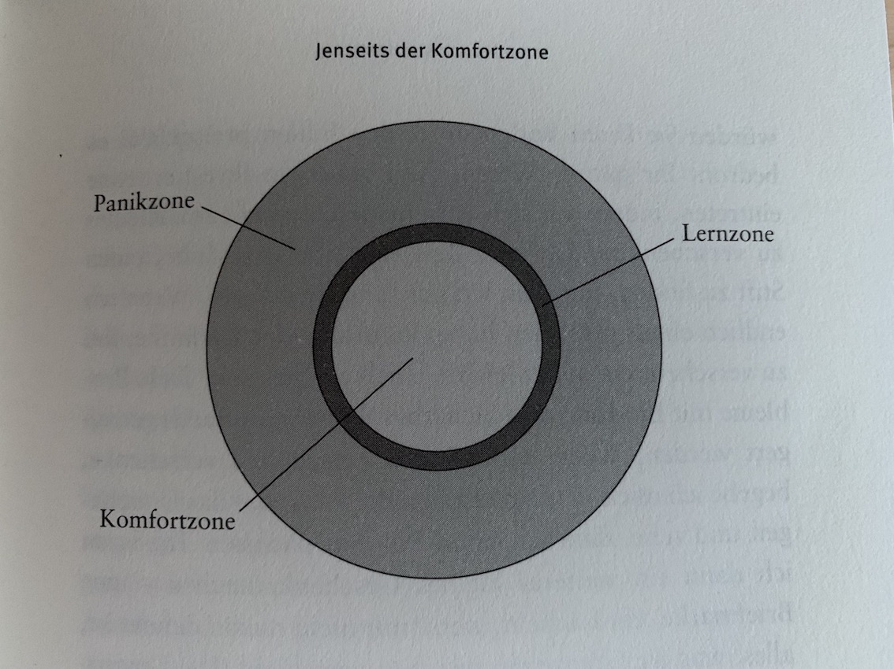

+++
title = "Dranbleiben trotz Hindernissen"
date = "2022-02-18"
draft = false
pinned = false
tags = ["Sinn", "Arbeit", "Selbstmanagement", "Ikigai", "Werte"]
image = "pexels-olya-kobruseva-5238645.jpg"
description = "Neues kann etwas magisches haben. Eine magische Anziehung und auch eine Energie die freigesetzt wird, machmal aber dann nicht so lange anhält. Es werden wohl die Meisten, die sich neuen, grösseren Vorhaben widmeten irgendwann mit (Selbst-)Zweifeln im Berührung gekommen sein. Je nach Ausgangslage (finanziell, körperlich, etc.), persönlichen Erfahrungen und Prägungen kann es schon einmal passieren, dass man sich dort verstrickt. Was dann helfen kann ist, wieder einen Kontakt zur Magie, die da am Anfang war herzustellen."
footnotes = "Titelbild: Foto von **[Olya Kobruseva](https://www.pexels.com/de-de/@olyakobruseva?utm_content=attributionCopyText&utm_medium=referral&utm_source=pexels)** von **[Pexels](https://www.pexels.com/de-de/foto/motivierende-einfache-inschrift-gegen-zweifel-5238645/?utm_content=attributionCopyText&utm_medium=referral&utm_source=pexels)**"
+++
Wenn wir neue Dinge starten wollen oder schon gestartet haben, dann kommt es immer wieder vor, dass wir Hindernissen begegnen. Das kann zum Beispiel sein, dass du dich beruflich umorientieren möchtest und dir Zertifikate, die Erfahrung oder das richtige Netzwerk fehlen. Es wäre aber auch denkbar, dass du dir eine Beziehung wünschst und mit schlechten Erfahrungen oder Selbstzweifeln kämpfst. Vielleicht bist du in die Selbstständigkeit oder ein anderes neues Projekt gestartet und hättest dir schnelleren oder grösseren «Erfolg» erhofft. Da gibt es noch etliche andere Situationen. 

> Wir überschätzen oft, was in kurzer Zeit möglich ist und unterschätzen, was wir in längeren Zeiträumen erreichen können. 

### Die Magie des Neuen

Neues kann etwas Magisches haben. Eine magische Anziehung und auch eine Energie, die freigesetzt wird, manchmal aber dann nicht so lange anhält. Es werden wohl die meisten, die sich neuen, grösseren Vorhaben widmeten, irgendwann mit (Selbst-)Zweifeln im Berührung gekommen sein. Je nach Ausgangslage (finanziell, körperlich etc.), persönlichen Erfahrungen und Prägungen kann es schon einmal passieren, dass man sich dort verstrickt. Was dann helfen kann ist, wieder einen Kontakt zur Magie, die da am Anfang war herzustellen.

### Dranbleiben, Loslassen, neues probieren

Beim Kontakt mit «dem Zauber des Anfangs» herstellen oder dem Innehalten zeigt sich vielleicht dann, ob es sich lohnt dranzubleiben oder ob es besser sein könnte, die Idee, das Vorhaben loszulassen. Denn diese Möglichkeit haben wir ja auch und können loslassen, was wir angefangen haben, wir können loslassen, was nicht (mehr) passt oder nicht (mehr) funktioniert

> Wenn Du entdeckst, dass Du ein totes Pferd reitest, steig ab!
>
> *Weisheit der Dakota Indianer*

Vielleicht merken oder wissen wir aber noch gar nicht, dass das Pferd tot ist oder es ist einfach nur erschöpft und braucht Ruhe.

Das heisst es geht auch darum, aufmerksam zu sein und zu spüren, in welchem Zustand «das Pferd» gerade ist. Vielleicht ist es sogar so, dass wir «das Pferd» gar nicht so müde machen müssen, bis es dann an Erschöpfung stirbt. Aber natürlich ist es genauso möglich, dass es einfach tot ist. So, wie es einfach zum Leben gehört.

Mir persönlich fällt es nicht gerade leicht zu sehen oder zu spüren, ob eines meiner Pferde nun tot ist, nur erschöpft oder ob es ein super Pferd ist, dass einfach nicht (mehr) zu mir passt. Da können Aussensichten helfen. Ich vermute, dass es sich lohnen kann, «das Pferd» einfach weiden zu lassen oder eine Auszeit im Stall zu gönnen. Bei mir schleicht sich in solchen Momenten dann schnell das Gefühl oder vorgelagert viel eher der Gedanke des Scheiterns ein. Wobei folgende Aussage helfen kann den Blickwinkel zu wechseln.

> «Ich glaube, dass es den Zustand des «nicht Klappens» gar nicht gibt.»
>
> *Marco Jakob*

Warum sollte zu merken, dass etwas nicht klappt, ein Scheitern sein? Das hat zumindest bei mir, sicher viel mit Prägung zu tun und dem damit verbundenen «was denken denn die andern». Aus der Sicht des Lernens könnte man das so sehen, dass etwas das nicht geklappt hat, ein Lernen, eine Lernerfahrung war und somit auch etwas, dass «geklappt» hat.

In diesem Prozess der eigenen Entwicklung, des sich Entfaltens und Entwickelns werden wir also voraussichtlich irgendwann mit Hindernissen, Hürden und Stoplersteinen zu kämpfen haben. Die Frage ist dann, ob wir den Kampf aufnehmen oder das als Spiel des Lebens betrachten können. Denn eigentlich ist es genau das.

### Jenseits der Komfortzone

In ihrem Buch schreibt Pema Chödrön von der Komfort, der Lern- und der Panikzone. Im Idealfall bewegen wir uns irgendwo in der Lernzone, denn dort wird Entwicklung in gesudem Mass möglich. In der Panikzone reiten wir dann vielleicht eher wieder «das tote Pferd». Vielleicht passt der [Eustress](https://de.wikipedia.org/wiki/Stressor) auch ganz gut in die Lernzone und der [Disstress](https://de.wikipedia.org/wiki/Disstress_(Medizin)) in die Panikzone. 

> Nur wer riskiert zu weit zu gehen, kann herausfinden, wie weit er gehen kann.\
> \
> *Thomas Stearns Eliot*

Und doch sollten wir vielleicht riskieren, zu weit zu gehen und unsere Grenzen zu spüren. Denn so oft ist viel mehr möglich, als wir uns vorstellen können.

Vielleicht habe wir auf unseren Wegen auch einfach zu oft die eine Lösung, das eine Ziel vor Augen, dass wir erreichen wollen. Ich komme noch einmal auf den spielerischen Teil und denke an Aussagen und Bücher von Simon Sinek, der vom unendlichen Spiel spricht.

> Bei endlichen Spielen geht es ums Gewinnen. Bei unendlichen Spielen geht es darum, dass das Spiel immer weitergeht.
>
> *Simon Sinek*

Dass das Leben und Veränderungen ein Prozess sind, darüber habe ich schon oft geschrieben und gesprochen. Sich das immer wieder vor Augen zu führen, kann helfen, nicht zu verzweifeln, innezuhalten und sich auf dem eigenen Weg immer wieder zu orientieren.