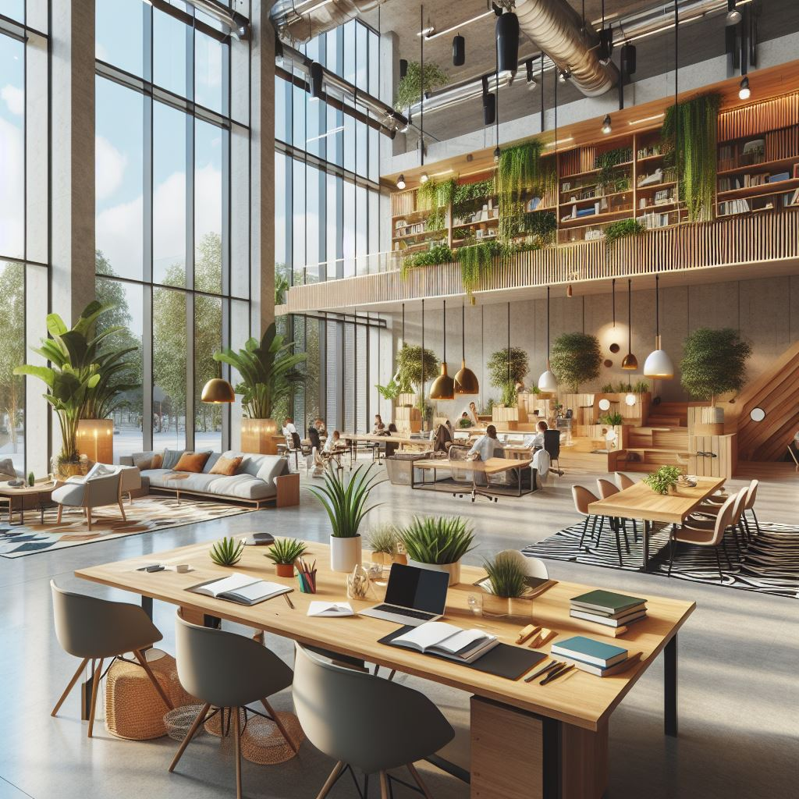

+++
title = "Gesunde Organisationen"
date = "2023-12-04"
draft = false
pinned = false
tags = ["Organisationsentwicklung", "Leadership"]
image = "_eb1e8c02-7bf5-49bc-afdf-b8b0f9f6e5d0.jpg"
description = "Gesunde Organisationen stellen die Menschen in den Mittelpunkt. Sie tun es in der Überzeugung, dass sie für ein erfolgreiches Unternehmen wesentlich sind. "
footnotes = "Bild erstellt mit Bing Image Creator"
+++
# Gesunde Organisationen - lebendige Arbeitswelten

## Menschen führen, Räume schaffen, Zukunft gestalten

Nicht erst seit gestern mache ich mir Gedanken über gesunde Organisationen. Es ist nicht so, dass ich eine Lösung dafür hätte und doch habe ich den Eindruck, einigen wichtigen Elementen immer mehr auf die Schliche zu kommen. Hier beleuchte ich ein paar (zumindest vorläufige) Erkenntnisse und Gedanken. Ich schreibe aus der eigenen Erfahrung und von Gelesenem, wobei sich diese Dinge immer mehr vermischen. Somit könnte ich keine konkreten Quellen nennen. Was ich nicht oder maximal am Rand beleuchten werde, sind finanzielle Vorteile einer gesunden Organisation. Diesen gilt mein Kerninteresse nicht, resp. ich bin davon überzeugt, dass wirtschaftlicher Erfolg im Wechselspiel mit meinen Gedanken ist. 

### Was verstehe ich unter einer gesunden Organisation?

### Der Mensch im Mittelpunkt

Gesunde Organisationen stellen die Menschen in den Mittelpunkt. Sie tun es in der Überzeugung, dass sie für ein erfolgreiches Unternehmen wesentlich sind. Menschen in den Mittelpunkt stellen heisst, sie in ihren Wünschen, Bedürfnissen, Kompetenzen und Potenzialen zu sehen und ernst zu nehmen. Gute Arbeit soll den Menschen dienen, nicht der Mensch der Arbeit. 

#### Räume

Aus Arbeitsräumen liesse sich so viel mehr machen, als sie heute sind. Diese Räume werden oft nicht nach den unterschiedlichen! Bedürfnissen der Menschen gestaltet. Ich habe den Eindruck, dass viele erstaunt wären, wie positiv sich schön und angenehm gestaltete Arbeits- und Pausenräume auf die Mitarbeitenden auswirken. Wenn diese dann auch noch die Bedürfnisse der «Leisen» berücksichtigen würden, wäre das ein Gewinn für alle. Oft reichen kleine Veränderungen und die Investitionen halten sich in Grenzen. Ich erinnere mich an eine Arbeitsstelle, bei der Pausenraum eigentlich ein Sitzungszimmer war. Mit einer Ideeneingabe und einem Minimalaufwand konnte ich einen nicht sinnvoll genutzten Raum zu einem Pausenraum mit grossem Tisch und Sofa umfunktionieren. 

*In die Richtung könnte ein schöner und offener Arbeitsort gehen. Erstellt mit Bing Image Creator.*

Passend dazu sind mir (zufälligerweise) folgende Thesen im Buch Future Skills, 30 Zukunftsentscheidende Kompetenzen und wie wir sie lernen können begegnet. 

> «Es fehlt an Sinnstiftung und Sinnerfahrung. Es fehlt an Schöpfertum und Leidenschaft. Es fehlt an Geist und Begeisterung. Es fehlt an dem, was Menschen in der Tiefe ihrer Seele oder ihres Herzens nährt. Es fehlt an Poesie und Schönheit in der Arbeitsumgebung. Es fehlt an Verbundenheit und Verbindlichkeit im Umgang miteinander.» 
>
> *Future Skills, Abschnitt New Work und Future Skills, 21 Thesen und 21 Impulse für die neue Büro- und Arbeitswelt, C. Quarch, J. Teunen (2021), S. 43*

> «Das Kostbare im Büro von heute ist der Mensch mit seinen vielfältigen Fähigkeiten und Potenzialen. Sie zu entfalten und erblühen zu lassen, ist die zentrale Aufgabe des Büros. Büros sollten Gewächshäuser menschlicher Potenzialentfaltung sein. 
>
> *Future Skills, Abschnitt New Work und Future Skills, 21 Thesen und 21 Impulse für die neue Büro- und Arbeitswelt, C. Quarch, J. Teunen (2021), S. 42*

#### Leadership

Führung braucht Kompetenz und nicht ein 3-Tages Leadership-Seminar oder einfach viel Berufserfahrung. Genauso wenig sind gute Mitarbeitende auch gute Führungskräfte. Diese Illusion kommt vielleicht davon, dass man so «die Guten» belohnen will. Nur vielleicht ist das (zumindest oft rückblickend) keine Belohnung und führt zu Unzufriedenheit bei allen Beteiligten. Leadership kann ein natürliches Talent sein und/oder sich durch einen bewusst gestalteten Lernprozess entwickeln. 

#### Gemeinsam unterwegs

Wie oft sah und sehe ich Menschen, die gegeneinander (oder zumindest nicht miteinander) arbeiten. Das manchmal sogar innerhalb der gleichen Abteilung. Man kämpft um Budgets, um die Anerkennung (von oben, aussen, ...) will die eigenen Ziele erreichen und vergisst das, was eigentlich wichtig ist – ein gutes Produkt, zufriedene Kund:innen etc. Einen gemeinsamen Weg zu finden ist nicht einfach, das ist klar. Das ist harte Arbeit, die sich lohnt und mit etwas Übung und Erfahrung sogar Spass macht. 

#### Entwicklung ermöglichen

Die meisten (oder alle?) denken immer noch in Rollen, in Jobprofilen oder in Funktionen. Das führt vermutlich u. a. dazu, dass wir neben einem Arbeitskräftemangel (durch viele Pensionierungen) auch einen Fachkräftemangel erleben. Wie viele Personen könnten sich wohl in andere (gefragtere und zukunftsorientiertere) Bereiche und Tätigkeiten weiterentwickeln, wenn man die Möglichkeiten dafür schaffen würde? 

#### Sehen die Zukunft und agieren in der Gegenwart

Es wird gerne über die Zukunft gesprochen. Wann soll denn die kommen? Sprechen wir von morgen, von in einem Jahr, in 10 Jahren? Gesunde Organisationen haben die Chancen, Möglichkeiten und Risiken der Zukunft im Blick und agieren in der Gegenwart. Stabilität, Kontinuität, Flexibilität und Agilität schliessen sich (vermutlich) nicht aus.