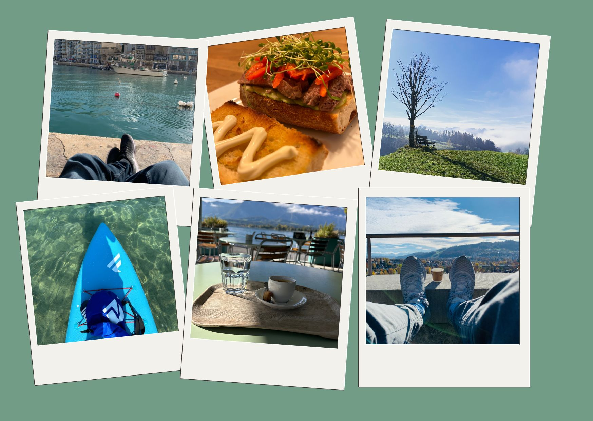

+++
title = "Gesundheitsförderung und Gesundheitserhaltung "
date = "2024-02-18"
draft = false
pinned = false
tags = ["Organisationsentwicklung", "Gesundheitsmanagement", "Personalentwicklung", "Gesundheit"]
image = "2c521ff4-daa8-475f-bb92-91bfb61dcd6c.jpg"
description = "Wenn es um unsere Gesundheit geht, können wir vieles positiv beeinflussen. Das gilt für uns als Individuen sowie für Unternehmen, welche gesundheitserhaltende und gesundheitsfördernde Arbeitsbedingungen schaffen können. Beim der Erhaltung und Förderung der Gesundheit geht es also um eine geteilte Verantwortung. "
footnotes = "**Buch**\n\n📕[Wofür stehen Sie morgens auf, Warum Sinn und Bedeutung entscheidend für unsere Gesundheit sind von Prof. Dr. Tobias Esch ](https://www.exlibris.ch/de/buecher-buch/deutschsprachige-buecher/tobias-esch/wofuer-stehen-sie-morgens-auf/id/9783833887611/)\n\n🔗**Achtsamkeit/Meditation**\n\n<https://www.bensblog.ch/tags/achtsamkeit/>\n\n🔗**Selbstmanagement**\n\n<https://www.bensblog.ch/tags/selbstmanagement/>\n\nBild: Sandra Zaugg"
+++
## Was können Menschen und Unternehmen für die Gesundheitserhaltung und Gesundheitsföderung tun?

Beginnen wir doch zuerst bei der Definition von Gesundheit. Auf der Webseite des Bundes steht:  

**\*Gesundheit** wird als wesentlicher Bestandteil des alltäglichen Lebens von Einzelpersonen, gesellschaftlichen Gruppen und der Gesamtbevölkerung verstanden. Die Weltgesundheitsorganisation WHO definiert Gesundheit als Zustand des vollständigen körperlichen, geistigen und sozialen Wohlbefindens.* 

**\*Gesundheitsförderung** zielt gemäss der Weltgesundheitsorganisation WHO darauf ab, allen Menschen ein höheres Mass an Selbstbestimmung über ihre Gesundheit zu ermöglichen und sie damit zur Stärkung ihrer Gesundheit zu befähigen. Gesundheit steht damit für ein positives Konzept, das in gleicher Weise die Bedeutung sozialer und individueller Ressourcen für die Gesundheit betont wie auch die körperlichen Fähigkeiten.* 

*Quelle: <https://www.edi.admin.ch/edi/de/home/themen/gesundheit-und-gesundheitsfoerderung.html>, aufgerufen am 17.02.2024*

Wenn wir von Gesundheit sprechen, dann geht es immer um die psychische und physische Gesundheit und die lassen sich kaum trennen. Natürlich werden diese auch heute  noch meistens voneinander getrennt betrachtet, auch wenn die Verbindung immer mehr in den Fokus rückt.

## Gesundheit und Gesundheitsförderung aus der Perspektive der Arbeitgebenden

Es ist wohl klar, dass Arbeitgeber:innen möglichst gesunde Mitarbeitende möchten. Wie gesund Mitarbeitende in Zukunft noch sein werden, lassen wir einmal offen. Denn schauen wir uns Zahlen aus Forschungen und Befragungen an, dann sind oder fühlen sich (sehr) viele Menschen psychisch belastet, ausgelaugt und auch an körperlichen Beschwerden mangelt es nicht.

Auf die Gesundheit der Arbeitnehmenden haben Unternehmen einen Teileinfluss. Sie können ihren Teil, also die gesundheitserhaltende- und gesundheitsförderliche Gestaltung der Arbeit aktiv gestalten. 

Dabei ist oder wäre zu beachten, dass nicht alle Menschen die gleichen Bedürfnisse haben.

Ich gehe hier nicht auf die konkreten Gestaltungsmöglichkeiten ein und zeige lediglich Bereiche, die einen Einfluss auf die Gesundheitserhaltung (da sprechen wir noch gar nicht von Förderung) haben. 

* Arbeitsumgebung (Räumlichkeiten, Temperatur, Licht, Pflanzen, Ruhe, …)
* Zusammenarbeit (Konflikte, Kommunikation, Vertrauen, Transparenz, …)
* Flexibilität (Arbeitsort, Arbeitszeit, …)
* Arbeitsmittel (Arbeitsflächen, Geräte/Maschinen, …)
* Förderung/Unterstützung der Mitarbeitenden (Coachingangebote, [Jobcrafting](https://www.bensblog.ch/tags/jobcrafting/), Beratungsangebote/Ansprechpersonen im Unternehmen auch zu privaten Themen, …)

## Gesundheit und Gesundheitsförderung aus der Perspektive der Arbeitnehmenden

Menschen möchten in der Regel nicht krank sein oder sich krank fühlen. Das gilt sowohl für die Arbeit wie auch für den ganzen Rest des Lebens. In der Zeit, in der wir uns bewegen, sind die (gefühlten) Ansprüche an Menschen jedoch enorm hoch. Wer allen Ansprüchen gerecht werden will, läuft m. E. Gefahr krank zu werden. Menschen können selbst viel für ihre Gesundheit tun (auch wenn wir vieles schlussendlich nicht in der Hand haben) und dieses Privileg sowie diese Verantwortung sollte man auch wahrnehmen.

Ein relativ einfaches Modell zur Erhaltung der Gesundheit ist das [BERN-Konzept von Prof. Dr. Tobias Esch](https://www.uniambulanz-witten.de/gesundheit-nachhaltig-staerken/)

**B**ehavior 

**E**xercise

**R**elaxation

**N**utrition

Wenn wir auf diese vier Bereiche achten und sie aktiv pflegen, dann können wir positiv Einfluss auf die Erhaltung und auch Förderung unserer physischen und psychischen Gesundheit nehmen. 

<iframe width="560" height="315" src="https://www.youtube.com/embed/vIebCGz9uf8?si=jnHulqSEjgiTzQY4" title="YouTube video player" frameborder="0" allow="accelerometer; autoplay; clipboard-write; encrypted-media; gyroscope; picture-in-picture; web-share" allowfullscreen></iframe>

### Ich ergänze zu den jeweiligen Überbegriffen noch eigene eigene Ideen und Gedanken. 

#### Behavior/Verhalten

Was stresst dich? Was tust du, von dem man weiss, dass es ungesund oder stressfördernd ist? Lass es sein oder reduziere es und integriere ein stressreduzierenden und gesundheitserhaltenden und -fördernden Lebensstil. Das braucht oft Zeit und ist nicht so einfach wie es klingt. Da können auch ganz individuelle Auslöser für Stress sein, die du noch gar nicht bewusst wahrgenommen hast. Es lohnt sich hinzusehen. 

#### Excercise

Wo ist Bewegung in deinem Leben? Ist es der Stress und der Druck, der dich treibt oder deine Lust und Freude? Integriere Bewegung in deinen Alltag. Das muss (zumindest zu Beginn), nicht allzu viel sein. Wichtig ist, dass du in Bewegung kommst. Am besten (so meine ich) gehst du gleich raus in die Natur. Denn die frische Luft wirkt gleich auch noch positiv auf dich. Du hast keine Zeit für Bewegung und erst recht nicht draussen? Dann ist das wohl ein Hinweis, etwas in deinem Leben zu verändern. 

#### Relaxation

Die Entspannung, sie ist doch mittlerweile in aller Munde. Du musst nicht gleich zum Meditationsguru werden. Zeit mit dir zu verbringen ist bereits ein guter Anfang. Du könntet ein Glücks- oder Dankbarkeitstagebuch führen oder du beginnst den Tag mit ein paar geschriebenen Worten. Natürlich kannst du auch mit Meditation beginnen, Qi-Gong üben und vieles mehr. Ah, und übrigens, da gehört auch Schlaf dazu. Achte auf einen gesunden Schlaf (Dauer, Umgebung, …).

#### Nutrition

Ernähre dich gesund. Da schreibe ich nicht mehr dazu, weil unter gesund ja vieles verstanden wird und ich bin echt kein Experte. Worin ich als Genusstrainer jedoch ein Experte bin, ist der bewusste Genuss. Neben den gesunden Lebensmitteln ist auch der bewusste Genuss ein wesentlicher Faktor einer gesunden Ernährung. Das ist etwas, was man aktiv lernen und praktizieren kann. Es lohnt sich, versprochen. 

### Geteilte Verantwortung

Bei der Gesundheitserhaltung und Gesundheitsförderung (von Arbeitnehmenden) geht es um eine geteilte Verantwortung. Es kann m. E. nur funktionieren, wenn beide Seiten ihren Teil aktiv, bewusst und ehrlich wahrnehmen. Ja, sich im Idealfall dabei sogar unterstützen. 

Was hier geschrieben ist, kannst du aus welcher Perspektive auch immer als Inspiration nehmen. Es ist niemals abschliessend und aus keiner medizinischen Fachexpertise geschrieben. Wenn dich ein Bereich interessiert, dann vertiefst du dich am besten selbst in ein Thema.