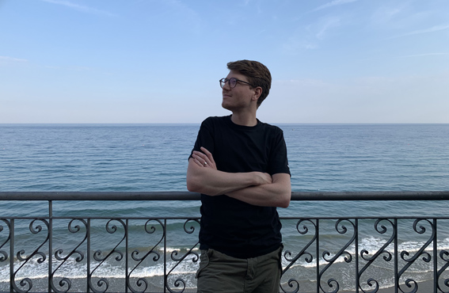

+++
title = "Hallo, ich bin Ben. "
date = "2021-10-12"
draft = false
pinned = false
image = "ben_meer.jpg"
description = "Hallo! schön bist du da. Das ist der Start meines Lernblogs und ich nehme dich mit auf meine Reise. \n"
+++
**Herzliche Willkommen! Schön schaust du hier vorbei.**\

Zuerst einmal: Hallo, ich bin Ben. Früher nannten mich alle Beni und das tun Menschen heute noch wenn sie mich kennenlernen, obwohl ich mich doch nie so vorstelle. Warum auch immer sie meinen mich so nennen zu wollen und zu dürfen. Mit dem Namen, und das ist nun wirklich ein intimer Einblick, verbinde ich vieles von dem, wie mich die Menschen früher sahen, bewerteten, be- und verurteilten. Ein Kind mit ADHS, einer der Lernen könnte wenn er wollte, zu faul und so weiter. Nun sitze ich hier und schreibe meinen ersten Lernblog-Eintrag. Das hat auch mit meiner Reise zu tun, auf der ich mich befinde. Vielleicht ist es das gesamte Leben, dass eine Art Reise ist und das hier «nur» eine Station. Oder ich beschreibe diesen Lebensabschnitt als Reise. Wie auch immer.. Ich nehme dich mit und wenn du Lust hast, kannst du mich hier dabei begleiten.

Was ich zu schreiben habe, weiss ich heute noch nicht. Vielleicht von meinem Einblick und meiner direkten Zusammenarbeit mit Marco oder meiner Rolle beim Colearning, meinen Erlebnissen im Coworking rund um den Effinger, Erfahrungen und Eindrücke aus meinen Begleitungen rund um die Berufsberatung oder aus meinen Podcast-Gesprächen. Sicher werde ich auch über andere Themen schreiben die mich beschäftigen.

Hier werde ich aus meiner Perspektive als Lernender schreiben. Vielleicht begleitest du mich auf dem gesamten Weg und vielleicht gehen wir einfach einen Teil der Strecke gemeinsam oder es bleibt eine flüchtige Begegnung. Wir werden sehen. So oder so freue ich mich.

Zitate und Geschichten werden sich in meinen Beiträgen sicher immer wieder finden. Dort finde ich Inspiration und sie helfen mir oft beim Perspektivenwechsel. Für heute finde ich dieses Zitat ganz passend.

> «Was würdest du mir sagen, wie ich von hier aus weitergehen soll?», fragte Alice. «Das hängt zum grössten Teil davon ab, wohin du möchtest», sagte die Grinsekatze. *Lewis Caroll, Alice im Wunderland*