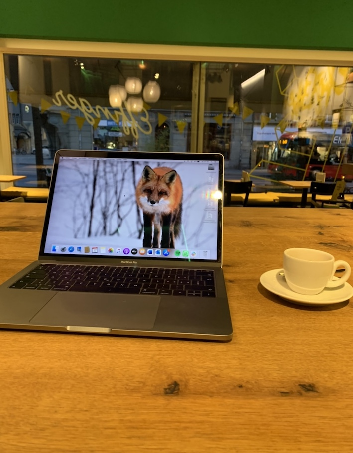
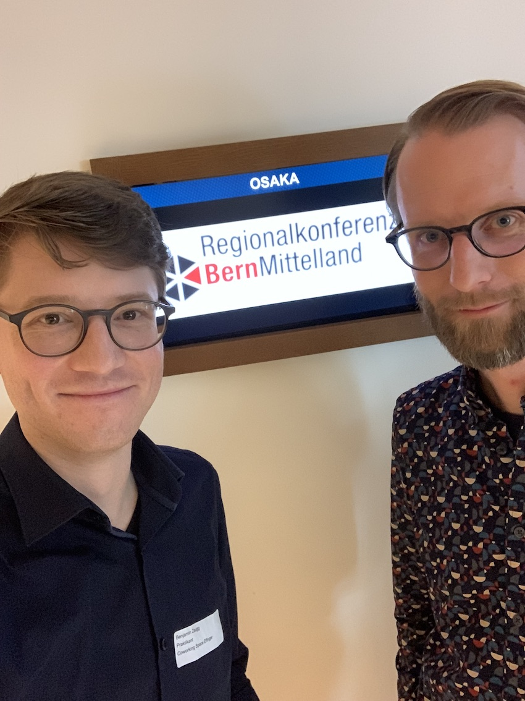
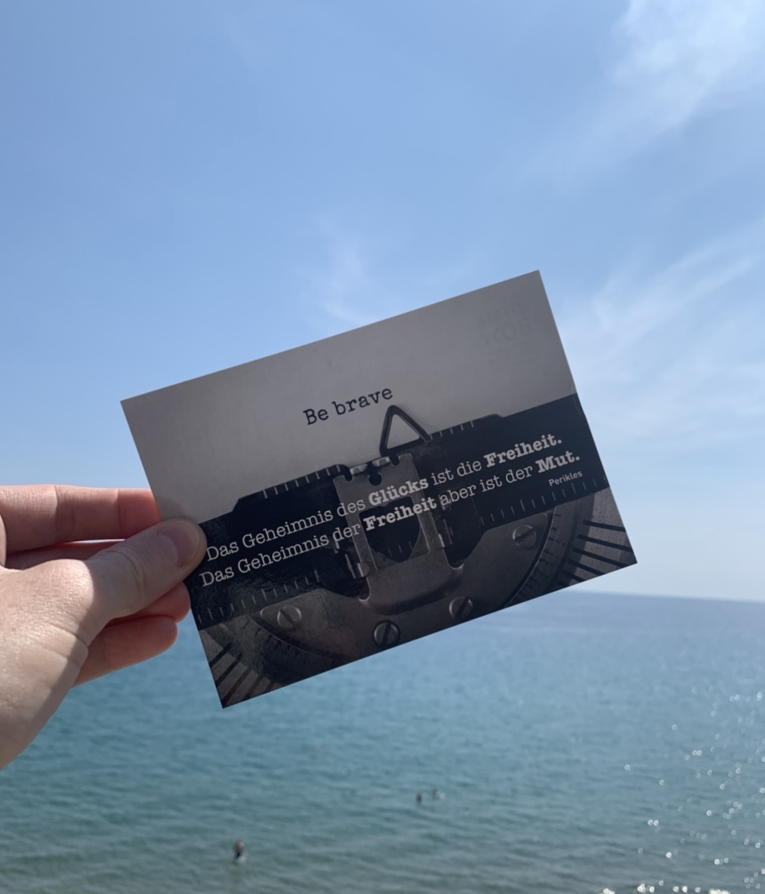
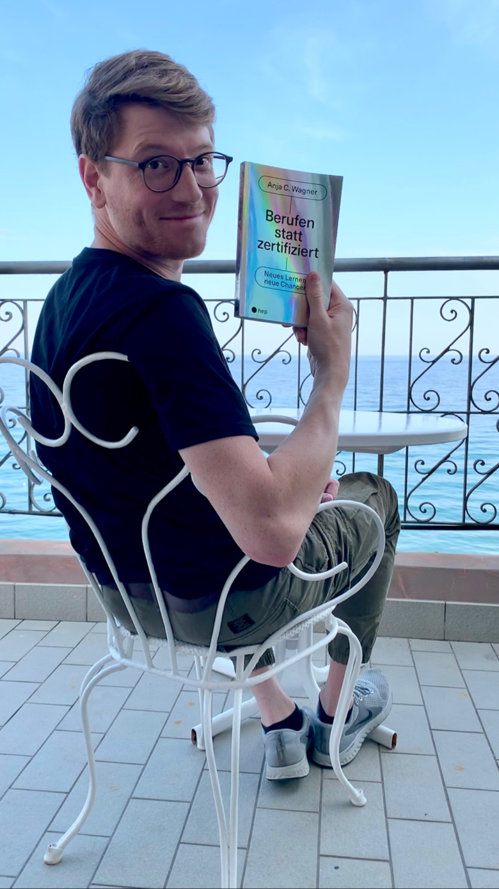

+++
title = "Ich blicke zurück auf die letzten Monate"
date = "2022-01-31"
draft = false
pinned = false
tags = ["Biografie", "Coworking", "Colearning", "Gedanken"]
image = "bildschirmfoto-2022-01-31-um-14.11.01.png"
description = "Es scheint mir Zeit zu sein, einmal auf die letzten Monate als Praktikant, als Unternehmer, als Coworker und als Colearner zurückzublicken. Meine oder diese Reise, von der ich hier erzähle, startete im Oktober 2021 und mein erster Blogbeitrag ging am 12. Oktober online."
footnotes = "Fotos 1 - 3: Ben Zaugg\n\nFoto 4: Sandra Zaugg"
+++
## Rückblick

> «Die Tür zur Erfahrung lässt sich nur von innen öffnen.»\
> *Carl R. Rogers*

Es scheint mir Zeit zu sein, einmal auf die letzten Monate als Praktikant, als Unternehmer, als Coworker und als Colearner zurückzublicken. Meine oder diese Reise, von der ich hier erzähle, startete im Oktober 2021 und [mein erster Blogbeitrag](https://www.bensblog.ch/hallo-ich-bin-ben/) ging am 12. Oktober online. Seither ist vieles passiert. Ich kam mir manchmal vor wie auf einer Autobahn. Es ging vorwärts, es ging schnell, es war spannend, es war abwechslungsreich und vieles zog an mir vorbei. Ich liess vieles vorbeiziehen. Anstatt mich, um bei der Autobahn zu bleiben, einmal an einem Rastplatz hinzusetzen, tankte ich schnell und fuhr gleich weiter. Dieses Praktikum ermöglichte mir einen Einblick und Begegnungen, die äusserst wertvoll waren und sind. Es gab wunderbare Landschaften, neblige Abschnitte, Stau und Blitzerfotos. Schauen wir aber einmal etwas genauer hin. Am besten gleich mit den Mentoring-Ablauf, den wir im [Colearning Bern](https://www.colearningbern.ch/) nutzen. 

### Dankbarkeit

#### Was habe ich erlebt?

Ich bin dankbar für alles, was ich erlebt habe. Es war für mich eine Achterbahn, die mich manchmal weiter weg von mir brachte und manchmal näher. Während dieser Zeit habe ich einen erweiterten und anderen Einblick in die Arbeitswelt erhalten. Ich sah hinter die Kulissen eines Coworking Spaces, hinter soziokratische Entscheide und ich sah die Menschen, die dahinterstecken. Vieles ist schön und auch schwierig. 

> Das Leben ist schön, von einfach war nie die Rede. 

Es gibt vieles, was ich sah, vieles, über das wir gesprochen haben und vieles findest du in den Blogbeiträgen der letzten Monate. Ich wurde (glaube ich) Teil von etwas. Es war und ist eine Reise im Innen und im Aussen. Es ist eine Reise, die ich nie alleine machen musste. 

#### Wofür bin ich dankbar?

Für das Vertrauen, dass mir [Marco](https://www.marcojakob.blog/) entgegengebracht hat und bringt. 

Für die wertvollen Mentorings mit [Fredi](https://www.fredizumbrunn.ch/)

Für die Möglichkeit, diese Reise zu machen.

Für die Freiheiten, die ich dabei erlebt habe.

Für den Rückhalt.

Für die Einblicke und Ausblicke.

Für die Gespräche.

Für die Geduld.

> «Wenn Dir jemand wirklich zuhört. Wenn Dir jemand wirklich zuhört, ohne dich zu verurteilen, ohne dass er den Versuch macht, die Verantwortung für Dich zu übernehmen oder Dich nach seinen Mustern zu formen – dann fühlt sich das verdammt gut an. Jedes Mal, wenn mir zugehört wird und ich verstanden werde, kann ich meine Welt mit neuen Augen sehen und weiterkommen. Es ist erstaunlich, wie scheinbar unlösbare Dinge doch zu bewältigen sind, wenn jemand zuhört.»\
> *Carl R. Rogers*

#### Für wen bist du dankbar?

Den Menschen, denen ich in dieser Zeit begegnet bin. 

Für die, die zugehört haben.

Für die Menschen, die mir begegnet sind.

### Inspiration

#### Wer mich inspiriert hat?

Ganz viele und ganz klar sicher Marco Jakob, der seinen Weg irgendwie mit Gelassenheit geht. Der irgendwie seinen Weg und sein Schritttempo gefunden zu haben scheint und der vertraut, in das, was kommt. Da sind auch noch ganz viele andere, die mich inspiriert haben. Es sind die Menschen, die auch ihren eigenen Weg gehen, die sich gegenseitig unterstützen, zuhören und gemeinsam Lösungen finden. Es sind die Colearner, die alle gemeinsam auf ihrem jeweiligen Weg sind, die zusammenarbeiten, lernen und Kaffee trinken. Mich inspirierten die «Sitzungen», die mir viel weniger verkrampft sind als die in Unternehmen und doch so viel mehr dabei herauskommt.

### Sichtbarkeit

#### Was von deinem Weg hast du seit dem letzten Mal für dich und für andere sichtbar gemacht (Text/Bild/Audio/Video)?

> «I'm not perfect… But I'm enough.»\
> *Carl R. Rogers*

Meine spontane Antwort wäre: zuviel 😉! Diesen Weg habe ich genutzt, um mein Lernblog auch als eine Art Tagebuch zu führen. Es sind Höhenflüge drin, die Abstürze, die Widersprüche und was weiss ich. 

### Weitergeben

#### Was konnte ich weitergeben, was werde und will ich weitergeben?

Das ist für mich gar nicht so einfach zu beantworten. Mit der Offenheit möchte ich sicher zeigen, dass wir sein dürfen. Einfach so wie wir sind. Ich möchte auch zeigen, dass es schwer sein kann, dass wir innere Kämpfe führen und das o.k. ist. Was ich weitergeben will und werde, kann ich noch gar nicht so genau sagen. Es ist aber sicher die Offenheit für Möglichkeiten, das Schaffen und Halten von Entwicklungsfreiräumen. Also eigentlich das, was ich schon lange tue. Nur jetzt mit noch mehr Hintergrund und Überzeugung. 

In diesem Rückblick habe ich die **Herausforderungen** ausgelassen, die im Mentoring-Prozess eigentlich vorkommen würden. Diese finden nun hier, gemeinsam mit dem Ausblick einen Platz. Eine der grössten Herausforderungen wird für mich in der nächsten Zeit sein, nicht zurück auf der Autobahn zu landen, sondern die Landstrassen zu nehmen. Mir Zeit zu lassen und meine Stärken zu nutzen, [ohne den Druck, den ich mir so oft mache.](https://www.bensblog.ch/irgendwie-ist-da-noch-mehr/) Passender wäre vielleicht nicht «weniger Druck machen», sondern gelassener damit umzugehen. Zu diesem Prozess, zu den Herausforderungen und dem Ausblick gehört auch meine «berufliche» Zukunft. Welche Form wird meine Selbstständigkeit haben, was wird bleiben und was wird sich verändern? Wie und was werde ich arbeiten? Wo zieht es mich hin? Welche Gelegenheiten ergeben sich? Ich habe einige Ideen und sehe Möglichkeiten. Wer weiss, vielleicht hast auch du beim Lesen Ideen und Gedanken dazu, auf die ich nicht komme, dann lass es mich wissen.

> «Ich bin fähig gewesen, mich für neue Ideen, neue Gefühle, neue Erfahrungen und neue Risiken zu öffnen. Ich entdeckte immer mehr, dass lebendig sein bedeutet, Wagnisse einzugehen, trotz fehlender Gewissheit zu handeln und sich auf das Leben einzulassen. All dies bringt Veränderungen mit sich, und für mich ist der Prozess der Veränderung mit dem Leben identisch. Mir ist klar, dass ich, wenn ich stabil und starr und statisch wäre, eine lebende Leiche wäre. Deshalb akzeptiere ich Verwirrung und Ungewissheit und Furcht und emotionale Höhen und Tiefen, weil sie der Preis sind, den ich für ein strömendes, rätselhaftes, erregendes Leben gern bezahle.»\
> *Carl R. Rogers*

Eigentlich wäre ein Buch passender als ein Blogbeitrag. Es reicht nicht einmal annähernd, hier alles aufzuschreiben, aber zumindest einen kleinen Einblick gibt es so.

Danke.