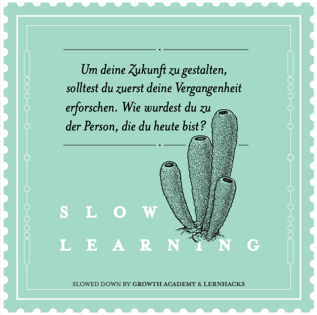
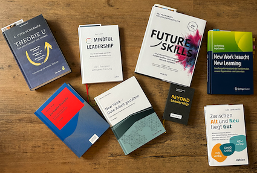

+++
title = "Ich lerne noch"
date = "2023-03-24"
draft = false
pinned = false
tags = ["Lernen", "SlowLearning", "Colearning", "Leadership", "Lernblog"]
image = "bildschirm-foto-2023-03-24-um-16.53.35.png"
description = "Ich bin noch da. Ich lerne noch. "
footnotes = "📚**Bücher:** \n\n📗[Beyond Leadership](https://www.exlibris.ch/de/buecher-buch/deutschsprachige-buecher/matthias-moelleney/beyond-leadership/id/9783286514355/)\n\n📗[Theorie U., Von der Zukunft her führen](https://www.exlibris.ch/de/buecher-buch/deutschsprachige-buecher/c-otto-scharmer/theorie-u-von-der-zukunft-her-fuehren/id/9783849703479/)\n\n📗[Mindful Leadership, Was ich bei Google und in der Küche eines Zen-Klosters lernte](https://www.exlibris.ch/de/buecher-buch/deutschsprachige-buecher/marc-lesser/mindful-leadership-die-7-prinzipien-achtsamer-fuehrung/id/9783867812740/)\n\n📗[New Work - Gute Arbeit gestalten, Psychologisches Empowerment von Mitarbeitern](https://www.exlibris.ch/de/buecher-buch/deutschsprachige-buecher/carsten-c-schermuly/new-work-gute-arbeit-gestalten/id/9783648150023/)\n\n📗[Die fünfte Disziplin, Kunst und Praxis der lernenden Organisation](https://www.exlibris.ch/de/buecher-buch/deutschsprachige-buecher/peter-m-senge/die-fuenfte-disziplin/id/9783791040301/)\n\n📗[Future Skills, 30 Zukunftsentscheidende Kompetenzen und wie wir sie lernen können](https://www.exlibris.ch/de/buecher-buch/deutschsprachige-buecher/69-co-creators/future-skills/id/9783800666355/)\n\n📗[Zwischen Alt und Neu liegt Gut, Wie wir mit Good Work eine zukunftsfähigke Arbeitskultur gestalten können, ohne alles neu machen zu müssen](https://www.exlibris.ch/de/buecher-buch/deutschsprachige-buecher/jule-jankowski/zwischen-alt-und-neu-liegt-gut/id/9783800669332/)\n\n📗[New Work braucht New Learning, Eine Perspektivenreise durch die Transformation unserer Organisations- und Lernwelten](https://www.exlibris.ch/de/buecher-buch/deutschsprachige-buecher/jan-foelsing/new-work-braucht-new-learning/id/9783658327576/)\n\n"
+++
### Ich lerne noch

Klar, ich lerne noch. Ich habe nie etwas anderes getan. Doch vielleicht musste ich lange so tun, als ob. Franzwörtli repetieren, Formeln auswendig lernen, ... . Du kennst es. 

Aber es ist wie so oft, ich schweife ab. Heute bereits bei der Einleitung. Eine derart lange Pause zwischen den Blogbeiträgen gab es bei mir wohl schon lange nicht mehr oder noch nie. Ich begann immer wieder Einträge zu schreiben und kam nie wirklich weit. Fertig. Schön. Sauber. So wollte ich meine Beiträge der Welt zeigen. Es wäre um meine Achtsamkeitspraxis gegangen, ich hätte über meine Gedanken und Fragen zur [Theorie U ](https://theory-u.de)von [Otto Scharmer ](https://ottoscharmer.com)geschrieben, es wäre um [psychologisches Empowerment ](https://www.hppyppl.de/blog/was-motiviert-menschen-psychologische-empowerment/)gegangen und über meine neue berufliche Rolle. Da wäre auch noch [Beyond Leadership](https://fh-hwz.ch/news/beyond-leadership-das-handbuch-von-matthias-moelleney-und-sybille-sachs) und [Mindful Leadership](https://www.arbor-verlag.de/bücher/aspekte-und-wege-der-achtsamkeit/mindful-leadership-die-7-prinzipien-achtsamer-fuehrung). Der Drang nach Perfektion hinderte mich (wieder einmal). Noch korrekter, ich liess mich von diesem Drang hindern.

Heute ist das anders. Ich habe richtig Lust, das Unfertige zu teilen. Vielleicht war ein [Linkedin-Post](https://www.linkedin.com/posts/bildungsdesign_slow-learning-activity-7044572443398524929-y-sq?utm_source=share&utm_medium=member_desktop) der Auslöser oder der letzte Anstoss. [Christoph Schmitt](https://www.linkedin.com/in/bildungsdesign/) schreibt auf Linkedin zur Initiative [Slow Learning](https://www.slow-learning.com/deutsch): *«Schöner Impuls: Für mich ganz wichtig, weil er einen wesentlichen Aspekt von Lernen beleuchtet: "Unterhalb" der Skills-Ebene, auf der wir relativ zügig Neues lernen, wo es ums Üben geht und ums Anwenden, um Methode, Technik und Output, unterhalb dieser Ebene wirkt der Aspekt von Lernen, der uns Menschen ausmacht: Der langsame und nachhaltige Teil des Lernens. Dort, wo es um den humanen Aspekt von Entwicklung geht. Um die Expedition: Buch lesen statt Abstract. Eintauchen statt Anstreichen. Wo es nicht mehr nur um Adaption geht und um Anwendung, sondern um Gestalten.»*

> «\[...]unterhalb dieser Ebene wirkt der Aspekt von Lernen, der uns Menschen ausmacht: Der langsame und nachhaltige Teil des Lernens. Dort, wo es um den humanen Aspekt von Entwicklung geht. Um die Expedition: Buch lesen statt Abstract. Eintauchen statt Anstreichen. Wo es nicht mehr nur um Adaption geht und um Anwendung, sondern um Gestalten.» Christoph Schmitt

#### Gestalten

Was da oben steht, berührt mich. Es ermutigt mich, dir einen Einblick zu geben. Ich zeige dir, was läuft und nicht das, was ich weiss oder zu wissen meine. Ich spüre in den letzten Monaten förmlich, wie die Verknüpfungen in meinem Gehirn entstehen. Ich fühle die Widerstände und Widersprüche zwischen der Theorie und der oft erlebten Realität. Ich suche und finde den Flow, stolpere, tauche ab und lerne. Die Bücher stehen für die Themen, mit denen ich mich in den letzten Monaten beschäftige. Das mache ich mit den Büchern, auf Plattformen wie Linkedin oder Youtube, ich spreche mit Menschen darüber oder erzähle davon. Einige Dinge praktiziere ich aktiv. Die Themen, mit denen ich mich beschäftige, berühren und bewegen mich. Vielleicht bewege ich auch die Themen, irgendwie.. Wer weiss. 

#### Slow Learning

> «Um die Zukunft zu gestalten, solltest du zuerst deine Vergangenheit erforschen. Wie wurdest du zu der Person, die du heute bist.» 
>
> *slow-learning.com*

Vieles aus meiner (viel früheren) Vergangenheit habe ich erforscht, erkundet und (vielleicht) verstanden. Ich weiss, dass die meisten meiner Interessen aus dem Schmerz entstanden sind. Deshalb war Lernen und alles, was damit zu tun hatte, die Hölle für mich. Heute ist Lernen für mich etwas vom Schönsten und natürlichsten. In den letzten Monaten verfing ich mich in einigen alten Denkmustern und deshalb blieben etliche Blogbeiträge unvollendet. Umso dankbarer bin ich für die Inspiration von Slow Learning. Ich bin noch da. Ich lerne noch. 

#### und jetzt?

Mir fehlt im Moment die Zeit und Energie, Menschen zu suchen und anzuschreiben, die sich für diese Themen ebenfalls interessieren. Menschen, die vielleicht selbst Expert:in in einem dieser Themen sind oder Menschen, die sich gerne über ihre Gedanken und Lernerlebnisse dazu austauschen möchten. Vielleicht bist aber genau du so ein Mensch. Dann melde dich doch und vielleicht treffen wir uns zu einem Spaziergang oder zu einem Kaffee. 

PS: Der Blogtitel erinnert mich an den Blogbeitrag [«Ich lerne noch» von Marco Jakob](https://www.marcojakob.blog/ich-lerne-noch/).