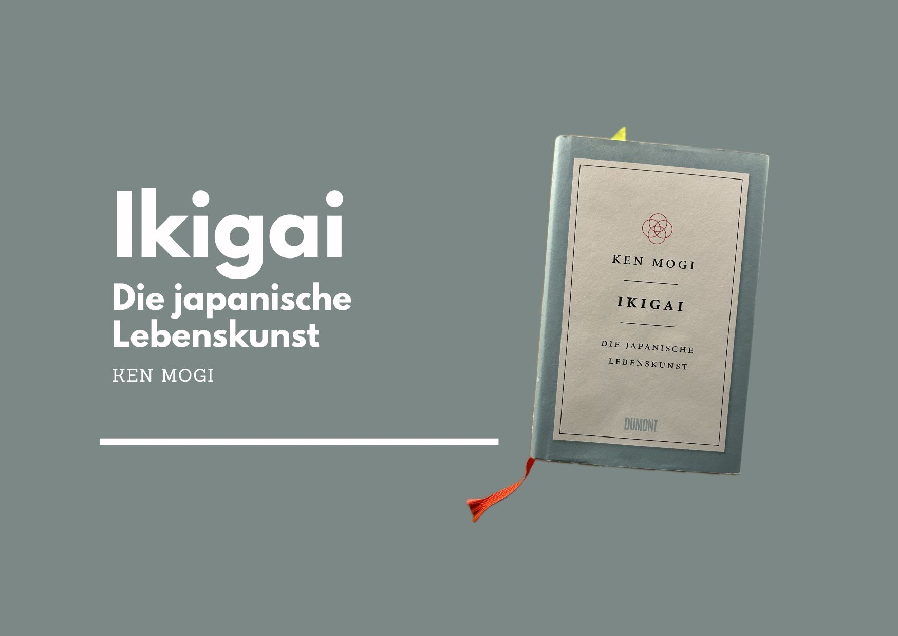

+++
title = "Ikigai - Das Buch von Ken Mogi"
date = "2023-07-12"
draft = false
pinned = false
tags = ["Persönlichkeitsentwicklung", "Sinn", "Ikigai", "Buch"]
image = "ikigai-buch.jpg"
description = "Ikigai, die japanische Lebenskunst. Einblicke in das Buch von Ken Mogi. "
footnotes = "Hinweis: Für erwähnte Bücher und Verlinkungen werde ich nicht bezahlt."
+++
# Ikigai - Die japanische Lebenskunst

## Ein Buch von Ken Mogi

Bevor ich das Buch Ikigai gelesen hatte, war mir das «Konzept» Ikigai, wie es bis heute immer wieder angepriesen wird, kaum bekannt. Wenn von Ikigai die Rede ist, dann meistens im Zusammenhang mit dem Venn-Diagram, welches nichts oder nur ganz wenig mit «der japanischen Lebenskunst» zu tun hat. Wer mehr dazu hören möchte, findet hier bei [Ken Mogi Gedanken](https://www.youtube.com/watch?v=a_2RIydy_NQ) dazu. 

Ikigai, die japanische Lebenskunst von Ken Mogi habe ich in (m)einer «Japanphase» gekauft und in kürzester Zeit gelesen. Der Hirnforscher Ken Mogi beschreibt Ikigai aus einer wissenschaftlichen Perspektive und wo es sich in der japanischen Kultur und Bevölkerung wiederfindet. Begeistert von dem Ansatz erzählte ich einer Bekannten, die in Osaka lebt und aufgewachsen ist, davon. Ihre einzige Frage war: «Und darüber gibt es bei euch ein Buch?!». In Japan kennt man Ikigai, aber es wird halt nicht darüber gesprochen oder analysiert. Es ist einfach ein Teil der Kultur und wie sich auch auf ihre Nachfrage bei anderen herausstellte, kein Thema, über das gesprochen wird. 

Ikigai wird als Schlüssel für ein langes, gesundes und erfülltes Leben zusammengefasst. In seinem Buch beschreibt Ken Mogi die fünf Säulen, die zu Ikigai führen und setzt diese immer wieder in Kontext zu konkreten Menschen und kulturellen Situationen. 

#### Die fünf Säulen sind: 

1. Klein anfangen
2. Loslassen lernen
3. Harmonie und Nachhaltigkeit leben
4. Die. Freude an den kleinen Dingen entdecken
5. Im Hier und Jetzt sein

Dabei ist wichtig, dass sie die Säulen nicht ausschliessen und keiner Reihenfolge bedingen. 

### Die Geschiche von Jiro Ono

Mir hat in diesem Buch besonders die Geschichte über den [japanischen Sushi-Koch Jiro Ono](https://www.youtube.com/watch?v=8R02NE050Jk) gefallen. Jiro Ono war bei der Erscheinung des Buches 2017 mit 94 Jahren der älteste lebende 3 Sterne Koch. Der Autor beschreibt, wie Jiro Ono die Zutaten sorgfältig zubereitet, worauf er achtet und wo oder was sein Ikigai sein könnte. Es ist eines von vielen Beispielen in die Welt von Japaner:innen. 

### **Ikigai – der Schlüssel zu einem reichen und erfüllten Leben?**

Ich würde meinen ja und nein. Das Buch Ikigai sowie die fünf genannten Säulen gefallen mir nach wie vor sehr. Es wäre jedoch zu einfach dieses Buch oder das «Konzept» als Lösung oder den einen Weg zu beschreiben. In den Texten von Ken Mogi finden sich Ansätze und Inspirationen, gute Dinge, Sinn und Gesundheit in das eigene Leben zu bringen. Schritt für Schritt und mit Offenheit für das, was im Leben kommt. 

➡️ [Hier gehts zum Buch bei exlibris.ch](https://www.exlibris.ch/de/buecher-buch/deutschsprachige-buecher/ken-mogi/ikigai/id/9783832165161/)

