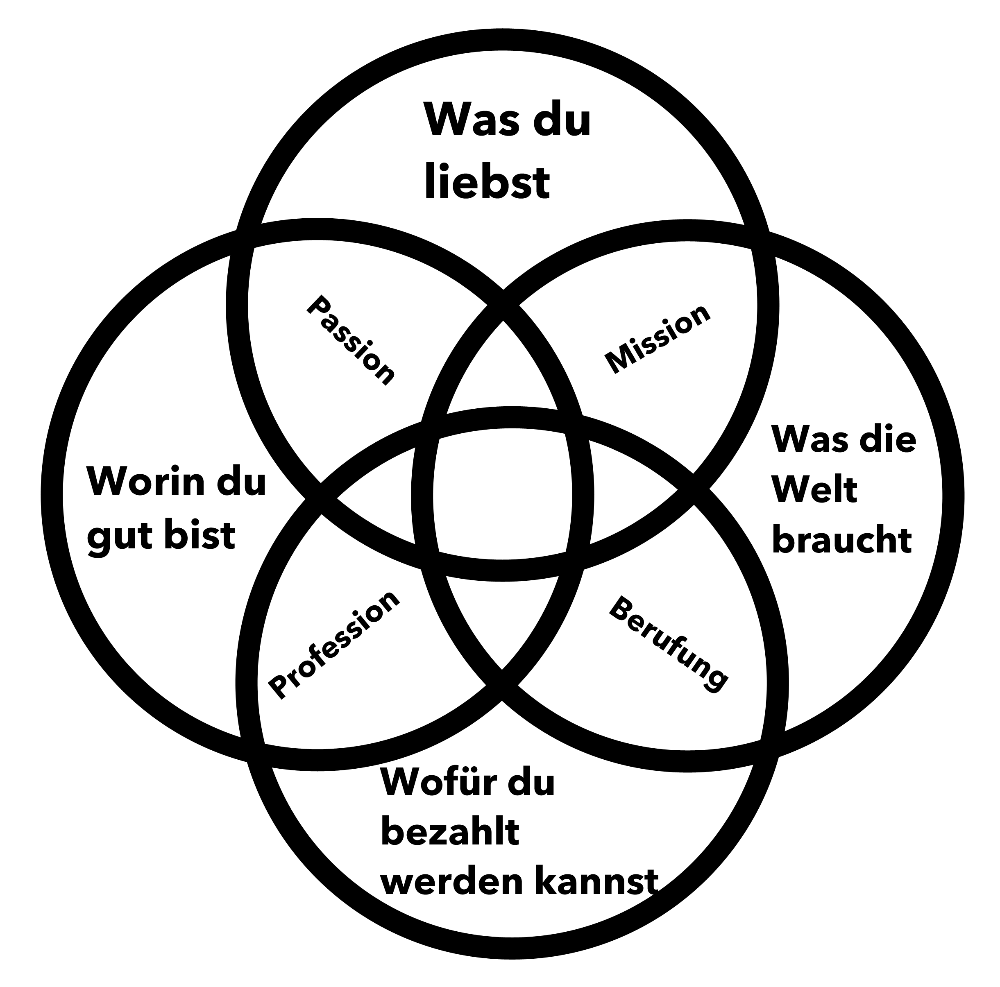

+++
title = "Ikigai (schon wieder)"
date = "2021-12-22"
draft = true
pinned = false
+++
Ja ich weiss. Ikigai erscheint bei mir immer wieder irgendwie irgendwo. Ja, ich bin kritisch gegenüber diesen verbreiteten Konzepte die schnell und einfach helfen sollen. Dankbarerweise wird meine skeptische Sicht im Buch von Ken Mogi ein bitzeli unterstrichen. Also: Den Hype und das Oberflächliche rund im Ikigai mag ich nicht. Die tiefe, die dahinter steckt berührt mich und ich habe den Eindruck, etwas von der Essenz zu verstehen. Wer weiss, ob das wirklich so ist. 

Ich denke nicht so oft über Ikigai nach, ärgere mich höchstens regelmässig über die «Mit Ikigai findest du deinen Sinn und die Lösung für all deine Probleme» Berichte, Posts, etc. 

In unserem «Jahresschlussgespräch» machte mich Marco plötzlich darauf aufmerksam, dass eigentlich fast alle meine Kreise klar sind, bis auf den mit dem Geld. Weil ich Bilder brauche, öffnete ich mein [Ikigai-Blog-Post](https://www.zukunftshelden.ch/post/ikigai-die-japanische-lebenskunst) und schaute mir die Grafik an. 

*so wird Ikigai oft dargestellt.* 

Nun, was soll ich sagen. Es hat mir (und das passiert selten) die Sprache verschlagen. Tatsächlich habe ich bei drei dieser Kreise eine Klarheit, wie ich sie bisher nicht hatte. Nicht einfach eine rationale Klarheit und auch keine, die nur aus dem Bauch kommt. Vielmehr eine Verbindung von Kopf und Bauch. Mein Hindernis? Immer dasselbe. Geld. Wobei auch hier vieles mit dem Blickwinkel zu tun hat. 

Man kann seinem [WHY](https://www.zukunftshelden.ch/post/deinwarum), seinem Ikigai, seinem Sinn nachrennen, ihn suchen, finden, aufschreiben und doch bleibt es unfertig. Mittlerweile denke ich, dass sich vieles «ergibt», wenn wir uns auf den Weg machen und offen sind. 

Noch wichtiger, davon bin ich mittlerweile überzeugt, ist, dass wir auf «die richtigen» Menschen treffen. Dazu finde ich dieses Zitat schön.

> «Der Mensch wird erst am Du zum Ich.» Martin Buber

Es geht nicht alleine. Es ging nie und wird nie gehen. Ich bin äusserst dankbar für diese Begegnung, für diesen gemeinsamen Weg. Ich habe mein Ikigai nicht gefunden. Ich habe mich gezeigt, gesprochen, zugehört, reflektiert, gemacht, bin begegnet so kam die Klarheit. Heute hat es eingeschlagen wie eine Bombe. Mein (fast) Ikigai. 

Im das noch mit den 5 Säulen aus dem Buch von Ken Mogi zu ergänzen:

1. Klein anfangen

Ich habe klein angefangen. Zum Beispiel [hier.](https://entwicklungsfreiraum.podigee.io/1-klein-anfangen) 

2. Loslassen lernen

Den Job endgültig gekündigt..