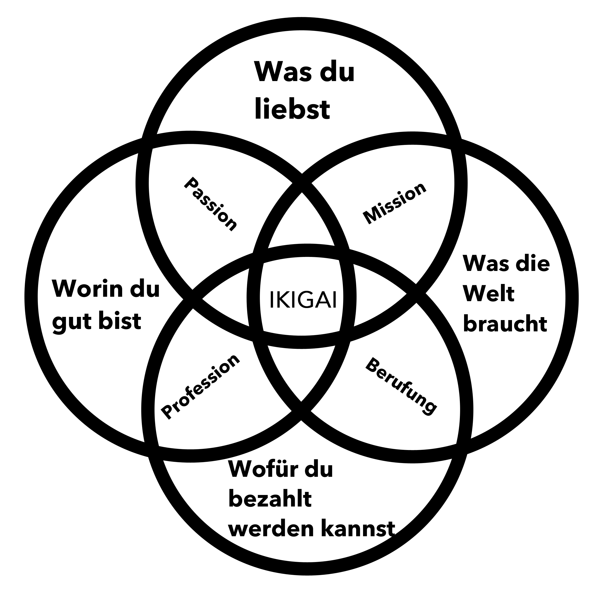
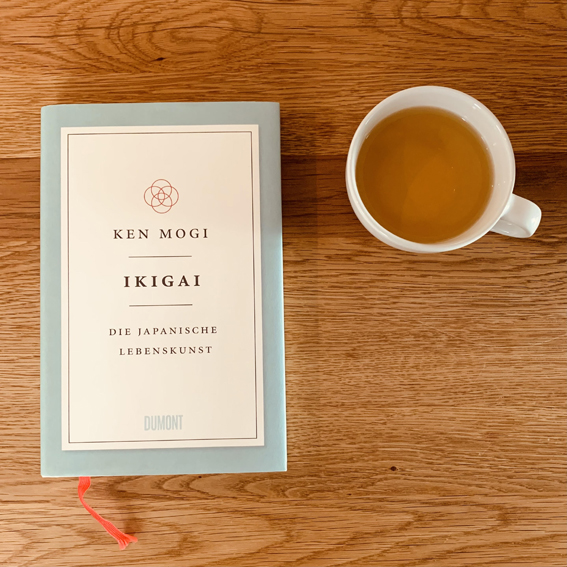
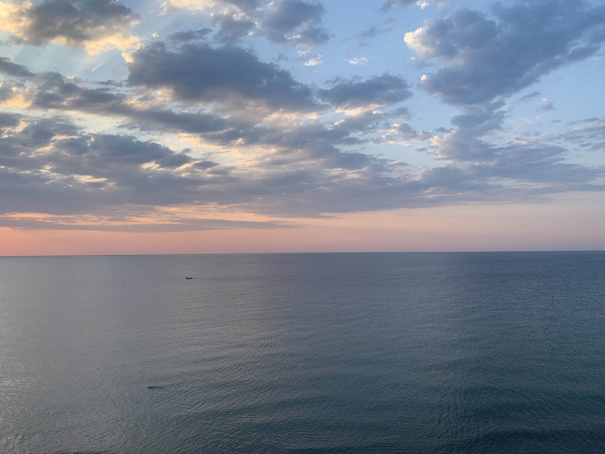

+++
title = "Ikigai (schon wieder)"
date = "2021-12-22"
draft = false
pinned = false
image = "meer.jpg"
description = "Ikigai (schon wieder). In unserem «Jahresschlussgespräch» machte mich Marco plötzlich darauf aufmerksam, dass eigentlich fast alle meine Kreise klar sind, bis auf den mit dem Geld. Weil ich Bilder brauche, öffnete ich mein Ikigai-Blog-Post und schaute mir die Grafik an."
+++
Ja ich weiss. Ikigai erscheint bei mir immer wieder irgendwie irgendwo. Ja, ich bin kritisch gegenüber diesen verbreiteten Konzepten, die schnell und einfach helfen sollen. Dankbarerweise wird meine skeptische Sicht im Buch von Ken Mogi ein bitzeli unterstrichen. Also: Den Hype und das Oberflächliche rund im Ikigai mag ich nicht. Die Tiefe, die dahinter steckt berührt mich und ich habe den Eindruck, etwas von der Essenz zu verstehen. Wer weiss, ob das wirklich so ist. 

Ich denke nicht so oft über Ikigai nach, ärgere mich höchstens regelmässig über die «Mit Ikigai findest du deinen Sinn und die Lösung für all deine Probleme» Berichte, Posts, etc. 

In unserem «Jahresschlussgespräch» machte mich [Marco](https://www.marcojakob.blog) plötzlich darauf aufmerksam, dass eigentlich fast alle meine Kreise klar sind, bis auf den mit dem Geld. Weil ich Bilder brauche, öffnete ich mein [Ikigai-Blog-Post](https://www.zukunftshelden.ch/post/ikigai-die-japanische-lebenskunst) und schaute mir die Grafik an. 

*so wird Ikigai oft dargestellt.* 

Nun, was soll ich sagen. Es hat mir (und das passiert selten) die Sprache verschlagen. Ich war mir nicht annähernd bewusst, wie weit ich gekommen bin. Es het mich berührt, etwas geschüttelt und das wird mich noch einige Tage begleiten. Tatsächlich habe ich bei drei dieser Kreise eine Klarheit, wie ich sie bisher nicht hatte. Nicht einfach eine rationale Klarheit und auch keine, die nur aus dem Bauch kommt. Vielmehr eine Verbindung von Kopf und Bauch. Mein Hindernis? Immer dasselbe. Geld. Wobei auch hier vieles mit dem Blickwinkel zu tun hat. 

> Das Gefühl kann viel feinfühliger sein als der Verstand scharfsinnig. Viktor E. Frankl

Man kann seinem [WHY](https://www.zukunftshelden.ch/post/deinwarum), seinem [Ikigai](https://www.zukunftshelden.ch/post/ikigai-die-japanische-lebenskunst), seinem Sinn nachrennen, ihn suchen, finden, aufschreiben und doch bleibt es unfertig. Mittlerweile denke ich, dass sich vieles «ergibt», wenn wir uns auf den Weg machen und offen sind. 

Noch wichtiger, davon bin ich mittlerweile überzeugt, ist, dass wir auf «die richtigen» Menschen treffen. Dazu finde ich dieses Zitat schön.

> «Der Mensch wird erst am Du zum Ich.» Martin Buber

Es geht nicht alleine. Es ging nie und wird nie gehen. Ich bin äusserst dankbar für diese Begegnung, für diesen gemeinsamen Weg. Ich habe mein Ikigai nicht gefunden. Ich habe mich gezeigt, gesprochen, zugehört, reflektiert, gemacht, bin begegnet uns so kam Klarheit. Heute hat es eingeschlagen wie eine Bombe. Mein (fast) Ikigai. 

**Ich möchte das noch mit den 5 Säulen aus dem Buch von Ken Mogi zu ergänzen:**

**1. Klein anfangen**

Ich habe klein angefangen. Zum Beispiel [hier.](https://entwicklungsfreiraum.podigee.io/1-klein-anfangen) Und so versuche ich weiter zu gehen. Hier einen Samen zu pflanzen, dort eine Idee weiterzugeben und einfach immer weiter zu gehen. 

**2. Loslassen lernen**

Definitiv keine feste Anstellung mehr, lernen mit der Unsicherheit umzugehen und immer wieder loslassen von Ängsten, Sorgen, (vermeintlicher) Sicherheit, ... . Loslassen vom alten «Ich», den [Prägungen](https://www.bensblog.ch/scheiss-pragungen/), den [Bildern und Geschichten](https://www.bensblog.ch/lesen/) von sich selbst. Von mir.

**3. Harmonie und Nachhaltigkeit leben**

Das beziehe ich ich meinem Fall auf Beziehungen und Tätigkeiten. Hier geht es nicht um harmonische Beziehungen sondern um solche die mir gut tun, stimmig sind und etwas in der Welt hinterlassen. Beim Individuum oder bei anderen. 

Ich gebe meine Energie dort ein, wo es für mich stimmig ist. Das heisst in meinem Fall für Dinge wie Bildung, neue und menschliche Formen von Arbeit sowie echtes und nachhaltiges Lernen.

Das alles vereint sich doch irgendwie auch in diesen Ikigai-Kreisen.. 

> «Der Mensch handelt nicht nur gemäß dem, was er ist, sondern er wird auch, wie er handelt.» Viktor E. Frankl

**4. Die Freude an den kleinen Dingen entdecken**

Wenn vieles unsicher ist und Ziele verfolgt werden, bleibt manchmal das auf der Strecke, was schon da ist. Da lohnt es sich, den Blick auf die kleinen Dinge zu richten, stolz darauf zu sein und Freude zu haben. Dazu kommt, dass diese kleinen Dinge oft grösser sind als wir meinen. Vor ein paar Tagen habe ich mich wieder intensiver der Dankbarkeit gewidmet und [hier](https://www.bensblog.ch/wenn-losungen-und-wege-vor-der-nase-liegen/) darüber geschrieben. Im Gespräch heute war auch Geld ein Thema, dass hier passt. Wenn ich mir die Frage stelle, habe ich heute genug Geld um zu essen, für ein Dach über dem Kopf, Kleidung und die mit «Ja» beantworten kann. Dann ist das schon etwas. Es ist etwas kleines an dem ich Freude haben kann und etwas, wofür ich dankbar sein darf. 

**5. Im Hier und Jetzt sein**

Für uns Menschen eine grosse Herausforderung, vor der ich auch immer wieder stehe. Ängste, Sorgen und Stress verfliegt oft ganz schnell, wenn ich ins Hier und Jetzt komme. Da gibt es so viele Dinge die Helfen. Ich mag zum Beispiel vieles aus dem [Genusstraining](https://bensgenusstraining.jimdofree.com/).

> «Wollen wir eine Brücke schlagen von Mensch zu Mensch – und dies gilt auch von einer Brücke des Erkennens und Verstehens – so müssen die Brückenköpfe eben nicht die Köpfe, sondern die Herzen sein.» Viktor E. Frankl

**Die Reise geht weiter..**

