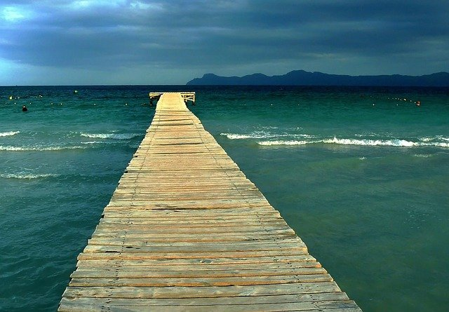
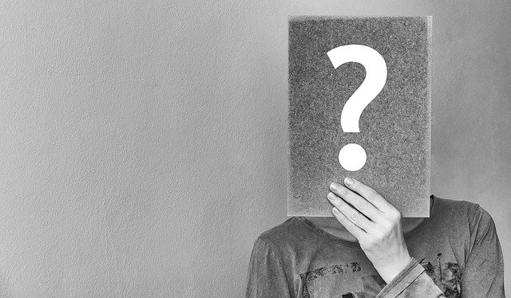
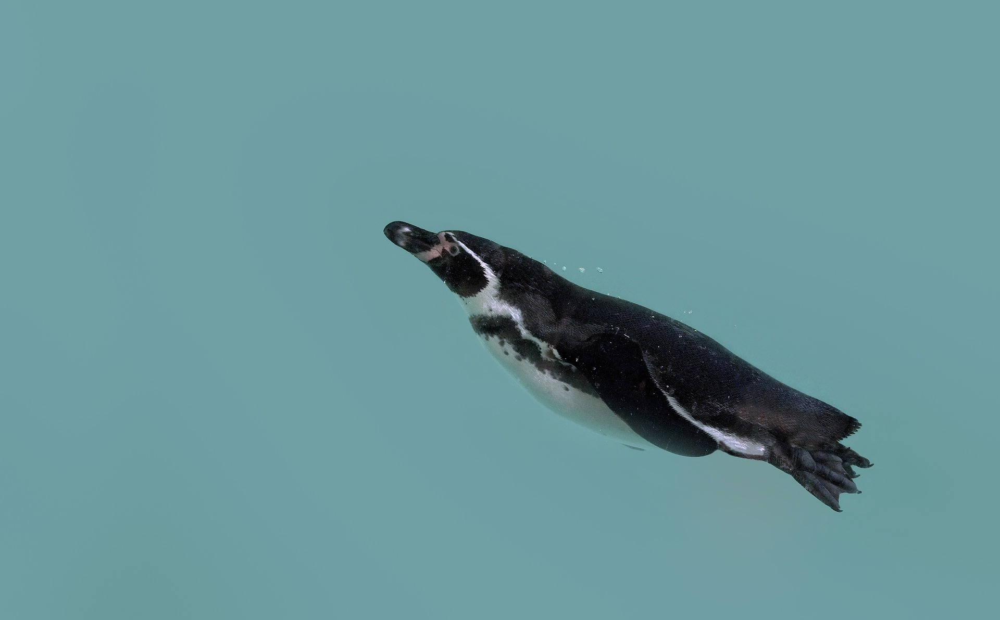
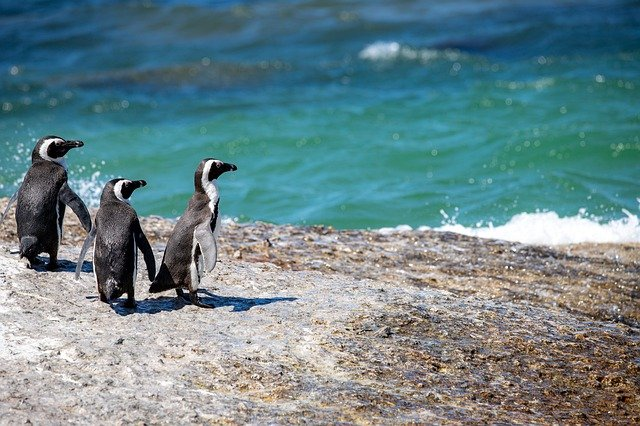

+++
title = "Im Element sein, ohne es zu merken"
date = "2022-02-12"
draft = true
pinned = false
tags = ["Biografie", "Arbeit", "Tagebuch"]
description = "Wie oft sind wir wohl in unserem Element, ohne es zu merken? Denn genau dann sind wir ja im Flow, vergessen die Zeit und «es» gelingt uns einfach. Über diese Phasen und Situationen denken wir im nachhinein nicht so stark nach und auch während dem wir drin sind, ist es einfach so wie es ist."
footnotes = "Bild Steg im Meer: [cocoparisienne](https://pixabay.com/de/users/cocoparisienne-127419/?utm_source=link-attribution&utm_medium=referral&utm_campaign=image&utm_content=249178) auf [Pixabay](https://pixabay.com/de/?utm_source=link-attribution&utm_medium=referral&utm_campaign=image&utm_content=249178)\\\nBild Fragezeichen: Bild von [Anemone123](https://pixabay.com/de/users/anemone123-2637160/?utm_source=link-attribution&utm_medium=referral&utm_campaign=image&utm_content=2736480) auf [Pixabay](https://pixabay.com/de/?utm_source=link-attribution&utm_medium=referral&utm_campaign=image&utm_content=2736480)\\\nBild Pinguin: Bild von [Thank you very much ❤ For every donation ☕](https://pixabay.com/de/users/astoko-1475917/?utm_source=link-attribution&utm_medium=referral&utm_campaign=image&utm_content=4571117) auf [Pixabay](https://pixabay.com/de/?utm_source=link-attribution&utm_medium=referral&utm_campaign=image&utm_content=4571117)\\\nBild Pinguine am Wasser: Bild von [Michael Bußmann](https://pixabay.com/de/users/michael_luenen-2998623/?utm_source=link-attribution&utm_medium=referral&utm_campaign=image&utm_content=4710224) auf [Pixabay](https://pixabay.com/de/?utm_source=link-attribution&utm_medium=referral&utm_campaign=image&utm_content=4710224)"
+++
> «Was ich körperlich erlitten habe, war das, was ich im Leben erreicht habe, wert. Ein Mensch, der nicht mutig genug ist, Risiken einzugehen, wird niemals etwas im Leben erreichen.»
>
> *Muhammad Ali (von dem ich in vielerlei Hinsicht beeindruck bin)*

Wie oft sind wir wohl in unserem Element, ohne es zu merken? Denn genau dann sind wir ja im Flow, vergessen die Zeit und «es» gelingt uns einfach. Über diese Phasen und Situationen denken wir im nachhinein nicht so stark nach und auch während dem wir drin sind, ist es einfach so wie es ist. Auf meiner persönlichen Reise nach Sinn in und um die Arbeit bin ich schon lange und wie in einigen Blogbeiträgen zu lesen ist, seit etwas mehr als einem Jahr, mehr denn je. Auf diesem Weg habe ich einmal irgendein Online-Tool genutzt, um mehr Klarheit zu erhalten. Ein Element auf diesem Weg ging in Richtung Motto-Ziel aus dem [ZRM](https://zrm.ch/) und dort habe ich dieses Bild ausgewählt: 

> «Nur wer riskiert, zu weit zu gehen, kann überhaupt herausfinden, wie weit er gehen kann.»
>
> *T. S. Elliot*

Was ich mir dazu aufgeschrieben habe, weiss ich nicht mehr so genau. Sicher weiss ich noch, dass ich mir das Gefühl vorstellen konnte, dort zu stehen. Ganz vorne, die Tiefe des Wassers unter mir, die leichten Wellen und wie mir schien, der Wind, der recht stark sein musste. Auch der etwas verhangene Himmel passte gut für mich. «Ein Meer voller Möglichkeiten» liegt da vor mir und nun ist es Zeit, diesen Platz hier zu «nutzen». Ich kann nicht sagen, ob es ums Springen ging oder einfach darum, dort zu stehen. Dieses Ende des Stegs symbolisierte für mich die Freiheit und die Unsicherheit. Vieles ist möglich, dachte ich. Nun kann ich auf diesem Stegt bleiben, ins Wasser springen oder abheben und mich in die Luft tragen lassen. Es wäre denkbar zu schwimmen, zu tauchen, zu surfen und auch, sich von einem Boot abholen zu lassen oder zurück zum Ende oder Anfang (je nachdem wie man das betrachten möchte) des Stegs zu gehen. Natürlich hatte ich die Idee, auf diesem Weg in mein Element zu kommen und auf jeden Fall musste ich einfach den Schritt nach vorne machen. 

Mir war damals klar, dass mein nächster Schritt ein Versuch ist und der Start vom Weg zu Sinn und Freude bei dem, was ich tue oder tun werde. Seither kämpfte ich immer wieder mit dem Finden des Richtigen. Wirklich anstrengend, dass kan ich dir sagen! Was da alles anstrengend war, liest du in den Beiträgen zwischen Oktober und Dezember 2021. 

Kommen wir also zurück zu heute, Vor ca. einem Monat entscheid ich mich, nicht Antworten zu suchen, sondern mit der Frage zu gehen. 

Das heisst, dass ich Gedanken zu möglichen Antworten notiere, ausspreche oder bespreche, aber diesen (noch) nicht konkret nachgehe. Vielleicht vertiefe ich mich beim einen oder anderen, probiere etwas konkrete(re)s aus und gehe wieder zur Frage. Das kann auch heissen, dass ich einfach ins Tun und Nichttun (das gelingt mir kaum) gehe. Ich konzentriere mich also auf die Arbeiten die anstehen und mache einfach. Dabei ertappe ich mich immer wieder in Momenten, in denen ich in den Flow komme, in denen ich zufrieden bin und die Energie spüre oder noch krasser: Tätigkeiten, die mir mehr Energie geben, als sie kosten. Diese fallen mir nicht so stark auf aber, ich merke wenn das Gegenteil passiert, also wenn die Energie schwindet, ein innerer Drang nach **der** Antwort auftaucht, meine Atmung flacher wird und mein Körper sich schleichend verspannt. 

[Wie ein Pinguin im Wasser](https://www.bensblog.ch/irgendwie-ist-da-noch-mehr/), so möchte ich mich fühlen oder sogar leben. Nun merke ich langsam aber sicher, wann ich mich so fühle und wann nicht. Ich bin ein Pinguin im Wasser! Ganz oft! und ich merke es nicht, weil es ja das Normalste auf der Welt ist für mich und somit auch nichts Spezielles. 

> «Du kannst die Wellen nicht stoppen, aber du kannst lernen sie zu surfen.»
>
> *Joseph Goldstein oder Jon Kabat-Zinn*

Ich stehe da und will nicht alleine weiterkämpfen. Ich stehe da und weiss, dass ich das nicht muss. Weder alleine, noch kämpfen. Ich kann (zumindest etwas) gegen den Strom schwimmen und trotzdem mit den Wellen gehen. Vieles ist mir noch nicht oder zuwenig klar, um mit der Antwort weiterzugehen (auch, weil ich mich noch gegen die Antwort wehre). Also gehe, schwimme oder fliege ich noch etwas mit meiner Frage. 

> «Krisen sind Angebote des Lebens, sich zu wandeln. Man braucht noch gar nicht zu wissen, was neu werden soll. Man muss nur bereit und zuversichtlich sein.»
>
> *Luise Rinser*