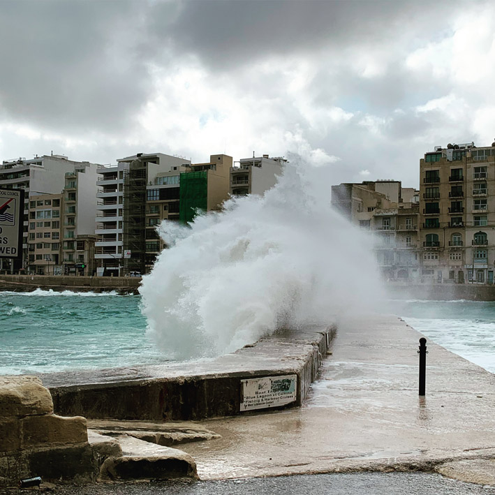
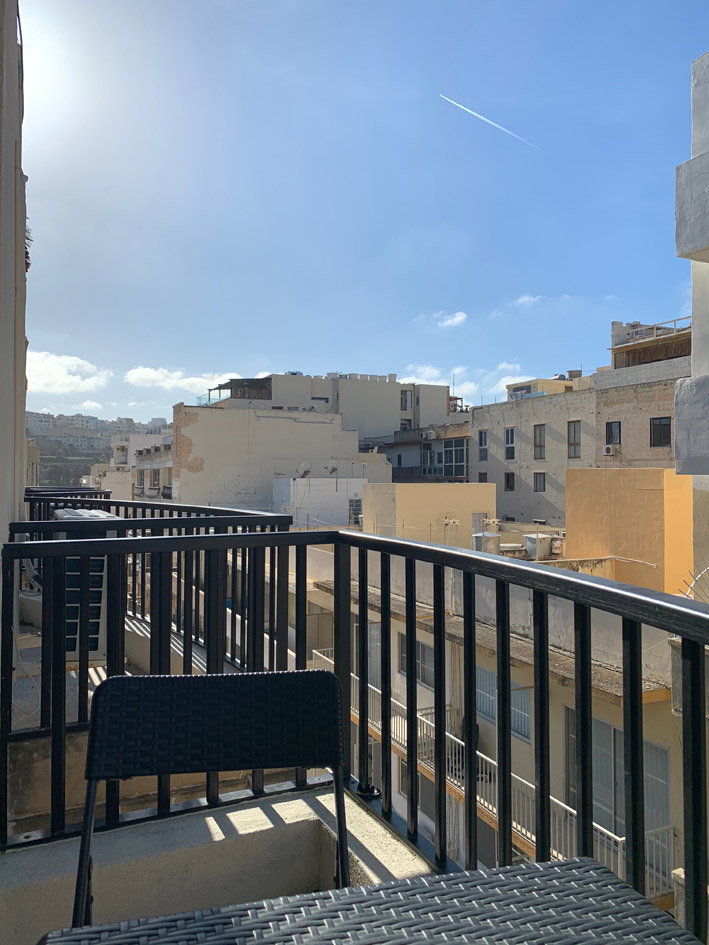
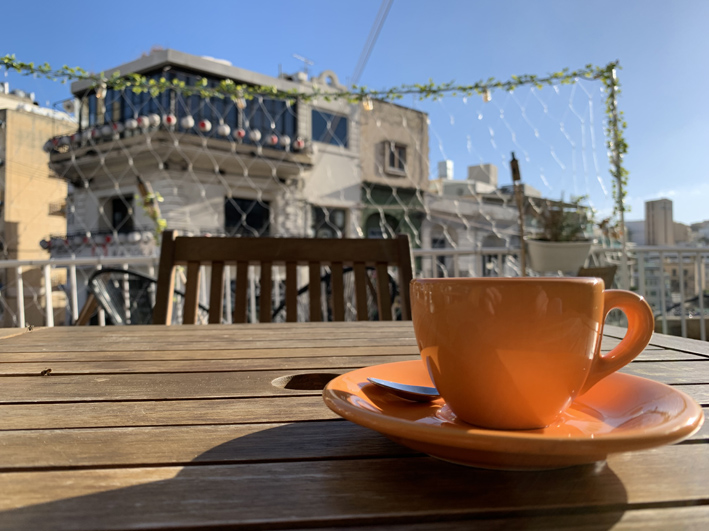
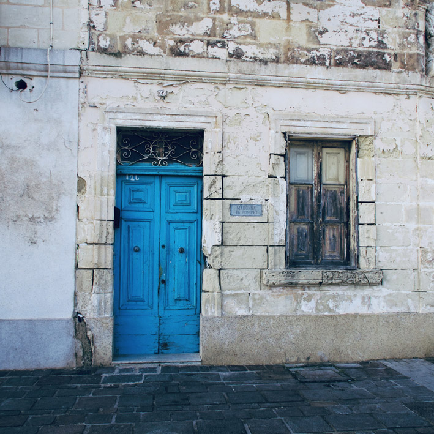

+++
title = "In Bewegung"
date = "2022-05-06"
draft = false
pinned = false
tags = ["Biografie", "Gedanken", "Recovery"]
image = "2.jpg"
description = "Ich möchte noch einmal zurückblicken weil ich merke, dass die Zeit dieses intensiven Rückblicks vorbei ist. Es fühlt sich nicht mehr gut an."
footnotes = "Texte aus [denk-weise.ch](https://denk-weise.jimdofree.com/)\n\nFotos Ben Zaugg"
+++
### Das Leben ist Bewegung

Das Leben und die Bewegungen, die Prozesse, die wir durchlaufen, vergleiche ich gerne mit dem Meer. Manchmal ist es voller Wellen und ein anderes Mal ganz still. Vieles ist unter der Oberfläche und für uns nur sichtbar (wenn überhaupt), wenn wir abtauchen. Das sind nur einige kleine Vergleiche, die wir mit dem Meer machen können.

Was brauchen Menschen in solchen Prozessen? Wie und wo finden sie Hilfe? Wie können sie sich selbst stärken, was hilft auszuhalten und wie geht man mit leeren, langweiligen Phasen um? Das sind nur einige Fragen, die ich mir immer wieder stelle und denen ich nachgehe. Für diese Themen gibt es nicht DIE Antwort. Nach einem Kontakt einer Autorin vor vielleicht etwas mehr als 3 Jahren kam die Idee, meine Geschichte in einem Buch zu veröffentlichen. Weil ich aber bei diesem Kontakt (die ersten Gespräche waren schon aufgenommen), kein gutes Bauchgefühl hatte und den Eindruck nicht loswurde, dass es eher um ein «Anschuldigen» von anderen als ein Inspirieren ging, zog ich mich aus dem Projekt zurück. Danach suchte ich mehr oder weniger aktiv selbst nach möglichen Autor*innen, welche das gemeinsam mit mir machen möchten. Es sollte meine Geschichte sein, mit dem klaren Ziel, andere zu inspirieren. Ich habe niemanden gefunden und legte dieses Projekt wieder auf Eis. Was ich aber machte, ich fing an, meine Biografie oder Elemente aus meiner Biografie in den (a)sozialen Medien zu teilen, habe ein oder zwei Podcast-Folgen aufgenommen und begann einen Teil von meinem Weg in diesem Blog zu teilen. Einige Beiträge lösten viele Rückmeldungen aus und andere Betroffenheit. Obwohl nie schlechte Reaktionen kamen, überlegte ich mir doch immer wieder, was diese Einblicke in mein Leben für meine (berufliche) Zukunft bedeuten könnten und ich weiss es bis heute nicht.

Ich möchte noch einmal zurückblicken, weil ich merke, dass die Zeit dieses intensiven Rückblicks vorbei ist. Es fühlt sich nicht mehr gut an. Aber lass mich das doch erklären. Im letzten Jahr oder vielleicht in den letzten 1 1/2 Jahren habe ich viel von mir und meiner Biografie geschrieben. Es war, ohne das ich mir dessen bewusst war, ein Verarbeitungsprozess (von dem ich eigentlich dachte, dass er schon mehr oder weniger durch ist). Es war auch Reflexion und das Gegenüberstellen von heute und gestern. 

> #### Zwüschä zwöi Läbä
>
> Zwüschä zwöi Läbä,
>
> da bini gsi,
>
> da bini immer no.
>
> Gseh ds Autä, füehlä mi im Nöiiä.
>
> So wini immer ha wöuä,
>
> und mirs doch glych niä ha chönnä vorsteuä.
>
> Im Nöiiä het o ds Schwirigä ä Schönheit,
>
> die wo si vorhär o scho het gha,
>
> aber itz chani sä gseh.
>
> Im Schwirigä si Chancä wo uf üs wartä.
>
> Si wartä druf, weli Hautig mir inähmä, weli Entscheidigä mir träffä. 
>
> Ig bi gforderet. Hiä und Itzä.

Es war eine Art Therapie und ein Verarbeitungsprozess, den ich unbewusst in Gang gegeben habe. Denn eigentlich ging es darum, mich einfach einmal mit all meinen Schwächen und Stärken zu zeigen, meine Geschichte mit anderen zu Teilen und Mut zu machen. Wie schön wäre es, wenn nur ein Mensch in meinen Worten Hilfe, Inspiration oder Ermutigung finden kann. Denn ich weiss wie einsam, alleine und verzweifelt man sich in dunklen Zeiten fühlen kann. Zeitgleich verliess ich meine Komfortzone immer mehr, um mich meinen Herzensthemen, der Arbeit mit Menschen, zu widmen. Ich gründete Zukunftshelden, startete den gleichnamigen Podcast und legte mit grosser Energie los.Meinen Vollzeitjob hatte ich gekündigt, fand eine 50 % Anstellung bei der ich mich überhaupt nicht gut fühlte und verliess diese bald wieder. Anschliessend war ich als Tellerwäscher, Hilfsgärtner, Hilfshauswart und Archivaufräumer unterwegs. Das heisst ich arbeitete am Abend, bei 30 Grad an der Sonne, in Kellern, schleppte Kisten und war meistens alleine unterwegs. Verdient habe ich für (für mich) viel anstrengendere Arbeit deutlich weniger als vorher, oft fühlte ich mich wieder als «Stift». Das alles, um das zu tun, was ich wirklich wirklich will. Mit der Zeit wurde die Energie und Freude abgelöst. Abgelöst von Zweifeln, Sorgen, Zukunftsängsten, Versagensängsten, Gedankenstrudel und Erschöpfung. Das wiederum führte zu Krisenmomenten und zu (vermeintlichen) Erleuchtungen und Erkenntnissen, wo es den mit mir hingehen soll. Dabei hat mir das radikale Teilen meiner Gedanken und Gefühle geholfen. Beim Aufschreiben oder Tippen kam auch ein Reflexionsprozess in Gang, an dem alle die wollten, teilhaben konnten. Das scheint im Rückblick viel geholfen zu haben.

> #### Autag
>
> Und wieder
>
> ä Momänt
>
> dä Momänt
>
> wo ds Läbä wandlet
>
> Nöiis wird normau
>
> Autag
>
> was früecher undänkbar wär gsi
>
> isch da
>
> Ersch no grad vou Glitzer
>
> lüchtend und gross
>
> wirds normau
>
> Autag
>
> schad
>
> dänki so für mi
>
> u bi chly truurig
>
> derbi isches doch so schön

Es ist noch nicht so, dass das Neue Normal wäre oder das ein Alltag eingekehrt wäre. Es sind immer noch alte biografische Anteile, die (das vermute ich zumindest) mit manchmal lauter Stimme schreien: «Gib auf!» Es scheint mir mehr so, dass ich mich langsam an diese Wellenbewegungen gewöhne und so irgendwie auch Vertrauen gewinne. 

Als ich das aufgeschrieben habe, dachte ich, dass ich gleich in diesem «neuen» Leben landen würde. Das ist nun schon einige Jahre her. Jetzt wird mir langsam bewusst, dass ich zwas in diesem «Neuen» angekommen bin, es aber immer noch neu und in vielem auch unbekannt ist. 

> #### Zwüschä zwöi Läbä
>
> **Zwüschä zwöi Läbä,**
>
> **da bini gsi,**
>
> **da bini immer no.**
>
> Gseh ds Autä, füehlä mi im Nöiiä.
>
> So wini immer ha wöuä,
>
> und mirs doch glych niä ha chönnä vorsteuä.
>
> Im Nöiiä het o ds Schwirigä ä Schönheit,
>
> die wo si vorhär o scho het gha,
>
> aber itz chani sä gseh.
>
> Im Schwirigä si Chancä wo uf üs wartä.
>
> Si wartä druf, weli Hautig mir inähmä, weli Entscheidigä mir träffä. I bi gforderet. Hiä und Itzä.

Zwischen zwei Leben. Da war ich. Da bin ich immer noch. Das mag vielleicht eigenartig klingen, denn es ist ja mein Leben und doch scheint diese alte Idendität zu schwinden oder einfach ein Teil des neuen und ermutigten Ichs zu werden oder wie schon oben geschrieben: es gelingt mir vielleicht einfach besser, die Wellenbewegungen des Lebens zu akzeptieren. 

Vieles davon war vor allem auch deshalb möglich, weil Menschen an meiner Seite waren und sind.