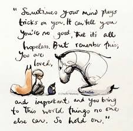

+++
title = "3..2..1"
date = "2021-12-29"
draft = true
pinned = false
tags = ["Gedanken", "Tagebuch", "Biografie"]
image = "images.jpg"
description = "Fast ist das Jahr durch. Jedes in dieser letzten Woche setze ich mich hin und lasse das Jahr noch einmal vorbeiziehen. Ich notiere mir die Momente, Begegnungen und Ereignisse die mir geblieben sind, die mich berührt haben oder die einen grösseren Stellenwert in meinem Leben haben (könnten)."
footnotes = "Bild: aus dem Buch von Charlie Mackesy"
+++
Fast ist das Jahr durch. Jedes in dieser letzten Woche setze ich mich hin und lasse das Jahr noch einmal vorbeiziehen. Ich notiere mir die Momente, Begegnungen und Ereignisse die mir geblieben sind, die mich berührt haben oder die einen grösseren Stellenwert in meinem Leben haben (könnten). Da sind oft ganz schöne Momente dabei und auch traurige. Das habe ich immer gemacht und dieses Jahr gehts einfach nicht.

Da ist so vieles und doch nichts. Vielleicht ist es zu viel. Heute Morgen nun, ich habe Kopfschmerzen, ordne Bücher, schwanke zwischen meiner mittlerweile bekannten Unsicherheit und Optimismus, ein Gefühl (oder ein Gedanke der zu einem Gefühl wird? da ist wohl wieder die Frage welcher Theorie man trauen möchte 😉) taucht auf. Es ist Klarheit, Klarheit über das, was dieses Jahr zusamenfassen würde. 

Lernen. Ich habe gelernt. Natürlich klingt das in einenm Lernblog etwas kalkuliert, ist es aber tatsächlich nicht. Natürlich lernen wir immer. Vielleicht liesse es sich noch eher konkretisieren mit (An-)Erkennen, mit Verinnerlichen, mit Fühlen. 

Verrückterweise (wobei wir wissen ja, es ist ganz normal) habe ich nicht in der Schulstube gelernt, sondern in Begegnungen, im Ausprobieren, beim Gehen von neuen Wegen und verlassen von solchen, die sich nicht gut anfühlen. 

Neue Wege bieten eine neue Umgebung, es gibt vieles zu entdecken, Begeisterung, Euphorie, Neugier begleiten mich dabei genau so wie die Angst und Unsicherheit vor dem Unbekannten, Unklaren und Möglichen. 

Dieses Buch [«Der Junge, der Maulwurf, der Fuchs und das Pferd»](https://www.exlibris.ch/de/buecher-buch/deutschsprachige-buecher/charlie-mackesy/der-junge-der-maulwurf-der-fuchs-und-das-pferd/id/9783471360217?gclid=Cj0KCQiAq7COBhC2ARIsANsPATG3P1vSRP259D7Upk21Llrke-nauktte9ISfnv74V8ygOITQThi4DYaAlIfEALw_wcB&gclsrc=aw.ds) von Charlie Mackesy habe ich vor ca. einem Jahr gekauft und es ist wunderbar. Dieses Bild passt hier ganz gut. 

Für die Begegnugen, Lern- und Entwicklunsfreiräume, fürs (An-)Erkannt werden und die Möglichkeiten in diesem Jahr und  vor allem in den letzten 3.. 4.. Monaten bin ich äusserst dankbar. 

Übrigens, während ich das schreibe läuft Elton John im Hintergrund. Seine Musik höre ich erst sein ein paar Monaten und ich wusste, er ist erfolgreich und ein Paradiesvogel. Wie hart, traurig und schwierig sein Weg war weiss ich erst seit dem Film [Rocketman](https://www.youtube.com/watch?v=S3vO8E2e6G0).