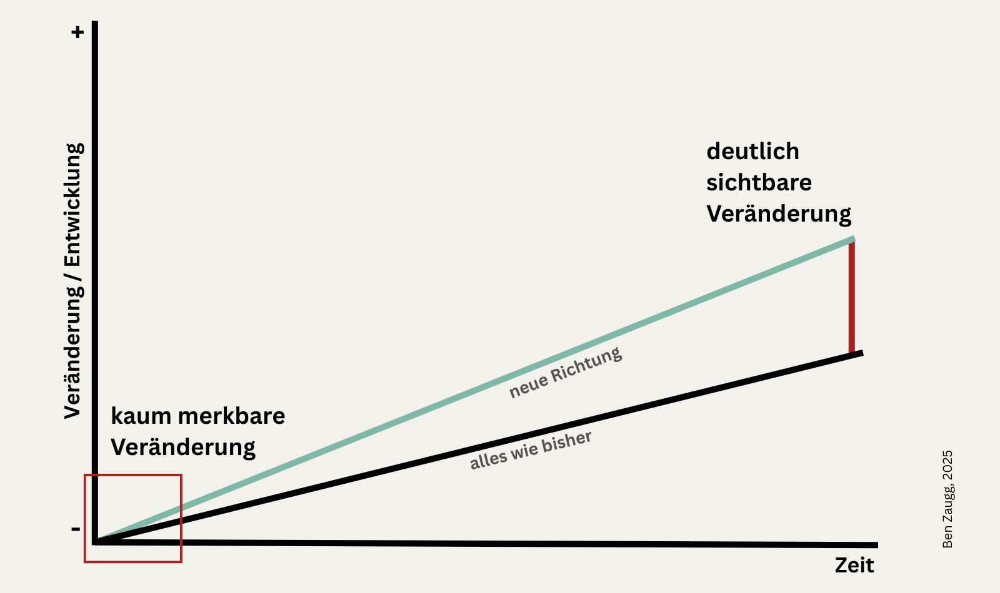

+++
title = "Kleine Schritte, grosse Veränderung"
date = "2025-07-21"
draft = true
pinned = false
tags = ["Persönlichkeitsentwicklung", "Ikigai", "Kaizen", "DesignThinking", "LifeDesign", "Lernen", "Biografie"]
image = "blog_titelbilder.jpg"
description = "Wie gestalte ich Veränderung, ohne mich selbst zu verlieren? In diesem Beitrag teile ich persönliche Prinzipien, die helfen können, dranzubleiben, neu zu denken – und dem eigenen Weg zu vertrauen.\n \n"
footnotes = "**Passende Bücher:**\n\n[**Ikigai**, Die japanische Lebenskunst, Ken Mogi](https://www.exlibris.ch/de/buecher-buch/deutschsprachige-buecher/ken-mogi/ikigai/id/9783832198992/?srsltid=AfmBOooed2X_1MtXCW7iqu8jca-siTsBMIwmevIvr6_jn8lZN6CvFkj2)\n\n[**Nagomi**, Der japanische Weg zu Harmonie und Lebensfreude, Ken Mogi](https://www.exlibris.ch/de/buecher-buch/deutschsprachige-buecher/ken-mogi/nagomi/id/9783832166878/?utm_source=google&utm_medium=cpc&utm_campaign=Shopping+CSS+Catch+All+(sh-CH-de-fr)&utm_content=Catch+All+DE+%26+FR&utm_term=&gad_source=1&gad_campaignid=22473186217&gbraid=0AAAAAD5hN-WpQSxhgQ0Ae12rVXrhhceSY&gclid=Cj0KCQjwyvfDBhDYARIsAItzbZFsGFQMyDLavgDhzeMHG_cgEV8VbCCfK1qwwSoKmrI_ZmtnzVK7GH0aAjlUEALw_wcB)\n\n[**Kaizen**, Schritt für Schritt zu einem erfüllten Leben mit der japanischen Erfolgsformel, Sarah Harvey](https://www.exlibris.ch/de/buecher-buch/deutschsprachige-buecher/sarah-harvey/kaizen/id/9783424153767/)\n\n[**Life Design**, Mit Design Thinking, Positiver Psychologie und Life Loops mehr von sich in das eigene Leben bringen](https://www.exlibris.ch/de/buecher-buch/deutschsprachige-buecher/sebastian-kernbach/life-design/id/9783791049229/)\n\n[**Life Design Actionbook**, Kreativität, Neugierde und Initiative kultivieren. Vom Denken ins Handeln kommen, um die Zukunft proaktiv zu gestalten](https://www.exlibris.ch/de/buecher-buch/deutschsprachige-buecher/sebastian-kernbach/life-design-actionbook/id/9783791054889/)\n\n[**Wofür stehen Sie morgens auf?** Warum Sinn und Bedeutung entscheidend für unsere Gesundheit sind, Prof. Dr. Tobias Esch](https://www.exlibris.ch/de/buecher-buch/deutschsprachige-buecher/tobias-esch/wofuer-stehen-sie-morgens-auf/id/9783833887611/)\n\n[Working out Loud, Wie Sie Ihre Selbstwirksamkeit stärken und Ihre Karriere und Ihr Leben nach eigenen Vorstellungen gestalten](https://www.exlibris.ch/de/buecher-buch/deutschsprachige-buecher/john-stepper/working-out-loud/id/9783800662814/)\n\n**[Bücher von Viktor Frankl](https://www.franklzentrum.org/museum/buecher.html?k=3)**\n\n**Bildquellen:**\n\nTitelbild: S. Zaugg\n\nGrafik: eigene Darstellung\n\nKintsugi-Tasse: Erstellt mit ChatGPT\n\nSchilder Einbahnstrasse. B. Zaugg\n\n[Kleine Tanne: Matthew Smith, Unsplash](https://unsplash.com/de/@whale)"
+++
# Kleine Schritte, grosse Veränderung: Ein Wegweiser für nachhaltige persönliche Entwicklung

Es ist Sonntagmorgen und ich sehe beim Blättern in einem Magazin irgendwelche Selbstoptimierungsideen zum Erreichen der eigenen Ziele. Diese oft einfachen Ratschläge halten sich hartnäckig und lassen sich auch gut verkaufen. Was mich dabei stört, ist, dass selten bis nie geschrieben wird, wie wert- und wirkungsvoll es sein kann, dem Leben nur eine minimal andere Richtung zu geben. Dazu gehört auch, dranzubleiben, zu vertrauen und auszuhalten. Es gehört dazu, eine Vision, ein Zielbild, etwas, das zieht, zu haben – das darf sich auf dem Weg auch ändern. Das kann verdammt anstrengend und mühsam sein, aber auch genauso schön. 

Ich glaube es war Hape Kerkeling der einmal gesagt hat, dass er seinem Leben nur eine minimal andere Richtung geben hat und deshalb Jahre später an einem (ganz) anderen Ort steht. In meinem Kopf ergab das etwa dieses Bild:

In den letzten 20 Jahren habe ich vieles ausprobiert, um zu genesen und meinen Weg zu gehen. Über diesen Weg habe ich in [«Meine Pinguingeschichte geschrieben»](https://www.bensblog.ch/der-pinguin-und-ich/). Alles, was ich getan habe, hat irgendwie dazu beigetragen. Heute kann ich ein paar Dinge benennen, die ich als universell wirkungsvoll betrachte. Einiges habe ich einfach so ausprobiert und später in Büchern und Modellen bestätigt erhalten, anderes ist von Menschen oder aus Büchern inspiriert. 

## Klein anfangen

### ➡️ Ein kleiner, konkreter Schritt zählt mehr als die perfekte Idee.

Grosse Ideen und Vorhaben geben Energie, sie sind jedoch auch schwer zu erreichen. Wo soll man anfangen? Am besten mit einfachen kleinen Schritten, die auf das Ziel einzahlen. 

Stell dir vor, du möchtest ein Buch schreiben, beginnst aber nie, weil das Vorhaben zu gross ist. Anstatt die grosse Idee vor dich hinzuschieben kannst du Kurztexte schreiben, einen Blog starten oder Texte als Social Media Posts veröffentlichen. 

Vielleicht bist du schon einmal dem [Ikigai-Venn-Diagramm ](https://www.youtube.com/watch?v=AC6vtCqwjLM)begegnet – vier sich überschneidende Kreise: Was du liebst, was du gut kannst, was die Welt braucht und wofür du bezahlt werden kannst. Es sieht schön aus, aber es kann auch Druck erzeugen. Denn wer findet schon auf Anhieb (oder jemals) die perfekte Mitte?

Der japanische Neurowissenschaftler und Autor [Ken Mogi ](https://www.bensblog.ch/ikigai-buch/)bietet einen anderen Zugang. Für ihn ist **Ikigai** keine Lebensaufgabe, die man finden muss, sondern eine innere Haltung, die sich in kleinen Dingen zeigt. In seinem Buch beschreibt er fünf Säulen des [Ikigai](https://www.bensblog.ch/tags/ikigai/):

* Klein anfangen
* Loslassen lernen
* Harmonie und Nachhaltigkeit leben
* Freude an kleinen Dingen finden
* Im Hier und Jetzt sein

Für mich ist das eine schöne Erinnerung: Es geht nicht darum, «die eine grosse Berufung» zu finden. Es geht vielmehr darum, die eigene Lebensweise mit Sinn und Stimmigkeit zu füllen. Sichtbar werden, ja, aber in einer Weise, die zu mir passt.

## Experimentieren – etwas mit kalkulierbarem Risiko ausprobieren.

### ➡️ **Nicht alles muss gleich «der grosse Wurf» sein.**

Genauso wirkungsvoll wie klein anzufangen kann das Experimentieren sein. Ideen, Träume und Visionen stellen sich in der Realität manchmal als weniger interessant, motivierend oder attraktiv heraus. Deshalb lohnt es sich, (kleine) Experimente zu starten und zu erkunden, wie sich das Neue anfühlt. 

Du möchtest dich selbstständig machen? Dann könntest du dein Arbeitspensum um 20 oder 40 % reduzieren. Wie fühlt sich die Lohneinbusse an? Was macht die finanzielle Unsicherheit mit dir? Wie ist es, alleine zu arbeiten? Ist das, was sich als Freiheit anfühlt wirklich so oder war es eher die Vorstellung davon? 

In der Innovationswelt spricht man oft von Design Thinking. Das ist ein Ansatz, der hilft, Neues nicht perfekt zu planen, sondern Schritt für Schritt zu entwickeln: beobachten, ausprobieren, reflektieren, anpassen. 

Auch persönliche Veränderung kann so gedacht werden: als ein iterativer Prozess, in dem du unterwegs lernst, was wirklich zu dir passt. Dafür gibt es extra einen Ansatz, der sich [Life Design](https://www.youtube.com/watch?v=x5ss2ITcefA) nennt. 

## Eine positive Haltung zum «Scheitern» entwickeln – «Ich lerne noch»

### ➡️ **Veränderung braucht den Mut zum Unvollkommenen.**

«Wer etwas anfängt, soll es auch zu Ende bringen». So oder so ähnlich sind wohl viele von uns geprägt. Deshalb fällt es uns vermutlich schwer, klein anzufangen oder zu experimentieren. Nicht nur das, wir haben auch Angst vor dem Scheitern, wobei Scheitern ja ein Teil von Experimentieren ist und sein soll. Wie viele gute Dinge wurden bei fehlgeschlagenen Experimenten entdeckt? Um gewünschte Veränderungen im eigenen Leben voranzubringen, lohnt es sich also eine positive Haltung zum Scheitern zu entwickeln. Wie wäre es, Scheitern nicht als etwas Negatives, als eine Niederlage anzusehen, sondern als Teil der Erfahrung – als Lernprozess. Ganz im Sinne von «Ich lerne noch». 

Experimentieren heisst auch zu scheitern. Alleine das Umdeuten des «Scheiterns» kann ein Lern- und Entwicklungsprozess sein. Versuche «Scheitern», Fehler, Umwege etc. als Lern- und Entwicklungsmöglichkeiten zu sehen. Es hat nicht geklappt? Dann frage dich: 

* Was würde ich heute anders machen? 
* Was habe ich auf dem Weg für neue Kompetenzen entwickelt?
* Wen habe ich auf diesem Weg kennengelernt?
* Was auf dem Weg hat mir gefallen und was nicht?

In Japan gibt es dafür ein schönes Bild: **[Kintsugi](https://finde-zukunft.de/blog/narben-aus-gold-nbspkintsugi-als-metapher-fr-unser-leben)** – die Kunst, Zerbrochenes mit Gold zu reparieren. Die Bruchstellen werden nicht versteckt, sondern betont. So entsteht ein neues Ganzes, das gerade durch seine Risse einzigartig ist. Vielleicht ist es mit uns und unseren Lernwegen ähnlich.

##  Die «richtigen» Menschen finden

### ➡️ Mit Unterstützung geht vieles besser.

Wer sich auf den Weg zu seinen Ideen, Träumen oder Visionen macht, kennt die kritischen Stimmen. 

* «Du?»
* «Das ist aber schwierig»
* «Ich könnte das nicht»
* «Bist du dir sicher?» 

Das sind nur ein paar einfache und oft schmerzhafte Aussagen. Gerade dann, wenn wir Unterstützung und Zuspruch benötigen. Oft sind es genau die Menschen, die uns nahestehen. Es geht dabei jedoch weniger um dich, sondern um sie selbst, ihre eigenen Begrenzungen oder ihre Unsicherheiten.

Deshalb ist es gut, sich Unterstützung ausserhalb des gewohnten Umfelds zu suchen. Menschen, die einen ähnlichen Weg gegangen sind, wie du gehen möchtest. Menschen, die bereits eine Expertise in dem Gebiet haben, wo du hinmöchtest oder Menschen, die selbst auf dem Weg sind. Oder Menschen, die andere professionell begleiten. 

## Sich zeigen

### ➡️ **Wer gesehen werden möchte, darf sichtbar werden.**

Ob innere oder äussere Veränderung – gerade wer sich beruflich in eine andere Richtung verändern möchte, braucht Sichtbarkeit. Dabei spielt es keine Rolle, ob du das innerhalb deiner Organisation machst, als Selbstständige oder auf der Suche nach einer neuen Stelle. «Wer in seiner Qualität gesehen werden möchte, muss sich auch zeigen.» Das oder etwas ähnliches hat mir einmal jemand gesagt. 

Du möchtest dich fachlich positionieren oder Kompetenzen zeigen, die noch nicht sichtbar sind? Dann könntest du dich auf Social Media zeigen, Blogbeiträge schreiben, einen Podcast beginnen, dein physisches Produkt ausstellen oder auf einer Webseite präsentieren. 

Eine bekannter Ansatz dazu ist [WOL (Working out Loud)](https://www.youtube.com/watch?v=XpjNl3Z10uc)

## Erlaube dir, die Richtung auf dem Weg zu ändern.

### ➡️ Visionen und Ziele sind Leitsterne, keine Einbahnstrasse.

Ziele, Ideen, Visionen – das sind alles Richtungen und keine fixen Wege. Im Prozess merkst du vielleicht, dass das, was dich einmal reizte, sich verändert hat. Das ist völlig in Ordnung, auch wenn gerade wieder Gedanken und Aussagen «was man anfängt macht man auch fertig», «du weisst nicht, was du willst» o. Ä. auftauchen. Erlaube dir die Abzweigungen zu nehmen, die für dich richtig sind. Genau dafür sind auch die hier genannten Punkte «Experimentieren» und «eine positive Haltung zum Scheitern entwickeln» gedacht. 

## Gelegenheiten nutzen und mutig ablehnen

### ➡️ Nicht jede Möglichkeit ist ein Geschenk. Und das ist okay.

Sich auf den Weg zu machen, mit anderen zu vernetzen und sich zu zeigen kann dazu führen, dass sich Gelegenheiten für Austausch, für Projekte und Jobs bieten. Sei mutig und nutze Gelegenheiten. Hab aber auch den Mut, Gelegenheiten abzulehnen, die zwar schön und interessant sind, für dich jedoch nicht passen. Das Bauchgefühl kann hier ein guter Ratgeber sein. 

## Dranbleiben

### ➡️ Veränderung ist ein langfristiger Prozess.

Veränderung braucht Zeit, viel Zeit. Dabei kannst du dir die Natur als Vorbild nehmen. Ein Baum, der fest verwurzelt ist und blüht wächst langsam. Er wächst, schlägt mehr Wurzeln, blüht, trägt Früchte, lässt die Blätter fallen, macht Pause und beginnt wieder von vorne. Vieles passiert kaum sichtbar und trotzdem wächst der Baum immer weiter und trägt immer wieder Früchte. 

Lass dich von Erfolgen und «Scheitern» nicht zu stark beeinflussen. Beides ist ein Teil des Weges.

In Japan gibt es das Konzept **[Kaizen](https://www.youtube.com/watch?v=GSzm7HlB-Ho)** – es meint kontinuierliche Verbesserung in kleinen Schritten.

Es geht nicht darum, alles zu optimieren. Sondern darum, jeden Tag einen kleinen Schritt in Richtung Entwicklung zu gehen. Genau das macht Veränderung nachhaltig.

## An vermeintlich uninteressante Orte gehen und dem Unerwarteten Raum geben

### ➡️ Was sich «uninteressant» anfühlt, kann entscheidend sein.

Eigentlich ist Fokus wichtig. Was jedoch genau so wichtig sein kann sind verschiedene Perspektiven. Manchmal eröffnen sich (vermeintlich) uninteressante Kontakte oder Gelegenheiten. Diese erweisen sich manchmal viel wertvoller als angenommen. Nutze also auch vermeintlich uninteressante Möglichkeiten – vielleicht sind sie genau das, was dir noch fehlt. 

Manchmal sind es die Gespräche am Rande, die zufälligen Begegnungen beim Warten auf den Bus oder das Buch, das du nur widerwillig aufgeschlagen hast, die dir den entscheidenden Impuls geben. Der Kurs, der «nicht dein Ding» war, zeigt dir plötzlich eine Lücke in deinem Denken auf.

All das sind keine Tipps, die man abhaken kann. Es sind Haltungen. Denkbewegungen. Einladungen.

Persönliche Veränderung beginnt selten mit einem grossen Knall. Meist beginnt sie mit einem stillen Impuls. Einer Idee. Einem inneren Ziehen. Und mit dem Mut, diesem Impuls Raum zu geben, ohne gleich zu wissen, wohin er führt.

## **Veränderung ist kein Projekt, sondern ein Weg.**

### Und manchmal genügt eine minimal andere Richtung, um an einen ganz neuen Ort zu gelangen.