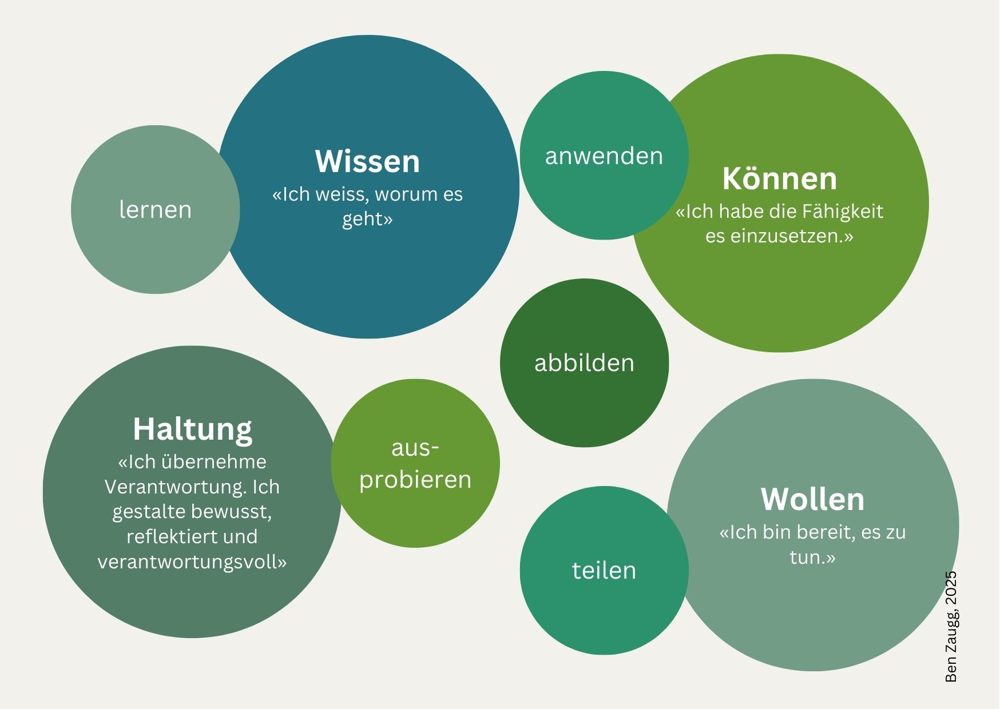

+++
title = "kompetenzraster-neuro"
date = "2025-05-21"
draft = true
pinned = false
tags = ["Lernen", "Neuro"]
image = "brain.jpg"
+++
## **Warum ich mich gegen ein CAS entschieden habe – aber nicht gegen das Lernen**

Eigentlich hatte ich geplant, in diesem Jahr ein CAS zu neurowissenschaftlichen Themen zu absolvieren – passend zu meiner Arbeit und meinem Interesse an Lernen und Veränderung. Doch nach einem intensiven Weiterbildungsjahr 2024, auch finanziell, habe ich mich bewusst dagegen entschieden. Gegen das formale Bildungsprogramm – nicht gegen das Lernen. Denn wenn das Interesse da ist, wenn ein innerer Impuls spürbar wird, dann ist Lernen nicht aufzuhalten.

## **Struktur für selbstorganisiertes Lernen – Bücher, Tools, KI**

Also habe ich mir selbst einen Rahmen geschaffen. Ich habe Bücher ausgewählt, die mir als roter Faden dienen. Gestartet bin ich bereits vor einigen Monaten – mit ersten Reflexionen, Leseprozessen und Praxistransfers. Dokumentiert habe ich mein Lernen von Beginn an in der mirroco-Software – zunächst noch ohne Kompetenzraster. Um die dabei erworbenen Kompetenzen sichtbarer zu machen, hinterlege ich nun ein Raster zu Neuro Change und Neuroleadership.

Aktuell entwickle ich gemeinsam mit mirroco ein neues Kompetenzprofil, das diesen selbstorganisierten Lernprozess abbildet. Es ist mein zweites Profil in dieser Software – diesmal nicht im Rahmen eines CAS, sondern als vollständig eigenverantworteter Weg.

Zur Erstellung dieses Skillprofils nutze ich verschiedene Quellen: ausgeschriebene Weiterbildungen, fundierte Buchinhalte und KI-basierte Tools. Die finale Ausformulierung wird erneut durch KI unterstützt – ein intensiver Prozess zwischen Strukturieren, Weglassen und Konkretisieren. Ziel ist ein Profil, das verständlich, nicht beliebig, praxisnah und anschlussfähig ist.

## **Ein Raster für etwas, das sich bewegt**

Ein Kompetenzraster wirkt auf den ersten Blick statisch – wie ein Ordnungssystem. Für mich ist es jedoch ein Raum für Bewegung. Es schränkt mein Lernen nicht ein, sondern macht es sichtbar. Lernen passiert bei mir ohnehin überall: in der Begleitung von Führungspersonen, in Veränderungsprozessen, beim Gestalten von Lernformaten.

Besonders angestossen wurde mein Interesse durch das SCARF-Modell – ein Impuls, der mich tiefer eintauchen liess in das, was im Gehirn passiert. In die Prozesse, die menschliches Verhalten im Kontext von Veränderung prägen.

## **Neuroleadership als Lernfeld**

**Zwei Bücher begleiten mich dabei besonders:**

* «Neuro Change – Antworten der Hirnforschung auf den Wandel im Management» von Dr. Markus Ramming
* «Neuroleadership – Erkenntnisse aus der Hirnforschung für die Führung von Mitarbeitenden» von Prof. Dr. Christian E. Elger

Beide Werke schlagen eine Brücke zwischen Neurowissenschaft, Führung und organisationalem Wandel oder auch Neuroökonomie. Sie ermöglichen mir, meine Erfahrungen aus Coaching, Bildung und Prozessbegleitung gehirngerechter zu reflektieren – und mit anderen zu teilen. Ich lerne, wie unser Gehirn auf Veränderung reagiert, welche Rolle das limbische System, Dopamin oder das Bedürfnis nach Sicherheit spielt. Diese Erkenntnisse fliessen direkt in meine Praxis ein – oft implizit, eingebettet in Formate, die psychologische Sicherheit und Beziehungsgestaltung in den Mittelpunkt stellen.

## **Vom Kopf in den Körper**

Doch mein Lernen bleibt nicht im Kopf. Es weitet sich aus – in den Körper, in den Alltag, in persönliche Themen. Ich beschäftige mich mit dem Vagusnerv, der Darm-Hirn-Achse, den Auswirkungen von Gehen auf unser Gehirn. Diese Themen verbinden sich mit meinen Erfahrungen in Genusstraining, Embodiment und Achtsamkeit. Sie erweitern mein Kompetenzprofil nicht, weil ich sie «beherrsche», sondern weil ich mit ihnen lerne, forsche, experimentiere – bewusst und selbstverantwortet.

## **Kompetenz sichtbar machen – und teilen**

**Das neue Kompetenzprofil, das ich mit [mirroco](https://www.mirroco.ch) entwickle, erfüllt für mich zwei Funktionen:**

1. Es macht mein Lernen sichtbar – für mich selbst und für andere.
2. Es zeigt, wie individuelle Lernprozesse strukturiert, reflektiert und dokumentiert werden können – selbstorganisiert, selbstbestimmt, selbstverantwortet.

Ich lerne, transferiere in den Alltag – und schreibe darüber. Denn das Teilen gehört für mich zum Lernen dazu. Nicht im Sinne eines Lehrens, sondern eines gemeinsamen Entdeckens.

> **Lernen lässt sich nicht aufhalten. Aber man kann es bewusst gestalten.**

### 💡 **Hinweis zur Begriffsklärung: Kompetenz**

Wenn ich von *Kompetenz* spreche, meine ich mehr als reines Wissen oder punktuelle Erfahrung. Kompetenz entsteht dort, wo **Wissen, Können, Wollen und Haltung** zusammenwirken – in konkreten Situationen, eingebettet in Handeln.

Sie zeigt sich nicht nur in dem, *was* ich weiss, sondern auch darin, *wie* ich mit diesem Wissen umgehe, ob ich es einsetze, weiterdenke, anwende – und ob ich bereit bin, Verantwortung dafür zu übernehmen.\
Ein Buch zu lesen ist ein Schritt – zur Kompetenz wird es erst, wenn ich die Inhalte mit meiner Praxis verbinde, sie reflektiere, gestalte und ins Handeln bringe.