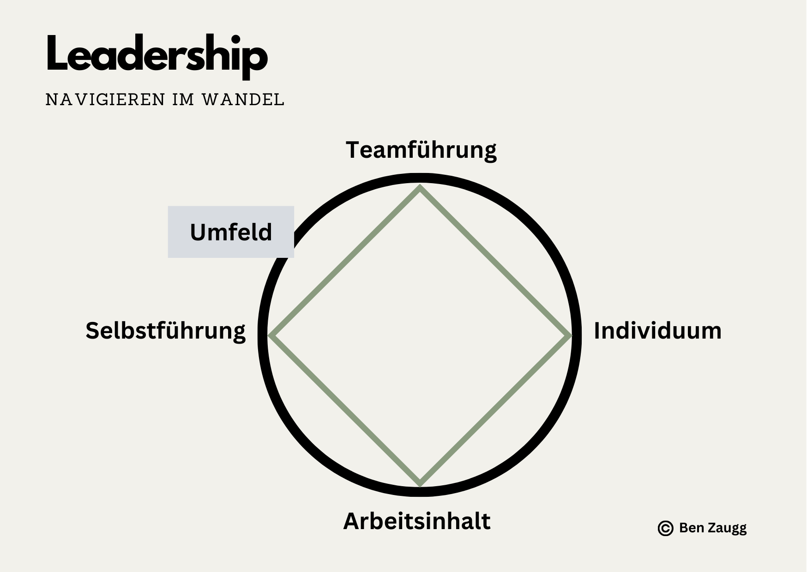
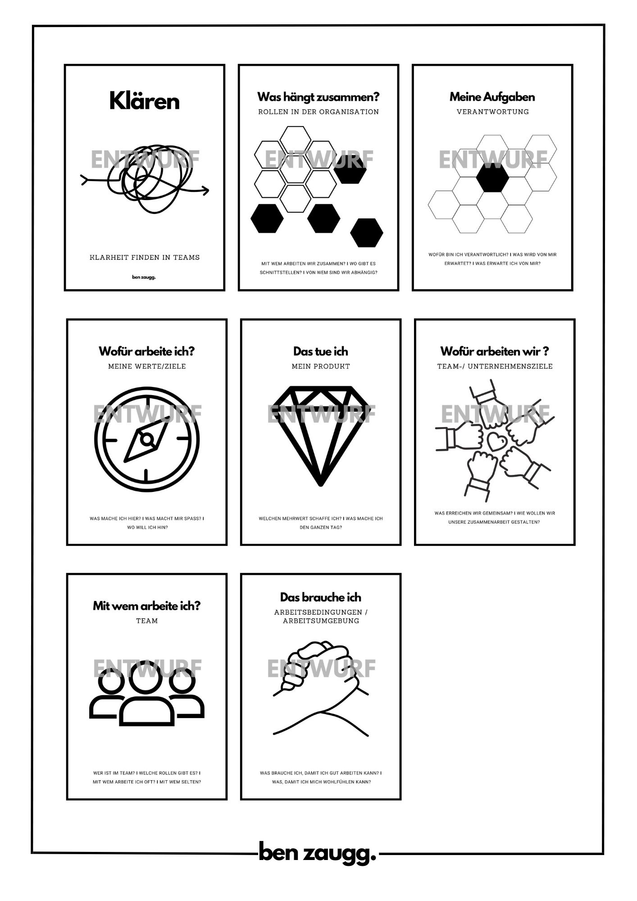
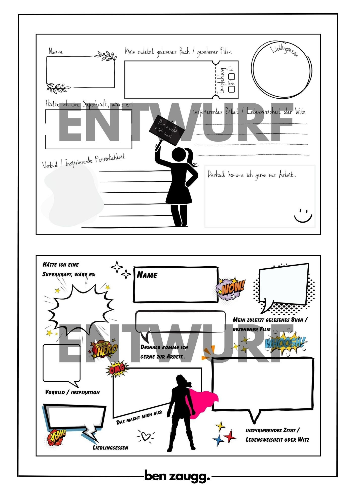

+++
title = "Leadership - Navigieren im Wandel"
date = "2023-12-06"
draft = false
pinned = false
tags = ["Leadership", "Personalentwicklung", "Organisationsentwicklung"]
image = "hiker-1984421_640.jpg"
description = "Gute Führung beginnt bei Selbstführung. Führungskräfte, die sich selbst, ihre (Lern-, Arbeits- und Führungs-) Biografie kennen, haben ein breiteres und tieferes Handlungsspektrum. Sie entwickeln sich in ihrer Rolle bewusst und laufend weiter."
footnotes = "📚 **Bücher**\n\n📘[Future Skills, 30 Zukunftsentscheidende Kompetenzen und wie wir sie lernen können](https://www.exlibris.ch/de/buecher-buch/deutschsprachige-buecher/69-co-creators/future-skills/id/9783800666355/)\n\n📘 [Trust me, warum Vertrauen die Zukunft der Arbeit ist, Karin Lausch](https://www.exlibris.ch/de/buecher-buch/deutschsprachige-buecher/karin-lausch/trust-me-warum-vertrauen-die-zukunft-der-arbeit-ist/id/9783648172353/)\n\n📘 [Das neue Führen, Führen und sich führen lassen in Zeiten der Unvorhersehbarkeit, Bodo Janssen ](https://www.exlibris.ch/de/buecher-buch/deutschsprachige-buecher/bodo-janssen/das-neue-fuehren/id/9783424202854/)➡️ [Hier gehts zum Blogbeitrag zum Buch](https://www.bensblog.ch/das-neue-fuehren/)\n\n📘 [TZI - Die Kunst sich selbst und eine Gruppe zu leiten](https://www.exlibris.ch/de/buecher-buch/deutschsprachige-buecher/cornelia-loehmer/tzi-die-kunst-sich-selbst-und-eine-gruppe-zu-leiten/id/9783608961225/)\n\nImage by [Andrew Martin](https://pixabay.com/users/aitoff-388338/?utm_source=link-attribution&utm_medium=referral&utm_campaign=image&utm_content=1984421) from [Pixabay](https://pixabay.com//?utm_source=link-attribution&utm_medium=referral&utm_campaign=image&utm_content=1984421)"
+++
## Navigieren im Wandel - Gedanken über Selbstführung, Teamdynamik und Anpassungsfähigkeit

**Leadership:** *englisch, Führung; Gesamtheit der Führungsqualitäten*. So steht es bei Duden.de. 

Bei Wikipedia habe ich unter Menschenführung etwa 20! unterschiedliche Führungsstile gefunden. Während ich schreibe, stehen hinter mir zudem etliche Bücher zu Führung. Aber, was ist gute oder richtige Führung? 

Darauf habe ich wohl keine Antwort, jedoch ein paar Gedanken. 

### Selbstführung

Gute Führung beginnt bei Selbstführung. Führungskräfte, die sich selbst, ihre (Lern-, Arbeits- und Führungs-) Biografie kennen, haben ein breiteres und tieferes Handlungsspektrum. Sie entwickeln sich in ihrer Rolle bewusst und laufend weiter. 

> «Ändern Sie Ihr Führungsverständnis: \[…] Führung erfordert Weisheit. Weisheit ist der stimmige Zusammenklang von Sozialität, Emotionalität und Rationalität.» 
>
> *Future Skills, Abschnitt New Work und Future Skills, 21 Thesen und 21 Impulse für die neue Büro- und Arbeitswelt, C. Quarch, J. Teunen (2021), Impuls 7*

### Individuelle Führung

Wer im Team tickt wie? Wer hat welche Stärken und Schwächen? Wohin will und kann sich ein:e Mitarbeiter:in bewegen? Das sind nur ein paar Fragen, die eine kompetente Führungskraft auf dem Schirm haben sollte. Um das Bild etwas konkreter zu zeichnen, könnte man auf einen Fussballtrainer oder auf einen Bergführer schauen. Sowohl ein Trainer wie auch ein Bergführer begleitet eine Gruppe von Individuen auf dem Weg zum Ziel. Jede:r ist für sich selbst verantwortlich und «muss» am Ende selbst ans «Ziel» kommen. Das klappt jedoch nur zusammen, mit gegenseitiger Unterstützung und in der richtigen Balance. Dafür ist der/die Bergführer:in, Fussballtrainer:in oder eben die Führungskraft zuständig.  

>  «Orientieren Sie sich bei Führungsaufgaben an der Tätigkeit des Gärtners: Sorgen Sie dafür, dass Ihre Mitarbeiter:innen ein gutes Arbeitsklima vorfinden, dass sie mit den nötigen Nährstoffen versehen werden, dass sie Wurzeln schlagen und einander unterstützen können, um zur Schönheit zu erblühen und reiche Frucht zu tragen» 
>
> *Future Skills, Abschnitt New Work und Future Skills, 21 Thesen und 21 Impulse für die neue Büro- und Arbeitswelt, C. Quarch, J. Teunen (2021), S. 45, Impuls 12*

### Teamführung

Einer guten Führungskraft gelingt es, mit den Menschen, mit denen sie zusammenarbeitet, ein Team zu bilden. Also eine Gruppe, die gemeinsam ein Ziel verfolgt, die sich gegenseitig unterstützt und ergänzt. Dabei geht es nicht darum, dass die Führungsperson alles formt und organisiert. Vielmehr schafft sie den Rahmen und ist dort zur Stelle, wo es Führung braucht. Auch hier könnten wir wieder die Bilder der Fussballmannschaft oder des Bergführers bemühen. Beide haben eine Aussensicht, also etwas Distanz zur Gruppe und doch sind sie ein Teil davon. Sie tragen Verantwortung für den Prozess und dafür, dass alle gemeinsam auf dem Weg bleiben.

So unterschiedliche wie Organisationen und Teams sind, so individuell gestaltet sich m. E. Führung. Es wäre auch zu kurz gedacht, einer Führungsperson die volle Verantwortung für ein Team zu geben. Ich sehe kollaborative und kooperative Zusammenarbeitsformen als zielführender, um in Zeiten von Unsicherheit und Unvorhersehbarkeit agil und auch stabil unterwegs zu sein. Oben erwähnten Punkte betrachte ich jedoch als Basis resp. stabiles Fundament, um eine Gruppe von Menschen sowohl in ruhigen wie auch in stürmischen Zeiten (zum Erfolg) zu begleiten. Dabei geht es natürlich immer um die Arbeit. Die Abbildung 1 zeigt, wie die einzelnen Aspekte zusammenhängen und immer auch von aussen beeinflusst werden.

Nachträgliche Ergänzung:\
\
Für eine Führungsperson welche ein Team durch verschiedenen Schwierigkeiten und Veränderungen begleitete, habe ich einige Materialien zur Unterstützung erstellt, die Entwürfe teile ich hier zur Inspiration: 

**Diese Karten dienten als Hilfe bei der laufenden Klärung von Themen rund um die Arbeit im Team und der Rolle dieses Teams innerhalb der Organisation.**

**Diese Plakate waren ein (freiwilliger) Teil zur Unterstützung des gemeinsamen Kennenlernens bei einer grösseren Veränderung im Team.** 

