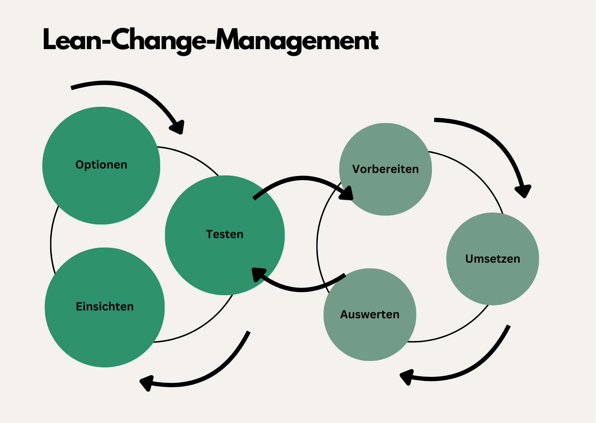

+++
title = "Lean-Change-Management"
date = "2024-07-02"
draft = false
pinned = false
tags = ["Organisationsentwicklung", "Change", "Agilität", "CAS"]
image = "pexels-eberhardgross-1612462.jpg"
description = "Ein Einblick in Lean-Change-Management und ein paar persönliche Gedanken. "
footnotes = "📚**Ergänzende Bücher**\n\n📘[Kotter John P. (2011), Leading Change, Wie Sie Ihr Unternehmen in acht Schritten erfolgreich verändern](https://www.exlibris.ch/de/buecher-buch/deutschsprachige-buecher/john-p-kotter/leading-change/id/9783800637898/)\n\n📘[Organisationsdesign in einer komplexen und instabilen Welt, Einführung in Modelle und Konzepte sowie deren Anwendung](https://www.exlibris.ch/de/buecher-buch/deutschsprachige-buecher/jens-o-meissner/organisationsdesign-in-einer-komplexen-und-instabilen-welt/id/9783658423384/?userLoggedOut=true)\n\nDie folgenden Bücher haben einen Bezug zu Japan. In allen drei finden sich ebenfalls Hinweise zum Nutzen von kleinen und stetigen Entwicklungsschritten. Es handelt sich jedoch eher um Bücher zur persönlichen Entwicklung. \n\n📘[Ikigai, die japanische Lebenskunst](https://www.exlibris.ch/de/buecher-buch/deutschsprachige-buecher/ken-mogi/ikigai/id/9783832165161/)\n\n📝[Hier gehts zum ergänzenden Blogbeitrag.](https://www.bensblog.ch/ikigai-buch/)\n\n🎧[Hier zur Podcast-Folge.](https://entwicklungsfreiraum-siebenminuten.podigee.io/9-ikigai)\n\n📘[Wabi Sabi, Die japanische Weisheit für ein perfekt unperfektes Leben](https://www.exlibris.ch/de/buecher-buch/deutschsprachige-buecher/beth-kempton/wabi-sabi/id/9783431041194/)\n\n🎧[Hier gehts zur ergänzenden Podcast-Folge.](https://entwicklungsfreiraum-siebenminuten.podigee.io/8-wabi-sabi)\n\n📘[Kaizen, Schritt für Schritt zu einem erfüllten Leben mit der japanischen Erfolgsformel](https://www.exlibris.ch/de/buecher-buch/deutschsprachige-buecher/sarah-harvey/kaizen/id/9783424153767/)\n\n📺**Video**\n\n[Prof. Peter Kruse über Change Management](https://www.youtube.com/watch?v=FLFyoT7SJFs)\n\nTitelbild: [eberhard grossgasteiger,](https://www.pexels.com/de-de/foto/luftaufnahme-der-zick-zack-strasse-1612462/) Pexels"
+++
## Einleitende (persönliche) Gedanken

Auch wenn mein CAS mit den Modulen einen Ablauf vorgibt, pendle ich zwischen den Themen. [Mein Lernen gestalte ich agil](https://www.bensblog.ch/cas-lernen-organisieren/) und habe den Eindruck, dass ich auch meine Lernprozesse (von denen ich sagen würde, dass sie bereits gut waren) verbessere. Ich nutze verschiedene Tools (z. B. Padlet, Miro, ChatGPT, …), hole mir Informationen aus Blogs, Youtube-Videos, Büchern (da stehen etliche hinter mir im Regal), Linkedin, … . In meinem Blog gibt es Einblicke in diese Prozesse. Seit 2021 schreibe ich u. a. über meine Lernthemen und Lernprozesse. Dieses Lernportfolio könnte, wenn man es denn von Anfang bis heute liest, auch eine Verbesserung beim selbstorganisiertem Lernen oder im Schreiben und Strukturieren von Artikeln zeigen (also noch mehr beiläufiges Lernen). Diese Seite lebt gemeinsam mit mir. Ich «manage» mein Lernen und meine kontinuierliche (persönliche) Entwicklung. Zusammenfassend würden wohl der Life Design Ansatz sowie das agile und selbstorganisierte Lernen meinen Weg am besten beschreiben oder theoretisch unterlegen. Dazu passt irgendwie auch Lean-Change-Management (nachfolgend LCM genannt). Es ist eines der Themen, die ein Teil dieses CAS sind. 

## **Was ist Lean-Change-Management?**

LCM kombiniert den Lean-Ansatz mit [agilem Vorgehen](https://www.bensblog.ch/agilitat/) oder Denken. Es geht darum, als Unternehmen anpassungsfähig zu sein und Veränderungsprozesse schlank und flexibel zu gestalten. Kontinuierliche Verbesserung und iterative Prozesse sind das Ziel. 

## **Die Prinzipien des Lean-Change-Management**

LCM funktioniert nach klaren Prinzipien, wie dies bei vielen anderen Ansätzen auch der Fall ist. Folgende Elemente stehen im Zentrum.

**Kundenzentrierung**: Alles, was getan wird, sollte einen Mehrwert für die Kunden bieten. Bei LCM stehen die Kunden im Fokus. So, wie dies bei Lean und agilen Ansätzen der Fall ist. 

**Iteratives Vorgehen**: Wie bei Agilität geht es auch hier um schnelle und kleine Veränderungen. Es geht darum zu testen, zu bewerten und kontinuierlich zu verbessern. Dazu wird auf kontinuierliches Feedback gesetzt. 

**Mitarbeiterbeteiligung**: Betroffene zu Beteiligten machen. Bei LCM wird die aktive Beteiligung der Mitarbeitenden am Veränderungsprozess gefördert. Man geht dabei davon aus, dass die Veränderung nur dann gelingt, wenn Mitarbeitenden eingebunden und motiviert sind. 

**Transparenz und Kommunikation**: Es wird offen und regelmässig kommuniziert. Beteiligte sollen über den Stand der Dinge, Fortschritte und Einfluss der Veränderungen informiert werden. 

## **Die Schritte im Lean-Change-Management Prozess**

Der LCM-Prozess folgt i. d. R. einen klaren Prozess, so wie dies auch bei anderen agilen Vorgehen oder im klassischen CM z. B. [den 8 Schritten nach Kotter](https://www.bensblog.ch/change-management/) der Fall ist. 

**Veränderungsbedarf identifizieren**: Welche Veränderungen sind nötig oder angebracht? Im ersten Schritt geht es darum, den Bedarf für Veränderungen zu erkennen. Möglichkeiten hier sind Marktanalysen, Kundenfeedback etc. 

**Hypothesen aufstellen und Experimente planen**: Basierend auf den Erkenntnissen werden Hypothesen aufgestellt. Diese werden in kleinen Experimenten geplant. Dadurch sollen schnelles Lernen und eine schnelle Anpassung möglich sein. 

**Durchführung der Experimente**: Auch wenn bis hier analysiert und geplant wurde, ist es wichtig, flexibel und offen zu bleiben. So kann und soll auch auf Unerwartetes schnell reagiert werden. 

**Feedback sammeln und analysieren**: Sind die Experimente durch, wird das Feedback analysiert. 

**Anpassungen vornehmen und skalieren**: Auf Basis des Feedbacks werden die Veränderungen angepasst/optimiert. Sobald diese den gewünschten Erfolg erzielen, werden sie im grösseren Umfang implementiert. 

## **Die Vorteile von Lean-Change-Management**

* **Schnellere Anpassung**: Durch die iterative Vorgehensweise können Unternehmen schneller auf Veränderungen reagieren.
* [**Weniger Widerstand**:](https://www.bensblog.ch/umgang-mit-widerstand/) Die Einbindung der Mitarbeiter reduziert den Widerstand gegen Veränderungen.
* **Bessere Ergebnisse**: Durch kontinuierliches Feedback und Anpassungen werden die Ergebnisse verbessert.

## **Gedanken zum Schluss**

LCM ist einer von vielen Ansätzen. Es bietet einen guten und sinnvollen Rahmen für Unternehmen, um in einer schnell wandelnden (Arbeits-) Welt Veränderungsprozesse umzusetzen. Wie bei allen anderen Ansätzen, Tools und Methoden ist es m. E. auch hier wichtig zu klären, wohin die Reise gehen soll und was am besten zum Unternehmen (Arbeitsweise, Kompetenzen der Mitarbeitenden, Kultur, …), den Herausforderungen und der Zukunft passt.