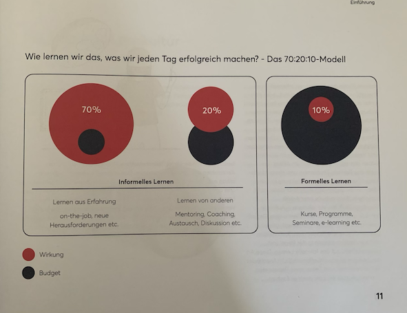

+++
title = "Learning by Doing"
date = "2022-08-08"
draft = false
pinned = false
tags = ["Lernen", "Bildung", "Personalentwicklung"]
image = "startup-g94a56e7f2_1280.jpg"
description = "Learning by Doing ist Lernen in seiner natürlichen Form. Wie bringen wir wieder mehr davon in unser (Arbeits-) Leben? Dazu gibt es in diesem Beitrag einige Gedanken. "
footnotes = "Mehr zum selbstbestimmten Lernen findest du bei [colearning.org](https://www.colearning.org>)\\\n\\\n[Hier gibt es mehr über Social Learning zu lesen ](https://www.linkedin.com/pulse/wissen-teilen-ist-macht-mit-social-learning-die-zukunft-dunkel/?trackingId=kvgwofmq8TXxlmJdFocQtg%3D%3D)\\\n\\\nEinen anderen Blogbeitrag zum Thema [Learning by Doing findest du bei Fredi Zumbrunn](https://www.fredizumbrunn.ch/learnings-by-doing/)\\\n\\\n**Weitere passende Bücher:**\n\n[Berufen statt Zertifiziert, Neues Lernen, Neue Chancen, Anja C. Wagner](https://www.exlibris.ch/de/buecher-buch/deutschsprachige-buecher/anja-c-wagner/berufen-statt-zertifiziert/id/9783035518689/)\\\n\\\n[Entlehrt euch!, Dr. Rolf Arnold](https://www.exlibris.ch/de/buecher-buch/deutschsprachige-buecher/rolf-arnold/entlehrt-euch/id/9783035504590/)\\\n\\\nTitelbild:  [StartupStockPhotos](https://pixabay.com/de/users/startupstockphotos-690514/?utm_source=link-attribution&utm_medium=referral&utm_campaign=image&utm_content=593341) auf [Pixabay](https://pixabay.com/de//?utm_source=link-attribution&utm_medium=referral&utm_campaign=image&utm_content=593341)"
+++
### Learning by Doing

#### Eine Einleitung

Menschen lernen immer und das tun sie oft dann, wenn sie es gar nicht denken. Sie lernen dann, wenn sie arbeiten. Sie lernen, während dem sie etwas tun. Sie klären dabei Fragen, lösen kleine und grosse Probleme, holen sich Hilfe, tauschen sich mit anderen aus, ... . Da stehen keine Pulte, es gibt keine Lehrpläne und Lernziele. Dieses Lernen hat aber immer noch wenig Akzeptanz, auch wenn es immer stärker zum Thema gemacht wird. 

#### Früher war alles..

..oder zumindest vieles vorhersehbarer und die Dinge entwickelten sich langsamer. Hier könnte man sich zum Beispiel vorstellen, wie lange ein Brief aus den Vereinigten Staaten in die Schweiz brauchte. Man musste Papier und Stift haben, dann brauchte es einen Briefumschlag und eine Briefmarke. Dann musste man zur Post oder zum Briefkasten. Das Erstellen und Versenden brauchte seine Zeit und dann kam noch der Weg dazu. Heute braucht diese Kommunikation ein paar Minuten, manchmal nur Sekunden. Dieses sehr einfache Beispiel soll zeigen, wie sich die Welt gewandelt hat. Auch wenn das für uns vielleicht nur noch Teil der Geschichte ist, leben wir in vielerlei Hinsicht immer noch in diesem Zeitalter. Denn wenn wir das Lernen oder eher Lehren von damals und heute betrachten, dann sind die Unterschiede nicht mehr so gross. 

> Wissen war Macht und diese «Macht» war nicht allen zugänglich. Heute sind Wissen und Informationen fast überall verfügbar. 

#### Zwischen früher und morgen

Die Art und Weise, wie wir lernten zu lernen und wie wir heute immer noch lernen oder lehren, unterscheidet sich nicht so stark von früher. Man geht oft immer noch von dieser vorhersehbaren Welt aus und definiert dafür Lehrpläne, Lernziele, die dann irgendwann abgeschlossen werden. Für viele ist dieses Lernen dann fertig. Endlich. Denn dabei ging es eher darum, einen Abschluss zu erlangen, als darum, wirklich selbst zu wachsen. Das «endlich abschliessen» steht doch irgendwie im Widerspruch zum so oft genannten lebenslangen Lernen?

#### Wo stehen wir heute?

Nach der Pandemie können wir plötzlich vieles, was vorher kaum machbar schien. Wir arbeiten remote, lernen hybrid und sehen, wie die digitale Transformation noch einmal an Wichtigkeit und Schnelligkeit zulegte. Mit Remote und hybrid scheint für viele Unternehmen und Menschen das Problem gelöst worden zu sein. Man muss nun also nicht mehr oder nicht mehr so oft in Kursräumen sitzen und das «Schulfeeling» ist etwas weniger schlimm. Nun haben aber leider viele nichts anderes gemacht, als die Kurse, Weiterbildungen, Schulungen etc. in den virtuellen Raum verlegt. Oder es werden fertige und vorgegebene E-Learnings erstellt, die irgendwo zwischen der eigentlichen Arbeit abgeschlossen werden müssen. Es bleibt also ein Müssen und ein Lernen in vorgegebenen Strukturen und Überzeugungen, bei denen es Expert:innen braucht. Wissen und Erfahrungen für sich zu behalten oder eben als Expert:in zu vermitteln scheint immer noch mit dem Gefühl von Macht und Kontrolle verbunden zu sein. 

#### Lernen verlernen

Wenn wir die Art, wie wir gelernt haben, verlernen, dann besteht Hoffnung. In einer Welt, in der Wissen (fast) immer und (fast) überall verfügbar ist, brauchen wir niemanden, der uns die Welt erklärt. Wir brauchen Expert:innen, die dann da sind, wenn wir nicht mehr weiterkommen. Das sind dann vielleicht nicht nur Fachexpert:innen sondern Menschen, die uns beim Lernen unterstützen. Sie könnten helfen zu reflektieren, sie könnten Ermutiger und Ermöglicher sein.

#### Lernen ist für alle anders

Wenn wir die Rahmenbedingungen für Lernen rund um unsere Arbeit anpassen, dann müssen wir uns bewusst sein, dass da viele unterschiedliche Lernbiografien sind. Da sind Menschen, die der Überzeugung sind, dass sie zu dumm sind. Andere denken, dass sie nur lernen, wenn sie beschult werden. Die wenigsten werden sich ihres täglichen Lernens oder Learning by Doing bewusst sein. Das in den (Arbeits-) Alltag zu integrieren braucht Zeit und Begleitung. Es geht darum, das Lernen zu verlernen und der Natürlichkeit des Lernens wieder Platz zu geben. 

#### Rahmenbedingungen schaffen

Wir müssen also das Lernen der Menschen im Betrieb nicht planen oder steuern, sondern Rahmenbedingungen schaffen, die selbstbestimmtes und selbstorganisiertes Lernen ermöglichen. So wird Learning by Doing nicht nur möglich, es erhält auch den Wert, den es verdient. Ein paar Möglichkeiten, dem natürlichen Lernen mehr Platz zu geben.

##### Social Learning

Menschen lernen von Menschen. So könnten Möglichkeiten geschaffen werden, damit Menschen im Unternehmen (auch Abteilungsübergreifend) mit- und voneinander lernen können. Eine einfache und schlanke Möglichkeit ist ein [gegenseitiges Mentoring](https://www.colearning.org/#mentoring) oder etwas weitreichender, wenn..

##### Lernen sichtbar machen

.. das Lernen sichtbar gemacht wird. Das kann ganz unterschiedlich gemacht werden. Es können Veranstaltungen sein, bei denen sich Menschen über die eigenen Lernerlebnisse austauschen. Mit individuellen [Lernblogs](https://www.colearning.org/#lernblog) (das könnten auch Podcasts oder Videos sein) können die eigenen Lernerfahrungen mit allen geteilt werden. Dadurch können anderen von den eigenen Erfahrungen lernen, es finden sich vielleicht ähnliche Interessen, Problemstellungen oder andere Verbindungen.

##### Zeit einplanen

[Harald Schirmer spricht und schreibt über das Einplanen von Lernzeiten.](https://harald-schirmer.de/2021/03/21/meine-keynote-zum-thema-lernen/) Es ist wichtig, dass wir uns Lernzeiten planen, sonst gehen sie unter. Diese Zeit muss m. E. nicht als aktive Lernzeit genutzt werden, sondern kann als Reflexionszeit eingesetzt werden. So könntest du dir zum Beispiel diese Mentoring-Fragen selbst stellen.

#### 70:20:10

Das 70:20:10 Framework hier aus dem Buch [Lernhacks](https://www.exlibris.ch/de/buecher-buch/deutschsprachige-buecher/thomas-tillmann/lernhacks/id/9783800664986/), Mit einfachen Routinen Schritt für Schritt zur agilen Lernkultur zeigt ebenfalls die Wichtigkeit und Wirkung des informellen Lernens. 

> Learning by Doing ist Lernen in seiner natürlichen Form. Es findet immer und überall statt.