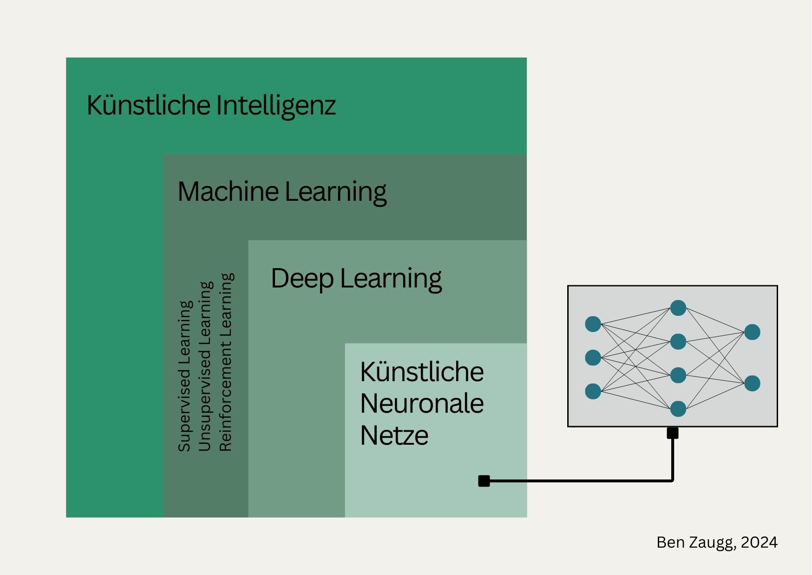

+++
title = "Leitfaden: Einführung von generativer KI in Organisationen"
date = "2024-12-05"
draft = false
pinned = false
tags = ["CAS-BI", "CAS", "KI", "Organisationsentwicklung", "Personalentwicklung", "Kompetenzen"]
image = "ich-und-die-ki-2.jpg"
description = "Ein Leitfaden zur Einführung generativer KI mit Fokus auf der Perspektive der Personal- und Organisationsentwicklung. "
+++
## 1.0 Einleitung

Dieser Leitfaden entstand im Herbst 2024 aus verschiedenen Gesprächen mit Personen aus digitalen Transformationsprojekten, aus der Bildung und Organisationsentwicklung sowie aus etlichen Stunden Podcast- und Videomaterial, die in den letzten Wochen und Monaten erschienen sind. Hier sind die am häufigsten genannten Themen im Zusammenhang mit der Einführung von KI in Organisationen zusammengefasst, die bei der Einführung von KI, insbesondere generativer KI-Modelle wie ChatGPT, in Organisationen zu beachten sind. Ziel ist es, Organisationen praxisnah bei der Einführung von KI zu unterstützen und dabei die Perspektive der [Personal- und Organisationsentwicklung](https://www.bensblog.ch/tags/organisationsentwicklung/) in den Fokus zu stellen. Der Leitfaden reflektiert auch Erkenntnisse aus aktuellen Entwicklungen und Diskussionen zu Bias, Diversität sowie Nachhaltigkeit in der KI und hebt die Bedeutung interdisziplinärer Zusammenarbeit hervor​.

## 2.0 Definition Künstliche Intelligenz

*«Künstliche Intelligenz ist die Fähigkeit einer Maschine, menschliche Fähigkeiten wie logisches Denken, Lernen, Planen und Kreativität zu imitieren. KI ermöglicht es technischen Systemen, ihre Umwelt wahrzunehmen, mit dem Wahrgenommenen umzugehen und Probleme zu lösen, um ein bestimmtes Ziel zu erreichen. Der Computer empfängt Daten (die bereits über eigene Sensoren, zum Beispiel eine Kamera, vorbereitet oder gesammelt wurden), verarbeitet sie und reagiert. KI-Systeme sind in der Lage, ihr Handeln anzupassen, indem sie die Folgen früherer Aktionen analysieren und autonom arbeiten.»* Definition EU-Parlament

Künstliche Intelligenz ist die Basistechnologie. Tools wie ChatGPT werden der Generativen KI zugeordnet, die eine Form des Deep Learnings ist und durch künstliche neuronale Netze (in Anlehnung an das menschliche Gehirn) funktioniert. KI generiert oft Inhalte basierend auf Trainingsdaten, weshalb ethische und urheberrechtliche Fragen in den Entwicklungsprozess integriert werden sollten. 

## 3.0 Neue Kompetenzen entwickeln

Die sinnvolle und verantwortungsvolle Nutzung von KI bedingt neue Kompetenzen auf allen Stufen der Organisation. Dabei geht es nicht nur um ein Grundverständnis der Funktion von neuen Technologien wie der KI, sondern auch um Datenschutz, kritischem Denken oder den Umgang mit Veränderungen. Diese Kompetenzen sind nicht neu, sondern in der VUCA-Welt sowie in einer zunehmenden Digitalisierung seit längerer Zeit wichtig. Die rasante Entwicklung der KI gibt der Notwendigkeit [neue Kompetenzen zu entwickeln](https://www.bensblog.ch/tags/kompetenzentwicklung/) noch einmal einen grossen Schub. Die drei Kompetenzbereiche Digitale Kompetenzen, KI-Grundkompetenzen sowie Change-Kompetenzen sind wichtig, um KI in einer Organisation sinnvoll und wirksam einsetzen zu können.

### 3.1 Digitale Kompetenzen

«Digitale Grundkompetenzen beschreiben die Fähigkeit, Anwendungen und Programme auf verschiedensten Geräten (Computer, Touchpad, Smartphone, Billettautomaten etc.) zu nutzen und damit Inhalte abzufragen, zu verändern und/oder zu erstellen.» (Kompetence.ch)

Diese Kompetenzen bieten die Grundlage, um KI überhaupt anwenden zu können. Damit der Aufbau und die Nutzung von KI in Organisationen funktionieren kann, sind diese essentiell. Dazu kommen Kompetenzen im Umgang mit KI, wobei diese in der aktuellen Zeit und Zukunft ganz allgemein wichtig sein werden.

### 3.2 Kompetenzen im Umgang mit KI

Im Umgang mit KI benötigen Mitarbeitende zusätzliche Kompetenzen, wobei sich die Tiefe der Kompetenzen je nach Arbeits- resp. Anwendungsbereich unterscheiden können. Um einen sicheren und sinnvollen Umgang zu gewährleisten, sind folgende Kompetenzen wichtig. Auf die Entwicklung dieser sollte ein Augenmerk gelegt werden.

**Datenschutz:** Kenntnisse und Verständnis von sicherer Datenverarbeitung

**Datenqualität:** Umgang mit Dokumenten und Daten

**Ethik:** Verständnis für ethische Fragestellungen in der KI. Dazu gehört die Sensibilität für Diskriminierung und Bias in KI-Systemen.

**Analytisches / innovatives & kreatives Denken:** Die Ergebnisse von KI-Systemen müssen immer wieder kritisch hinterfragt werden, da sie nicht 100 % zuverlässig sind. Zudem sollte weiterhin auf die eigene (menschliche) Kreativität und Intuition vertraut werden. 

**Umgang mit Veränderungen** Die KI wird vieles verändern (Berufsbilder, Arbeitsinhalte, Arbeitsabläufe, die Art der Zusammenarbeit etc.). Das braucht ein Verständnis für die Wirkungsmechanismen von Change-Prozessen und dem eigenen Umgang damit.

* **[Change & Transformation begleiten](https://www.bensblog.ch/tags/change/):** Durch die vielfältigen und disruptiven Veränderungen durch die KI ist es wichtig, Change- und Transformationsthemen in der Organisation auf menschlicher Ebene Aufmerksamkeit zu schenken. 
*  **Change-[Leadership](https://www.bensblog.ch/tags/leadership/):** Leadership-Kompetenzen gewinnen in Zeiten disruptiver Veränderungen noch einmal an Wichtigkeit. Leader:innen müssen selbst mit dem Wandel klarkommen und ihre Mitarbeitenden durch diesen Wandel begleiten. 

### 3.3 Neue Formen der Zusammenarbeit

Die KI soll Menschen bei ihrer Arbeit unterstützen. Es entsteht eine Art Zusammenarbeit zwischen den Mitarbeitenden und der KI. Das erfordert neue Kompetenzen in Kollaboration und Kooperation. Sowohl zwischen Menschen wie auch zwischen Mensch-Maschine. Die Arbeit in der technosozialen Arbeitswelt wird vom Zukunftsinstitut als eines der aktuellsten Handlungsfelder identifiziert. 

Bei der Einführung von KI werden zudem interdisziplinäre Teams wichtiger. Gerade beim Schreiben von Promts sind die verschiedensten Perspektiven von Hilfsarbeiter:innen bis zur Geschäftsleitung gefragt. 

* Diese interdisziplinären Teams müssen begleitet werden können.
* Menschen müssen in interdisziplinären Teams über verschiedene Hierarchiestufen hinweg zusammenarbeiten können

## 4.0 KI sinnvoll einsetzen

Mit der generativen KI und den Large Language Modells wie ChatGPT oder Claude.ai sind ganz neue Möglichkeiten entstanden, wie KI in Organisationen eingesetzt werden kann. Das heisst jedoch nicht, dass KI unbedingt eingesetzt werden muss und schon gar nicht, dass Use-Cases von anderen Organisationen kopiert werden sollten. Damit KI einen Wettbewerbsvorteil bringen kann, sollten Fragen vorher geklärt werden: 

**Nutzen:**

* Wo kann uns KI wirklich einen Mehrwert bringen?
* Was heisst das für andere Prozesse, Berufsbilder etc.?

**Ressourcen:**

Welche Ressourcen stehen uns heute zur Verfügung, um KI einzuführen? 

*  **Fachliche:** Welche Kompetenzen brauchen wir, um KI einzuführen und zu nutzen? Haben Mitarbeitende, insbesondere Entscheidungsträger:innen diese Fähigkeiten?
*  **Zeitliche:** Wie viele zeitliche Ressourcen stehen uns in der gesamten Organisation zur Verfügung?

## 5.0 Technische Integration und Datenmanagement

**Verbindung zu anderen Systemen**

Die Verbindung von KI-Anwendungen in bestehende Systeme muss berücksichtigt werden, damit eine reibungslose Integration möglich ist, sofern diese benötigt wird. Es sind alle Anspruchsgruppen so früh wie möglich miteinzubeziehen. 

**Datenmigration und -anbindung**

Für den Einsatz mit generativer KI sind strukturierte Daten essenziell. Organisationen sollten bestehende Datenquellen bewerten und gegebenenfalls migrieren. Wie ist der aktuelle Stand der Daten? Wo sind sie abgelegt? Was bedeutet es, die Daten für die KI aufzubereiten?

## 6.0 Rechtliche und ethische Rahmenbedingungen

**Datenschutz:** Der Datenschutz ist auch beim Einsatz von KI sehr wichtig. Es bedarf einem neuen Verständnis, da der Umgang mit Daten (Training der KI, Eingeben von Daten für Antworten etc.) ein neuer ist. Ein Grundverständnis von Daten, deren Verarbeitung und dem zusammenhängenden Datenschutz auf allen Stufen der Organisation wichtig. 

**Urheberrecht:** Der Ursprung von KI-generierten Inhalten ist oft unklar. Der Umgang mit Urheberrechten ist noch nicht geklärt. Es ist also auf folgendes zu achten: 

* KI-generierte Inhalte könnten, je nach dem, womit ein Modell trainiert wurde, Urheberrechte verletzen. 
* Wissen wir, woher die Daten kommen, mit denen ein Modell trainiert wird oder wurde?

**Bias und Diversität:** Die Resultate der KI können nur so gut sein, wie ihre Trainingsdaten. Es ist auf Bias und Inklusionsthemen bei der Einführung und Nutzung der KI zu achten. Im Idealfall werden hier Expert:innen hinzugezogen. 

**Nachhaltigkeit**: Generative KI erfordert eine sehr hohe Menge an Rechenleistung und ist somit energieintensiv.

## 7.0 Zukunft und Weiterentwicklung der generativen KI

**Technologische Trends**

* **Multimodale KI**: Es gibt Systeme, die Text, Bild und Audio kombinieren. Das eröffnet ganz neue Anwendungsmöglichkeiten, vereinfacht jedoch auch die Erstellung von Deep Fakes oder Fake News. 
* **Mensch-Maschine-Kollaboration:** In der technosozialen Arbeitswelt fokussieren Mitarbeitende auf kreative, strategische sowie menschenorientierte Aufgaben. Die KI übernimmt repetitive Aufgaben wie Administration, Koordination etc. 

## 8.0 Schlussgedanken

Der Einsatz von künstlicher Intelligenz ist nichts Neues und bereits lange ein (unsichtbarer) Teil unseres Lebens. Durch den frei zugänglichen Einzug von generativer KI in unseren (Arbeits-) Alltag hat sich im Herbst 2022 jedoch innerhalb von wenigen Wochen vieles schlagartig verändert und diese Veränderungen halten an. Längerfristige Auswirkungen auf Organisationen und unsere Arbeit können heute nur geschätzt werden. Sobald der Hype abflacht, geht es um den sinnvollen und wirksamen Einsatz in unsere Arbeit, damit die KI uns bei der Arbeit unterstützen und entlasten kann. Damit dies möglich ist, braucht es neue Kompetenzen, strategisches Denken ein strategisches und umsichtiges Vorgehen. Dabei kann dieser Leitfaden eine erste Unterstützung bieten.