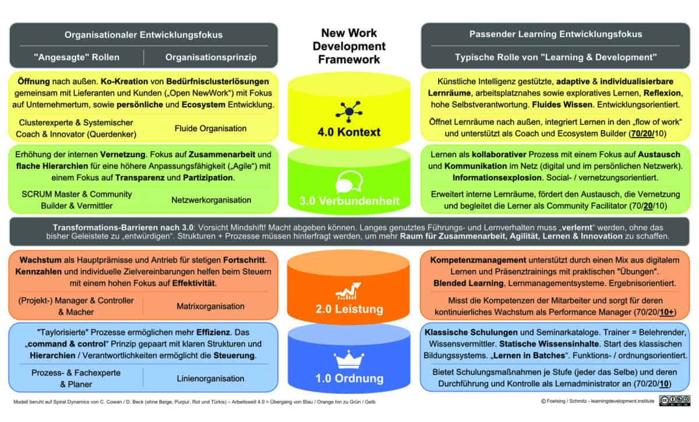

+++
title = "lernende-organisation-modul-2"
date = "2024-09-24"
draft = true
pinned = false
tags = ["CAS", "CAS-BI", "LernendeOrganisation"]
image = "einstieg-3.jpg"
description = "Einblick in Modul 2 (Lernende Organisation) im CAS Business Impact."
+++
## **Einleitende Gedanken**

Es fällt mir schwer, meinen eigenen Lernprozess in diesem Modul sichtbar zu machen. Es gibt (zu) viele Themen, über die ich schreiben könnte. Trotzdem gibt’s hier einen kurzen Ein- und Überblick in mein zweites Modul.  

## **Modul 2: Lernende Organisation – Theorie und Praxis im Fokus**

In diesem Modul beschäftige ich mich intensiv mit dem Konzept der lernenden Organisation. Die fünf Disziplinen nach Peter Senge, die Entwicklung einer Lernkultur und der Einfluss von künstlicher Intelligenz spielen dabei eine Rolle. Wie im ersten Modul „New Work“ könnte man jedes dieser Themen vertiefen, doch mein Ziel ist es, sie in konkrete Zusammenhänge zu stellen und praxisorientiert herunterzubrechen.

## **Lernende Organisation oder Lernen in Organisationen – Ein Überblick** 

Eine lernende Organisation kann man als ein dynamisches, anpassungsfähiges System, das durch das Handeln und Denken der Menschen innerhalb der Organisation gestaltet wird bezeichnen. Mehr dazu auch im Beitrag Lernend Organisation. Das [White Paper «Agiles Lernen»](https://mentus.de/whitepaper-agiles-lernen/) von Prof. Dr. Nele Graf und Dr. Frank Edelkraut zeigt die Bedeutung von Metakompetenzen, die für die Zukunftsfähigkeit von Mitarbeitenden und Unternehmen entscheidend sind. Die Entwicklung dieser Kompetenzen kann ein wichtiger Teil sein, um aus und mit lernenden Menschen schrittweise eine lernende Organisation zu gestalten. 

## **Praxisnahe Schritte zur lernenden Organisation**

In der Praxis zeigt sich oft, dass kleine, schrittweise Veränderungen notwendig sind, um eine Organisation lern- und anpassungsfähiger zu machen. Auch ohne das Ziel, eine vollständige lernende Organisation zu werden, ist es sinnvoll, Lernen und Entwicklung im Alltag zu verankern. Dabei spielen Lernkultur, Freiheitsgrade, psychologische Sicherheit, Organisationskultur und Führungsverhalten zentrale Rollen.

## **Muss eine Organisation lernen?** 

Wichtige Fragen sind: Muss sich eine Organisation verändern? Wofür muss sie lern- und anpassungsfähig sein? Welche Kompetenzen benötigen die Mitarbeitenden? Um diese Fragen zu beantworten, habe ich mich damit auseinandergesetzt, welche kleinen Schritte eine Organisation in Richtung einer lernenden Organisation gehen könnte. Das Ziel ist es, Lernen und Entwicklung nachhaltig zu verankern.

## **Fazit: Lernen als Schlüssel zur Anpassungsfähigkeit** 

Unabhängig davon, ob das Ziel eine vollständige lernende Organisation ist, gewinnen Lernen und Anpassungsfähigkeit in der modernen Arbeitswelt zunehmend an Bedeutung. Ansätze wie Lernen 4.0, agiles Lernen und New Learning bieten wertvolle Orientierungspunkte. Prof. Dr. Nele Graf und Dr. Anja Schmitz haben dazu übrigens eine wertvolle Begriffsabgrenzungen vorgenommen, die als hilfreiche Orientierung dienen. Um mich bei meinen Themen immer wieder am Gesamtbild zu orientieren, habe ich mir im Verlauf diese Grafik erstellt. 

Ebenfalls finde ich das New Work Development Framework von Jan Foelsing und Anja Schmitz sehr hilfreich. Diese findest du auch im Buch New Work braucht New Learning auf Seite 75

Ein Überblick aller Blogbeiträge zum CAS Business Impact findest du übrigens [hier.](https://www.bensblog.ch/cas_businessimpact_verzeichnis/)