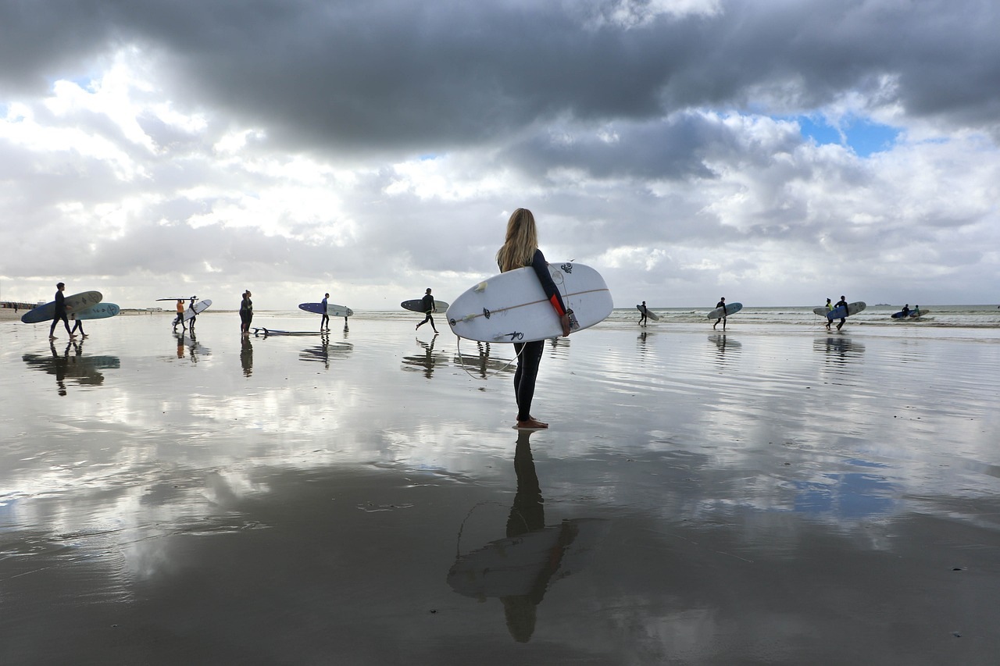
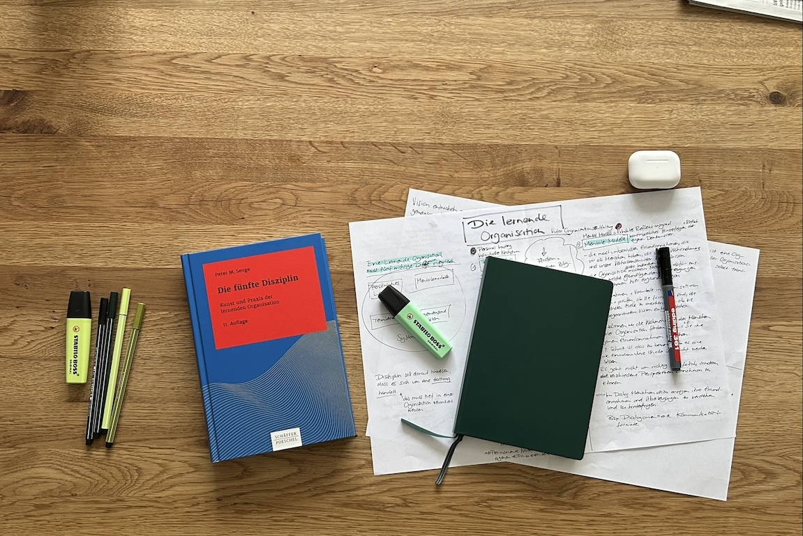

+++
title = "Die lernende Organisation"
date = "2024-05-08"
draft = false
pinned = false
tags = ["CAS", "Organisationsentwicklung", "Personalentwicklung", "Lernen", "Leadership"]
image = "surfers-4390427_1280.jpg"
description = "Was ist eine lernende Organisation und welche Vorteile hat sie? Ein Einblick in einen nicht so neuen Ansatz, der Unternehmen erfolgreich, flexibel und anpassungsfähig machen kann. "
footnotes = "📚**Passende** **Bücher**\n\n📕[Selbstmanagement ressourcenorientiert, Theoretische Grundlagen und Trainingsmanual für die Arbeit mit dem Zürcher Ressourcen Modell (ZRM®)](https://www.exlibris.ch/de/buecher-buch/deutschsprachige-buecher/maja-storch/selbstmanagement-ressourcenorientiert/id/9783456862149/)\n\n📕[Die angstfreie Organisation, Wie Sie psychologische Sicherheit am Arbeitsplatz für mehr Entwicklung, Lernen und Innovation schaffen](https://www.exlibris.ch/de/buecher-buch/deutschsprachige-buecher/amy-c-edmondson/die-angstfreie-organisation/id/9783800660674/)\n\n📕[Das neue Führen, Führen und sich führen lassen in Zeiten der Unvorhersehbarkeit](https://www.exlibris.ch/de/buecher-buch/deutschsprachige-buecher/bodo-janssen/das-neue-fuehren/id/9783424202854/)\n\n📕[Frag immer erst: warum, Wie Top-Firmen und Führungskräfte zum Erfolg inspirieren](https://www.exlibris.ch/de/buecher-buch/deutschsprachige-buecher/simon-sinek/frag-immer-erst-warum/id/9783868815382/)\n\n📕[Lernhacks,](https://www.exlibris.ch/de/buecher-buch/deutschsprachige-buecher/thomas-tillmann/lernhacks/id/9783800664986/) [Mit einfachen Routinen Schritt für Schritt zur agilen Lernkultur](https://www.exlibris.ch/de/buecher-buch/deutschsprachige-buecher/thomas-tillmann/lernhacks/id/9783800664986/)\n\n📕[Team Toppings,](https://www.exlibris.ch/de/buecher-buch/deutschsprachige-buecher/franziska-schleuter/team-toppings/id/9783800671939/) [21 Lernhacks für agiles Arbeiten](https://www.exlibris.ch/de/buecher-buch/deutschsprachige-buecher/franziska-schleuter/team-toppings/id/9783800671939/)\n\n📕[Die fünfte Disziplin, Kunst und Praxis der lernenden Organisation](https://www.exlibris.ch/de/buecher-buch/deutschsprachige-buecher/peter-m-senge/die-fuenfte-disziplin/id/9783791040301/)\n\nTitelbild: [Manie Van der Hoven](https://pixabay.com/de/users/justasurferdude-5308948/?utm_source=link-attribution&utm_medium=referral&utm_campaign=image&utm_content=4390427) auf [Pixaba](https://pixabay.com/de//?utm_source=link-attribution&utm_medium=referral&utm_campaign=image&utm_content=4390427)y\n\nFoto: Ben Zaugg\n\n"
+++
## Einleitende Gedanken

Auch in einer Welt, in der wir nicht die ganze Zeit von VUCA und BANI sprechen, ist die Anpassungsfähigkeit von erfolgreichen und wettbewerbsfähigen Unternehmen wichtig. Also, sie war es schon immer. Denn die Welt hat sich immer verändert und sie wird es weiter tun. Interessanterweise sind es nicht einfach die Umstände, die sich wie von Zauberhand ändern, sondern wir Menschen haben unseren Anteil daran. Natürlich schien (aus heutiger Sicht und wohl aus unserer geografischen Perspektive), die Welt lange Zeit relativ stabil zu sein. Jetzt ist sie wohl nicht nur im natürlichen und stetigen Wandel, sondern durch die Pandemie, neue Kriege, Klimawandel und demografische Veränderungen offensichtlich(er) instabiler und unsicherer, als wir es kennen. Dafür brauchen wir (auch in Unternehmen) neue oder andere Lösungen oder Herangehensweisen als bisher. 

> «Veränderung ist das Ergebnis von Lernen.» 
>
> *Peter M. Senge*

##  «Alte» Gedanken für eine «neue» Welt

Die lernende Organisation von Peter M. Senge ist ein aus meiner Sicht sehr wertvoller Ansatz. Eine Haltung, eine Sicht- und Arbeitsweise, die erst jetzt als Lösung für unsere «neuen» Probleme entstanden sein könnte. Es sind jedoch «alte» Gedanken, die nun vielleicht aktueller sind und durch die Dringlichkeit einen höheren Stellenwert in Unternehmen erhalten. 

> «Eine lernende Organisation ist ein Ort, an dem Menschen kontinuierlich entdecken, dass sie ihre Realität selbst erschaffen. Und dass sie sie verändern können.»
>
> *Peter M. Senge*

## Lernende Organisation – ein kurzer Überblick

Peter Senge beschreibt eine Lernende Organisation als ein lebendiges System, das sich ständig weiterentwickelt. 

### Eine lernende Organisation basiert auf fünf Disziplinen: 

#### **Personal Mastery** – persönliche Reife oder persönliches Lernen 

Hier geht es um die individuelle Selbstentwicklung. Menschen müssen ein (Arbeits-) Umfeld vorfinden, in dem sie sich als Mensch und ihre Fähigkeiten (weiter-) entwickeln können. Für sich, ihre Arbeit und Lernen müssen sie auch Verantwortung übernehmen können. 

#### **Mental Models** – mentale Modelle oder Reflexionsfähigkeit

(Unbewusste) Denkmuster, Verhaltensmuster und Grundannahmen müssen hinterfragt werden (können). Dazu braucht es eine individuelle und kollektive Reflexionsfähigkeit. Das heisst, Individuen müssen ihre eigenen Muster erkennen und hinterfragen können. Diese sollen auch für die Organisation sichtbar werden. 

#### **Shared Visioning** - gemeinsame Vision 

Die gemeinsame Vision dient als Orientierung, als Polarstern oder Anker. Wo wollen die Menschen in der Organisation gemeinsam hin. Daran orientiert sich ihre Tätigkeit. Wichtig ist dabei ein gemeinsames Verständnis der Vision, resp. das gegenseitige Verstehen der Einzelsichten auf die Vision. 

#### **Teamlearning** – Teamlernen

Teams müssen nicht nur in der Lage sein, gemeinsam zu arbeiten, sondern auch gemeinsam zu lernen. Dabei geht es nicht nur darum, innerhalb des Teams zu lernen, sondern auch mit anderen Teams. 

#### **Systems Thinking** - Systemdenken

Und hier kommt die fünfte Disziplin. Die ersten vier sind die Grundlage oder die Voraussetzung für diese. Es braucht ein ganzheitliches Denken, einen systemischen Blick auf die Organisation. Wir müssen die Komplexität der Organisation (an-)erkennen und verstehen können. 

## Ergänzende Gedanken

Im Zusammenhang mit der lernenden Organisation kommen mir andere Modelle und Ansätze in den Sinn. Einige könnten ergänzend eingesetzt werden oder sind wohl innerhalb der Disziplin eine weitere Disziplin für sich. Ich ergänze, was mir gerade in den Sinn kommt. 

##### **[Psychologische Sicherheit](https://www.bensblog.ch/psychologische-sicherheit/)**

Insbesondere bei den Mental Models und dem Teamlearning spielt diese m. E. eine wichtige Rolle. Gibt es Raum für Fehler und Unsicherheiten? Kann darüber gesprochen werden? Eine sichere Umgebung und Offenheit sind wichtig. 

##### **[Leadership-Kompetenzen](https://www.bensblog.ch/leadership-navigieren-im-wandel/)**

Die sind ja eh immer wichtig. Gehen Menschen als Vorbilder voran? Erkennen und unterstützen Menschen in Leader-Rollen die Mitarbeitenden in den Lern-Prozessen, der Kommunikation und beim klären der Vision?

##### **Selbstführung oder Selbst(er-)kenntnis**

Wie gut kennen die Menschen sich selbst? Wie hoch ist ihre Reflexionsfähigkeit? Können sie sich selbst führen, «managen» (das Wort mag ich nicht so) oder coachen? Sind die Menschen überhaupt bereit dazu?

##### **[Lernkompetenzen](https://www.bensblog.ch/tags/lernen/)**

Haben die Menschen Selbstlernkompetenzen? Erleben sie sich als kompetente Lerner:innen? Müssen diese erst wieder entdeckt und erlebt werden? \
\
Unabhängig davon, ob man direkt auf eine lernende Organisation abzielt oder nicht, halte ich viele der genannten Elemente für wesentlich, um als Unternehmen den aktuellen und zukünftigen Herausforderungen der (Arbeits-)Welt zu begegnen.

