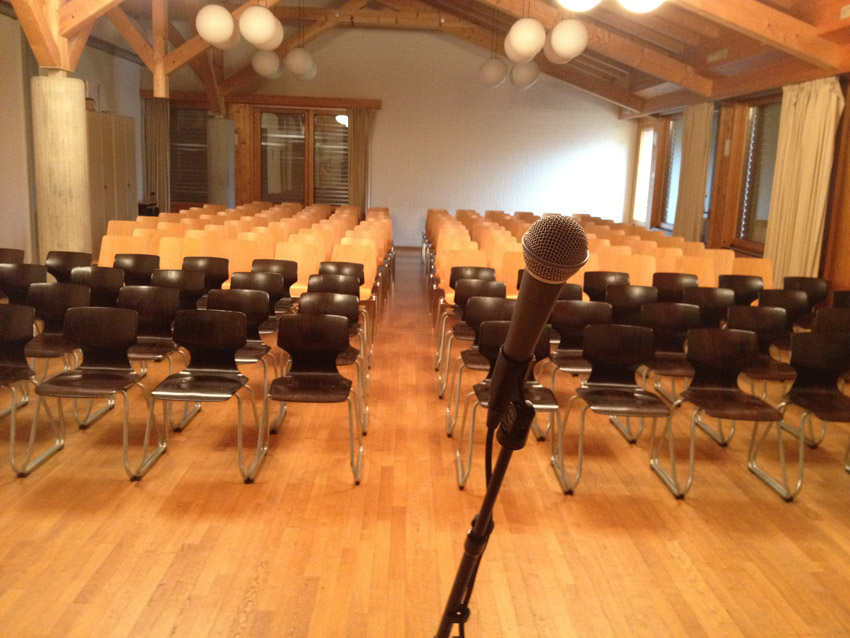
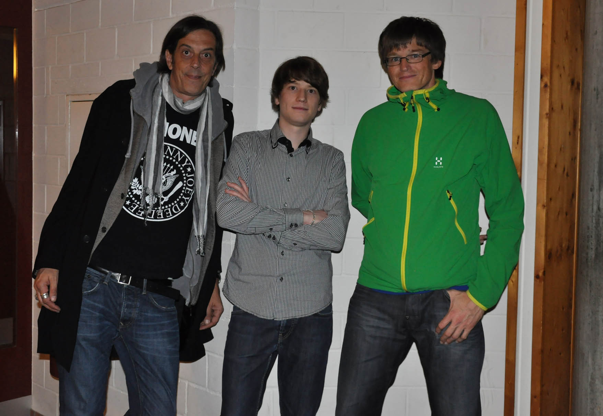

+++
title = "Wie ich zum Lesen und zurück zu den Geschichten kam"
date = "2021-11-26"
draft = false
pinned = false
image = "img_0498.jpg"
description = "Auf der Suche nach dem Bild für den vorherigen Blogbeitrag bin ich über alte Fotos gestolpert, die mich gleich zu dem führen, was ich dir jetzt erzähle. Es passt zu meiner Lernbiografie und das ist ein Teil dieses Blogs hier."
footnotes = "[herbstlesung.ch](www.herbstlesung.ch)\n\n[denk-weise.ch](https://denk-weise.jimdofree.com)"
+++
Auf der Suche nach dem Bild für den vorherigen Blogbeitrag bin ich über alte Fotos gestolpert, die mich gleich zu dem führen, was ich dir jetzt erzähle. Es passt zu meiner Lernbiografie und das ist ein Teil dieses Blogs hier. 

Falls du mich hier oder dort verfolgst, weisst du nun, dass meine Schulzeit schwierig war und an viele erinnere ich mich nicht mehr im Detail, an anderes noch recht gut.

An was ich bereits immer Freude hatte, waren Geschichten und Worte. Es gibt «Beweise», die zeigen, dass ich mich schon als Kind mit Zitaten und Worten beschäftigt habe. Oft habe diese «grossen Worte» aus Büchern abgeschrieben und verschenkt. Eigentlich eine gute Grundlage für einen guten Schüler, zumindest in Deutsch.. Naja, es kam anders. So anders, dass ich die Freude an Worten und Büchern verlor. Weil ich nicht so gut in Deutsch war, ermunterte man mich zum Lesen, denn das würde mir helfen, mich zu verbessern. Ob du es glaubst oder nicht, so entfernte ich mich immer mehr von Büchern, Deutsch und den Worten. Irgendwann war eine grosser Graben zwischen mir und den Büchern.. so ein Junge wie ich liest eh nicht. Dann hat man mir noch empfohlen, doch wenigstens Comics zu lesen, aber dieses Müssen und Sollen hat zu was geführt? Dazu, dass ich noch weniger Lust hatte.

Klar, ab und zu habe ich ein Buch gelesen, aber wirkliche Freude? Eher nicht.

Dann kam es wieder einmal anders.

Ich war etwa 22 und meine Mutter gab mir einen Zeitungsausschnitt, bei dem etwas über einen Schriftsteller stand, und ich weiss eigentlich gar nicht mehr, warum sie mir diesen gegeben hat. Auf jeden Fall fand ich den interessant, las bald das erste Buch, dann das zweite und besuchte eine oder zwei Lesungen. Bald darauf hatte ich ihn selbst für eine Lesung gebucht, einen Raum reserviert und noch keine Ahnung wie das eigentlich geht. Keine Ahnung ist vielleicht falsch, denn ich hatte ein Gefühl dafür (von wo auch immer) wie man das macht und tatsächlich, es hat geklappt. Es hat so gut geklappt, dass ich ein paar Tage nach der Durchführung gleich das nächste Jahr gebucht habe. Der Veranstaltungsort war übrigens eine Schulhaus-Aula, derselbe Ort, an dem man mir versuchte, englisch beizubringen. Bis ich mich wieder an diese Sprache wagte, sollte es dann auch noch einmal fast 10 Jahre gehen. Aber das ist ein anderes Thema. 

Dieser eine kleine Zeitungsartikel sowie die Begegnung mit diesem Geschichtenerzähler hat viel ins Rollen gebracht und mich wieder zurück zur Liebe für Geschichten geführt. 

> Gschichte si nid wi Zähn, wo nume zwöi Mou chömen und wenn se verbrucht hesch, isch fertig. Nei, d Gschichte wachsen immer wieder noche. Pedro Lenz