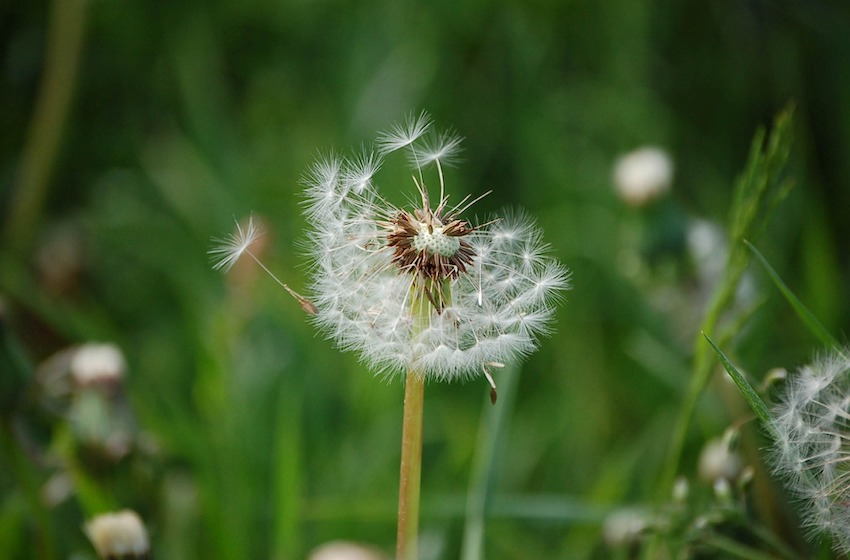

+++
title = "Der Löwenzahn als Inspiration"
date = "2021-12-16"
draft = false
pinned = false
image = "whatsapp-image-2021-12-18-at-12.01.18-5-.jpeg"
description = "Willkommen in der Welt des Löwenzahns. Ich möchte mit dir ein paar Gedanken über diese vielseitige und inspirierende Pflanze teilen. "
+++
### Der Löwenzahn

Willkommen in der Welt des Löwenzahns. Ich möchte mit dir ein paar Gedanken über diese vielseitige Pflanze teilen. Es ist eine Blume, die uns den Sommer ankündet und uns mit ihrer wunderbar gelben Farbe anstrahlt. Sie ist aber auch ein nicht gerne gesehenes Unkraut bei ambitionierten Gärtnern, obwohl sie den Insekten viel Freude bereiten würde. Der Löwenzahn wird auch als Heilkraut gesehen, welchem man nachsagt, dass es Lebenskraft schenkt und für viele Kinder sowie für das Kind in uns, ist er eine wunderbare Pusteblume.

Eine Blume die uns ärgert, Freude bereitet, den Lauf des Lebens zeigt und aus meiner Sicht eine Vorbildfunktion hat. Denn:

> **der Löwenzahn fragt nicht wo er wachsen darf und ob es überhaupt möglich ist. Er wächtst, wo es gerade geht.**

**Wachsen wo es gerade geht**

Wo hast du schon überall einen Löwenzahn gesehen? Ich konnte ihn schon an den unmöglichsten Orten finden. Er fragt nicht ob er wachsen kann. Er tut es einfach. 

**Unkraut und Achtsamkeit**

Wenn wir uns über den Löwenzahn im Garten ärgern, werden wir bald nur noch das Unkraut sehen und wenig Freude an den übrigen Pflanzen haben. Betrachten wir dieses "Unkraut" aber mit neugier, dann sehen wir wie die Bienen diese wunderbar gelbe Blume besuchen, wir sehen die schöne freundliche Farbe und freuen uns über die Pusteblume.

**Aufblühen – Loslassen – Wachsen – Ruhen**

Der Löwenzahn scheint mir sehr klar den Lauf des Lebens zu zeigen. Wir sehen bald die auffälligen gelben Blüten, die sich später wie eine weisse Decke über die Felder legen und anschliessend ihre Samen fliegen lassen um wieder wachsen zu können. Im Winter gönnt sich der Löwenzahn eine Pause. Er ist da, nur eben nicht so auffällig. Um aufzublühen und zu wachsen sollten wir loslassen und ruhen nicht vergessen.

**Freude und das Kind in uns nicht vergessen**

Die Pusteblume – wie viel Freude hat uns diese Blume als Kind bereitet. Kannst du dich erinnern, wann du das letzte Mal gepustet hast?

