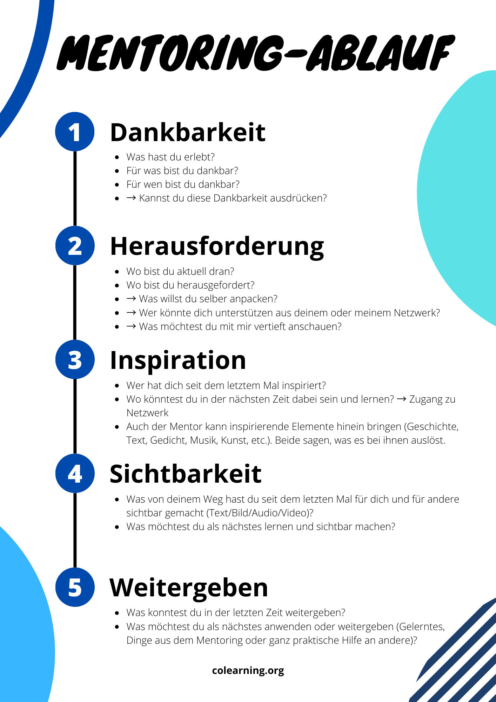

+++
title = "Mentoring"
date = "2024-06-08"
draft = false
pinned = false
tags = ["Personalentwicklung", "Organisationsentwicklung", "Colearning", "Mentoring", "Leadership"]
image = "2c521ff4-daa8-475f-bb92-91bfb61dcd6c.jpg"
description = "Könnte Mentoring ein (Teil-)Lösungsansatz für viele Probleme und Herausforderungen in der Personal- und Führungsentwicklung in einer unbeständigen und unsicheren (Arbeits-) Welt sein? "
footnotes = "Titelbild Sandra Zaugg"
+++
#### Könnte Mentoring ein (Teil-)Lösungsansatz für viele Probleme und Herausforderungen in der Personal- und Führungsentwicklung sein? 

\
Wir leben in einer VUCA oder BANI-Welt. Viele Menschen fühlen sich verunsichert und viele sind frustriert oder überfordert. Auch wenn wir unsere (Arbeits-)Welt nicht so unbeständig und mehrdeutig wahrnehmen würden, sind die «ganz normalen» Herausforderungen da. Sie sind überall und werden durch die allgemeine (vielleicht auch unbewusste) Verunsicherung verstärkt. Mitarbeitende werden zu Führungskräften, ehemalige Lernende sind plötzlich «fertig», also «aus»gebildet und sollten nun alles alleine können, neue Mitarbeitende werden ins kalte Wasser «geworfen» und ein Change-Prozess löst den nächsten ab. Da kommen dann noch die privaten Herausforderungen (Familie, Finanzen, Gesundheit, …) dazu. Alles in allem kann das auch für sehr soziale Menschen eine einsame Sache werden. Das müsste aber nicht sein! 

#### Bevor wir weitermachen, schauen wir doch, was zu Mentoring im Duden steht: 

[Der Duden sagt](https://www.duden.de/rechtschreibung/Mentoring): Beratung und Unterstützung durch erfahrene Fach- oder Führungskräfte

###### Herkunft: englisch mentoring, zu: to mentor = beraten; ausbilden, zu: mentor, [Mentor](https://www.duden.de/rechtschreibung/Mentor_Berater)

### **Mein Bezug zu Mentoring**

Mentoring kennt man bereits lange. Vor drei Jahren bin ich im Rahmen von [Colearning](https://www.colearning.org) das erste Mal in Kontakt mit dem Colearning-[Mentoring](https://handbuch.colearning.org/operatives/informationssystem/mentoring-ablauf#mentoring-ablauf-ausfuehrlich) gekommen. Diese Art des Mentorings sieht eine Struktur vor und bedingt keine Fach- oder Führungskompetenz. Sie bedingt nicht einmal zwingend eine konkrete Erfahrung in «etwas». Natürlich ist es ideal, wenn die Mentorin oder der Mentor bereits erste Erfahrungen als Mentee gesammelt hat und den Prozess kennt. Zu Beginn war ich mit einem anderen (erfahrenen) Colearner in einem gegenseitigen Mentoring, also Mentor und Mentee gleichzeitig. Zu einem späteren Zeitpunkt suchte ich nach einem Mentoring-Partner ausserhalb des Colearning-Universums und bin nun seit wohl mittlerweile ca. 1.5 Jahren mit ihm unterwegs. Mittlerweile bin ich in zwei gegenseitigen Mentorings unterwegs. 

### **Mentoring, ein Lösungsansatz(?)**

Menschen in der Arbeitswelt und in Lernkontexten sind oft alleine unterwegs. Nach aussen sieht es zwar nach einem Team, einer Kursgruppe etc. aus. Im Kern ist jedoch jede und jeder für sich unterwegs. Ein persönlicher fachlicher Austausch, der auch eine differenzierte oder distanzierte(re) Perspektive bietet, bleibt oft aus. Gerade in schwierigen Phasen wird das deutlich. Hier kommen die Qualität und der Nutzen von Mentoring ins Spiel. Lass mich das anhand von ein paar Beispielen illustrieren.

#### **Führungskräfte**

Eine bestehende Mitarbeiterin wechselt innerhalb des Teams in eine Führungsrolle. Hier könnten neben den alltäglichen Herausforderungen in der Führung insbesondere der Rollenwechsel ein Thema sein. Hier könnte ein Mentoring mit einer erfahrenen Führungskraft oder jemandem aus dem Beratungs-/Coachinghintergrund Sinn machen. 

Führungskräfte balancieren oder jonglieren zwischen ihren fachlichen Aufgaben und den Führungsthemen. Dieser Spagat fordert immer wieder Reflexion. Zudem bringt die Führung auf menschlicher Ebene neue Herausforderungen und vielleicht auch regelmässig wiederkehrende Reizthemen. Hier könnten zwei Führungskräfte sich regelmässig zu einem gegenseitigen Mentoring treffen. 

#### **(Gemeinsames) Lebenslanges lernen**

Eigentlich mag ich den Begriff in der Form nicht, da Lernen nie aufhört. Dadurch, dass man Lernen in formelle Rahmen gepackt hat, haben wir einen unnatürlichen Bezug zu lernen. Durch Mentorings (z. B. wie es Colearner machen), werden sich Menschen ihrem Lernen immer wieder bewusst und entdecken und (an-)erkennen, dass sie immer wieder Lernerlebnisse im Alltag haben. Beim Lernen sind sowohl klassiche Mentor-Mentee Beziehungen wie auch gegenseitige Mentoring denkbar. Je nach Lernthema macht eine Mentorin Sinn, die fachliche Kompetenzen im Lernbereich hat. Gerade dann wenn es um das alltägliche Lernen und Reflektieren geht, erachte ich unterschiedliche Hintergründe als wertvoll. 

#### **Fachliche Kompetenzentwicklung** 

Erfahrene Mentorinnen begleiten (Quer-) Einsteigerinnen als Mentorinnen und Mentoren beim Auf- und Ausbau von fachlichen Kompetenzen. Eine sehr klassische Variante des Mentorings. In diesem Fall sind Fachexpertinnen als Mentorin oder Mentor angebracht. 

#### **Entwicklung begleiten**

Persönlichkeitsentwicklung, Personalentwicklung, Kulturentwicklung etc. Mentoring (hier spreche ich v. a. vom Arbeitskontext) unterstützt die individuelle Entwicklung der Mitarbeitenden und setzt Anker in Art der Zusammenarbeit und der Kultur. Es fördert die Kommunikation, die (Weiter-)Entwicklung der Mitarbeitenden, die gegenseitige Unterstützung und kann m. E. einen wichtigen Einfluss auf die Unternehmenskultur und deren positive Entwicklung haben. Gut eingeführte Mentoringprozesse können einen positiven Einfluss auf die Fehlerkultur, die psychologische Sicherheit und die Zusammenarbeit im allgemeinen haben. 

#### **Reverse Mentoring**

Ein Begriff, der mittlerweile oft auftaucht, auch wenn er bereits etwas älter zu sein scheint. Aus meiner Sicht sind generationenübergreifendes Zusammenarbeiten und die gegenseitige Offenheit so oder so entscheidend für eine, für unsere! gemeinsame Zukunft. Deshalb nur der Ergänzung halber [hier ein Einblick in dieses Mentoring-Format](https://www.monster.ch/de/mitarbeiter-finden/hr-know-how/recruiting/talent-management/reverse-mentoring-training-coaching-weiterbildung-099706/). 

### (Fast) Zum Schluss beleuchten wir den Mentoring-Ablauf wie wir ihn im Colearning leben und wo ich hier den Nutzen der einzelnen Elemente sehe. 

#### **Dankbarkeit**

Dieser Aspekt lenkt den Fokus auf das Positive, auf das, was gut ist und war. Gerade in schwierigen Situationen hilft es eine Distanz zu schaffen. 

#### **Herausforderung**

Es geht nicht nur darum, die Herausforderung zu nennen, sondern auch zu reflektieren, wo und was man selbst anpacken kann. Dieser Punkt bietet den Raum, um direkte oder indirekte Hilfe zu bitten.

#### **Inspiration**

Auch hier wechselt der Fokus wieder auf das Positive, auf Erlebnisse und Begegnungen oder Momente, die oft vergessen gehen. Gab es eine Inspiration von aussen oder konnte man jemanden inspirieren. 

#### **Sichtbarkeit**

Entwicklungs- und Lernprozesse können immer und überall stattfinden. Es kann für sich selbst und für andere hilfreich sein, diese sichtbar zu machen. Eine Variante ist das Schreiben eines (Lern-)Blogs (wie der hier), der dann auch als Lern- und/oder Kompetenzportfolio dienen kann. Als weitere Varianten ist alles Mögliche denkbar. Das Lernen in einem Gespräch mit anderen Teilen, ein End- oder Zwischenprodukt ausstellen, zeigen, ein Podcast-Format, ein Padlet oder Miro-Board und noch so vieles mehr.

#### **Weitergeben**

Alle Menschen haben etwas zu geben. Das kann praktische Hilfe für andere sein, das Weitergeben von Erkenntnissen des Mentorings oder selbst Mentorin oder Mentor sein. So kann ein Lern- oder Mentoring-Ökosystem entstehen, welches wenig zeitlichen und finanziellen Aufwand benötigt.

### Schlussgedanken

Ein Mentoring im Sinne des Colearning-Mentorings kann ein wertvolles Instrument sein, damit sich Mitarbeitende gegenseigt bei der persönlichen und fachlichen Entwicklung sowie in ihren Lernprozessen begleiten können. Es kann die Kommunikation zwischen Abteilungen fördern und gegenseitige vertiefte Einblicke ermöglichen. Da die Strukturen innerhalb von Colearning schlank gehalten wurden und auch das Mentoring darauf ausgerichtet ist, sind der zeitliche Aufwand und die Kosten tief. Der Nutzen (so erlebe und beobachte ich es zumindest) umso grösser.